Semana 1
===========
Durante esta semana vamos a introducir el curso y estudiar la plataforma de cómputo con la cual trabajaremos este semestre.
La presentación de la primera clase está aquí: 
`Clase 1.1 <https://drive.google.com/open?id=199nQxxbA0AIDNq_tzbS7AryIZM7NNT1Jq3RvPds9-c8>`__.

Objetivo
---------
1. Introducir el curso

2. Introducir y configurar la plataforma de cómputo 

Lecturas
---------
En los siguientes sitios web se describe las características de la plataforma a utilizar (tanto hardware como software):

1. Características generales de la plataforma `ESP32 <https://www.espressif.com/en/products/hardware/esp32/overview>`__.

2. Guía de programación `ESP-IDF <`https://esp-idf.readthedocs.io/en/latest/>`__.

3. Tarjeta de desarrollo: `ESP32-PICO-KIT V4 board <https://esp-idf.readthedocs.io/en/latest/hw-reference/modules-and-boards.html#esp32-pico-kit-v4>`__.

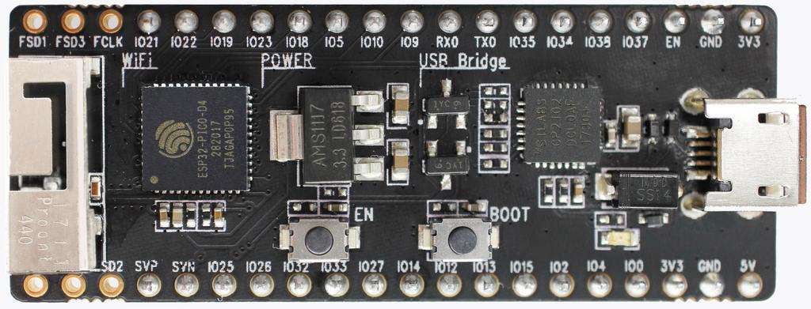

Ejercicio 1: Configuración de las herramientas
------------------------------------------------
Vamos a configurar el entorno de desarrollo como lo indica la guía de programación 
`ESP-IDF <https://esp-idf.readthedocs.io/en/latest/>`__. Específicamente, seguiremos los pasos indicados en la sección
`Get started <https://esp-idf.readthedocs.io/en/latest/get-started/index.html#>`__. Antes de continuar con los pasos
siguientes es fundamental que seamos capaces de configurar, compilar, programar y comunicarnos con la tarjeta. Todos los pasos
anteriores desde la línea de comandos (bueno, tal vez la comunicación serial no). Para las comunicaciones serial podemos
utilizar la terminal de arduino o programas como `Hercules <https://www.hw-group.com/software/hercules-setup-utility>`__
o `CoolTerm <http://freeware.the-meiers.org/>`__.

En la documentación anterior sugieren utilizar eclipse como entorno integrado de desarrollo. Como sé que hay personas que no
les gusta eclipse (alias Simón), también podemos utilizar Visual Studio Code (me está gustando más). 
El siguiente video en youtube muestra cómo configurar `visual studio code <https://www.youtube.com/watch?v=VPgEc8FUiqI>`__.
En la descripción del video está el enlace para descargar los archivos necesarios. Una tercera opción, 
la cual utilizaré tabién es `visualGDB <https://visualgdb.com/>`__; sin embargo, esta herramienta no es gratis, es para gente de modo.

Hola mundo sin IDE
^^^^^^^^^^^^^^^^^^^
En esta sesión ilustraré los pasos necesarios para probar la instalación de las herramientas desde la línea de comandos. 
Estas pruebas son fundamentales antes de pensar en la instalación de un IDE. 

1. Lo primero que necesitamos para trabajar con la plataforma ESP32 es una serie de herramientas que permitan traducir 
código de lenguaje C a código de máquina de la plataforma objetivo (*target*). Todo este proceso lo haremos directamente en el 
computador (*host*) que puede tener un sistema operativo Linux, Windows o MacOS. El resultado de la traducción será un archivo 
binario que contendrá instrucciones en código de máquina del ESP32. Estas instrucciones tendremos que almacenarlas en la memoria
no volátil del ESP32 (memoria flash). El proceso de almacenamiento se realiza con la ayuda de un *bootloader*. Un *bootloader* 
es un programa que se ejecutará en el ESP32 y tendrá por reposabilidades recibir la información del archivo binario y 
almancenarla en la memoria. Esta operación se realiza, en principio, mediante el puerto serial; 
sin embargo, podríamos hacer lo mismo utilizando otros medios tales como un interfaz ethernet, wifi, 
una memoria no volátile externa, entre otros. Pregunta Juanito: ¿Y cómo hacemos para ejercutar el bootloader? La respuesta larga
está `aquí <https://github.com/espressif/esptool/wiki/ESP32-Boot-Mode-Selection>`__. La respuesta corta: el pin GPIO0 debe 
estar en estado lógico bajo y mantenerse así mientras el ESP32 es reiniciado. Las siguiente figura muestra 
los *push buttons* de la tarjeta de desarrollo que permiten realizar la operación:

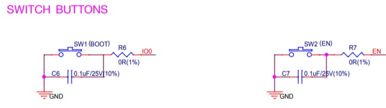


Afortunadamente, la secuencia anterior de acciones se puede automatizar desde la interfaz 
USB-Serial mediante el *script* esptool.py. Este *script*, que hace parte del *toolchain*, envía la información 
de la traducción y controla las líneas RTS y DTR que a su vez permiten controlar el pin GPIO0 y el pin de reset del ESP32. 
La siguiente figura muestra en detalle el esquemático de la interfaz USB-Serial:

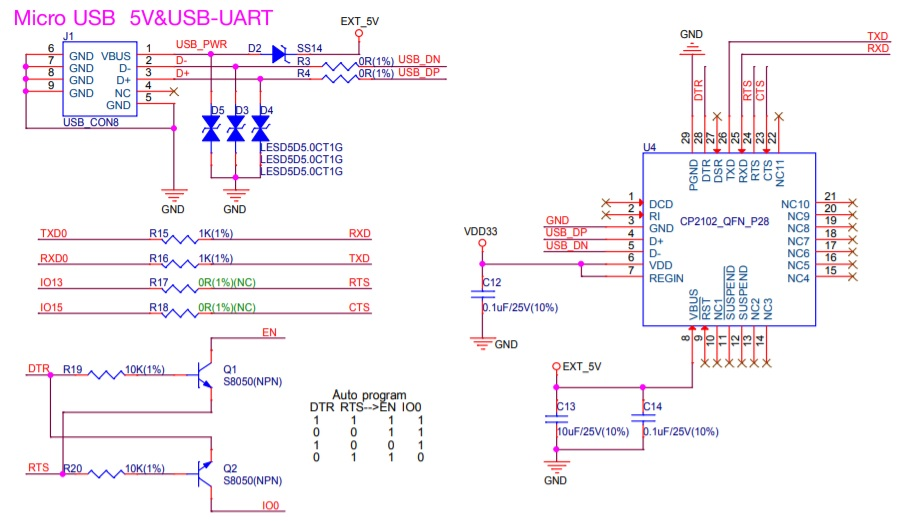


Volviendo de nuevo al asunto del *toolchain*, en la siguiente figura se observa el mismo concepto pero esta vez recordando 
lo estudiado en sensores 1 con la plataforma Arduino UNO.

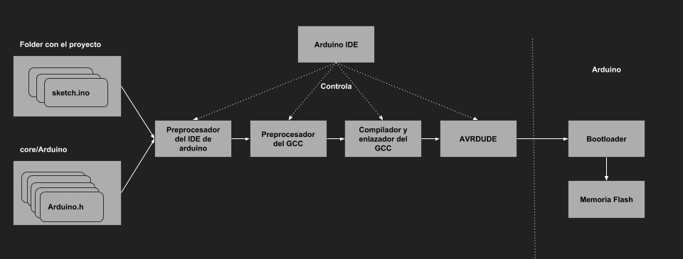

En mi caso, la siguiente figura muestra una imagen del *toolchain*, para windows y precompilado por espressif, descomprimida:

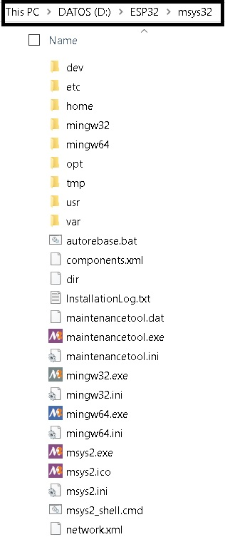

Esta estructura emula un entorno similar al que se enfrentaría un usuario de Linux o MacOS.

2. Ya habíamos dicho que en esta parte del proceso no utilizaremos un IDE. Por tanto, la herramienta para realizar todas 
las operaciones será una terminal de línea de comandos, en mi caso: ``D:\ESP32\msys32\mingw32.exe``. Antes de continuar con 
la descarga del *framwork* de desarrollo, vamos a crear una carpeta para almacenarlo. Utilice los comandos de terminal 
``mkdir -p ~/esp32`` para crear el directorio y ``cd ~/esp`` para cambiarse (navegar) de directorio.

3. Vamos a descargar el *framework* de desarrollo. Pregunta Juanito ¿Qué es un *framework*? Podemos entender un *framework* 
como una aplicación incompleta, es decir, la empresa espressif nos entrega parte de nuestra aplicación hecha, pero nosotros 
debemos completarla con la funcionalidad particular que deseamos. El *framework* se denomina ``ESP-IDF`` que 
quiere decir *Espressif IoT Development Framework*. Para descargarlo debemos abrir la terminal y ejecutar los siguientes 
comandos::

    cd ~/esp
    git clone --recursive https://github.com/espressif/esp-idf.git


El ESP-IDF se descargará en la carpeta ``~/esp/esp-idf``. La siguiente figura muestra donde está dicha carpeta:

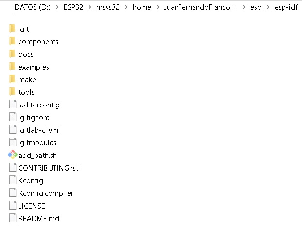

.. note::
    #. El símbolo ``~`` significa directorio raíz del usuario. 
    #. Si por algún motivo olvidó utilizar la opción ``--recursive``, es necesario ejecutar los siguientes comandos para bajar el *framework* completo::
        
        cd ~/esp/esp-idf
        git submodule update --init

4. Ahora debemos configurar la ruta donde está ubicado el ESP-IDF. Para ello, debemos crear un *script* en la carpeta 
``D:\ESP32\msys32\etc\profile.d`` que nombraremos ``export_idf_path.sh``. Escriba en el archivo::

    export IDF_PATH="D:/ESP32/msys32/home/JuanFernandoFrancoHi/esp/esp-idf"

Salvamos el *script* y CERRAMOS la terminal. Al abrir de nuevo la terminal y ejecutar el comando::
    
    printenv IDF_PATH

Debe aparecer la ruta previamente configurada. De lo contrario, será necesario verificar los pasos anteriores.

5. Creamos un projecto. Copiamos en el directorio ``~/esp`` uno de los ejemplos que vienen con el ESP-IDF así:

    cd ~/esp
    cp -r $IDF_PATH/examples/get-started/hello_world .

6. Conectamos el ESP32 al PC e identificamos el puerto serial asignado por el sistema operativo:

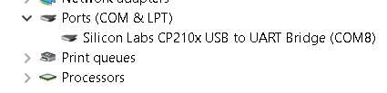

7. Vamos a configurar el ESP-IDF utilizando la herramienta ``menuconfig``::

    cd ~/esp/hello_world
    make menuconfig

Debe aparecer la siguiente ventana:

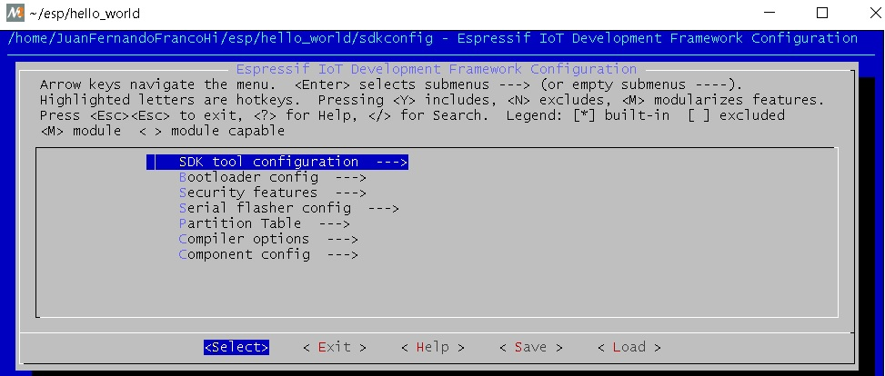

Navegar al menú ``Serial flasher config`` > ``Default serial port`` para configurar el puerto serial y la velocidad:

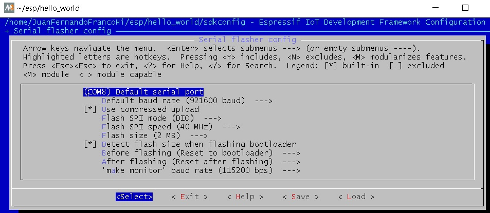

Confirmar las selecciones con enter. No olvide salvar seleccionando ``< Save >`` y luego salir seleccionando ``< Exit >``.

8. Compilar y almacenar el programa en la memoria *flash*. En la terminal escribimos el comando::
    
    make flash

Este comando hace varias cosas: compilar la aplicación y todos los componentes del ESP-IDF, genera el bootloader, 
`la tabla de particiones <https://esp-idf.readthedocs.io/en/latest/api-guides/partition-tables.html>`__, los binarios de la aplicación y 
finalmente envía el binario al ESP32.

9. Una vez almacenado el binario de la aplicación en la memoria *flash*, podemos abrir una terminal serial a 115200 para observar el resultado.

10. Pregunta Juanito ¿Y esto toca hacerlo cada que creemos una aplicación? La respuesta es si y no. No es necesario 
bajar el ESP-IDF y configurarlo; sin embargo, si es recomendable seguir estos pasos: 

* Copiar un proyecto existente.
* Configurar el *framework*: ``make menuconfig``.
* Compilar el proyecto: ``make all``. Esto compila la aplicación, el bootloader y la tabla de partición.
* Grabar todo el proyecto: ``make flash``.
* Luego, compilar sólo la aplicación: ``make app``. Esto acelara el proceso al evitar compilarlo todo. 
* Luego, grabar sólo la aplicación: ``make app-flash``.

11. Pregunta Juanito ¿Y si Espressif actualiza el toolchain? Cambio el nombre del directorio de 
``D:\ESP32\msys32`` a ``D:\ESP32\msys32\mingw32_old`` y repito todo el procedimiento desde la descarga del *toolchain*

12. Pregunta Juanito ¿Y si Espressif no actualiza el toolchain pero si actualiza el ESP-IDF? cambio el direcorio ~/esp/esp-idf por ~/esp/esp-idf_old y clono 
de nuevo el ESP-IDF::

    cd ~/esp
    git clone --recursive https://github.com/espressif/esp-idf.git


Configuración de Visual Studio Code (VSC)
^^^^^^^^^^^^^^^^^^^^^^^^^^^^^^^^^^^^^^^^^^^
A continuación describiré los pasos necesarios para configurar la herramienta. Esta sección supone que los pasos anteriores se siguieron y el resultado 
fué exitoso. Esto es importante porque la función de VSC es llamar automáticamente los mismos comandos que estamos llamando manualmente. 

1. Lo primero que debemos hacer es descargar `visual studio code <https://code.visualstudio.com/>`__.

2. Luego se deben instalar algunas extensiones: C/C++ for Visual Studio Code, Native Debug (para el futuro, pero nosotros no 
utilizaremos el debugger porque no tenemos una interfaz JTAG), Serial Monitor como muestra la siguiente figura:

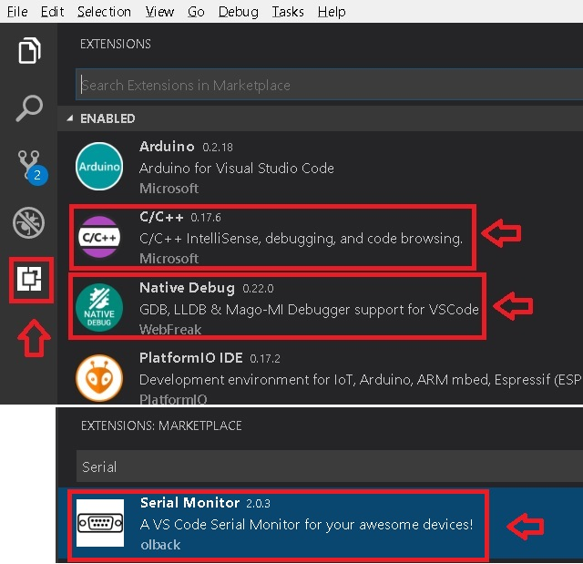

3. Ahora configuramos la terminal desde la que VSC llamará los comandos. Seleccionar ``File -> Preferences -> Settings`` y adicionar el siguiente texto a las 
preferencias actuales::
    
        "terminal.integrated.shell.windows": "D:/ESP32/msys32/usr/bin/bash.exe",
        "terminal.integrated.shellArgs.windows": [
            "--login",
        ],
        "terminal.integrated.env.windows": {
            "CHERE_INVOKING": "1",
            "MSYSTEM": "MINGW32",
        }
    
Es de notar la ruta de la aplicación ``bash.exe`` en mi sistema: ``D:/ESP32/msys32/usr/bin/bash.exe``. En mi caso, los *Settings* quedan así::

    {
        "terminal.integrated.shell.windows": "D:/ESP32/msys32/usr/bin/bash.exe",
        "terminal.integrated.shellArgs.windows": [
            "--login",
        ],
        "terminal.integrated.env.windows": {
            "CHERE_INVOKING": "1",
            "MSYSTEM": "MINGW32",
        },
        "arduino.path": "C:/Users/JuanFernandoFrancoHi/arduino-1.8.5-windows/arduino-1.8.5",
        "arduino.logLevel": "info", "arduino.enableUSBDetection": true, 
        "C_Cpp.intelliSenseEngine": "Tag Parser",
        "files.autoSave": "afterDelay",
        "python.pythonPath": "C:\\Users\\JuanFernandoFrancoHi\\AppData\\Local\\Programs\\Python\\Python36-32\\python.exe",
        "arduino.additionalUrls": [
            "https://git.oschina.net/dfrobot/FireBeetle-ESP32/raw/master/package_esp32_index.json",
            "http://arduino.esp8266.com/stable/package_esp8266com_index.json",
            "https://github.com/stm32duino/BoardManagerFiles/raw/master/STM32/package_stm_index.json",
            "https://raw.githubusercontent.com/VSChina/azureiotdevkit_tools/master/package_azureboard_index.json"
        ]
    }

4. Verificamos que la terminal esté correctamente configurada. Seleccionamos el menú ``View --> Output`` y finalmente clock en Terminal. El resutado debe ser 
similar al que muestra la figura:

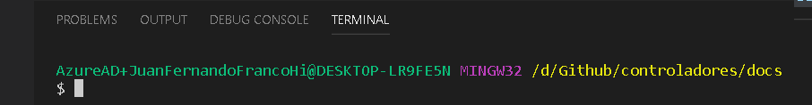

Iniciar un nuevo proyecto en Visual Studio Code
^^^^^^^^^^^^^^^^^^^^^^^^^^^^^^^^^^^^^^^^^^^^^^^^^
1. Copiamos de la carpeta de ejemplos del ESP-IDF el proyecto hello_world::

    cd ~/esp
    mkdir vscode-workspace
    cd vscode-workspace
    cp -r $IDF_PATH/examples/get-started/hello_world .

2. Copiamos la carpeta `.vscode <https://drive.google.com/open?id=1l-HYwUgtfNcS21sKReE8H1UyWgclgFZ3>`__ en el directorio hello_world. Esta carpeta tiene dos 
archivos: ``c_cpp_properties.json`` y ``tasks.json``. El archivo ``c_cpp_properties.json`` tiene el *path* de los *include* del proyecto, del ESP-IDF, del 
toolchain, entre otros.

.. note::
    No olvide ajustar los path con la ruta adecuada en su sistema.

    Tenga en cuenta que este archivo lo podrá seguir reutilizando con cada proyecto que cree.

El archivo ``tasks.json`` tiene configuradas las tareas para compilar, programar, entre otras. En este caso vamos a editar las siguiente tareas:

* ``flash app`` y ``build app``: cambiamos uno de los ``args`` por -jX donde X será el número de *cores* disponibles en su computador. En mi caso, X será 4.
* ``monitor`` y ``menuconfig``: cambiar el *path* de ``command`` para ajustarlo a su sistema. En mi caso ``"D:/ESP32/msys32/mingw32.exe"`` 

3. Abrimos la carpeta hello_world en VSC: ``File -> Open Folder``. Luego buscamos en el *explorer* de VSC el archivo ``hello_world_main.c``. Si VSC reconoce 
los *includes* no deben aparecer líneas verdes bajo las líneas ``#include`` como muestra la figura:

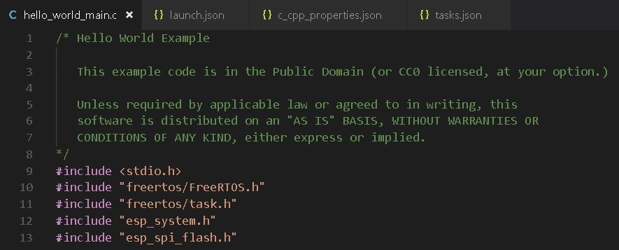

4. Estamos listos para probar las tareas. Seleccione el menú ``Tasks -> Run Tasks`` o la tecla F12. Deben aparecer las tareas como se ve en la figura:

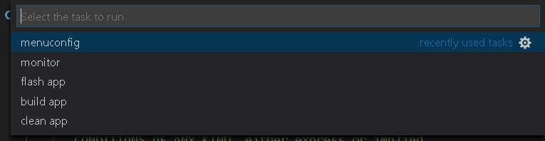

* Seleccionamos ``clean app`` para borrar compilaciones previas (si es que tenemos).
* Seleccionamos ``menuconfig`` para configurar el *framework* a nuestro gusto. No olvide esperar la generación del archivo de configuración.
* Seleccionamos ``build app`` para compilar la aplicación.
* Seleccionamos ``flash app`` para almacenar el programa en la memoria *flash*.
* Abrimos una terminal serial para verificar que efectivamente quedó programada la aplicación.

5. Como ejercicio corto se recomienda realizar una pequeña modificación al código y repetir los pasos anteriores desde ``build app``.

.. note::
    Debe notar que al realizar modificaciones al código, la velocidad de compilación aumenta considerablemente porque ya no es necesario compilar 
    todo el framework.

Ejercicio 2: análisis del ejemplo 
------------------------------------
En este ejercicio vamos a analizar un poco el código del Ejercicio 1.

.. code-block:: c
   :lineno-start: 9

    #include <stdio.h>
    #include "freertos/FreeRTOS.h"
    #include "freertos/task.h"
    #include "esp_system.h"
    #include "esp_spi_flash.h"


    void app_main()
    {
        printf("Hola sensores 2!\n");

        /* Print chip information */
        esp_chip_info_t chip_info;
        esp_chip_info(&chip_info);
        printf("This is ESP32 chip with %d CPU cores, WiFi%s%s, ",
                chip_info.cores,
                (chip_info.features & CHIP_FEATURE_BT) ? "/BT" : "",
                (chip_info.features & CHIP_FEATURE_BLE) ? "/BLE" : "");

        printf("silicon revision %d, ", chip_info.revision);

        printf("%dMB %s flash\n", spi_flash_get_chip_size() / (1024 * 1024),
                (chip_info.features & CHIP_FEATURE_EMB_FLASH) ? "embedded" : "external");

        for (int i = 10; i >= 0; i--) {
            printf("Restarting in %d seconds...\n", i);
            vTaskDelay(1000 / portTICK_PERIOD_MS);
        }
        printf("Restarting now.\n");
        fflush(stdout);
        esp_restart();
    }

Varios puntos a considerar:

Lo primero que debemos notar es el punto de entrada del programa, la función ``app_main()``, línea 16. Al igual que el *framework* de arduino, 
el punto de entrada de la aplicación es diferente a la función ``main()``. Esto ocurre porque la función ``main()``
hace parte del código del *framework* y ese éste quien llamará el código de la aplicación del usuario.

En la línea 18 se observa la función ``printf`` de la biblioteca ``#include <stdio.h>``. Esta biblioteca permite enviar mensajes a la terminal serial a través 
de la UART0 del ESP32.

En la línea 21 se observa la definición de una estructura de datos de tipo ``esp_chip_info_t``. El lenguaje C no soporta de manera nativa objetos, por tanto, 
es necesario crear estructuras de datos en memoria (simuladondo objetos) e inicializarlas empleando funciones, ``esp_chip_info(&chip_info);``, a las cuales 
se pasan las estructuras de datos por REFERENCIAS: ``&chip_info``. En este caso el operador ``&`` obtiene la dirección de la variable ``chip_info``. El 
siguiente código muestra la definición de la estructura de datos ``esp_chip_info_t``. Es de notar que la estructura de datos anida otra estructura de datos 
``esp_chip_model_t``:

.. code-block:: c
   :lineno-start: 1

    /**
    * @brief The structure represents information about the chip
    */
    typedef struct {
        esp_chip_model_t model;  //!< chip model, one of esp_chip_model_t
        uint32_t features;       //!< bit mask of CHIP_FEATURE_x feature flags
        uint8_t cores;           //!< number of CPU cores
        uint8_t revision;        //!< chip revision number
    } esp_chip_info_t;    

Este código muestra la implementación de la función ``esp_chip_info``:

.. code-block:: c
   :lineno-start: 1

    static void get_chip_info_esp32(esp_chip_info_t* out_info)
    {
        out_info->model = CHIP_ESP32;
        uint32_t reg = REG_READ(EFUSE_BLK0_RDATA3_REG);
        memset(out_info, 0, sizeof(*out_info));
        if ((reg & EFUSE_RD_CHIP_VER_REV1_M) != 0) {
            out_info->revision = 1;
        }
        if ((reg & EFUSE_RD_CHIP_VER_DIS_APP_CPU_M) == 0) {
            out_info->cores = 2;
        } else {
            out_info->cores = 1;
        }
        out_info->features = CHIP_FEATURE_WIFI_BGN;
        if ((reg & EFUSE_RD_CHIP_VER_DIS_BT_M) == 0) {
            out_info->features |= CHIP_FEATURE_BT | CHIP_FEATURE_BLE;
        }
        int package = (reg & EFUSE_RD_CHIP_VER_PKG_M) >> EFUSE_RD_CHIP_VER_PKG_S;
        if (package == EFUSE_RD_CHIP_VER_PKG_ESP32D2WDQ5 ||
            package == EFUSE_RD_CHIP_VER_PKG_ESP32PICOD2 ||
            package == EFUSE_RD_CHIP_VER_PKG_ESP32PICOD4) {
            out_info->features |= CHIP_FEATURE_EMB_FLASH;
        }
    }

    void esp_chip_info(esp_chip_info_t* out_info)
    {
        // Only ESP32 is supported now, in the future call one of the
        // chip-specific functions based on sdkconfig choice
        return get_chip_info_esp32(out_info);
    }

La variable ``out_info`` es un puntero, es decir, una variable que almancena direcciones de otras variables y puede estar implementada 
en los registros del procesador o en el *stack* (Pregunta Juanito: ¿Qué?). En este caso ``out_info``, almacena la dirección de una variable de 
tipo ``esp_chip_info_t``. Note que luego el contenido de ``out_info`` se pasa otra variable ``out_info`` diferente a la primera. Esto ocurre al llamar 
la función ``get_chip_info_esp32(out_info);`` (Pregunta Juanito: no charlemos tan pesado, ¿Cómo así?). No pierda de vista que 
la dirección que estamos pasando de aquí para allá no es más que la dirección de ``chip_info``. Finalmente, observe cómo se acceden las posiciones 
de memoria de la variable ``chip_info`` mediante el puntero ``out_info``, por ejemplo, ``out_info->features`` modifica la posición features de ``chip_info`` 
mediante el operador ``->`` (Pregunta el profe a Juanito: ¿Eres feliz?).

En la línea 23 se observan varias cosas interesante:
Primero, el uso de cadenas formateadas: ``"This is ESP32 chip with %d CPU cores, WiFi%s%s, "``. El resultado de ``printf`` es:
``This is ESP32 chip with 2 CPU cores, WiFi/BT/BLE,``. Note que %d, %s%s no aparecen. En vez de eso, aparece el número 2 en vez de %d y la cadena ``/BT/BLE`` 
en vez de %s%s. Lo que ocurre es que ``printf`` es capaz de detectar algunos caracteres especiales y cambiarlos por el resultado de evaluar 
``chip_info.cores``, ``(chip_info.features & CHIP_FEATURE_BT) ? "/BT" : ""`` y ``(chip_info.features & CHIP_FEATURE_BLE) ? "/BLE" : "")``. 
Estas dos últimas expresiones son condicionales que evaluan la condición de la izquierda del signo ``?``. Si la condición es verdadera, la expresión 
devuelve el resultado de la expresión a la izquierda del signo ``:``, de lo contrario, devuelve lo que esté a la derecha.

En la línea 35 se observa la función ``vTaskDelay(1000 / portTICK_PERIOD_MS);``. Esta función es un llamado al sistema operativo, ``FreeRTOS``, para 
solicitar generar un retardo de 1 segundo. Para medir los tiempos, ```FreeRTOS`` genera una base de tiempo o una interrupción periódica llamada ``tick`` del 
sistema. La operación ``1000 / portTICK_PERIOD_MS`` calcula la cantidad de *ticks* que hay en 1000 mili segundos. De esta manera le informamos al sistema 
operativo cuántos *ticks* tardará el retardo.

La línea 38 muestra la función ``fflush(stdout);``. Esta función bloquea el programa hastas que todos los caracteres pendientes por transmitir sean enviados 
a través de la UART0. Pregunta Juanito: ¿Pero entonces qué hace ``printf``? ¿No se supone que transmite una información por la UART0? En realidad, tal como 
ocurre con el *framework* de arduino, la función ``printf`` realmente copia la información a un *buffer* de transmisión. Como el ESP32 corre tan rápido, 
no es posible garantizar que al llegar al código de máquina correspondiente al la línea 38 toda la información se haya transmitido. En consecuencia, la función 
``fflush(stdout);`` hará que el ESP32 espere hasta que último dato se haya enviado.

En la línea 39, la función ``esp_restart`` permite reiniciar el ESP32 por software, es decir, no es necesario una acción por hardware para obligar al ESP32 
a ejecutar de nuevo el programa almacenado.

Ejercicio 3: Entorno profesional de desarrollo 
------------------------------------------------

En el ejercicio 1 hablé de la herramienta `visualGDB <https://visualgdb.com/>`__. Esta herramienta es muy práctica y útil, aunque no es gratis. Para utilizarla 
se recomienda descargar Visual Studio Enterprice, que es gratuita para la comunidad Unviersitaria de la escuela de Ingeniería, a través de la plataforma 
`Microsoft Imagine <https://goo.gl/8WRiec>`__ ingresando con el correo y clave institucional.

Luego descargar e instalar `VisualGDB 5.4 Preview 3 <http://sysprogs.com/files/visualgdb/VisualGDB-5.4-preview3.msi>`__.

Crear un projecto seleccionado la opción que muestra la figura:

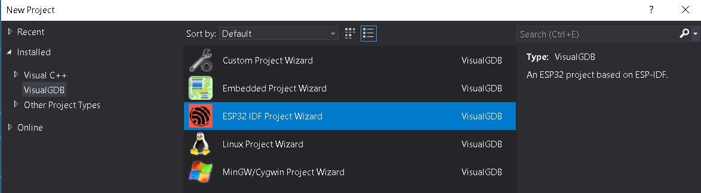

visualGDB utiliza su propio toolchain precompilado que debe ser descargado al momento de crear el proyecto. Una vez descargado, se selecciona como muestra 
la figura:

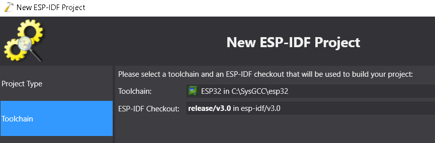

Seleccionar como *Project Sample* el proyecto *blink*:

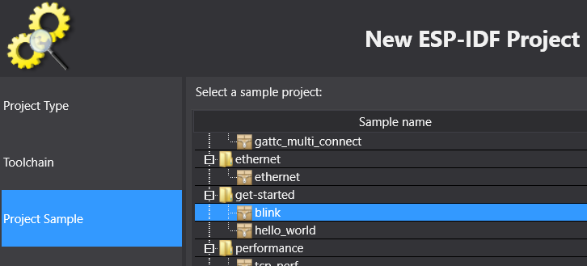

Finalmente seleccionar el *Debug Method*:

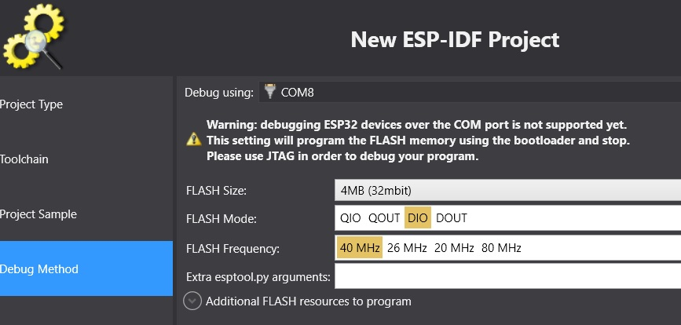

Al llegar a este punto estamos listos para desarrollar. Pregunta Juanito: ¿Y el tutorial para configurar la herramienta? No hay tutorial, la herramienta 
ya está lista para ser utilizada. Entonces procedemos así:

* Click derecho en el nombre del proyecto (ver el cuadro Solution Explorer). Seleccionar VisualGDB Project Properties.
* Configurar el ESP-IDF. Esto no es más que una versión más sencilla de menuconfig.
* Seleccionar ESP-IDF Project y configurar como muestra la figura, no olvidar dar clock en Apply y OK para salvar los cambios.

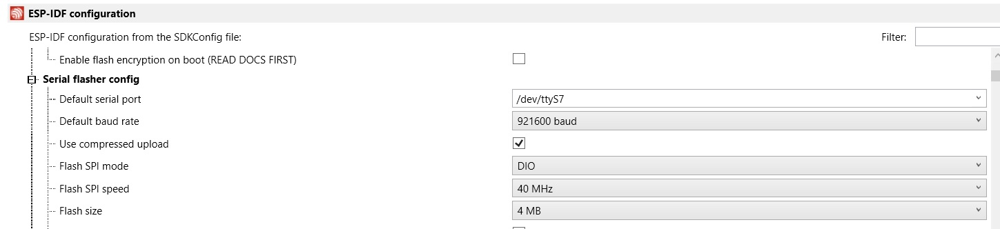

* Para compilar el programa seleccionar: ``Build->Build Solution``.
* Para almacenar el programa en la memoria: ``Debug->Start Without Debugging``.

A continuación se muestra el código fuente de la aplicación:

.. code-block:: c
   :lineno-start: 9

    #include <stdio.h>
    #include "freertos/FreeRTOS.h"
    #include "freertos/task.h"
    #include "driver/gpio.h"
    #include "sdkconfig.h"

    /* Can run 'make menuconfig' to choose the GPIO to blink,
    or you can edit the following line and set a number here.
    */
    #define BLINK_GPIO CONFIG_BLINK_GPIO

    void blink_task(void *pvParameter)
    {
        /* Configure the IOMUX register for pad BLINK_GPIO (some pads are
        muxed to GPIO on reset already, but some default to other
        functions and need to be switched to GPIO. Consult the
        Technical Reference for a list of pads and their default
        functions.)
        */
        gpio_pad_select_gpio(BLINK_GPIO);
        /* Set the GPIO as a push/pull output */
        gpio_set_direction(BLINK_GPIO, GPIO_MODE_OUTPUT);
        while(1) {
            /* Blink off (output low) */
            gpio_set_level(BLINK_GPIO, 0);
            vTaskDelay(1000 / portTICK_PERIOD_MS);
            /* Blink on (output high) */
            gpio_set_level(BLINK_GPIO, 1);
            vTaskDelay(1000 / portTICK_PERIOD_MS);
        }
    }

    void app_main()
    {
        xTaskCreate(&blink_task, "blink_task", configMINIMAL_STACK_SIZE, NULL, 5, NULL);
    }

Ejercicio: analizar el código.


