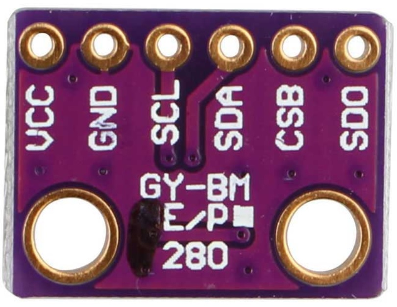

Semana 10
===========
Esta semana realizaremos un ejercicio práctico que nos permite conectar un sensor utilizando el puerto SPI del 
microcontrolador. Adicionalmente, vamos a introducir el bus I2C (``Inter-Integrated Circuit``).

Objetivos
----------

1. Practicar el uso del bus SPI mediante la comunicación entre un sensor y un microcontrolador.
2. Introducir de manera teórica y con ejemplos el bus I2C.

Ejercicio SPI
---------------

Vamos a utilizar el sensor `BME280 <https://www.bosch-sensortec.com/bst/products/all_products/bme280>`__. de la empresa Bosh. 
El BME280 es un sensor ambiental que permite medir humedad relativa, presión y temperatura. Como  controlador, vamos a 
utilizar el ESP32, pero esta vez emplearemos el `framework de arduino <https://github.com/espressif/arduino-esp32>`__.

Para realizar el ejericicio utilizaremos el siguiente material:

* API de `arduino <https://www.arduino.cc/en/Reference/SPI>`__.
* Código fuente del módulo SPI del `ESP32 Arduino Core <https://github.com/espressif/arduino-esp32/tree/master/libraries/SPI/src>`__.
* Información general del sensor `BME280 <https://www.bosch-sensortec.com/bst/products/all_products/bme280>`__.
* Hoja de datos del sensor `BME280 <https://ae-bst.resource.bosch.com/media/_tech/media/datasheets/BST-BME280_DS002-13.pdf>`__.
* Tutorial del sensor `BME280 <https://learn.adafruit.com/adafruit-bme280-humidity-barometric-pressure-temperature-sensor-breakout/overview>`__.

Pinouts
^^^^^^^^^^
La siguiente figura muestra los pines del sensor a utilizar:

Las señales tienen la siguiente función:

* VCC: alimentación a 3.3V.
* GND: 0V.
* SCL: Clock SPI.
* SDA: MOSI SPI.
* CSB: CS o SS (Chip Select) SPI.
* SDO: MISO SPI.

En relación al controlador `ESP32 pio <https://docs.espressif.com/projects/esp-idf/en/latest/get-started/get-started-pico-kit.html>`__, 
los pines SPI serán:

* Clock SPI: pin 18
* MISO: pin 19
* MOSI: pin 23
* CS: pin 5

Para conectar el sensor con el controlador se procede así:

========== ======== ====
ESP32 pico  BME280  SPI
========== ======== ====
3V3        VCC      ---
GND        GND      ---
pin 18     SCL      CLOCK
pin 23     SDA      MOSI
pin 5      CSB      SS
pin 19     SDO      MISO 
========== ======== ====

Software
^^^^^^^^^^
Para realizar la prueba del sensor es necesario instalar estas dos bibliotecas:

* `Adafruit Sensor <https://github.com/adafruit/Adafruit_Sensor>`__
* `Adafruit BME280 Library <https://github.com/adafruit/Adafruit_BME280_Library>`__

Programa de prueba
^^^^^^^^^^^^^^^^^^^^
Una vez instalada la biblioteca Adafruit BME280. Se debe abrir el ejemplo BME280test.ino. Y realizar las siguiente 
modificaciones:

Comentar la el archivo de cabeceras Wire.h. Este archivo corresponde al API I2C. Modificar el pinout del SPI:

.. code-block:: c 
   :lineno-start: 24

    #include <SPI.h>
    #define BME_SCK 18
    #define BME_MISO 19
    #define BME_MOSI 23
    #define BME_CS 5

Comentar la línea que declara el objeto I2C y descomentar la correspondiente a SPI:

.. code-block:: c 
   :lineno-start: 33

    //Adafruit_BME280 bme; // I2C
    Adafruit_BME280 bme(BME_CS); // hardware SPI
    //Adafruit_BME280 bme(BME_CS, BME_MOSI, BME_MISO, BME_SCK); // software SPI

A continuación se observa el código completo:

.. code-block:: c 
   :lineno-start: 1

    /***************************************************************************
    This is a library for the BME280 humidity, temperature & pressure sensor

    Designed specifically to work with the Adafruit BME280 Breakout
    ----> http://www.adafruit.com/products/2650

    These sensors use I2C or SPI to communicate, 2 or 4 pins are required
    to interface. The device's I2C address is either 0x76 or 0x77.

    Adafruit invests time and resources providing this open source code,
    please support Adafruit andopen-source hardware by purchasing products
    from Adafruit!

    Written by Limor Fried & Kevin Townsend for Adafruit Industries.
    BSD license, all text above must be included in any redistribution
    ***************************************************************************/

    //#include <Wire.h>

    #include <Adafruit_Sensor.h>
    #include <Adafruit_BME280.h>

    #include <SPI.h>
    #define BME_SCK 18
    #define BME_MISO 19
    #define BME_MOSI 23
    #define BME_CS 5

    #define SEALEVELPRESSURE_HPA (1013.25)

    //Adafruit_BME280 bme; // I2C
    Adafruit_BME280 bme(BME_CS); // hardware SPI
    //Adafruit_BME280 bme(BME_CS, BME_MOSI, BME_MISO, BME_SCK); // software SPI

    unsigned long delayTime;

    void setup() {
    Serial.begin(9600);
    Serial.println(F("BME280 test"));

    bool status;

    // default settings
    // (you can also pass in a Wire library object like &Wire2)
    //status = bme.begin(0x76);ç
    status = bme.begin();
    if (!status) {
        Serial.println("Could not find a valid BME280 sensor, check wiring!");
        while (1);
    }

    Serial.println("-- Default Test --");
    delayTime = 1000;

    Serial.println();
    }

    void loop() {
    printValues();
    delay(delayTime);
    }

    void printValues() {
    Serial.print("Temperature = ");
    Serial.print(bme.readTemperature());
    Serial.println(" *C");

    Serial.print("Pressure = ");

    Serial.print(bme.readPressure() / 100.0F);
    Serial.println(" hPa");

    Serial.print("Approx. Altitude = ");
    Serial.print(bme.readAltitude(SEALEVELPRESSURE_HPA));
    Serial.println(" m");

    Serial.print("Humidity = ");
    Serial.print(bme.readHumidity());
    Serial.println(" %");

    Serial.println();
    }

Al ejecutar el código el resultado será algo similar a esto::

    Temperature = 25.44 *C
    Pressure = 850.51 hPa
    Approx. Altitude = 1452.61 m
    Humidity = 51.67 %

    Temperature = 25.43 *C
    Pressure = 850.43 hPa
    Approx. Altitude = 1453.42 m
    Humidity = 51.67 %

    Temperature = 25.43 *C
    Pressure = 850.47 hPa
    Approx. Altitude = 1453.03 m
    Humidity = 51.67 %

La temperatura se reporta como un número en punto flotante en grados centígrados. La presión se reporta como un número 
en punto flotante en Pascales. Note que el valor de presión se divide por el literal 100.0F (constante en punto flotante) 
para convertir a hecto Pascales el resultado. Para el cálculo de la altitud aproximada, es necesario pasar la presión 
sobre el nivel del mar de la ciudad al día y hora de la prueba en unidades de hecto Pascales. Finalmente se reporta la humdad 
relativa en punto flotante.

Análisis de la biblioteca SPI y la hoja de datos del sensor
^^^^^^^^^^^^^^^^^^^^^^^^^^^^^^^^^^^^^^^^^^^^^^^^^^^^^^^^^^^
Abra el `código fuente <https://github.com/adafruit/Adafruit_BME280_Library/blob/master/Adafruit_BME280.cpp>`__ 
de la biblioteca del sensor.

* Analice el código del constructor de la clase. ¿Qué estrategia utilizan para diferenciar el SPI por hardware al SPI 
  por software?
* ¿En qué parte del código se inicializa el objeto SPI?
* Haciendo la lectura del código fuente, ¿Qué bit se envía primero, el de mayor peso o el de menor peso?
* ¿Cuál modo de SPI utiliza el sensor?
* ¿Cuál es la velocidad de comunicación?
* El sensor soporta dos modos SPI. Leyendo la información en la hoja de datos, cómo sería posible configurar el modo?
* ¿Cuál es el protocolo para escribir información en el sensor?
* ¿Cuál es el protocolo para leer informacion del sensor?
* Busque en el código fuente de la biblioteca,  ¿Dónde se lee el chip-ID del sensore BME280?
* Muestre y explique detalladamente los pasos y el código para identificar el chip-ID. No olvide apoyarse de la hoja de datos
* ¿Qué otros pasos se requieren para inicializar el sensor?

Introducción a I2C
-------------------
Para realizar la introducción al bus I2C vamos a utilizar el siguiente material de referencia:

* `Presentación teórica <https://drive.google.com/open?id=1koxaaKxT7FhGBK2CITGljjGEOfgs1aYpfE1OZ70SmZ4>`__.

