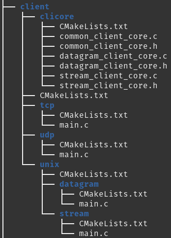
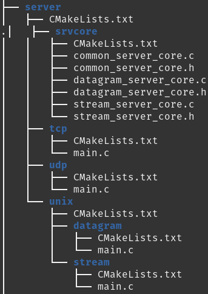
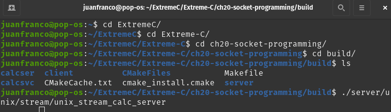
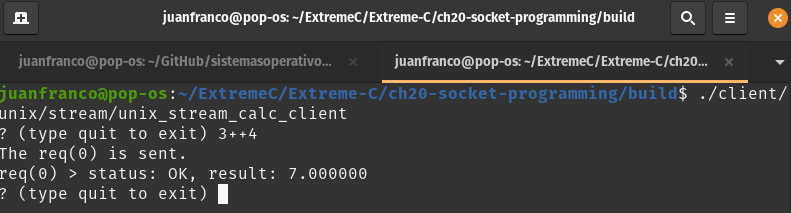

Semana 15
===========

La semana 9 comenzamos a estudiar algunas estrategias
de comunicación entre procesos o IPC, por sus siglas
en inglés.

Recordemos que habían dos estrategias:

* Transferencia de datos: 
    
    * byte streams: pipes, FIFO, stream socket
    * messages: Queue, datagram sockets.

* Memoria compartida

Durante las semanas 15 y 16 veremos algunas técnicas
que permitirán comunicar procesos en diferentes computadores.

El material que estudiaremos será tomado de 
`este <https://www.packtpub.com/extreme-c>`__ texto.

Sesión 1
---------
En `este <https://docs.google.com/presentation/d/132VYF-8-lz38iac9rUAt-vv_0mBfW4P_ckMecR2V-EU/edit?usp=sharing>`__
enlace está el material teórico para esta semana.

Sesión 2
---------
En esta sesión vamos a abordar la programación de sockets de manera
práctica. Para ello vamos a realizar un proyecto que permita ilustrar
los diferentes tipos de sockets.

Veremos en total 4 posibilidades:

* *Socket UDS* (*Unix domain socket*) sobre un *stream channel*.
* *Socket UDS* sobre un *datagram channel*.
* *Socket network* sobre un *stream channel*. 
* *Socket network* sobre un *datagram channel*.

El proyecto tendrá un servidor y múltiples clientes.

En `este <https://github.com/PacktPublishing/Extreme-C/tree/master/ch20-socket-programming>`__
enlace está el código fuente del proyecto completo.

Ejercicio 1
^^^^^^^^^^^^

Descargar el proyecto:

* Cree un directorio llamado ExtremeC
* Clone el repositorio:  
  
  git clone https://github.com/PacktPublishing/Extreme-C

* Cambiase al directorio donde está el proyecto:

  cd Extreme-C/ch20-socket-programming

* Ejecute el comando tree para ver la jerarquía de directorios
  del proyecto.

Las siguientes figuras muestran la estructura del código
del cliente y el server. Note que hay varios archivos
main.c, uno para cada tipo de socket: tcp, udp y unix
(en sus dos sabores, stream y datagram):

Ejercicio 2
^^^^^^^^^^^^
Antes de compilar el proyecto debemos instalar un
biblioteca llamada `cmocka <https://cmocka.org/>`__:

.. code-block:: c
   :linenos:

    sudo apt-get install libcmocka-dev

Compilación del proyecto:

.. code-block:: c
   :linenos:

   $ mkdir -p build
   $ cd build
   $ cmake ..
   ...
   $ make
   ...
   $

Ejercicio 3
^^^^^^^^^^^^
Ejecución de proyecto:

* Asegúrese de estar en el directorio build.
* Abra una nueva terminal (tendrá dos y ambas con el
  directorio build activo).
* Ejecute el server UDS
  
  ./server/unix/stream/unix_stream_calc_server

* Ejecute el cliente UDS:

  ./client/unix/stream/unix_stream_calc_client

* Escriba en el cliente la operación 3++4

Ejercicio 4
^^^^^^^^^^^^

El contenido de cada subdirectorio es el siguiente:

* /calcser: biblioteca (libcalcser.a) para hacer marshalling y unmarshalling
  a los datos que serán transmitidos y recibidos. En este
  código estará como tal el protocolo de la aplicación.

* /calcsvc: biblioteca (libcalcsvc.a) que contiene el código
  fuente del servicio de calculadora.
  
* /server/srvcore: biblioteca (libsrvcore.a) que contendrá
  la funcionalidad común del servidor independiente del tipo
  de socket.

* /server/unix/stream: código del servidor usando un socket
  tipo UDS stream.

* /server/unix/datagram: código del servidor usando un socket
  tipo UDS datagram

* /server/tcp: código del servidor usando un socket stream

* /server/udp: código del servidor usando un socket datagram

* /client/clicore: biblioteca (libclicore.a) con toda la funcionalidad común
  del cliente independiente del tipo de socket.

* /client/unix/stream: código del cliente usando un
  stream UDS socket.

* /client/unix/datagram: código del cliente usando un
  datagram UDS socket.

* /client/tcp: código del cliente usando un stream socket.

* /client/udp: código del cliente usando un datagram socket.

Ejercicio 5
^^^^^^^^^^^^
Este ejercicio analiza el protocolo de comunicación.

Las características del protocolo serán:

* Cada mensaje será de longitud variable.
* Cada mensaje tendrá un separador para indicar el fin
  del mensaje.
* Solo se utilizarán caracteres alfanuméricos más otros
  de control bien definidos.
* Tiene dos tipos de mensajes: solicitudes y respuestas.
* Las solicitudes tienen cuatro campos:
  Identificador de la solicitud + método + primer operando
  + segundo operando.
* Cada mensaje tiene un identificador que es usado por
  el servidor para generar su respectiva respuesta.
* El campo método es una operación que deberá realizar la
  calculadora.
* En el archivo calcser/calc_proto_req.h se puede ver
  la definición del objeto para realizar las solicitudes:

  .. code-block:: c
    :linenos:

      #ifndef CALC_PROTO_REQ_H
      #define CALC_PROTO_REQ_H

      #include <stdint.h>

      typedef enum {
        NONE,
        GETMEM, RESMEM,
        ADD, ADDM,
        SUB, SUBM,
        MUL, MULM,
        DIV
      } method_t;

      struct calc_proto_req_t {
        int32_t id;
        method_t method;
        double operand1;
        double operand2;
      };

      method_t str_to_method(const char*);
      const char* method_to_str(method_t);

      #endif   
 
* En el archivo anterior se ven nueve métodos.
* Los métodos que tienen una M al final permiten
  sumar los dos operandos con una memoria interna
  de la calculadora y dejar el resultado en esa
  memoria interna.
* Por ejemplo: se desea crear una solicitud con ID 1000
  para sumar el 1.5 con el 5.6. Para hacerlo se debe crear
  un objeto del tipo calc_proto_req_t así:

  .. code-block:: c
    :linenos:

    struct calc_proto_req_t req;
    req.id = 1000;
    req.method = ADD;
    req.operand1 = 1.5;
    req.operand2 = 5.6;

* Para poder transmitir este objeto, se debe serializar
  o hacer un marshalling así:

.. code-block:: c
   :linenos:

   1000#ADD#1.5#5.6$

* Note que el carácter # se utiliza para separar
  los campos y el carácter $ para indicar el fin del mensaje
  o separador de mensaje.

* Los mensajes de respuesta tienen tres campos
  ID de la solicitud + estado + resultado. 

* El objeto para responder es está aquí
  calcser/calc_proto_resp.h:

  .. code-block:: c
    :linenos:

    #ifndef CALC_PROTO_RESP_H
    #define CALC_PROTO_RESP_H

    #include <stdint.h>

    #define STATUS_OK              0
    #define STATUS_INVALID_REQUEST 1
    #define STATUS_INVALID_METHOD  2
    #define STATUS_INVALID_OPERAND 3
    #define STATUS_DIV_BY_ZERO     4
    #define STATUS_INTERNAL_ERROR  20

    typedef int status_t;

    struct calc_proto_resp_t {
      int32_t req_id;
      status_t status;
      double result;
    };

    #endif

* Por ejemplo:

  .. code-block:: c
    :linenos:

    struct calc_proto_resp_t resp;
    resp.req_id = 1000;
    resp.status = STATUS_OK;
    resp.result = 7.1;

* Y será serializado así:

  .. code-block:: c
    :linenos:

    1000#0#7.1$

Ejercicio 5
^^^^^^^^^^^^

Ahora se analiza el API de la biblioteca para hacer
el marshalling y unmarshalling de los objetos
correspondientes a las solicitudes y a las respuestas.

El API de la biblioteca está aquí: calcser/calc_proto_ser.h

.. code-block:: c
   :linenos:

    #ifndef CALC_PROTO_SER_H
    #define CALC_PROTO_SER_H

    #include <types.h>

    #include "calc_proto_req.h"
    #include "calc_proto_resp.h"

    #define ERROR_INVALID_REQUEST          101
    #define ERROR_INVALID_REQUEST_ID       102
    #define ERROR_INVALID_REQUEST_METHOD   103
    #define ERROR_INVALID_REQUEST_OPERAND1 104
    #define ERROR_INVALID_REQUEST_OPERAND2 105

    #define ERROR_INVALID_RESPONSE         201
    #define ERROR_INVALID_RESPONSE_REQ_ID  202
    #define ERROR_INVALID_RESPONSE_STATUS  203
    #define ERROR_INVALID_RESPONSE_RESULT  204

    #define ERROR_UNKNOWN  220

    struct buffer_t {
      char* data;
      int len;
    };

    struct calc_proto_ser_t;

    typedef void (*req_cb_t)(
            void* owner_obj,
            struct calc_proto_req_t);

    typedef void (*resp_cb_t)(
            void* owner_obj,
            struct calc_proto_resp_t);

    typedef void (*error_cb_t)(
            void* owner_obj,
            const int req_id,
            const int error_code);

    struct calc_proto_ser_t* calc_proto_ser_new();
    void calc_proto_ser_delete(
            struct calc_proto_ser_t* ser);

    void calc_proto_ser_ctor(
            struct calc_proto_ser_t* ser,
            void* owner_obj,
            int ring_buffer_size);

    void calc_proto_ser_dtor(
            struct calc_proto_ser_t* ser);

    void* calc_proto_ser_get_context(
            struct calc_proto_ser_t* ser);

    void calc_proto_ser_set_req_callback(
            struct calc_proto_ser_t* ser,
            req_cb_t cb);

    void calc_proto_ser_set_resp_callback(
            struct calc_proto_ser_t* ser,
            resp_cb_t cb);

    void calc_proto_ser_set_error_callback(
            struct calc_proto_ser_t* ser,
            error_cb_t cb);

    void calc_proto_ser_server_deserialize(
            struct calc_proto_ser_t* ser,
            struct buffer_t buffer,
            bool_t* req_found);

    struct buffer_t calc_proto_ser_server_serialize(
            struct calc_proto_ser_t* ser,
            const struct calc_proto_resp_t* resp);

    void calc_proto_ser_client_deserialize(
            struct calc_proto_ser_t* ser,
            struct buffer_t buffer,
            bool_t* resp_found);

    struct buffer_t calc_proto_ser_client_serialize(
            struct calc_proto_ser_t* ser,
            const struct calc_proto_req_t* req);

    #endif

El API tiene funciones para construir y destruir el
objeto usado para serializar:

.. code-block:: c
   :linenos:

    void calc_proto_ser_ctor(
            struct calc_proto_ser_t* ser,
            void* owner_obj,
            int ring_buffer_size);

    void calc_proto_ser_dtor(
            struct calc_proto_ser_t* ser);

Dos funciones para serializar y deserializar en el
server y dos para hacer los propio en el cliente:

.. code-block:: c
   :linenos:

    void calc_proto_ser_server_deserialize(
            struct calc_proto_ser_t* ser,
            struct buffer_t buffer,
            bool_t* req_found);

    struct buffer_t calc_proto_ser_server_serialize(
            struct calc_proto_ser_t* ser,
            const struct calc_proto_resp_t* resp);

    void calc_proto_ser_client_deserialize(
            struct calc_proto_ser_t* ser,
            struct buffer_t buffer,
            bool_t* resp_found);

    struct buffer_t calc_proto_ser_client_serialize(
            struct calc_proto_ser_t* ser,
            const struct calc_proto_req_t* req);

Tres funciones callback:

.. code-block:: c
   :linenos:

    void calc_proto_ser_set_req_callback(
            struct calc_proto_ser_t* ser,
            req_cb_t cb);

    void calc_proto_ser_set_resp_callback(
            struct calc_proto_ser_t* ser,
            resp_cb_t cb);
            
    void calc_proto_ser_set_error_callback(
            struct calc_proto_ser_t* ser,
            error_cb_t cb);

* calc_proto_ser_set_req_callback: será llamado
  cuando se deserialice una solicitud

* calc_proto_ser_set_resp_callback: será llamado
  cuando se deserialice una respuesta

* calc_proto_ser_set_error_callback: será llamado
  cuando ocurra un error en el proceso de serialización
  o deserialización

El código de la función del lado del servidor
para serializar es este:

.. code-block:: c
   :linenos:

    struct buffer_t calc_proto_ser_server_serialize(
        struct calc_proto_ser_t* ser,
        const struct calc_proto_resp_t* resp) {

      struct buffer_t buff;
      char resp_result_str[64];
      _serialize_double(resp_result_str, resp->result);
      buff.data = (char*)malloc(64 * sizeof(char));
      sprintf(buff.data, "%d%c%d%c%s%c", resp->req_id,
              FIELD_DELIMITER, (int)resp->status, FIELD_DELIMITER,
          resp_result_str, MESSAGE_DELIMITER);
      buff.len = strlen(buff.data);

      return buff;

    }

resp es un puntero al objeto de solicitud que se
desea serializar. La función retorna un objeto
de tipo buffer_t que contendrá el solicitud serializada

.. code-block:: c
   :linenos:

    struct buffer_t {
      char* data;
      int len;
    };

El código de la función del lado del servidor
para deserializar es este:

.. code-block:: c
   :linenos:

    void calc_proto_ser_server_deserialize(
        struct calc_proto_ser_t* ser,
        struct buffer_t buff,
        bool_t* req_found) {
      if (req_found) {
        *req_found = FALSE;
      }
      _deserialize(ser, buff, _parse_req_and_notify,
              ERROR_INVALID_REQUEST, req_found);
    }

Un análisis similar se puede hacer para las funciones
correspondientes para el cliente.

Ejercicio 6
^^^^^^^^^^^^

Servicio de la calculadora.

El api está aquí: calcsvc/calc_service.h

.. code-block:: c
   :linenos:

    #ifndef CALC_SERVICE_H
    #define CALC_SERVICE_H

    #include <types.h>

    static const int CALC_SVC_OK = 0;
    static const int CALC_SVC_ERROR_DIV_BY_ZERO = -1;

    struct calc_service_t;

    struct calc_service_t* calc_service_new();
    void calc_service_delete(struct calc_service_t*);

    void calc_service_ctor(struct calc_service_t*);
    void calc_service_dtor(struct calc_service_t*);

    void calc_service_reset_mem(struct calc_service_t*);
    double calc_service_get_mem(struct calc_service_t*);
    double calc_service_add(struct calc_service_t*, double, double b,
        bool_t mem);
    double calc_service_sub(struct calc_service_t*, double, double b,
        bool_t mem);
    double calc_service_mul(struct calc_service_t*, double, double b,
        bool_t mem);
    int calc_service_div(struct calc_service_t*, double,
            double, double*);

    #endif

Para cada cliente que se conecte al servidor es necesario
crear un objeto de tipo calc_service_t.

Como los algunas operaciones dependen de la memoria interna
de la calculadora, es posible que algunas solicitudes
dependan de solicitudes anteriores. Es por ello que nuestro
objeto tipo calc_service_t es un objeto de tipo stateful service objects.

Si algunas solicitudes no dependieran de solicitudes
anteriores entonces nuestro objeto tipo calc_service_t
sería un stateless service object y por tanto podríamos crear
un solo objeto para todos los clientes, es decir, podríamos
tener un singleton service object.

Ejercicio 7: UDS stream server
^^^^^^^^^^^^^^^^^^^^^^^^^^^^^^^

Llamamos server al proceso que escuchará las conexiones.

El código se encuentra aquí: server/unix/stream/main.c

// TODO

