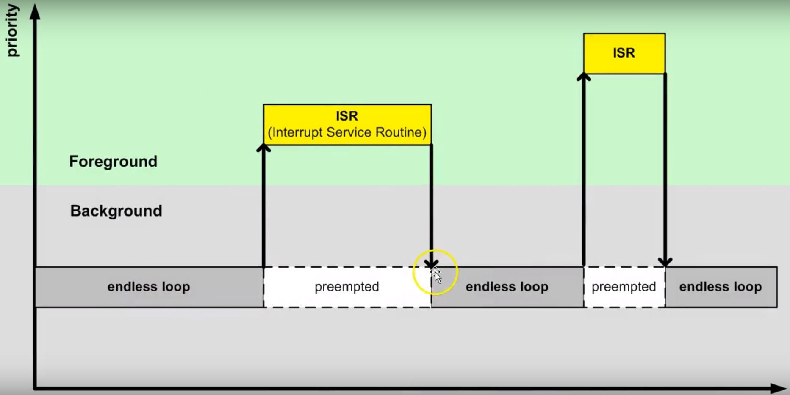
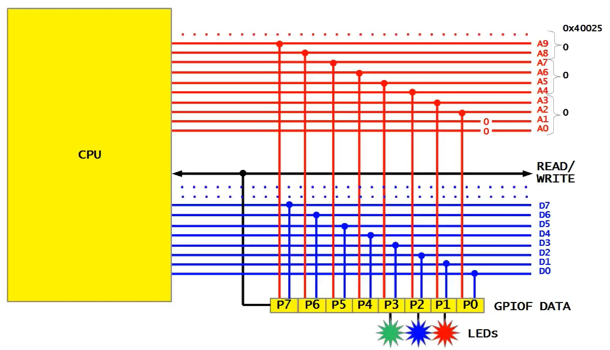
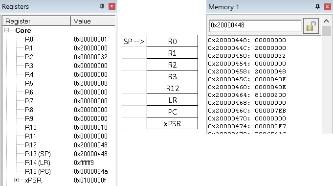
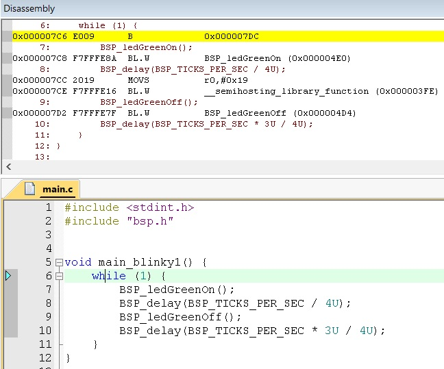
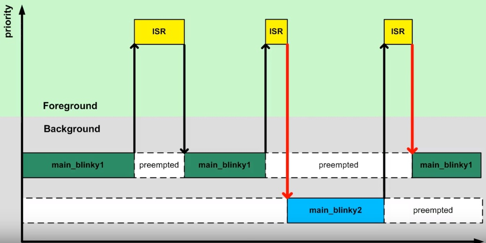
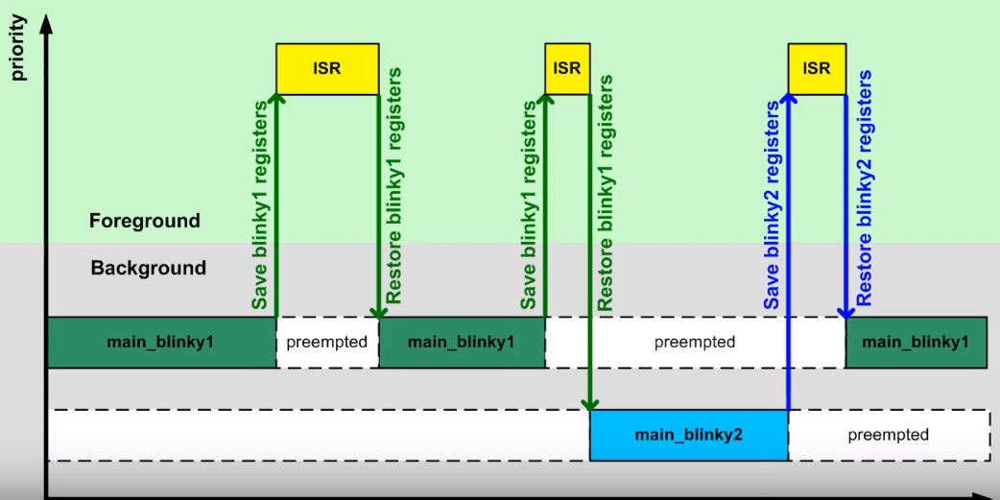
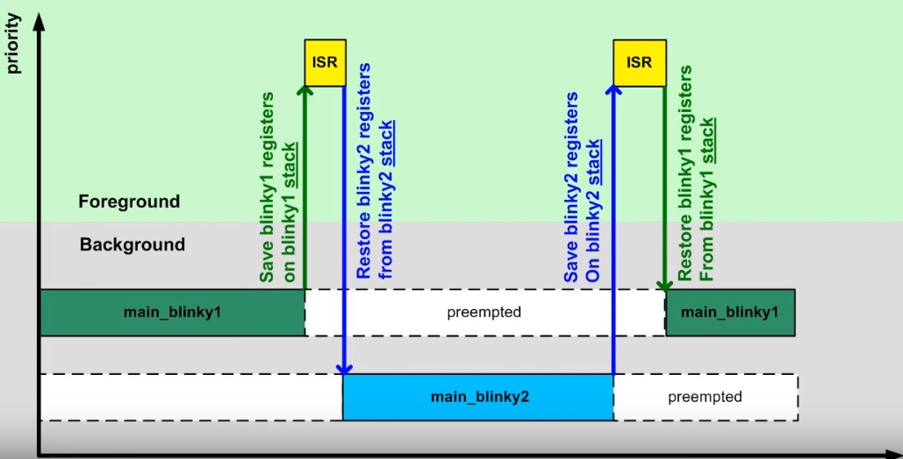
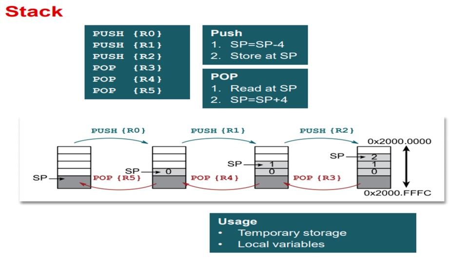

Semana 2
===========
Esta semana comenzaremos a explorar conceptos avanzados de programación de sistemas embebidos. En particular, mediante 
el uso de sistemas operativos de tiempo real (RTOS); sin embargo, antes de comenzar a utilizar las abstracciones que un 
RTOS nos ofrece, debemos comprender cómo funciona.

Objetivos
---------
1. Entender cómo funciona un sistema operativo de tiempo real.
2. Programar utilizando tareas.

Algo de teoría
---------------
Los RTOS son una evolución de la arquitectura de programación clásica *backgroud/foreground* tan conocida por 
nosotros (si, arduino). La idea entonces de un RTOS es ofrecernos un ambiente de programación con múltiples *background* 
funcionando de manera concurrente, es decir, es como tener un programa de arduino con múltiples ciclos ``loop()`` 
concurrentes.

El siguiente código muestra un ejemplo típico de una arquitectura *background/foreground*:

.. code-block:: c
   :lineno-start: 1

    // background code:
    
    #include <stdint.h>
    #include "bsp.h"

    int main() {
        BSP_init();
        while (1) {
            BSP_ledGreenOn();
            BSP_delay(BSP_TICKS_PER_SEC / 4U);
            BSP_ledGreenOff();
            BSP_delay(BSP_TICKS_PER_SEC * 3U / 4U);
        }
        return 0;
    }

.. code-block:: c
   :lineno-start: 1

    // foreground code: blocking version

    #include <stdint.h>  /* Standard integers. WG14/N843 C99 Standard */
    #include "bsp.h"
    #include "TM4C123GH6PM.h" /* the TM4C MCU Peripheral Access Layer (TI) */

    /* on-board LEDs */
    #define LED_BLUE  (1U << 2)

    static uint32_t volatile l_tickCtr;

    void SysTick_Handler(void) {
        ++l_tickCtr;
    }

    void BSP_init(void) {
        SYSCTL->RCGCGPIO  |= (1U << 5); /* enable Run mode for GPIOF */
        SYSCTL->GPIOHBCTL |= (1U << 5); /* enable AHB for GPIOF */
        GPIOF_AHB->DIR |= (LED_RED | LED_BLUE | LED_GREEN);
        GPIOF_AHB->DEN |= (LED_RED | LED_BLUE | LED_GREEN);
        SystemCoreClockUpdate();
        SysTick_Config(SystemCoreClock / BSP_TICKS_PER_SEC);
        __enable_irq();
    }

    uint32_t BSP_tickCtr(void) {
        uint32_t tickCtr;
        __disable_irq();
        tickCtr = l_tickCtr;
        __enable_irq();
        return tickCtr;
    }

    void BSP_delay(uint32_t ticks) {
        uint32_t start = BSP_tickCtr();
        while ((BSP_tickCtr() - start) < ticks) {
        }
    }

    void BSP_ledGreenOn(void) {
        GPIOF_AHB->DATA_Bits[LED_GREEN] = LED_GREEN;
    }

    void BSP_ledGreenOff(void) {
        GPIOF_AHB->DATA_Bits[LED_GREEN] = 0U;
    }

Es importante notar que el código anterior es bloqueante (Pregunta Juanito: ¿Qué es eso?). La función 
``BSP_delay(BSP_TICKS_PER_SEC / 4U);`` consume todos los recursos de la CPU en espera ocupada. A esto también lo llamamos 
``polling``. 


¿Cómo superamos la espera ocupada? Utilizando la excelente técnica de programación conocida como máquinas de estado:

.. code-block:: c
   :lineno-start: 1

    // background code: non-blocking version 
    int main() {
        BSP_init();
        while (1) {
            /* Blinky polling state machine */
            static enum {
                INITIAL,
                OFF_STATE,
                ON_STATE
            } state = INITIAL;
            static uint32_t start;
            switch (state) {
                case INITIAL:
                    start = BSP_tickCtr();
                    state = OFF_STATE; /* initial transition */
                    break;
                case OFF_STATE:
                    if ((BSP_tickCtr() - start) > BSP_TICKS_PER_SEC * 3U / 4U) {
                        BSP_ledGreenOn();
                        start = BSP_tickCtr();
                        state = ON_STATE; /* state transition */
                    }
                    break;
                case ON_STATE:
                    if ((BSP_tickCtr() - start) > BSP_TICKS_PER_SEC / 4U) {
                        BSP_ledGreenOff();
                        start = BSP_tickCtr();
                        state = OFF_STATE; /* state transition */
                    }
                    break;
                default:
                    //error();
                    break;
            }
        }
        //return 0;
    }

En ambos códigos, espera ocupada y máquinas de estado, la arquitectura *background/foreground* se puede entender como 
ilustra la figura:



El código que enciende y apaga el LED corre en el *background*. Cuando ocurre la interrupción ``SysTick_Handler`` el 
*background* será "despojado" de la CPU de la cual se apropiará (*preemption*) el servicio de atención a 
la interrupción o ``ISR`` en el *foreground*. Una vez termine la ejecución de la ISR, el *backgound* retomará justo en el 
punto en el cual fue "desalojado" (preempted). Note también que la comunicación entre el *background/foreground* se realiza 
por medio de la variable ``l_tickCtr``. Adicionalmente, observe como la función BSP_tickCtr accede la variable. 
Pregunta Juanito: ¿Por qué se hace de esa manera? Para evitar las condiciones de carrera.

¿Qué son las condiciones de carrera?
^^^^^^^^^^^^^^^^^^^^^^^^^^^^^^^^^^^^^^

Son condiciones que se  presentan cuando dos entidades concurrentes compiten por un recurso haciendo que el estado del 
recurso dependa de la secuencia en la cual se accede. El siguiente ejemplo 
ilustrará este asunto:

.. code-block:: c 
   :lineno-start: 1

    #include "TM4C123GH6PM.h"
    #include "bsp.h"

    int main() {
        SYSCTL->RCGCGPIO  |= (1U << 5); /* enable Run mode for GPIOF */
        SYSCTL->GPIOHBCTL |= (1U << 5); /* enable AHB for GPIOF */
        GPIOF_AHB->DIR |= (LED_RED | LED_BLUE | LED_GREEN);
        GPIOF_AHB->DEN |= (LED_RED | LED_BLUE | LED_GREEN);

        SysTick->LOAD = SYS_CLOCK_HZ/2U - 1U;
        SysTick->VAL  = 0U;
        SysTick->CTRL = (1U << 2) | (1U << 1) | 1U;

        SysTick_Handler();

        __enable_irq();
        while (1) {
            GPIOF_AHB->DATA = GPIOF_AHB->DATA | LED_GREEN;
            GPIOF_AHB->DATA = GPIOF_AHB->DATA & ~LED_GREEN;
        }
        //return 0;
    }

.. code-block:: c 
   :lineno-start: 1

    /* Board Support Package */
    #include "TM4C123GH6PM.h"
    #include "bsp.h"

    __attribute__((naked)) void assert_failed (char const *file, int line) {
        /* TBD: damage control */
        NVIC_SystemReset(); /* reset the system */
    }

    void SysTick_Handler(void) {
        GPIOF_AHB->DATA_Bits[LED_BLUE] ^= LED_BLUE;
    }

.. code-block:: c 
   :lineno-start: 1

    #ifndef __BSP_H__
    #define __BSP_H__

    /* Board Support Package for the EK-TM4C123GXL board */

    /* system clock setting [Hz] */
    #define SYS_CLOCK_HZ 16000000U

    /* on-board LEDs */
    #define LED_RED   (1U << 1)
    #define LED_BLUE  (1U << 2)
    #define LED_GREEN (1U << 3)

    #endif // __BSP_H__

Observemos el código generado por el compilador para las expresiones que encienden y apagan el LED verde:

.. code-block:: asm
   :lineno-start: 1

    18                GPIOF_AHB->DATA = GPIOF_AHB->DATA | LED_GREEN;
    000003d4:   4B09                ldr        r3, [pc, #0x24]
    000003d6:   F8D333FC            ldr.w      r3, [r3, #0x3fc]
    000003da:   4A08                ldr        r2, [pc, #0x20]
    000003dc:   F0430308            orr        r3, r3, #8
    000003e0:   F8C233FC            str.w      r3, [r2, #0x3fc]
    19                GPIOF_AHB->DATA = GPIOF_AHB->DATA & ~LED_GREEN;
    000003e4:   4B05                ldr        r3, [pc, #0x14]
    000003e6:   F8D333FC            ldr.w      r3, [r3, #0x3fc]
    000003ea:   4A04                ldr        r2, [pc, #0x10]
    000003ec:   F0230308            bic        r3, r3, #8
    000003f0:   F8C233FC            str.w      r3, [r2, #0x3fc]

Consideremos el caso en el cual el LED azul está apagado y el LED verde encendido. El procesador comenzará 
a ejecutar las siguientes instrucciones que apagarán el LED verde:

.. code-block:: asm
   :lineno-start: 1

    19                GPIOF_AHB->DATA = GPIOF_AHB->DATA & ~LED_GREEN;
    000003e4:   4B05                ldr        r3, [pc, #0x14]
    000003e6:   F8D333FC            ldr.w      r3, [r3, #0x3fc]
    000003ea:   4A04                ldr        r2, [pc, #0x10]
    000003ec:   F0230308            bic        r3, r3, #8
    000003f0:   F8C233FC            str.w      r3, [r2, #0x3fc]

Justo antes de ejecutar la instrucción ``000003ec: F0230308 bic r3, r3, #8`` ocurre una interrupción 
``SysTick_Handler``. Dicha interrupción enciende y apaga el LED azul cada 500 ms. En este caso el LED azul se 
encenderá. Por tanto, al salir de la interrupción, tanto el LED azul como el verde estarán encendidos. Tenga en cuenta 
que el LED azul se apagará en 500 ms. La instrucción ``000003ec: F0230308 bic r3, r3, #8`` se ejecuta y sorpresivamente 
ambos LEDs se apagan (Dice Juanito: ¿Qué pasó?). Acaba de presentarse una ``condición de carrera``.

Para enteder lo anterior, debemos analizar con cuidado el contenido del registro r3 y del puerto de entrada/salida 
justo antes de la ejecución de ``000003ec: F0230308 bic r3, r3, #8``. En ese punto ``r3 = 0x00000008`` y 
``GPIOF = 0x00000008``. Esto es así porque estamos leyendo en el registro r3 el contenido del puerto GPIOF y en este 
momento el LED verde (bit 3) está encendido. Una vez se ejecuta la interrupción, el puerto cambia (``GPIOF = 0x0000000C``) 
ya que tanto el LED azul como el verde están encendidos. Luego de la interrupción se ejcuta la instrucción  
``000003ec: F0230308 bic r3, r3, #8`` haciendo ``r3 = 0x00000000``. Note que en este momento el valor de r3 no 
está considerando el estado del LED azul. En consecuencia, al ejecutar ``000003f0: F8C233FC str.w r3, [r2, #0x3fc]`` 
el puerto ``GPIOF`` tomará el valor de r3 y ambos LEDs se apagarán. (Pregunta Juanito: ¿Y cómo se puede arreglar esto?). 
El problema ocurre porque la lectura del puerto, su modificación y posterior escritura NO ES ``ATÓMICA``. Entonces para 
solucionar el problema podemos atacarlo de dos maneras: haciendo que la lectura, modificación y escritura del recurso sea 
atómica ("indivisible") o evitando compartir el recurso. 

Estrategia atómica:

.. code-block:: c
   :lineno-start: 1

    while (1) {
        __disable_irq();
        GPIOF_AHB->DATA = GPIOF_AHB->DATA | LED_GREEN;
        __enable_irq();
        
        __disable_irq();
        GPIOF_AHB->DATA = GPIOF_AHB->DATA & ~LED_GREEN;
        __enable_irq();
    }

Estrategia no recurso compartido:

.. code-block:: c
   :lineno-start: 1

    while (1) {
        GPIOF_AHB->DATA_Bits[LED_GREEN] = LED_GREEN;
        GPIOF_AHB->DATA_Bits[LED_GREEN] = 0U;
    }

La última estrategia permite acceder de manera individual y sólo con una operación de escritura los bits del puerto 
de entrada salida. La estrategia funciona gracias a una "jugada" en hardware. La siguiente figura muestra la implementación 
de los puertos de GPIO en el microcontrolador que estamos utilizando para realizar los ejemplos: TM4C123G de Texas 
Instruments. Note que hay una línea de dirección y de datos dedicada a cada bit del puerto de entrada salida:



Las líneas de dirección habilitan la escritura del bit. Por tanto, si se desea escribir el bit 2 del puerto, en las 
línea correspondientes del bus de direcciones debemos colocar el valor 0x010 y escribir en el bus de datos un 0x0000000004. 
En los ejemplos anteriores, al ejecutar la instrucción ``000003f0: F8C233FC str.w r3, [r2, #0x3fc]`` estamos 
escribiendo el valor del registro r3 en el puerto GPIOF completo porque el valor 0x3FC en las líneas correspondientes 
del bus de direcciones habilita cada bit del puerto GPIOF.

A continuación se observa el código generado por el compilador al emplear la estrategia del recurso no compartido:

.. code-block:: asm
   :lineno-start: 1

    19                GPIOF_AHB->DATA_Bits[LED_GREEN] = LED_GREEN;
    000003d4:   4B0E                ldr        r3, [pc, #0x38]
    000003d6:   2208                movs       r2, #8
    000003d8:   621A                str        r2, [r3, #0x20]

La instrucción ``ldr r3, [pc, #0x38]`` carga la dirección del puerto GPIOF en el registro 3 (0x4005D000), ``movs r2, #8`` 
carga un 8 en r2 y finalmente ``str r2, [r3, #0x20]`` escribe un 8 en la dirección 0x4005D000 + 0x20, es decir,  
se escribe un 1 en el bit 3 del puerto GPIOF correspondiente al LED verde.

El siguiente código muestra la declaración del puerto GPIOF en lenguaje C:

.. code-block:: c
   :lineno-start: 1

    typedef struct {                                    /*!< GPIOA Structure                                                       */
    __IO uint32_t  DATA_Bits[255];                    /*!< GPIO bit combinations                                                 */
    __IO uint32_t  DATA;                              /*!< GPIO Data                                                             */
    __IO uint32_t  DIR;                               /*!< GPIO Direction                                                        */
    __IO uint32_t  IS;                                /*!< GPIO Interrupt Sense                                                  */
    __IO uint32_t  IBE;                               /*!< GPIO Interrupt Both Edges                                             */
    __IO uint32_t  IEV;                               /*!< GPIO Interrupt Event                                                  */
    __IO uint32_t  IM;                                /*!< GPIO Interrupt Mask                                                   */
    __IO uint32_t  RIS;                               /*!< GPIO Raw Interrupt Status                                             */
    __IO uint32_t  MIS;                               /*!< GPIO Masked Interrupt Status                                          */
    __O  uint32_t  ICR;                               /*!< GPIO Interrupt Clear                                                  */
    __IO uint32_t  AFSEL;                             /*!< GPIO Alternate Function Select                                        */
    __I  uint32_t  RESERVED1[55];
    __IO uint32_t  DR2R;                              /*!< GPIO 2-mA Drive Select                                                */
    __IO uint32_t  DR4R;                              /*!< GPIO 4-mA Drive Select                                                */
    __IO uint32_t  DR8R;                              /*!< GPIO 8-mA Drive Select                                                */
    __IO uint32_t  ODR;                               /*!< GPIO Open Drain Select                                                */
    __IO uint32_t  PUR;                               /*!< GPIO Pull-Up Select                                                   */
    __IO uint32_t  PDR;                               /*!< GPIO Pull-Down Select                                                 */
    __IO uint32_t  SLR;                               /*!< GPIO Slew Rate Control Select                                         */
    __IO uint32_t  DEN;                               /*!< GPIO Digital Enable                                                   */
    __IO uint32_t  LOCK;                              /*!< GPIO Lock                                                             */
    __I  uint32_t  CR;                                /*!< GPIO Commit                                                           */
    __IO uint32_t  AMSEL;                             /*!< GPIO Analog Mode Select                                               */
    __IO uint32_t  PCTL;                              /*!< GPIO Port Control                                                     */
    __IO uint32_t  ADCCTL;                            /*!< GPIO ADC Control                                                      */
    __IO uint32_t  DMACTL;                            /*!< GPIO DMA Control                                                      */
    } GPIOA_Type;
    #define GPIOF_AHB_BASE                  0x4005D000UL
    #define GPIOF_AHB                       ((GPIOA_Type              *) GPIOF_AHB_BASE)

Más adelante veremos que existe una tercera técnica para controlar el acceso atómico o exclusivo a los recursos compartidos. 
Dicha opción es ofrecida por un RTOS mediante el uso semáfaros de exclusión mutua.

Ejecución de múltiples *backgound* concurrentes
^^^^^^^^^^^^^^^^^^^^^^^^^^^^^^^^^^^^^^^^^^^^^^^^

Hasta este punto hemos ilustrado dos tipos de arquitecturas *backgroud/foreground*: bloqueante (espera ocupada) y no 
bloqueante (máquinas de estado). En este punto vamos a concentrarnos en evulucionar la versión bloqueante. Para ello, 
"intentaremos" crear un programa, bloqueante, que encienda y apague dos LEDs de manera independiente y concurrente. El 
siguiente código ilustra una intento de conseguir lo anterior:

.. code-block:: c 
   :lineno-start: 1

    #include <stdint.h>
    #include "bsp.h"

    int main() {
        volatile uint32_t run = 0U; 
        BSP_init();

    while (1) {
        BSP_ledGreenOn();
        BSP_delay(BSP_TICKS_PER_SEC / 4U);
        BSP_ledGreenOff();
        BSP_delay(BSP_TICKS_PER_SEC * 3U / 4U);

        BSP_ledBlueOn();
        BSP_delay(BSP_TICKS_PER_SEC / 2U);
        BSP_ledBlueOff();
        BSP_delay(BSP_TICKS_PER_SEC / 3U);

    }
        //return 0;
    }

Al ejecutar este código claramente se observa que los LEDs no están funcionando de manera concurrente e independiente. Por 
tanto, el siguiente evento sería tener dos ciclos:

.. code-block:: c 
   :lineno-start: 1

    void main_blinky1() {
        while (1) {
            BSP_ledGreenOn();
            BSP_delay(BSP_TICKS_PER_SEC / 4U);
            BSP_ledGreenOff();
            BSP_delay(BSP_TICKS_PER_SEC * 3U / 4U);
        }
    }

    void main_blinky2() {
        while (1) {
            BSP_ledBlueOn();
            BSP_delay(BSP_TICKS_PER_SEC / 2U);
            BSP_ledBlueOff();
            BSP_delay(BSP_TICKS_PER_SEC / 3U);
        }
    }


    int main() {
        volatile uint32_t run = 0U; 
        BSP_init();

        if(run){
            main_blinky1();
        }
        else{
        main_blinky2();
        }

        //return 0;
    }

Al ejecutar este código claramente se observa que sólo se ejecuta la función ``main_blinky2``. Vamos a analizar en detalle 
cómo es el funcionamiento de este programa. Para ello vamos a detener la ejecución del programa justo antes de retornar de 
la interrupción ``SysTick_Handler```. La figura muestra el contenido del los registros del procesador, el *stack frame* y 
el contenido del *stack*.



Según el *stack frame* y el contenido del *stack*, al retornar de la interrupción el programa debe continuar en la posición 
de memoria ``PC = 0x000004EC``. De manera muy astuta pregunta Juanito: ¿Y si cambiamos a mano el valor en el stack 
que será cargado en el PC al retornar de la interrupción? Esto permitiría hacer que el programa continue en cualquier 
posición de memoria. La siguiente figura muestra la posición en memoria de programa de la función main_blinky1:



El inicio de la función está en la posición 0x000007C6. Por tanto, si modificamos la posición del stack correspondiente al 
PC justo antes de retornar de la interrupción, conseguiremos el efecto deseado. La siguiente figura muestra lo conseguido 
hasta ahora modificando de manera manual la dirección de retorno de la interrupción.



La técnica anterior es el principio sobre el cual se basan los RTOS para lograr cambiar el flujo de ejecución entre 
los diferentes *backgrounds* disponibles. La parte del RTOS encargada de extender la arquitectura *backgound/foreground* 
permiendo que se puedan ejecutar concurrentemente varios *backgounds* sobre la misma CPU se denomina ``kernel``. A estos 
múltiples *backgrounds* los denominamos ``tareas``. Al proceso de cambiar frecuentemente la CPU entre mútiples tareas 
creando la ilusión de que cada tarea tiene la CPU para ella sóla se denomina ``multitarea``.

Como se señaló anteriormente, el cambio en la dirección de retorno de la interrupción es el principio de un kernel, pero  
esta idea por si sola presenta un problema. Si ``main_blinky1`` se está ejecutando y ocurre una interrupción, la CPU 
salvará automáticamente los registros ``R0 a R3`` y ``LR, PC y xPSR`` en el stack. Luego al retornar de la interrupción, 
los registros serán restuardos. De esta manera la interrupción podrá hacer uso de los registros y 
la función ``main_blinky1`` podrá continuar en el punto donde fue interrumpida. Si en vez de volver a ``main_blinky1`` el 
flujo continua con ``main_blinky2`` los registros resturados serán modificados por el código de ``main_blinky2`` y al 
retornar a ``main_blinky1`` el estado de los registros estará corrupto. La siguiente figura ilustra el problema:



Por tanto, es necesario tener un espacio para salvar el contenido de los registros de main_blinky1, así como para 
main_blinky2. Si cada tarea tiene un stack propio, se puede conseguir lo que muestra la figura:



El siguiente código muestra una posible implementación para lo descrito anteriormente:

.. code-block:: c 
   :lineno-start: 1

    #include <stdint.h>
    #include "bsp.h"

    #include <stdint.h>
    #include "bsp.h"

    uint32_t stack_blinky1[40];
    uint32_t *sp_blinky1 = &stack_blinky1[40];

    void main_blinky1() {
        while (1) {
            BSP_ledGreenOn();
            BSP_delay(BSP_TICKS_PER_SEC / 4U);
            BSP_ledGreenOff();
            BSP_delay(BSP_TICKS_PER_SEC * 3U / 4U);
        }
    }

    uint32_t stack_blinky2[40];
    uint32_t *sp_blinky2 = &stack_blinky2[40];

    void main_blinky2() {
        while (1) {
            BSP_ledBlueOn();
            BSP_delay(BSP_TICKS_PER_SEC / 2U);
            BSP_ledBlueOff();
            BSP_delay(BSP_TICKS_PER_SEC / 3U);
        }
    }


    /* background code: sequential with blocking version */
    int main() {
        BSP_init();

    /* fabricate Cortex-M ISR stack frame for blinky1 */
    *(--sp_blinky1) = (1U << 24);  /* xPSR */
    *(--sp_blinky1) = (uint32_t)&main_blinky1; /* PC */
    *(--sp_blinky1) = 0x0000000EU; /* LR  */
    *(--sp_blinky1) = 0x0000000CU; /* R12 */
    *(--sp_blinky1) = 0x00000003U; /* R3  */
    *(--sp_blinky1) = 0x00000002U; /* R2  */
    *(--sp_blinky1) = 0x00000001U; /* R1  */
    *(--sp_blinky1) = 0x00000000U; /* R0  */
    /* additionally, fake registers R4-R11 */
    *(--sp_blinky1) = 0x0000000BU; /* R11 */
    *(--sp_blinky1) = 0x0000000AU; /* R10 */
    *(--sp_blinky1) = 0x00000009U; /* R9 */
    *(--sp_blinky1) = 0x00000008U; /* R8 */
    *(--sp_blinky1) = 0x00000007U; /* R7 */
    *(--sp_blinky1) = 0x00000006U; /* R6 */
    *(--sp_blinky1) = 0x00000005U; /* R5 */
    *(--sp_blinky1) = 0x00000004U; /* R4 */

    /* fabricate Cortex-M ISR stack frame for blinky2 */
    *(--sp_blinky2) = (1U << 24);  /* xPSR */
    *(--sp_blinky2) = (uint32_t)&main_blinky2; /* PC */
    *(--sp_blinky2) = 0x0000000EU; /* LR  */
    *(--sp_blinky2) = 0x0000000CU; /* R12 */
    *(--sp_blinky2) = 0x00000003U; /* R3  */
    *(--sp_blinky2) = 0x00000002U; /* R2  */
    *(--sp_blinky2) = 0x00000001U; /* R1  */
    *(--sp_blinky2) = 0x00000000U; /* R0  */
    /* additionally, fake registers R4-R11 */
    *(--sp_blinky2) = 0x0000000BU; /* R11 */
    *(--sp_blinky2) = 0x0000000AU; /* R10 */
    *(--sp_blinky2) = 0x00000009U; /* R9 */
    *(--sp_blinky2) = 0x00000008U; /* R8 */
    *(--sp_blinky2) = 0x00000007U; /* R7 */
    *(--sp_blinky2) = 0x00000006U; /* R6 */
    *(--sp_blinky2) = 0x00000005U; /* R5 */
    *(--sp_blinky2) = 0x00000004U; /* R4 */

        while (1) {
        }
        //return 0;
    }

Analicemos varios asuntos del código anterior. La línea ``uint32_t stack_blinky1[40];`` declara el *stack* para la tarea1. 
la línea ``uint32_t *sp_blinky1 = &stack_blinky1[40];`` inicializa el *stack pointer* para la tarea1. El *stack* es de 40 
palabras de 32 bits y si inicializa en la palabra 41, es decir, una palabra por fuera del *stack*. La siguiente figura 
ilustra el funcionamiento del *stack* para el microcontrolandor en cuestión e ilustra la razón para inicializar el 
*stack pointer* de esta manera ya que al hacer una operación ``push`` primero se decrementa el *stack pointer* y luego 
se almacena el dato en el *stack*.



Las siguientes líneas de código sirven para inicializar el stack de cada tarea. Note que se guardarán los registros 
de la CPU ``xPSR,PC,LR,R0-R3, R12``:

.. code-block:: c 
   :lineno-start: 37

    /* fabricate Cortex-M ISR stack frame for blinky1 */
    *(--sp_blinky1) = (1U << 24);  /* xPSR */
    *(--sp_blinky1) = (uint32_t)&main_blinky1; /* PC */
    *(--sp_blinky1) = 0x0000000EU; /* LR  */
    *(--sp_blinky1) = 0x0000000CU; /* R12 */
    *(--sp_blinky1) = 0x00000003U; /* R3  */
    *(--sp_blinky1) = 0x00000002U; /* R2  */
    *(--sp_blinky1) = 0x00000001U; /* R1  */
    *(--sp_blinky1) = 0x00000000U; /* R0  */
    /* additionally, fake registers R4-R11 */
    *(--sp_blinky1) = 0x0000000BU; /* R11 */
    *(--sp_blinky1) = 0x0000000AU; /* R10 */
    *(--sp_blinky1) = 0x00000009U; /* R9 */
    *(--sp_blinky1) = 0x00000008U; /* R8 */
    *(--sp_blinky1) = 0x00000007U; /* R7 */
    *(--sp_blinky1) = 0x00000006U; /* R6 */
    *(--sp_blinky1) = 0x00000005U; /* R5 */
    *(--sp_blinky1) = 0x00000004U; /* R4 */

Inicialmente ninguna de las tareas funcionará porque el programa se quedará infinitamente en el ciclo 
``while (1) { }``. Para comenzar la ejecución de las tareas, debemos detener el programa justo antes de retornar de 
``SysTick_Handler``. Restaruramos los registros ``R4-R11`` (inicialmente con basura porque es la primera vez 
que ejecutamos la tarea1). Ajustamos el *stack pointer* de la tarea 1 para que apunte a R0 y asignamos el SP de la CPU 
con el valor del *stack pointer* de la tarea1. Una vez se reanuda el programa se debe ejecutar la tarea1. 
Para ejecutar la tarea2, volvemos a detener el programa, pero esta vez al inicio de la interrupción ``SysTick_Handler``. 
En este punto, tendremos salvados en el *stack* de la tarea1 los registros ``xPSR,PC,LR,R0-R3, R12`` 
(estos los salva la interrupción automáticamente). Ahora debemos salvar en el *stack* de la tarea1 el resto de registros 
de la CPU, es decir, ``R4-R11`` (comenzando por R11) y ajustar el valor del *stack pointer* de la tarea1 al último 
registro salvado. Justo antes de retornar de la interrupción debemos restaurar los registros ``R4-R11`` de la tarea2 
(la primera vez con basura, luego si tendrá los valores apropiados), colocamos el *stack pointer* de la tarea2 apuntando a 
R0 y asignamos el SP de la CPU con el valor del *stack pointer* de la tarea2. Al retornar de ``SysTick_Handler`` se 
ejecutará la tarea2. Este proceso se repetirá indefinidamente. Claramente se observa que este procedimiento manual es 
tedioso, pero como ya se mencionó se puede automatizar completamente por software. Ese es el trabajo del kernel del RTOS.

Ejercicio
----------
Escriba cómo sería el algoritmo para implementar el kernel que funcione como previamente se describió. Pregunta Juanito: 
¿Es posible implementar el algoritmo utilizando 100 % código C? ¿Será necesario escribir algo de código ensamblador?


.. note::
    Los ejemplos anterior y algunas figuras son tomados de un excelente curso ofrecido por 
    `Miro Samek <http://www.state-machine.com/quickstart/>`__.


