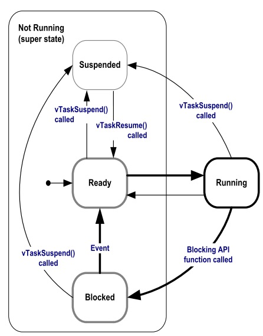

Semana 3
===========
Esta semana vamos a introducir el sistema operativo FreeRTOS. Haremos un recorrido por el API que ofrece este sistema 
opertativo de tiempo real sobre la plataforma ESP32.

Objetivos
----------

1. Conocer las características básicas de un sistema operativo de tiempo real.
2. Utilizar tareas para construir programas.

Ejercicios con el API de FreeRTOS
---------------------------------
Para realizar los siguientes ejercicio es necesario tener a la mano dos documentos:

1. `Tutorial oficial <https://www.freertos.org/Documentation/161204_Mastering_the_FreeRTOS_Real_Time_Kernel-A_Hands-On_Tutorial_Guide.pdf>`__.
2. La implementación de Espressif. `ESP-FREERTOS <https://esp-idf.readthedocs.io/en/latest/api-reference/system/freertos.html>`__.

Ejericio 1: explorar documentación y código fuente
^^^^^^^^^^^^^^^^^^^^^^^^^^^^^^^^^^^^^^^^^^^^^^^^^^^^
Este primer ejercicio es exploratorio. Los siguientes enlaces tienen información que nos permitirá navegar por el recorrido 
de esta semana. Este ejercicio consiste en *hojear* los siguientes enlaces para hacerse a una idea de dónde encontrar 
la información cuando haga falta:

1. Espressif, la empresa detrás de la plataforma ESP32, ha realizado un excelente trabajo de apatación del FreeRTOS al ESP32. 
   En los siguientes enlaces se pueden consultar los detalles: 

   * API de FreeRTOS: `FreeRTOS <https://esp-idf.readthedocs.io/en/latest/api-reference/system/freertos.html>`__.
   * FreeRTOS específico para el *framework* ESP-IDF: `FREERTOS-SMP <http://esp-idf.readthedocs.io/en/latest/api-guides/freertos-smp.html>`__.

2. Abra cada una de las secciones del `sitio con la documentación <https://esp-idf.readthedocs.io/en/latest/>`__ oficial del ESP32 y *mire por encima*.

3. La página oficial de `FreeRTOS <https://www.freertos.org/>`__.

4. Manual del `FreeRTOS <https://www.freertos.org/Documentation/FreeRTOS_Reference_Manual_V10.0.0.pdf>`__ y el `tutorial oficial <https://www.freertos.org/Documentation/161204_Mastering_the_FreeRTOS_Real_Time_Kernel-A_Hands-On_Tutorial_Guide.pdf>`__.

5. El estándar de `codificación <https://www.freertos.org/FreeRTOS-Coding-Standard-and-Style-Guide.html>`__.

6. ¿Cómo `funciona <https://www.freertos.org/implementation/main.html>`__ FreeRTOS?

7. El código fuente de FreeRTOS adaptado para el ESP32 lo encontramos aquí: ``esp-idf\components\freertos``. 
   No olvide darle una mirada.

8. Los libros oficiales de FreeRTOS vienen con `ejemplos <https://sourceforge.net/projects/freertos/files/FreeRTOS/V9.0.0/source-code-for-book-examples.zip/download>`__ 
   que corren en windows utilizando visual studio.

Ejercicio 2: configuración del sistema operativo
^^^^^^^^^^^^^^^^^^^^^^^^^^^^^^^^^^^^^^^^^^^^^^^^^
El sistema operativo se configura mediante el archivo ``FreeRTOSConfig.h`` ubicado en la ruta ``esp-idf\components\freertos\include\freertos``. 
Este archivo NO debe modificarse directamente. Para modificar el comportamiento de FreeRTOS se utiliza ``menuconfig`` en la 
opción ``Component config --->`` y luego se busca la opción ``FreeRTOS --->`` donde se ajustará la opción deseada. Una vez 
se haga el *build* de la aplicación, el archivo ``FreeRTOSConfig.h`` se actualizará automáticamente. Para este ejercicio haga 
lo siguiente:

    * Cree un directorio con el nombre FreeRTOS-example1.
    * Copie los archivos del ejemplo ``esp-idf\examples\get-started\hello_world``.
    * Copie el directorio .vscode con sus configuraciones.
    * Abra el directorio FreeRTOS-example1 en visual studio code (VSC)
    * Compruebe que sus archivos .h son reconocidos por VSC y el ``intelliSenseMode`` funciona.
    * Modifique el nombre del archivo .c en el directorio main por example1.c.
    * Abra el archivo MakeFile y cambie el nombre del proyecto.
    * Realice un ``menuconfig`` para configurar el puerto serial de la tarjeta y la velocidad de comunicación.
    * Realice un ``build app``.
    * Abra el archivo el archivo ``FreeRTOS-example1\build\include\sdkconfig.h``.
    * Ubique el macro ``CONFIG_FREERTOS_HZ``. Por defecto tendrá un valor 100, es decir, el *tick* del sistema será de 100 Hz 
    * Realice de nuevo un menuconfig y modifique en el componente de FreeRTOS el *tick* del sistema. Coloque 1000.
    * Salve y luego haga de nuevo un ``build app``.
    * Observe de nuevo ``FreeRTOS-example1\build\include\sdkconfig.h`` y el valor de CONFIG_FREERTOS_HZ.
    * CONCLUYA.

.. note::
    No olvide salvar luego de modificar una opción con menuconfig.
    
    En relación al manejo de la memoria dinámica, tenga en cuenta que ESP-IDF utiliza las funciones malloc y free.
    Si se desean utilizar las API para el manejo de los objetos de FreeRTOS con memoria estática, es necesario habilitar la 
    opción en ``menuconfig``.

Ejercicio 3: manejo de tareas
^^^^^^^^^^^^^^^^^^^^^^^^^^^^^^
La estructura de una tarea en FreeRTOS es como muestra el siguiente código:

.. code-block:: c 
   :lineno-start: 1

    void vTaskCode( void * pvParameters )
    {
        for( ;; )
        {
            // Task code goes here.
        }
    }

Una tarea se representa en C con una función. La función NO debe retornar, pero puede recibir una dirección a cualquier 
cosa. En la variable ``pvParameters`` es posible almacenar la dirección de los datos INICIALES que deseamos 
pasarle a la tarea al momento de crearla.

En este ejercicio vamos a crear un par de tareas:

.. code-block:: c
   :lineno-start: 1

    #include <stdio.h>
    #include "freertos/FreeRTOS.h"
    #include "freertos/task.h"
    #include "esp_system.h"
    #include "esp_spi_flash.h"

    /* Used as a loop counter to create a very crude delay. */
    #define mainDELAY_LOOP_COUNT		( 0xffffff)

    /* The task functions. */

    void vTask1( void *pvParameters )
    {
    const char *pcTaskName = "Task 1 is running\r\n";
    volatile uint32_t ul;

        /* As per most tasks, this task is implemented in an infinite loop. */
        for( ;; )
        {
            /* Print out the name of this task. */
            printf( pcTaskName );

            /* Delay for a period. */
            for( ul = 0; ul < mainDELAY_LOOP_COUNT; ul++ )
            {
                /* This loop is just a very crude delay implementation.  There is
                nothing to do in here.  Later exercises will replace this crude
                loop with a proper delay/sleep function. */
            }
        }
    }
    /*-----------------------------------------------------------*/

    void vTask2( void *pvParameters )
    {
    const char *pcTaskName = "Task 2 is running\r\n";
    volatile uint32_t ul;

        /* As per most tasks, this task is implemented in an infinite loop. */
        for( ;; )
        {
            /* Print out the name of this task. */
            printf( pcTaskName );

            /* Delay for a period. */
            for( ul = 0; ul < mainDELAY_LOOP_COUNT; ul++ )
            {
                /* This loop is just a very crude delay implementation.  There is
                nothing to do in here.  Later exercises will replace this crude
                loop with a proper delay/sleep function. */
            }
        }
    }

    void app_main()
    {
        /* Create one of the two tasks. */
        xTaskCreate(	vTask1,		/* Pointer to the function that implements the task. */
                        "Task 1",	/* Text name for the task.  This is to facilitate debugging only. */
                        2048,		/* Stack depth - most small microcontrollers will use much less stack than this. */
                        NULL,		/* We are not using the task parameter. */
                        1,			/* This task will run at priority 1. */
                        NULL );		/* We are not using the task handle. */

        /* Create the other task in exactly the same way. */
        xTaskCreate( vTask2, "Task 2", 2048, NULL, 1, NULL ); 
    }

Los parámetros de ``xTaskCreate`` están detalladamente explicados `aquí <https://esp-idf.readthedocs.io/en/latest/api-reference/system/freertos.html#task-api>`__. 
Lea detenidamente la documentación correspondiente. 

Al ejecutar este código el resultado es ::

    Task 1 is running
    Task 2 is running
    Task 1 is running
    Task 2 is running
    Task watchdog got triggered. The following tasks did not reset the watchdog in time:
    - IDLE (CPU 0)
    - IDLE (CPU 1)
    Tasks currently running:
    CPU 0: Task 1
    CPU 1: Task 2

Pregunta Juanito: ¿Qué es `Task watchdog <https://esp-idf.readthedocs.io/en/latest/api-reference/system/wdts.html>`__? En el 
dominio de los sistema embebidos existe un dispositivo conocido 
como el perro guardián o *watchdog timer*. Este dispositivo se debe alimentar (*feed*) periódicamente, de lo contrario, 
reiniciará la CPU (morderá al amo). En el caso del ESP-IDF *Task watchdog* será una tarea más que emulará el comportamiento 
de un *watchdog timer* en software, pero no reiniciará la CPU. Pregunta Juanito: ¿Y quién alimenta al perrito? Dos tareas, 
cada una asociada a una CPU. Las tareas se conocemos como las *Idle Tasks*. Estas tareas se ejecutan cuando no hay tareas de 
la aplicación listas para correr porque están bloqueadas esperando por algún evento. En nuestro ejemplo, las tareas 1 y 2 
están haciendo uso de las CPUs todos el tiempo en espera ocupada. Por tanto, la *Task watchdog* alertará al desarrollador 
acerca de este uso excesivo de la CPU.

Pregunta Juanito: ¿Es posible deshabilitar temporalmente *Task watchdog*? Sí, es necesario hacer un ``menuconfig`` e 
ingresar al componente ESP32-specific donde se podrá dehabilitar la opción ``Initialize Task Watchdog Timer on stratup``. 
Realice este procedimiento y verifique de nuevo la salida del programa.

Ejercicio 4: uso de los parámetros de una tarea
^^^^^^^^^^^^^^^^^^^^^^^^^^^^^^^^^^^^^^^^^^^^^^^^
En este ejercicios veremos que es posible crear tareas completamente independientes aunque utilicemos el mismo código. Es 
algo similar a definir una clase y luego instanciar dos objetos. Para este ejercicio podemos copiar el directorio del ejercicio 
anterior y hacemos lo siguiente:

    * Borrar el directorio build.
    * Borrar los archivos sdkconfig.
    * En .vscode dejar sólo los archivos c_cpp_properties.json y tasks.json.
    * Abrir el el directorio.
    * Cambiar el nombre del archivo .c por example2.c
    * En el archivo MakeFile cambiar el nombre del proyecto. Por ejemplo, FreeRTOS-exmaple2.
    * Abrir el archivo c_cpp_properties.json y verificar que la parte final del archivo se vea así (de lo contrario borrar)::

                            "D:/ESP32/msys32/opt/xtensa-esp32-elf/lib/gcc/xtensa-esp32-elf/5.2.0/include",
                            "D:/ESP32/msys32/opt/xtensa-esp32-elf/lib/gcc/xtensa-esp32-elf/5.2.0/include-fixed"
                        ],
                        "limitSymbolsToIncludedHeaders": true,
                        "databaseFilename": "${workspaceRoot}/.vscode/browse.vc.db"
                    },
                    "cStandard": "c11",
                    "cppStandard": "c++17"
                }
            ],
            "version": 4
        }
    * Hacer un menuconfig, cambiando el puerto serial, la velocidad y en ``Component config``, ``ESP32-specific``, modificar 
      ``Panic Handler behaviour`` por ``Print registers and halt``. De esta manera si tenemos un error podremos leer 
      fácilmente la razón del error y las CPUs será detenidas.

Ejecutar el siguiente código:

.. code-block:: c
   :lineno-start: 1

    #include <stdio.h>
    #include "freertos/FreeRTOS.h"
    #include "freertos/task.h"

    /* Used as a loop counter to create a very crude delay. */
    #define mainDELAY_LOOP_COUNT		( 0xffffff)

    /* Define the strings that will be passed in as the task parameters.  These are
    defined const and off the stack to ensure they remain valid when the tasks are
    executing. */
    const char *pcTextForTask1 = "Task 1 is running\n";
    const char *pcTextForTask2 = "Task 2 is running\n";

    TaskHandle_t xTask1Handle;
    TaskHandle_t xTask2Handle;

    /* The task function. */
    void vTaskFunction( void *pvParameters )
    {
        char *pcTaskName;
        volatile uint32_t ul;

        /* The string to print out is passed in via the parameter.  Cast this to a
        character pointer. */
        pcTaskName = (char *)pvParameters;

        /* As per most tasks, this task is implemented in an infinite loop. */
        for( ;; )
        {
            /* Print out the name of this task. */
            printf( pcTaskName );
            printf("stack: %d \n",uxTaskGetStackHighWaterMark(NULL));
 
            /* Delay for a period. */	
            for( ul = 0; ul < mainDELAY_LOOP_COUNT; ul++ )
            {

            }
        }
    }
    /*-----------------------------------------------------------*/
    void app_main()
    {
        /* Create one of the two tasks. */
        xTaskCreate(	vTaskFunction,		/* Pointer to the function that implements the task. */
                        "Task 1",	/* Text name for the task.  This is to facilitate debugging only. */
                        1000,		/* Stack depth - most small microcontrollers will use much less stack than this. */
                        (void *) pcTextForTask1,  /* Pass the text to be printed into the task using the task parameter. */
                        1,			/* This task will run at priority 1. */
                        &xTask1Handle );		/* We are not using the task handle. */

        /* Create the other task in exactly the same way. */
        xTaskCreate( vTaskFunction, "Task 2", 1000, (void *) pcTextForTask2, 1, &xTask2Handle ); 
    }

Al ejecutar la aplicación anterior y abrir el puerto serial no veremos mensajes impresos en la terminal. Si presionamos 
el botón de reset veremos que se ha presentado una condición de error en el programa y las CPUs se han detenido.

Ahora cambie el tamaño del stack de 1000 a 1500. ¿El mensaje de error es el mismo? Los dos errores anteriores son indicio 
de problemas en la definición del tamaño del stack de cada tarea. Por último, vamos a incrementar el tamaño del stack a 
2048 en cada tarea. ¿Qué resultado se consigue?

Ejercicio 5: manejo de prioridades
^^^^^^^^^^^^^^^^^^^^^^^^^^^^^^^^^^
FreeRTOS planifica las tareas (*schedule*) por prioridades. La política es que la CPU será entregada 
a la tarea lista para correr con la prioridad más alta. Cuando las tareas tienen la misma prioridad, la CPU es entregada por 
turnos (*round-robin*). A cada tarea se le asignará el mismo ``time slicing`` que será el intervalo entre ``ticks``. Si 
configTICK_RATE_HZ es 100 Hz cada tarea tendrá la CPU por 10 ms. Tenga presente que las prioridades se asignan 
entre 0 y (configMAX_PRIORITIES  –  1). El macro configMAX_PRIORITIES está definido en el archivo FreeRTOSConfig.h.   

.. code-block:: c
   :lineno-start: 1

    #include <stdio.h>
    #include "freertos/FreeRTOS.h"
    #include "freertos/task.h"

    /* Used as a loop counter to create a very crude delay. */
    #define mainDELAY_LOOP_COUNT		( 0xffffff)

    /* Define the strings that will be passed in as the task parameters.  These are
    defined const and off the stack to ensure they remain valid when the tasks are
    executing. */
    const char *pcTextForTask1 = "Task 1 is running\n";
    const char *pcTextForTask2 = "Task 2 is running\n";
    const char *pcTextForTask3 = "Task 3 is running\n";

    /* The task function. */
    void vTaskFunction( void *pvParameters )
    {
        char *pcTaskName;
        volatile uint32_t ul;

        /* The string to print out is passed in via the parameter.  Cast this to a
        character pointer. */
        pcTaskName = (char *)pvParameters;

        /* As per most tasks, this task is implemented in an infinite loop. */
        for( ;; )
        {
            /* Print out the name of this task. */
            printf( pcTaskName );
            printf("stack: %d \n",uxTaskGetStackHighWaterMark(NULL));
            /* Delay for a period. */	
            for( ul = 0; ul < mainDELAY_LOOP_COUNT; ul++ )
            {
            }
        }
    }
    /*-----------------------------------------------------------*/
    void app_main()
    {
        /* Create one of the two tasks. */
        xTaskCreate(	vTaskFunction,		/* Pointer to the function that implements the task. */
                        "Task 1",	/* Text name for the task.  This is to facilitate debugging only. */
                        2048,		/* Stack depth - most small microcontrollers will use much less stack than this. */
                        (void *) pcTextForTask1,  /* Pass the text to be printed into the task using the task parameter. */
                        1,			/* This task will run at priority 1. */
                        NULL );		/* We are not using the task handle. */

        /* Create the other task in exactly the same way. */
        xTaskCreate( vTaskFunction, "Task 2", 2048, (void *) pcTextForTask2, 2, NULL);
        xTaskCreate( vTaskFunction, "Task 3", 2048, (void *) pcTextForTask3, 3, NULL ); 
    }

El resultado de ejecutar el código será::

    Task 2 is running
    stack: 512 
    Task 3 is running
    stack: 324 
    Task 2 is running
    stack: 512 
    Task 3 is running
    stack: 324 
    Task 2 is running
    stack: 512 

Pregunta Juanito: ¿Y en dónde está la tarea 1? Como la tarea 1 tiene prioridad 1, el planificador del sistema operativo 
(``scheduler``) asignará las CPUs a las tareas 2 y 3 que tienen la prioridad más alta (2 y 3 respectivamente) y siempre 
están listas para correr.

Pregunta Juanito: ¿Y cómo hacemos para que la tarea 1 pueda correr sin cambiar las prioridades? Debemos hacer que las tareas 
de más alta prioridad pasen del estado listas para correr a bloqueadas. Esto lo puede lograr un tarea llamando funciones 
especiales del sistema operativo que las obliguen a esperar por algún evento. Cuando un tarea espera por algún evento, el 
sistema operativo no lo tendrá en cuenta para la planificación de la CPU. Por tanto, la colocará en una lista de tareas 
bloqueadas (esperando por).

la siguiente figura muestra los posibles estados de una tarea en FreeRTOS:

Ejercicio 6: llamados bloqueantes
^^^^^^^^^^^^^^^^^^^^^^^^^^^^^^^^^^
El siguiente código muestra cómo podemos modificar el ejemplo anterior, usando llamados bloqueantes, para lograr que las 
tareas de mayor prioridad pasen al estado bloqueado:

.. code-block:: c 
   :lineno-start: 1

    #include <stdio.h>
    #include "freertos/FreeRTOS.h"
    #include "freertos/task.h"

    /* Used as a loop counter to create a very crude delay. */
    #define mainDELAY_LOOP_COUNT		( 0xffffff)

    /* Define the strings that will be passed in as the task parameters.  These are
    defined const and off the stack to ensure they remain valid when the tasks are
    executing. */
    const char *pcTextForTask1 = "Task 1 is running\n";
    const char *pcTextForTask2 = "Task 2 is running\n";
    const char *pcTextForTask3 = "Task 3 is running\n";

    /* The task function. */
    void vTaskFunction( void *pvParameters )
    {
        char *pcTaskName;

        /* The string to print out is passed in via the parameter.  Cast this to a
        character pointer. */
        pcTaskName = (char *)pvParameters;

        /* As per most tasks, this task is implemented in an infinite loop. */
        for( ;; )
        {
            /* Print out the name of this task. */
            printf( pcTaskName );
            printf("stack: %d \n",uxTaskGetStackHighWaterMark(NULL));
            /* Delay for a period.  This time a call to vTaskDelay() is used which places 
            the task into the Blocked state until the delay period has expired.  The  
            parameter takes a time specified in ‘ticks’, and the pdMS_TO_TICKS() macro  
            is used to convert 250 milliseconds into an equivalent time in ticks. */ 
            vTaskDelay(pdMS_TO_TICKS( 1000 ));
        }
    }
    /*-----------------------------------------------------------*/
    void app_main()
    {
        /* Create one of the two tasks. */
        xTaskCreate(	vTaskFunction,		/* Pointer to the function that implements the task. */
                        "Task 1",	/* Text name for the task.  This is to facilitate debugging only. */
                        2048,		/* Stack depth - most small microcontrollers will use much less stack than this. */
                        (void *) pcTextForTask1,  /* Pass the text to be printed into the task using the task parameter. */
                        1,			/* This task will run at priority 1. */
                        NULL );		/* We are not using the task handle. */

        /* Create the other task in exactly the same way. */
        xTaskCreate( vTaskFunction, "Task 2", 2048, (void *) pcTextForTask2, 2, NULL);
        xTaskCreate( vTaskFunction, "Task 3", 2048, (void *) pcTextForTask3, 3, NULL ); 
    }

El resultado será::

    Task 1 is running
    stack: 600 
    Task 3 is running
    stack: 592 
    Task 2 is running
    stack: 532 
    Task 1 is running
    stack: 600 
    Task 3 is running
    stack: 592 
    Task 2 is running
    stack: 532 

Note que en este caso la tarea 1 será ejecutada. Otro llamado bloqueante que genera resultados similares es 
vTaskDelayUntil(). A diferencia de vTaskDelay, vTaskDelayUntil espcifica exactamente el valor del contador de *ticks* 
en el cual la tarea debe moverse del estado bloqueado al estado listo para correr. En cambio vTaskDelay especifica la 
cantidad de *ticks* que debe pasar la tarea bloqueada desde el momento en que se realiza el llamado a la función. Por tanto, 
si antes de llamar a vTaskDelay el código previo no es el mismo, la tarea se ejecutará con algo de *jitter* porque el 
tiempo relativo entre llamados a la función vTaskDelay presentará variabilidad (*jitter*).

.. code-block:: c 
   :lineno-start: 1

    #include <stdio.h>
    #include "freertos/FreeRTOS.h"
    #include "freertos/task.h"

    /* Used as a loop counter to create a very crude delay. */
    #define mainDELAY_LOOP_COUNT		( 0xffffff)

    /* Define the strings that will be passed in as the task parameters.  These are
    defined const and off the stack to ensure they remain valid when the tasks are
    executing. */
    const char *pcTextForTask1 = "Task 1 is running\n";
    const char *pcTextForTask2 = "Task 2 is running\n";
    const char *pcTextForTask3 = "Task 3 is running\n";

    /* The task function. */
    void vTaskFunction( void *pvParameters )
    {
        char *pcTaskName;
        TickType_t xLastWakeTime; 

        /* The string to print out is passed in via the parameter.  Cast this to a
        character pointer. */
        pcTaskName = (char *)pvParameters;

        /* The xLastWakeTime variable needs to be initialized with the current tick 
        count.  Note that this is the only time the variable is written to explicitly. 
        After this xLastWakeTime is automatically updated within vTaskDelayUntil(). */ 
        xLastWakeTime = xTaskGetTickCount();

        /* As per most tasks, this task is implemented in an infinite loop. */
        for( ;; )
        {
            /* Print out the name of this task. */
            printf( pcTaskName );
            printf("stack: %d \n",uxTaskGetStackHighWaterMark(NULL));
            /* This task should execute every 1000 milliseconds exactly.  As per 
            the vTaskDelay() function, time is measured in ticks, and the 
            pdMS_TO_TICKS() macro is used to convert milliseconds into ticks. 
            xLastWakeTime is automatically updated within vTaskDelayUntil(), so is not 
            explicitly updated by the task. */ 
            vTaskDelayUntil( &xLastWakeTime, pdMS_TO_TICKS( 1000 ));  
        }
    }
    /*-----------------------------------------------------------*/
    void app_main()
    {
        /* Create one of the two tasks. */
        xTaskCreate(	vTaskFunction,		/* Pointer to the function that implements the task. */
                        "Task 1",	/* Text name for the task.  This is to facilitate debugging only. */
                        2048,		/* Stack depth - most small microcontrollers will use much less stack than this. */
                        (void *) pcTextForTask1,  /* Pass the text to be printed into the task using the task parameter. */
                        1,			/* This task will run at priority 1. */
                        NULL );		/* We are not using the task handle. */

        /* Create the other task in exactly the same way. */
        xTaskCreate( vTaskFunction, "Task 2", 2048, (void *) pcTextForTask2, 2, NULL);
        xTaskCreate( vTaskFunction, "Task 3", 2048, (void *) pcTextForTask3, 3, NULL ); 
    }

El resultado debe ser el mismo del código anterior.

