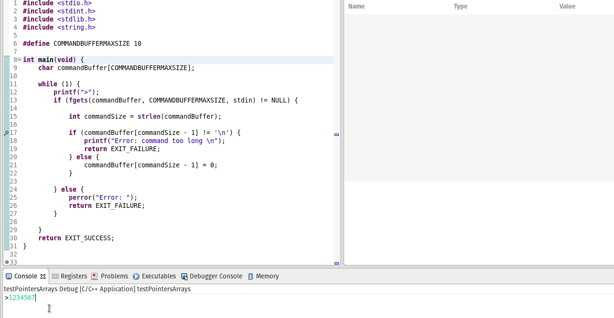

Semana 4
===========

Esta semana vamos a realizar las siguientes actividades:

1. Discutir en grupo el último ejercicio de la semana pasada.
2. Evaluación formativa.
3. Análisis de la evaluación formativa.

Ejercicio: problema
^^^^^^^^^^^^^^^^^^^^

La semana pasada planteamos este problema para resolver:

Realice un programa que permita crear un base de datos de estudiantes.
Cada registro de la base de datos estará dado por:
número de cédula, nombre y semestre. Cada registro corresponde a un estudiante.

Implemente los siguientes comandos:

**mkdb nombre tamaño** : crea una base de datos especificando el nombre
y la cantidad de registros.

**loaddb nombre** : carga la base de datos en memoria desde el archivo
especificado. El comando debe indicar si la base de datos se cargó
correctamente o no existe. La base de datos debe cargarse en memoria
dinámica antes de poder aplicar los siguientes comandos.

**savedb nombre** : este comando salva la base de datos en el archivo
especificado.

**readall** : lee todos los registros de la base de datos.

**readsize** : lee la cantidad de registros de la base datos.

**mkreg cedula nombre semestre** : crea un nuevo registro en la base
de datos.

**readreg cédula** : busca en la base de datos por número de cédula.
En caso de encontrar la cédula imprime el registro completo.

**exit** : salir del programa. Antes de terminar debe preguntar si se desea
salvar la base de datos en el archivo especificado con el comando loaddb.

Cada comando deberá implementarse como una función.

Cada registro es así:

.. code-block:: c
   :linenos:

    struct estudiante
    {
        int cedula;
        char nombre[30];
        int semestre;
    };

Ingresar comandos
------------------

La primera característica que vamos a construir en nuestro programa es la
capacidad de leer los comandos y los argumentos que el usuario pasará por
la línea de comandos.

.. code-block:: c
   :linenos:

    #include <stdio.h>
    #include <stdint.h>
    #include <stdlib.h>

    int main (void){
        while(1){

        }
        return EXIT_SUCCESS;
    }

El programa será un ciclo infinito que procesará continuamente comandos y
en condiciones normales, solo terminará si se ingresa el
comando **exit**.

.. code-block:: c
   :linenos:

    #include <stdio.h>
    #include <stdint.h>
    #include <stdlib.h>

    #define COMMANDBUFFERMAXSIZE 50

    int main (void){
        char commandBuffer[COMMANDBUFFERMAXSIZE];

        while(1){
            printf(">");
            fgets(commandBuffer, COMMANDBUFFERMAXSIZE, stdin);

        }
        return EXIT_SUCCESS;
    }   

El programa en cada ciclo le mostrará al usuario un prompt (**>**) que
servirá para indicarle que ya está listo para recibir un nuevo comando.
Luego utilizamos la función **fgets** para leer una cadena de caracteres
del flujo de entrada. Se espera que la cadena de caracteres termine en
con un enter (``\n``) seguido de un carácter **NULL** (0) que indica
el fin de la cadena.

**fgets** espera que le pasemos la dirección en memoria donde guardaremos
los caracteres. En este caso, será un arreglo de caracteres alojados en
el stack y con una capacidad máxima de COMMANDBUFFERMAXSIZE caracteres.

**fgets** retorna NULL si ocurre algún problema con la lectura.

.. code-block:: c
   :linenos:

    #include <stdio.h>
    #include <stdint.h>
    #include <stdlib.h>

    #define COMMANDBUFFERMAXSIZE 50

    int main (void){
        char commandBuffer[COMMANDBUFFERMAXSIZE];

        while(1){
            printf(">");
            if ( fgets(commandBuffer, COMMANDBUFFERMAXSIZE, stdin) != NULL){

            }
            else{
                perror("Error: ");
                return EXIT_FAILURE;
            }

        }
        return EXIT_SUCCESS;
    }

Podemos leer el valor retornado por **fgets** para decidir si procesamos
o no la cadena de entrada. Note que en caso de error, estamos usando la
función **perror** para imprimir un mensaje que describa el error
producido por **fgets**.

.. note::
    Cuando ocurre un error fgets coloca información en la variable entera
    y global errno a la cual podemos acceder con perror, solo que perror además
    interpreta el valor almacenado en la variable e imprime un texto
    descriptivo.

    Esta es la documentación de fgets:

    NAME

    fgets - get a string from a stream
    
    SYNOPSIS

    #include <stdio.h>

    char *fgets(char *s, int n, FILE *stream);

    DESCRIPTION
    
    The fgets() function reads bytes from stream into the array pointed to by s, until n-1 bytes are read, or a newline character is read and transferred to s, or an end-of-file condition is encountered. The string is then terminated with a null byte.
    The fgets() function may mark the st_atime field of the file associated with stream for update. The st_atime field will be marked for update by the first successful execution of fgetc(), fgets(), fgetwc(), fgetws(), fread(), fscanf(), getc(), getchar(), gets() or scanf() using stream that returns data not supplied by a prior call to ungetc() or ungetwc().

    RETURN VALUE
    
    Upon successful completion, fgets() returns s. If the stream is at end-of-file, the end-of-file indicator for the stream is set and fgets() returns a null pointer. If a read error occurs, the error indicator for the stream is set, fgets() returns a null pointer and sets errno to indicate the error.

Una vez tenemos la cadena en commandBuffer podemos proceder a procesarla.
Lo primero que haremos será eliminar el ENTER:

.. code-block:: c
   :linenos:

    #include <stdio.h>
    #include <stdint.h>
    #include <stdlib.h>
    #include <string.h>

    #define COMMANDBUFFERMAXSIZE 50

    int main(void) {
        char commandBuffer[COMMANDBUFFERMAXSIZE];

        while (1) {
            printf(">");
            if (fgets(commandBuffer, COMMANDBUFFERMAXSIZE, stdin) != NULL) {

                int commandSize = strlen(commandBuffer);

                if (commandBuffer[commandSize - 1] != '\n') {
                    printf("Error: command too long \n");
                    return EXIT_FAILURE;
                } else {
                    commandBuffer[commandSize - 1] = 0;
                }

            } else {
                perror("Error: ");
                return EXIT_FAILURE;
            }

        }
        return EXIT_SUCCESS;
    }

La función **strlen** (está prototipada en string.h) nos permite encontrar
el tamaño de la cadena. Recuerde que la cadena incluye el ENTER y en caso
de estar en la cadena se ubicará en la posición commandSize - 1. Note
que si en esta posición no está el ENTER, quiere decir que la cadena
ingresada por el usuario supera la capacidad de commandBuffer y por
tanto, **fgets** truncará la cadena. Por ejemplo, si cambiamos la capacidad
de commandBuffer de 50 a 10:

Para eliminar el ENTER de la cadena basta con reemplazarlo con un 0,
indicando así que la cadena termina en este punto.

Implementación del comando mkdb nombre tamaño
-----------------------------------------------

Las siguientes líneas obtienen los argumentos de **mkdb** y llaman
la función que realizará la acción.

.. code-block:: c
    :linenos:

    #include <stdio.h>
    #include <stdint.h>
    #include <stdlib.h>
    #include <string.h>

    int makeDatabasefn(int);

    #define COMMANDBUFFERMAXSIZE 50

    const char makeDatabase[] = "mkdb";
    char currentDataBaseName[COMMANDBUFFERMAXSIZE];
    int currentDataBaseSize = 0;

    struct estudiante
    {
        int cedula;
        char nombre[30];
        int semestre;
    };
    struct estudiante *pcurrentDataBase;

    int main(void) {
        char commandBuffer[COMMANDBUFFERMAXSIZE];

        while (1) {
            printf(">");
            if (fgets(commandBuffer, COMMANDBUFFERMAXSIZE, stdin) != NULL) {

                int commandSize = strlen(commandBuffer);

                if (commandBuffer[commandSize - 1] != '\n') {
                    printf("Error: command too long \n");
                    return EXIT_FAILURE;
                } else {
                    commandBuffer[commandSize - 1] = 0;
                }

                if (0 == strncmp(makeDatabase, commandBuffer, strlen(makeDatabase)) ) {
                    int result = sscanf(commandBuffer, "%*s %s %d", currentDataBaseName, &currentDataBaseSize);
                    if (result != 2) {
                        currentDataBaseName[0] = 0;
                        currentDataBaseSize = 0;
                        printf("Enter valid arguments\n");
                    }
                    else {
                        if (makeDatabasefn(currentDataBaseSize) != 1) {
                            printf("Database can't be created\n");
                        }
                    }
                }

            } else {
                perror("Error: ");
                return EXIT_FAILURE;
            }

        }
        return EXIT_SUCCESS;
    }

    int makeDatabasefn(int size){
        int success = 0;
        pcurrentDataBase = malloc( sizeof(struct estudiante)*size );
        if(pcurrentDataBase != NULL) success = 1;
        return success;
    }

La función **strncmp** compara los strlen(makeDatabase) primeros bytes del
arreglo de caracteres makeDatabase con commandBuffer. Si son iguales
devuelve 0. **sscanf** lee la cadena de entrada y la procesa como **scanf**.
Finalmente, **makeDatabase** crea la base datos en memoria dinámica.

La línea ``pcurrentDataBase = malloc( sizeof(struct estudiante)*size );`` crea
tantos registros como lo indique ``size``.

Implementación del comando loaddb nombre
-----------------------------------------

Este comando lee la base de datos desde un archivo y la carga en memoria
dinámica. Cada archivo contiene en su primera línea el tamaño de la
base de datos y luego, en las demás líneas, un registro, por línea,
compuesto por la cédula, nombre y semestre. Cada uno de los campos
anteriores está separado por un espacio.

Primero añadimos el código que permite leer el comando y los argumentos:

.. code-block:: c
    :linenos:

    .
    .
    .

    // definición del nuevo comando
    const char loadDatabase[] = "loaddb";
    .
    .
    .
    // if para leer mkdb
    .
    .
    .
    else if( 0 == strncmp(loadDatabase, commandBuffer, strlen(loadDatabase) ) ){
        char name[COMMANDBUFFERMAXSIZE];
        int result = sscanf(commandBuffer, "%*s %s",name);
        if(result != 1){
            printf("Enter a data base name\n");
        }
        else{
            if( loadDatabasefn(name) == 0){
                printf("Can't load the database\n");
            }
            else{
                strncpy(currentDataBaseName, name, COMMANDBUFFERMAXSIZE);
            }
        }
	}

Y la función que leerá el archivo y cargará en memoria dinámica la base
de datos:

.. code-block:: c
    :linenos:

    //1. el prototipo
    int loadDatabasefn(char *);
    .
    .
    .
    //2. Crear un contador de registros
    int currentDataBaseRegister = 0;
    .
    .
    .
    //3. El código

    int loadDatabasefn(char * dataBaseFileName){
        int currentDataBaseSizeTmp = 0;
        struct estudiante *pcurrentDataBaseTmp;
        int currentDataBaseRegisterTmp = 0;

        int result = 0;
        FILE *fp = fopen(dataBaseFileName, "r");
        if(fp == NULL){
            perror("Error: ");
        }
        else{
            int scanfStatus = fscanf(fp,"%d", &currentDataBaseSizeTmp);
            if(feof(fp) == 0){
                if(scanfStatus == 1){
                    pcurrentDataBaseTmp = (struct estudiante *) malloc( sizeof(struct estudiante)*currentDataBaseSizeTmp );
                    if(pcurrentDataBaseTmp != NULL){
                        while(1){
                            int scanfStatus = fscanf(fp,"%d %s %d", &((pcurrentDataBaseTmp + currentDataBaseRegisterTmp)->cedula),
                                                    (pcurrentDataBaseTmp + currentDataBaseRegisterTmp)->nombre,
                                                    &((pcurrentDataBaseTmp + currentDataBaseRegisterTmp)->semestre) );
                            if(feof(fp) == 0){
                                if(scanfStatus != 3){
                                    free(pcurrentDataBaseTmp);
                                    break;
                                }
                                else{
                                    currentDataBaseRegisterTmp++;
                                }
                            }
                            else{
                                result = 1;
                                pcurrentDataBase = pcurrentDataBaseTmp;
                                currentDataBaseSize = currentDataBaseSizeTmp;
                                currentDataBaseRegister = currentDataBaseRegisterTmp;
                                break;
                            }
                        }
                    }
                }
                else{
                    printf("Can't read database size\n");
                }
            }
            else{
                printf("Can't read database\n");
            }

            fclose(fp);
        }
        return result;
    }

Note que la lectura de las líneas del archivo se hace en un
ciclo infinito del cual se sale cuando una lectura al archivo
retorne EOF. Tenga en cuenta que es necesario leer el archivo
para poder obtener un EOF. Es por ello que primero se
hace un **fscanf** y luego se llama feof.

Implementación de los demás comandos
-------------------------------------

Se incluye ahora la implementación final al problema con
algunas variaciones:

.. code-block:: c
    :linenos:

    #include <stdio.h>
    #include <stdlib.h>
    #include <string.h>

    #define COMMANDMAXSIZE 50
    #define NAMEMAXSIZE 30
    char commandBuffer[COMMANDMAXSIZE + 1];

    const char makeDatabase[] = "mkdb";
    const char loadDatabase[] = "loaddb";
    const char saveDatabase[] = "savedb";
    const char readAllRegisters[] = "readall";
    const char readDbSize[] = "readsize";
    const char readDbCapacity[] = "readcapacity";
    const char makeRegister[] = "mkreg";
    const char readRegister[] = "readreg";
    const char quit[] = "exit";

    int makeDatabasefn(int);
    int loadDatabasefn(char *);
    void saveDatabasefn(char *);
    void readAllRegistersfn(void);
    int readsizefn(void);
    int makeRegisterfn(int, char *, int );
    int readRegisterfn(int);
    void quitfn(void);

    struct estudiante
    {
        int cedula;
        char nombre[30];
        int semestre;
    };

    char currentDataBaseName[50];
    int currentDataBaseSize = 0;
    struct estudiante *pcurrentDataBase;
    int currentDataBaseRegister = 0;

    int main()
    {
        while(1){
            printf(">");
            if ( fgets(commandBuffer, COMMANDMAXSIZE + 1,stdin) != NULL){

                int commandSize = strlen(commandBuffer);

                if(commandBuffer[commandSize - 1] != '\n'){
                    printf("Error: command too long \n");
                    return EXIT_FAILURE;
                }
                else{
                commandBuffer[commandSize - 1] = 0;
                }

                if( 0 == strncmp(makeDatabase, commandBuffer, strlen(makeDatabase) ) ){
                    char* token = strchr(commandBuffer, ' ');
                    if(token != NULL){
                        int result = sscanf(token + 1, "%s %d", currentDataBaseName, &currentDataBaseSize);
                        if(result != 2){
                        currentDataBaseName[0] = 0;
                        currentDataBaseSize = 0;
                        printf("Enter a valid arguments\n");
                        }
                        else{
                            if ( makeDatabasefn(currentDataBaseSize) != 1){
                                printf("Database can't be created\n");
                            }
                        }
                    }
                    else{
                        printf("Enter a valid arguments\n");
                    }
                }
                else if ( 0 == strncmp(readAllRegisters, commandBuffer, strlen(readAllRegisters) ) ){
                    readAllRegistersfn();
                }
                else if ( 0 == strncmp(makeRegister, commandBuffer, strlen(makeRegister) ) ){
                    char* token = strchr(commandBuffer, ' ');
                    char name[50];
                    int cedula;
                    int semestre;

                    if(token != NULL){
                        int result = sscanf(token + 1, "%d %s %d", &cedula, name,&semestre);
                        if(result != 3){
                        printf("Enter a valid register arguments\n");
                        }
                        else{
                            if( makeRegisterfn(cedula, name, semestre) != 1){
                                printf("Data base is full, register was not created\n");
                            }
                        }
                    }
                }
                else if( 0 == strncmp(saveDatabase, commandBuffer, strlen(saveDatabase) ) ){
                    if(currentDataBaseName[0] == 0){
                        printf("Load a data base first\n");
                        continue;
                    }
                    char* token = strchr(commandBuffer, ' ');
                    if(token != NULL){
                        int result = sscanf(token + 1, "%s", currentDataBaseName);
                        if(result != 1){
                        printf("Enter a name\n");
                        }
                        else{
                            saveDatabasefn(currentDataBaseName);
                        }
                    }
                    else{
                        printf("Enter a name\n");
                    }
                }
                else if( 0 == strncmp(quit, commandBuffer, strlen(quit) ) ){
                    if(currentDataBaseName[0] == 0){
                        printf("No active db\n");
                        continue;
                    }
                    printf("save data base with name %s? y/n: ",currentDataBaseName);
                    if (fgets(commandBuffer, COMMANDMAXSIZE + 1,stdin) != NULL){

                    int commandSize = strlen(commandBuffer);
                    commandBuffer[commandSize - 1] = 0;
                    if( 0 == strncmp("y", commandBuffer, 1) ){
                        saveDatabasefn(currentDataBaseName);
                    }
                    }
                    return EXIT_SUCCESS;
                }
                else if( 0 == strncmp(loadDatabase, commandBuffer, strlen(loadDatabase) ) ){
                    char* token = strchr(commandBuffer, ' ');
                    char name[50];

                    if(token != NULL){
                        int result = sscanf(token + 1, "%s",name);
                        if(result != 1){
                        printf("Enter a data base name\n");
                        }
                        else{
                            if( loadDatabasefn(name) == 0){
                                printf("Can't load de database\n");
                            }
                            else{
                                strncpy(currentDataBaseName, name, 50);
                            }
                        }
                    }
                    else{
                        printf("Enter a database name\n");
                    }
                }
                else if( 0 == strncmp(readDbSize, commandBuffer, strlen(readDbSize) ) ){
                    printf("%d\n",currentDataBaseRegister);
                }
                else if( 0 == strncmp(readDbCapacity, commandBuffer, strlen(readDbCapacity) ) ){
                    printf("%d\n",currentDataBaseSize);
                }
                else if( 0 == strncmp(readRegister, commandBuffer, strlen(readRegister) ) ){
                    char* token = strchr(commandBuffer, ' ');
                    int cedula;

                    if(token != NULL){
                        int result = sscanf(token + 1, "%d",&cedula);
                        if(result != 1){
                        printf("Enter a numeric id number\n");
                        }
                        else{
                            if( readRegisterfn(cedula)  == 0){
                                printf("Can't find the id number in the database\n");
                            }
                        }
                    }
                    else{
                        printf("Enter a id number\n");
                    }
                }
                else{
                    printf("Not valid command\n");
                }
            }
            else{
                perror("Error: ");
                return EXIT_FAILURE;
            }
        }
        return EXIT_SUCCESS;
    }

    int makeDatabasefn(int size){
        int success = 0;
        pcurrentDataBase = (struct estudiante *) malloc( sizeof(struct estudiante)*size );
        if(pcurrentDataBase != NULL) success = 1;
        return success;
    }

    void readAllRegistersfn(void){
        for(int i = 0; i < currentDataBaseRegister; i++){
            printf("registro %d cedula: %d, nombre: %s, semestre: %d\n", i+1, (pcurrentDataBase + i)->cedula,(pcurrentDataBase + i)->nombre, (pcurrentDataBase + i)->semestre);
        }
    }

    int makeRegisterfn(int cedula, char * nombre, int semestre){
        int result = 0;
        if(currentDataBaseRegister < currentDataBaseSize){
            (pcurrentDataBase+ currentDataBaseRegister)->cedula = cedula;
            strncpy( (pcurrentDataBase+ currentDataBaseRegister) ->nombre, nombre, NAMEMAXSIZE);
            (pcurrentDataBase+ currentDataBaseRegister)->semestre = semestre;
            currentDataBaseRegister++;
            result = 1;
        }
        return result;
    }

    void saveDatabasefn(char * name){
        FILE *fp = fopen(name, "w+");
        fprintf(fp,"%d\n",currentDataBaseSize);
        for(int i = 0; i < currentDataBaseRegister; i++){
            fprintf(fp, "%d %s %d\n", (pcurrentDataBase + i)->cedula,(pcurrentDataBase + i)->nombre, (pcurrentDataBase + i)->semestre);
        }
        fclose(fp);
    }

    int loadDatabasefn(char * dataBaseFileName){
        int currentDataBaseSizeTmp = 0;
        struct estudiante *pcurrentDataBaseTmp;
        int currentDataBaseRegisterTmp = 0;

        int result = 0;
        FILE *fp = fopen(dataBaseFileName, "r");
        if(fp == NULL){
            perror("Error: ");
        }
        else{
            int scanfStatus = fscanf(fp,"%d", &currentDataBaseSizeTmp);
            if(feof(fp) == 0){
                if(scanfStatus == 1){
                    pcurrentDataBaseTmp = (struct estudiante *) malloc( sizeof(struct estudiante)*currentDataBaseSizeTmp );
                    if(pcurrentDataBaseTmp != NULL){
                        while(1){
                            int scanfStatus = fscanf(fp,"%d %s %d", &((pcurrentDataBaseTmp + currentDataBaseRegisterTmp)->cedula), (pcurrentDataBaseTmp + currentDataBaseRegisterTmp)->nombre, &((pcurrentDataBaseTmp + currentDataBaseRegisterTmp)->semestre) );
                            if(feof(fp) == 0){
                                if(scanfStatus != 3){
                                    free(pcurrentDataBaseTmp);
                                    break;
                                }
                                else{
                                    currentDataBaseRegisterTmp++;
                                }
                            }
                            else{
                                result = 1;
                                pcurrentDataBase = pcurrentDataBaseTmp;
                                currentDataBaseSize = currentDataBaseSizeTmp;
                                currentDataBaseRegister = currentDataBaseRegisterTmp;
                                break;
                            }
                        }
                    }
                }
                else{
                    printf("Can't read database size\n");
                }
            }
            else{
                printf("Can't read database\n");
            }

            fclose(fp);
        }
        return result;
    }

    int readRegisterfn(int id){
        int result = 0;

        for(int i = 0; i < currentDataBaseRegister;i++){
            if( (pcurrentDataBase + i)->cedula == id ){
                result = 1;
                printf("registro %d cedula: %d, nombre: %s, semestre: %d\n", i+1, (pcurrentDataBase + i)->cedula,(pcurrentDataBase + i)->nombre, (pcurrentDataBase + i)->semestre);
                break;
            }
        }
        return result;
    }

Evaluación formativa
^^^^^^^^^^^^^^^^^^^^
La evaluación formativa consiste en una serie de problemas que
buscan aplicar los conceptos estudiados hasta ahora.

Problema: encriptar y desencriptar un archivo
----------------------------------------------

Se busca realizar dos programas que permitan encriptar
y desencriptar un archivo.

El programa que encripta:

* Debe solicitar al usuario la función para encriptar
  la información y el nombre del archivo de entrada y
  el de salida. El archivo de entrada tendrá la
  información y el de salida la información encriptada.
* La función debe modificar cada uno de los bytes que
  componen el archivo. Tenga presente que también se
  encriptará el byte de nueva línea.

El programa que desencripta:

* Debe solicitar al usuario la función para encriptar
  la información y el nombre del archivo de entrada y
  el de salida. En este caso el archivo de entrada
  tendrá la información encriptada y el archivo de salida
  la información desencriptada.
* Tenga presente que el usuario ingresa la función
  con la cual se encripta y usted debe encontrar la
  función inversa para desencriptar.

Una solución al problema
-------------------------
A diferencia de la solución anterior, en esta solución se tratará de
mantener al mínimo las verificaciones buscando mostrar solo aquellas
cosas escenciales de la solución.

.. warning:: Este código asumen que la información ingresada está
             bien formateada y libre de errores. Por tanto, se omiten
             algunas verificaciones.

.. note:: Para probar los siguientes programas (es el mismo para encriptar
          y desencriptar) es necesario que cree el archivo de texto que
          será encriptado.

.. code-block:: c
    :linenos:

    #include <stdint.h>
    #include <stdio.h>
    #include <stdlib.h>
    #include <string.h>

    uint8_t encXorFunction(uint8_t data) { return data ^ 0xFF; }

    int main(int argc, char *argv[]) {
    char input[50];
    char inFile[20];
    char outFile[20];
    char function[10];
    uint8_t (*encFuntion)(uint8_t) = NULL;

    printf("Enter in_file out_file function\n");
    fgets(input, sizeof(input), stdin);
    sscanf(input, "%s %s %s", inFile, outFile, function);

    FILE *fin = fopen(inFile, "r");
    if (fin == NULL) {
        perror("Error: ");
        return EXIT_FAILURE;
    }

    if (strncmp("xor", function, 3) == 0) {
        encFuntion = &encXorFunction;
    }

    FILE *fout = fopen(outFile, "w");
    if (fout == NULL) {
        perror("Error: ");
        return EXIT_FAILURE;
    }

    while ( fgets(input, sizeof(input), fin) != NULL) {

        int n = strlen(input);

        for (int i = 0; i < n; i++) {
        input[i] = (*encFuntion)(input[i]);
        }
        fputs(input, fout);
    }

    fclose(fin);
    fclose(fout);
    return EXIT_SUCCESS;
    }

Problema: modificación al problema anterior
--------------------------------------------
Modifique el código anterior para que reciba
la información desde la línea de comandos.

Ejercicio final
-----------------
Si ha llegado a este ejericio, felicidades, buen trabajo.
Este último ejercicio es tal vez uno de los más importantes,
se trata de ayudarle y explicarle a los compañeros
que aún no terminan. En este caso el beneficio será doble,
usted repasa y refuerza y por otro lado le ayuda a un compañero.

