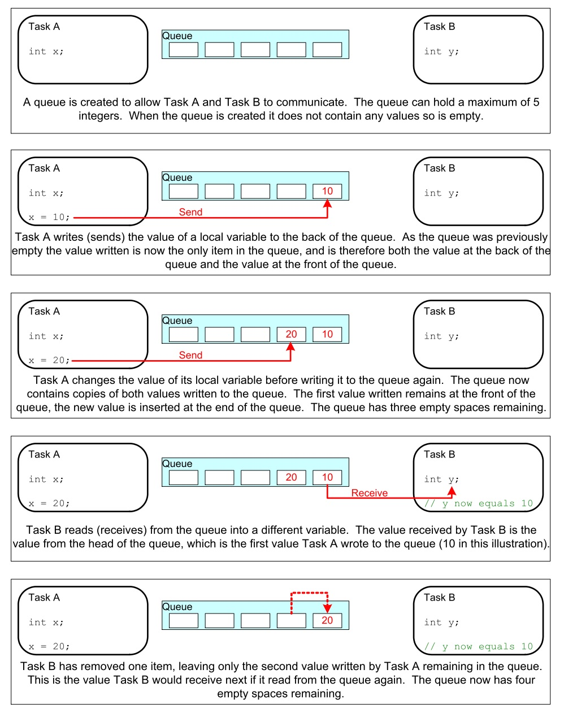
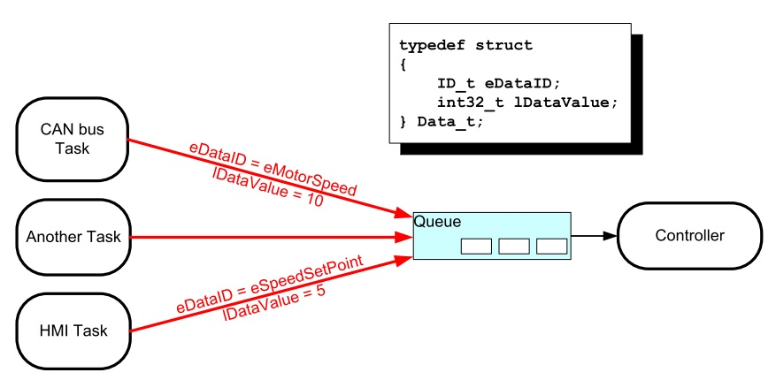
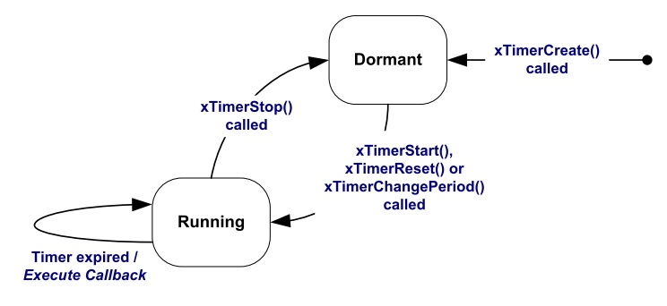
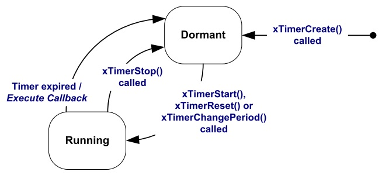

Semana 4
===========
Esta semanas continuaremos explorando el API de FreeRTOS. 

Objetivos
----------

1. Utilizar mecanismos de comunicación entre tareas.
2. Emplear los servicios ofrecidos por los temporizadores del sistema operativo para controlar acciones en el tiempo.

Ejercicios con el API de FreeRTOS
---------------------------------
Para realizar los siguientes ejercicio es necesario tener a la mano dos documentos:

1. `Tutorial oficial <https://www.freertos.org/Documentation/161204_Mastering_the_FreeRTOS_Real_Time_Kernel-A_Hands-On_Tutorial_Guide.pdf>`__.
2. La implementación de Espressif. `ESP-FREERTOS <https://esp-idf.readthedocs.io/en/latest/api-reference/system/freertos.html>`__.

Ejericio 1: comunicación entre tareas
^^^^^^^^^^^^^^^^^^^^^^^^^^^^^^^^^^^^^^

Las colas o *Queues* son uno de los mecanismos de comunicación de FreeRTOS. Estas permiten comunicar tareas, tareas con 
interrupciones e interrupiones con tareas.

Las colcas almacenan una cantidad finita de items todos ellos del mismo tamaño. La longitud de la cola es la cantidad 
máxima de items que puede almacenar. Al momento de crear la cola se define el tamaño de los items y la longitud de la cola.

Las colas se utilizan como estructuras de datos FIFO (First In First Out). Los datos se escriben al final de la cola (*tail*) 
y se remueven del frente (*head*). Es posible escribir al frente de la cola para modificar datos que ya están presentes.

La siguiente figura ilustra cómo funciona una cola:

Los datos que se almacenan en la cola pueden comportarse por valor (copia byte por byte) o por referencia (se copia la 
dirección del puntero donde están los datos). El primer método es más costoso en términos de memoria, pero permite desacoplar 
mejor las tareas, haciendo más simple el manejo de la información. 

Otras características a considerar:

* Es usual que una cola tenga múltiples escritores y sólo un lector. Aún así, es posible usarlas con otros esquemas.
* Una tarea lectora se bloqueará si no hay datos en la cola. Es posible especificar el tiempo que durará bloqueada. Si 
  otra tarea o una interrupción envía datos a la cola, la tarea pasará automáticamente al estado lista para ejecución y por 
  tanto será candidata a tener una CPU cuando el *scheduler* así lo determine.
* Las tareas pueden bloquerse, y especificar también tiempos de bloqueo, al escribir una cola. Esto ocurre cuando no hay 
  más espacio disponible.
* Varias tareas escritoras pueden bloquearse al esperar espacio en una cola. Cuando el espacio esté disponible, la tarea de 
  más alta prioridad será desbloqueada y puesta en lista para correr. Si todas las tareas tienen la misma prioridad, la tarea 
  que lleve más tiempo esperando desbloqueada y puesta lista para correr.
* API para crear una cola :: 
  
    QueueHandle_t xQueueCreate( UBaseType_t uxQueueLength, UBaseType_t uxItemSize ); 

Actividades: 

* Realizar el ejemplo 10 del `Tutorial oficial <https://www.freertos.org/Documentation/161204_Mastering_the_FreeRTOS_Real_Time_Kernel-A_Hands-On_Tutorial_Guide.pdf>`__.
* Realizar el ejemplo 11.

Recuerde que en ambas actividades es de esperar un comportamiento diferente gracias a los dos CPUs. De igual manera, es 
necesario adaptar el código pues no tenemos acceso directo a la función main. Pregunta juanito: ¿Cómo adapto el código? 
Mire los ejemplos anteriores y compárelos con los códigos de la semana 3.

Ejericio 2: verificación del ejemplo 10
^^^^^^^^^^^^^^^^^^^^^^^^^^^^^^^^^^^^^^^^^^

Una vez realizado el ejercicio 1 compare su respuesta con el siguiente código. Analice y concluya:

.. code-block:: c 
   :lineno-start: 1

    #include <stdio.h>
    #include "freertos/FreeRTOS.h"
    #include "freertos/task.h"
    #include "freertos/queue.h"

    /*-----------------------------------------------------------*/
    /* Declare a variable of type QueueHandle_t.  This is used to store the handle 
    to the queue that is accessed by all three tasks. */ 
    QueueHandle_t xQueue; 

    static void vSenderTask( void *pvParameters ) 
    { 
        int32_t lValueToSend; 
        BaseType_t xStatus; 

        /* Two instances of this task are created so the value that is sent to the 
        queue is passed in via the task parameter - this way each instance can use  
        a different value.  The queue was created to hold values of type int32_t,  
        so cast the parameter to the required type. */ 
        lValueToSend = ( int32_t ) pvParameters; 

        /* As per most tasks, this task is implemented within an infinite loop. */ 
        for( ;; ) 
        { 
            /* Send the value to the queue. 

            The first parameter is the queue to which data is being sent. 

            The second parameter is the address of the data to be sent, in this case 
            the address of lValueToSend. 

            The third parameter is the Block time – the time the task should be kept 
            in the Blocked state to wait for space to become available on the queue.
            */ 

            printf( "Sender(%d). stack: %d\r\n",lValueToSend,uxTaskGetStackHighWaterMark(NULL));
            xStatus = xQueueSendToBack( xQueue, &lValueToSend, 0 ); 

            if( xStatus != pdPASS ) 
            { 
                /* The send operation could not complete because the queue was full - */ 
                printf( "Could not send to the queue.\r\n" ); 
            } 
        } 
    }

    static void vReceiverTask( void *pvParameters ) 
    { 
        /* Declare the variable that will hold the values received from the queue. */ 
        int32_t lReceivedValue; 
        BaseType_t xStatus; 
        const TickType_t xTicksToWait = pdMS_TO_TICKS( 100 ); 

        /* This task is also defined within an infinite loop. */ 
        for( ;; ) 
        { 
            printf( "There are (%d) messages waiting\r\n",uxQueueMessagesWaiting( xQueue )); 
            /* Receive data from the queue. 

            The first parameter is the queue from which data is to be received.

            The second parameter is the buffer into which the received data will be 
            placed.  In this case the buffer is simply the address of a variable that 
            has the required size to hold the received data.  

            The last parameter is the block time – the maximum amount of time that the 
            task will remain in the Blocked state to wait for data to be available */ 
            
            printf("Receiver stack: %d\r\n",uxTaskGetStackHighWaterMark(NULL));

            xStatus = xQueueReceive( xQueue, &lReceivedValue, xTicksToWait ); 

            if( xStatus == pdPASS ) 
            { 
                /* Data was successfully received from the queue, print out the received 
                value. */ 
                printf( "Received = %d\r\n", lReceivedValue ); 
            } 
            else 
            { 
                /* Data was not received from the queue even after waiting for 100ms. 
                This must be an error as the sending tasks are free running and will be 
                continuously writing to the queue. */ 
                printf( "After 100ms blocking time, could not receive from the queue.\r\n" ); 
            } 
        } 
    } 

    void app_main()
    {
        
        /* The queue is created to hold a maximum of 5 values, each of which is 
        large enough to hold a variable of type int32_t. */ 
        xQueue = xQueueCreate( 5, sizeof( int32_t ) ); 

        if( xQueue != NULL ) 
        { 
            /* Create the task that will read from the queue.  The task is created with 
            priority 2, so above the priority of the sender tasks. */ 
            
            xTaskCreate( vReceiverTask, "Receiver", 2048, NULL, 2, NULL ); 

            /* Create two instances of the task that will send to the queue.  The task 
            parameter is used to pass the value that the task will write to the queue, 
            so one task will continuously write 100 to the queue while the other task  
            will continuously write 200 to the queue.  Both tasks are created at 
            priority 1. */ 
            xTaskCreate( vSenderTask, "Sender1", 2048, ( void * ) 100, 1, NULL ); 
            xTaskCreate( vSenderTask, "Sender2", 2048, ( void * ) 200, 1, NULL ); 
        } 
        else 
        { 
            /* The queue could not be created. */ 
        }
    }

Al ejecutar el código ::

    There are (0) messages waiting
    Sender(100). stack: 1756
    Receiver stack: 512
    Sender(200). stack: 1752
    Received = 100
    Sender(100). stack: 588
    There are (1) messages waiting
    Sender(200). stack: 584
    Receiver stack: 512
    Received = 200
    There are (2) messages waiting
    Sender(200). stack: 584
    Receiver stack: 512
    Received = 100
    There are (2) messages waiting
    Sender(200). stack: 584
    Receiver stack: 512
    Received = 200
    There are (2) messages waiting
    Sender(200). stack: 584
    Receiver stack: 512
    Received = 200
    There are (2) messages waiting
    Sender(200). stack: 584
    Receiver stack: 512
    Received = 200
    There are (2) messages waiting
    Sender(200). stack: 520
    Receiver stack: 512
    Received = 200

Luego de un instante aquí hay otra captura de la salida ::

    There are (2) messages waiting
    Sender(100). stack: 588
    Receiver stack: 512
    Received = 200
    There are (2) messages waiting
    Sender(100). stack: 588
    Receiver stack: 512
    Received = 200
    There are (2) messages waiting
    Sender(100). stack: 588
    Receiver stack: 512
    Received = 100
    There are (2) messages waiting
    Sender(100). stack: 588
    Receiver stack: 512
    Received = 100
    There are (2) messages waiting
    Sender(100). stack: 588
    Receiver stack: 512
    Received = 100
    There are (2) messages waiting
    Sender(100). stack: 524
    Receiver stack: 512
    Received = 100
    There are (2) messages waiting

Note cómo la ejecución de las tarea que envían se alterna en el tiempo.

Ejericio 3: verificación del ejemplo 11
^^^^^^^^^^^^^^^^^^^^^^^^^^^^^^^^^^^^^^^^^^

En el ejemplo 11 del tutorial, una tarea lectora recibe mensajes de varias tareas escritoras. Todos los mensajes llegan 
a la misma cola, por tanto, es necesario establecer una estrategia que permita identificar la fuente de cada mensaje. El 
escenario que se describe se ilustra en la siguiente figura:

Aquí está el código del ejemplo 11:

.. code-block:: c 
   :lineno-start: 1

    #include <stdio.h>
    #include "freertos/FreeRTOS.h"
    #include "freertos/task.h"
    #include "freertos/queue.h"

    /* The tasks to be created.  Two instances are created of the sender task while
    only a single instance is created of the receiver task. */
    static void vSenderTask( void *pvParameters );
    static void vReceiverTask( void *pvParameters );

    /* Declare a variable of type QueueHandle_t.  This is used to store the queue
    that is accessed by all three tasks. */
    QueueHandle_t xQueue;

    typedef enum
    {
        eSender1,
        eSender2
    } DataSource_t;

    /* Define the structure type that will be passed on the queue. */
    typedef struct
    {
        uint8_t ucValue;
        DataSource_t eDataSource;
    } Data_t;

    /* Declare two variables of type Data_t that will be passed on the queue. */
    static const Data_t xStructsToSend[ 2 ] =
    {
        { 100, eSender1 }, /* Used by Sender1. */
        { 200, eSender2 }  /* Used by Sender2. */
    };

    void app_main(void)
    {
        xQueue = xQueueCreate( 3, sizeof( Data_t ) );

        if( xQueue != NULL )
        {
            xTaskCreate( vSenderTask, "Sender1", 2048, ( void * ) &( xStructsToSend[ 0 ] ), 2, NULL );
            xTaskCreate( vSenderTask, "Sender2", 2048, ( void * ) &( xStructsToSend[ 1 ] ), 2, NULL );
            xTaskCreate( vReceiverTask, "Receiver", 2048, NULL, 1, NULL );
        }
        else
        {
            printf("The queue could not be created.\r\n");
        }
    }
    /*-----------------------------------------------------------*/

    static void vSenderTask( void *pvParameters )
    {
        BaseType_t xStatus;
        const TickType_t xTicksToWait = pdMS_TO_TICKS( 100UL );
        for( ;; )
        {
            xStatus = xQueueSendToBack( xQueue, pvParameters, xTicksToWait );

            if( xStatus != pdPASS )
            {
                printf( "After 100ms blocking time, could not send to the queue.\r\n" );
            }
        }
    }
    /*-----------------------------------------------------------*/

    static void vReceiverTask( void *pvParameters )
    {
        Data_t xReceivedStructure;
        BaseType_t xStatus;

        for( ;; )
        {
            printf( "There are (%d) messages waiting\r\n",uxQueueMessagesWaiting( xQueue ));
            xStatus = xQueueReceive( xQueue, &xReceivedStructure, 0 );

            if( xStatus == pdPASS )
            {
                if( xReceivedStructure.eDataSource == eSender1 )
                {
                    printf( "From Sender 1 = %d\r\n", xReceivedStructure.ucValue );
                }
                else
                {
                    printf( "From Sender 2 = %d\r\n", xReceivedStructure.ucValue );
                }
            }
            else
            {
                printf( "The queue is empty.\r\n" );
            }
        }
    }

Y el resultado es::

    There are (3) messages waiting
    From Sender 1 = 100
    There are (3) messages waiting
    From Sender 1 = 100
    There are (3) messages waiting
    From Sender 1 = 100
    There are (3) messages waiting
    From Sender 1 = 100
    There are (3) messages waiting
    From Sender 2 = 200
    There are (3) messages waiting
    From Sender 1 = 100
    There are (3) messages waiting
    From Sender 2 = 200
    There are (3) messages waiting
    From Sender 1 = 100
    There are (3) messages waiting
    From Sender 2 = 200
    There are (3) messages waiting
    From Sender 1 = 100
    There are (3) messages waiting
    From Sender 2 = 200

Analice el resultado. ¿Qué puede concluir?

Ejercicio 4: ¡RETO!
^^^^^^^^^^^^^^^^^^^^

En este ejercicio se requiere resolver el siguiente reto. Debemos comunicar dos tareas. La tarea escritora enviará 
mensajes de longitud variable. Cada mensaje será una cadena. La tarea lectora deberá imprimir los mensajes recibidos. 
Por su parte la tarea escritora deberá crear un *buffer* (sólo uno) con el tamaño apropiado para poder alojar cada mensaje. 
Los mensajes serán enviados por medio de una cola. Cada mensaje en la cola debe tener un puntero al *buffer* donde está el 
mensaje. Tenga presente que el escritor no podrá utilizar el *buffer* hasta que el lector lea el mensaje y lo imprima. Por 
tanto es necesario pensar en una estrategia para sincronizar las tareas.

Ejercicio 5: Software Timers
^^^^^^^^^^^^^^^^^^^^^^^^^^^^^^

Los *software timers* se utilizan para programar la ejecución de una función ( *callback* ) en un instante de tiempo futuro o 
de manera periódica a una frecuencia fija. Hay dos tipos de *software timers*: *one-shot timer* y periódico o 
*auto-reload timer*. En el primero, el *callback* se ejecuta sólo una vez. En el segundo, el *callback* se llama 
periódicamente. Un *software timer* puede estar en uno de dos posibles estados: *dormant*, no está corriendo y su *callback* 
no será ejecutado, *running*, está corriendo y su *callback* será ejecutado. La siguiente figura muestra el modelo de 
funcionamiento de un *auto-reload timer*:

La siguiente figura muestra el modelos de funcionamiento de un *one-shot timer*:

Al utilizar los *software timers* se debe considerar:

* Es necesario incluir `freertos/timers.h` 
* Declarar el callback usando el siguiente prototipo::

    void ATimerCallback( TimerHandle_t xTimer ); 

* Los *callback* se ejecutan de principio a fin. Deben mantenerse cortos y NUNCA entrar en estado bloqueado.
* Los *callback* ejecutan en el contexto de una tarea que FreeRTOS crea automáticamente al iniciar. Por tanto, no deben 
  hacer llamados a funciones bloqueantes que puedan bloquear la tarea creada por FreeRTOS.
* Es posible utilizar funciones como xQueueReceive, pero se debe definir el tiempo de bloqueo en 0.
* Todos los *software timers* se ejecutan en el contexto de una tarea, *timer service task*, de FreeRTOS que se crea
  automáticamente cuando el *scheduler* inicia. El tamaño de su *stack* y prioridad se definen utilizando menuconfig. 
  Para evitar que la tarea *timer service* se bloquee no se pueden utilizar servicios bloqueantes de FreeRTOS.
* La comunicación entre las tareas que crean *software timers* y la tarea *timer service* se realiza mediante una cola de 
  comandos, tales como: *start*, *stop*, *reset*. La cola es creada automáticamente cuando el planificador inicia. 
  El tamaño de la cola se define con menuconfig. Los comandos son eviados a la cola usando funciones especificas del API de 
  FreeRTOS.
* `API <https://esp-idf.readthedocs.io/en/latest/api-reference/system/freertos.html#timer-api>`__.

Para el ejercicio la configuración por defecto de la tarea *timer service* es:

* Prioridad: 1
* Tamaño del stack: 2048
* Tamaño de la cola: 10

El siguiente código ilustra el uso de los dos tipos de *software timer*:

.. code-block:: c 
   :lineno-start: 1

    #include <stdio.h>
    #include "freertos/FreeRTOS.h"
    #include "freertos/task.h"
    #include "freertos/queue.h"
    #include "freertos/timers.h"

    /* The periods assigned to the one-shot and auto-reload timers respectively. */
    #define mainONE_SHOT_TIMER_PERIOD		( pdMS_TO_TICKS( 3333UL ) )
    #define mainAUTO_RELOAD_TIMER_PERIOD	( pdMS_TO_TICKS( 500UL ) )

    /*-----------------------------------------------------------*/

    /*
    * The callback functions used by the one-shot and auto-reload timers
    * respectively.
    */
    static void prvOneShotTimerCallback( TimerHandle_t xTimer );
    static void prvAutoReloadTimerCallback( TimerHandle_t xTimer );

    void app_main(void){
        TimerHandle_t xAutoReloadTimer, xOneShotTimer;
        BaseType_t xTimer1Started, xTimer2Started;

        /* Create the one shot software timer, storing the handle to the created
        software timer in xOneShotTimer. */
        
        xOneShotTimer = xTimerCreate( "OneShot", mainONE_SHOT_TIMER_PERIOD,
                                    pdFALSE, 0, prvOneShotTimerCallback );	

        /* Create the auto-reload software timer, storing the handle to the created
        software timer in xAutoReloadTimer. */
        xAutoReloadTimer = xTimerCreate( "AutoReload", mainAUTO_RELOAD_TIMER_PERIOD,	
                                        pdTRUE, 0, prvAutoReloadTimerCallback );	
        
        /* Check the timers were created. */
        if( ( xOneShotTimer != NULL ) && ( xAutoReloadTimer != NULL ) )
        {
            /* Start the software timers, using a block time of 0 (no block time). */
            xTimer1Started = xTimerStart( xOneShotTimer, 0 );
            xTimer2Started = xTimerStart( xAutoReloadTimer, 0 );

            /* The implementation of xTimerStart() uses the timer command queue, and
            xTimerStart() will fail if the timer command queue gets full. 
            Check both calls to xTimerStart() passed. */
            if( ( xTimer1Started == pdPASS ) && ( xTimer2Started == pdPASS ) )
            {
                /* Start the scheduler. */
                printf("Timers are started\r\n");
            }
        }
    }

    /*-----------------------------------------------------------*/

    static void prvOneShotTimerCallback( TimerHandle_t xTimer )
    {
        static TickType_t xTimeNow;
        /* Obtain the current tick count. */
        xTimeNow = xTaskGetTickCount();
        /* Output a string to show the time at which the callback was executed. */
        printf( "One-shot timer callback executing %d\r\n", xTimeNow );
    }
    /*-----------------------------------------------------------*/

    static void prvAutoReloadTimerCallback( TimerHandle_t xTimer )
    {
        static TickType_t xTimeNow;

        /* Obtain the current tick count. */
        xTimeNow = xTaskGetTickCount();

        /* Output a string to show the time at which the callback was executed. */
        printf( "Auto-reload timer callback executing %d\r\n", xTimeNow );
    }
    /*-----------------------------------------------------------*/

El resultado de ejecutar el programa::
    
    Timers are started
    Auto-reload timer callback executing 50
    Auto-reload timer callback executing 100
    Auto-reload timer callback executing 150
    Auto-reload timer callback executing 200
    Auto-reload timer callback executing 250
    Auto-reload timer callback executing 300
    One-shot timer callback executing 333
    Auto-reload timer callback executing 350
    Auto-reload timer callback executing 400
    Auto-reload timer callback executing 450

