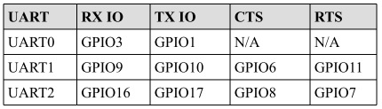

Semana 6
===========
Esta semanas vamos a explorar el framework de Espressif denomido `IDF <https://github.com/espressif/esp-idf>`__ 
(Espressif IoT Development Framework).

Objetivos
----------

1. Conocer el framework IDF para el desarrollo de aplicaciones con el ESP32.
2. Utilizar el framework IDF mediante la realización de ejemplos simples.

.. _my-reference-label:

Reto de la semana pasada
-------------------------

.. code-block:: c
   :lineno-start: 1

    #include <stdio.h>
    #include <string.h>
    #include <stdlib.h>
    #include "freertos/FreeRTOS.h"
    #include "freertos/task.h"
    #include "freertos/semphr.h"
    #include "driver/gpio.h"

    /**
    * Brief:
    * This test code shows how to configure gpio and how to use gpio interrupt.
    *
    * GPIO status:
    * GPIO18: output
    * GPIO4:  input, pulled up, interrupt from rising edge and falling edge
    *
    * Test:
    * Connect GPIO18 with GPIO4
    * Generate pulses on GPIO18, that triggers interrupt on GPIO4
    *
    */

    #define GPIO_OUTPUT_IO_0 GPIO_NUM_18
    #define GPIO_INPUT_IO_0 GPIO_NUM_4
    #define ESP_INTR_FLAG_DEFAULT 0

    SemaphoreHandle_t xSemaphore = NULL;

    static void IRAM_ATTR gpio_isr_handler(void *arg)
    {
        BaseType_t xHigherPriorityTaskWokenByPost;
        // We have not woken a task at the start of the ISR.
        xHigherPriorityTaskWokenByPost = pdFALSE;
        xSemaphoreGiveFromISR(xSemaphore, &xHigherPriorityTaskWokenByPost);
        if (xHigherPriorityTaskWokenByPost)
        {
            portYIELD_FROM_ISR();
        }
    }

    static void gpio_task_example(void *arg)
    {
        for (;;)
        {
            if (xSemaphoreTake(xSemaphore, portMAX_DELAY))
            {
                printf("GPIO[4] intr, val: %d\n", gpio_get_level(GPIO_INPUT_IO_0));
            }
        }
    }

    void app_main()
    {
        // Configure Output
        gpio_intr_disable(GPIO_OUTPUT_IO_0);
        gpio_set_level(GPIO_OUTPUT_IO_0, 0);
        gpio_pullup_dis(GPIO_OUTPUT_IO_0);
        gpio_pulldown_dis(GPIO_OUTPUT_IO_0);
        gpio_set_direction(GPIO_OUTPUT_IO_0, GPIO_MODE_OUTPUT);

        // Configure input
        gpio_set_direction(GPIO_INPUT_IO_0, GPIO_MODE_INPUT);
        gpio_pullup_en(GPIO_INPUT_IO_0);
        gpio_set_intr_type(GPIO_INPUT_IO_0, GPIO_INTR_ANYEDGE);
        gpio_intr_enable(GPIO_INPUT_IO_0);

        //create a binary semaphore
        xSemaphore = xSemaphoreCreateBinary();

        //start gpio task
        xTaskCreate(gpio_task_example, "gpio_task_example", 2048, NULL, 10, NULL);

        //install gpio isr service
        gpio_install_isr_service(ESP_INTR_FLAG_DEFAULT);
        //hook isr handler for specific gpio pin
        gpio_isr_handler_add(GPIO_INPUT_IO_0, gpio_isr_handler, (void *)GPIO_INPUT_IO_0);

        int cnt = 0;
        while (1)
        {
            printf("cnt: %d\n", cnt++);
            vTaskDelay(1000 / portTICK_RATE_MS);
            gpio_set_level(GPIO_OUTPUT_IO_0, cnt % 2);
        }
    }

Ejercicios
-----------

Ejercicio 1: documentación
^^^^^^^^^^^^^^^^^^^^^^^^^^^

* Ubicar la `documentación <https://docs.espressif.com/projects/esp-idf/en/latest/>`__ del framework.
* Ubicar la carpeta con los ejemplos en su sistema de archivos: ``msys32\home\JuanFernandoFrancoHi\esp\esp-idf\examples``

Ejercicio 2: GPIO 
^^^^^^^^^^^^^^^^^^^

En este ejercicio vamos a programar los puertos de entrada-salida del ESP32 utilizando el IDF. Se realizarán comparaciones 
con el framework de arduino donde sea posible. El ejemplo de este ejercicio corresponde precisamente al :ref:`my-reference-label`.

Comparando::

    Arduino: pinMode(pin, mode)
    IDF: esp_err_t gpio_set_direction(gpio_num_t gpio_num, gpio_mode_t mode)

    Arduino: digitalWrite(pin, value), digitalRead(pin)
    IDF: esp_err_t gpio_set_level(gpio_num_t gpio_num, uint32_t level)
         int gpio_get_level(gpio_num_t gpio_num)

Ejercicio 3: comunicaciones seriales
^^^^^^^^^^^^^^^^^^^^^^^^^^^^^^^^^^^^^^

`El ESP32 tiene 3 UART <https://esp-idf.readthedocs.io/en/latest/api-reference/peripherals/uart.html>`__ soportadas en 
hardware deneminadas ``UART0``, ``UART1`` y ``UART2``. La siguiente figura muestra los pines donde normalmente se mapean 
las UARTS (aunque es posible mapearlos a otros pines):

El IDF incluye un driver para las UART cuya API está definida en ``driver/uart.h``. En arduino las UART están representadas 
por los objetos SerialX, donde X corresponde a una UART especifica. Para configurar el objeto Serial en arduino se utiliza::

    Serial.begin(speed) Serial.begin(speed, config)

Donde ``config`` permite definir la cantidad de bits, paridad, y el bit de parada. En el caso de IDF, una UART 
se puede configurar definiendo la estructura de datos ``uart_config_t`` o también (como ocurrió con los GPIO) 
llamando funciones particulares para configurar cada aspecto individualmente. Una vez populada la estructura, se le pasa a la 
función ``uart_param_config()``. Luego se mapea a los pines deseados con ``uart_set_pin()`` y finalmente se inicializa el 
driver con uart_driver_install(). El siguiente codigo ilustra los pasos anteriores:

.. code-block:: c
   :lineno-start: 1

    /* UART asynchronous example, that uses separate RX and TX tasks

    This example code is in the Public Domain (or CC0 licensed, at your option.)

    Unless required by applicable law or agreed to in writing, this
    software is distributed on an "AS IS" BASIS, WITHOUT WARRANTIES OR
    CONDITIONS OF ANY KIND, either express or implied.
    */
    #include "freertos/FreeRTOS.h"
    #include "freertos/task.h"
    #include "esp_system.h"
    #include "esp_log.h"
    #include "driver/uart.h"
    #include "soc/uart_struct.h"
    #include "string.h"

    static const int RX_BUF_SIZE = 1024;

    #define TXD_PIN (GPIO_NUM_4)
    #define RXD_PIN (GPIO_NUM_5)

    void init() {
        const uart_config_t uart_config = {
            .baud_rate = 115200,
            .data_bits = UART_DATA_8_BITS,
            .parity = UART_PARITY_DISABLE,
            .stop_bits = UART_STOP_BITS_1,
            .flow_ctrl = UART_HW_FLOWCTRL_DISABLE
        };
        uart_param_config(UART_NUM_1, &uart_config);
        uart_set_pin(UART_NUM_1, TXD_PIN, RXD_PIN, UART_PIN_NO_CHANGE, UART_PIN_NO_CHANGE);
        // We won't use a buffer for sending data.
        uart_driver_install(UART_NUM_1, RX_BUF_SIZE * 2, 0, 0, NULL, 0);
    }

    int sendData(const char* logName, const char* data)
    {
        const int len = strlen(data);
        const int txBytes = uart_write_bytes(UART_NUM_1, data, len);
        ESP_LOGI(logName, "Wrote %d bytes", txBytes);
        return txBytes;
    }

    static void tx_task()
    {
        static const char *TX_TASK_TAG = "TX_TASK";
        esp_log_level_set(TX_TASK_TAG, ESP_LOG_INFO);
        while (1) {
            sendData(TX_TASK_TAG, "Hello world");
            vTaskDelay(2000 / portTICK_PERIOD_MS);
        }
    }

    static void rx_task()
    {
        static const char *RX_TASK_TAG = "RX_TASK";
        esp_log_level_set(RX_TASK_TAG, ESP_LOG_INFO);
        uint8_t* data = (uint8_t*) malloc(RX_BUF_SIZE+1);
        while (1) {
            const int rxBytes = uart_read_bytes(UART_NUM_1, data, RX_BUF_SIZE, 1000 / portTICK_RATE_MS);
            if (rxBytes > 0) {
                data[rxBytes] = 0;
                ESP_LOGI(RX_TASK_TAG, "Read %d bytes: '%s'", rxBytes, data);
                ESP_LOG_BUFFER_HEXDUMP(RX_TASK_TAG, data, rxBytes, ESP_LOG_INFO);
            }
        }
        free(data);
    }

    void app_main()
    {
        init();
        xTaskCreate(rx_task, "uart_rx_task", 1024*2, NULL, configMAX_PRIORITIES, NULL);
        xTaskCreate(tx_task, "uart_tx_task", 1024*2, NULL, configMAX_PRIORITIES-1, NULL);
    }

El código anterior está lleno de cosas interesantes (muchas preguntas de Juanito); sin embargo, antes de analizarlas, 
veamos algunos aspecetos interesantes del driver serial de IDF:

* Al igual que el framework de Arduino, IDF utiliza buffers tipo ``FIFO`` donde se colocarán los datos que serán transmitidos 
  o recibidos. Por tanto, y como en el caso de Arduino (``Serial.read()``, ``Serial.println()``), las funciones del API de IDF 
  están limitadas a leer o escribir de dichos buffers con uart_read_bytes() y uart_write_bytes().
* La función uart_read_bytes() es bloqueante; sin embargo, así como en el framework de Arduino (Serial.available()), es 
  posible preguntar si hay datos disponibles en el buffer de recepción con uart_get_buffered_data_len()::

    // Read data from UART.
    const int uart_num = UART_NUM_2;
    uint8_t data[128];
    int length = 0;
    ESP_ERROR_CHECK(uart_get_buffered_data_len(uart_num, (size_t*)&length));
    length = uart_read_bytes(uart_num, data, length, 100);
* En caso de necesitar descartar todos los datos en el buffer de recepción se debe llamar ``uart_flush()``.

Ahora sí, analicemos varios aspectos del ejercicio:

* En la función ``uart_driver_install`` el tamaño del buffer de transmisión se definió a cero indicando que el driver no 
  utilizará un buffer de transmisión y por tanto las funciones de transmisión se bloquearán hasta que todos los datos hayan 
  sido transmitidos.
* uart_driver_install permite informar, en una cola, los eventos que ocurren en el driver serial. 
  `En este enlace <https://github.com/espressif/esp-idf/blob/020ade652d9b6b0b87b0bebe176a150cc4407749/examples/peripherals/uart_events/main/uart_events_example_main.c>`__ 
  se puede ver un ejemplo que ilustra cómo funciona.
* Las tareas de recepción y transmisión utilizan la función ``void esp_log_level_set(const char *tag, esp_log_level_t level)``. 
  La función recibe una cadena para identficar el módulo y un nivel de verbosidad. La función hace parte de la bilbioteca 
  `Logging <https://esp-idf.readthedocs.io/en/latest/api-reference/system/log.html?highlight=esp_log_level_set#>`__ 
  de IDF. Un ``log`` es un registro que permite grabar acontecimientos en el sistema. En este caso los logs son enviados a la 
  UART0. ``esp_log_level_set()`` permite disminuir en tiempo de ejecución el nivel de verbosidad de los logs de cada módulo; 
  sin embargo, el nivel de verbosidad máximo se configura en tiempo de compilación con ``CONFIG_LOG_DEFAULT_LEVEL`` en 
  ``menuconfig``. Un módulo puede ser un archivo o una tarea. Se identifica por una etiqueta o TAG. El nivel de verbosidad 
  de menor nivel a mayor es: ``Error``, ``Warning``, ``Info``, ``Debug`` y ``Verbose``. El nivel por defecto de 
  ``CONFIG_LOG_DEFAULT_LEVEL`` es ``Info``. IDF permite aumentar por archivo el nivel de verbosidad definiendo en ese archivo 
  el macro LOG_LOCAL_LEVEL así::

    #define LOG_LOCAL_LEVEL ESP_LOG_VERBOSE
    #include "esp_log.h"
* Para usar la biblioteca ``Logging`` se debe definir en cada archivo o tarea una etiqueta y luego se utiliza un logging 
  macro::

    static const char *TX_TASK_TAG = "TX_TASK";  o
    static const char *RX_TASK_TAG = "RX_TASK";

    ESP_LOGE - error (lowest)
    ESP_LOGW - warning
    ESP_LOGI - info
    ESP_LOGD - debug
    ESP_LOGV - verbose (highest)
* En el ejercicio::

    ESP_LOGI(logName, "Wrote %d bytes", txBytes);
* En el ejercicio también se usa ``ESP_LOG_BUFFER_HEXDUMP(tag, buffer, buff_len, level)``. Este macro volca un buffer a un 
  determinado nivel de verbosidad. Por ejemplo::
  
    W (195) log_example: 0x3ffb4280   45 53 50 33 32 20 69 73  20 67 72 65 61 74 2c 20  |ESP32 is great, |
    W (195) log_example: 0x3ffb4290   77 6f 72 6b 69 6e 67 20  61 6c 6f 6e 67 20 77 69  |working along wi|
    W (205) log_example: 0x3ffb42a0   74 68 20 74 68 65 20 49  44 46 2e 00              |th the IDF..|
* Finalmente, ``rx_task`` utiliza memoria dinámica, es decir, memoria que se maneja en el ``heap`` o zona de memoria 
  dinámica. El manejo de memoria dinámica en C se hace manualmente, a diferencia de python, java o C# que cuentan con 
  mecanismos automáticos de manejo de memoria conocidos como ``garbage collectors``. Por tanto, la memoria 
  se reserva con ``malloc`` y luego debe liberarse manualmente con ``free()``. En el ejercicio, ``malloc`` recibe la cantidad 
  de bytes a reservar y devuelvo un puntero genérico, ``void *``. ``free`` recibe el puntero devuelto por malloc.

Ejercicio 4: otros periféricos
^^^^^^^^^^^^^^^^^^^^^^^^^^^^^^^

El ESP32 es rico en periféricos. El propósito de este ejercicio es explorar libremente algunos de ellos: 

* El equivalente en Arduino a ``analogRead()``: `ADC <https://esp-idf.readthedocs.io/en/latest/api-reference/peripherals/adc.html>`__.
* El equivalente en Arduino a ``analogWrite()`` cuando el microcontrolador posee realmente convertidor digital a análogo:
  `DAC <https://esp-idf.readthedocs.io/en/latest/api-reference/peripherals/dac.html>`__.
* El equivalente en Arduino a ``analogWrite()`` cuando la salida es ``PWM``:
  `LED control module <https://esp-idf.readthedocs.io/en/latest/api-reference/peripherals/ledc.html>`__.
