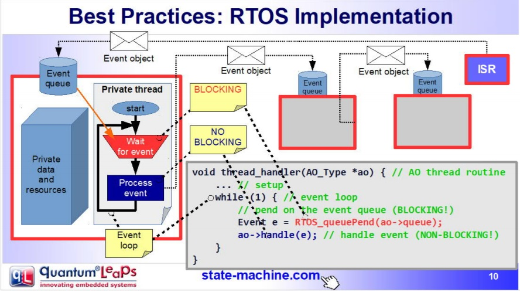
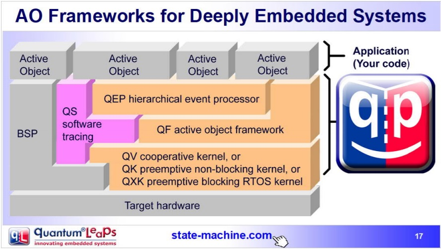

Semana 7
===========
A este punto del recorrido hemos visitado diferentes maneras de desarrollar aplicaciones para sistemas embebidos.
Desde la arquetectura ``background/foreground`` clásica, utilizada por Arduino, pasando por las máquinas de estado jerárquicas,
hasta los sistemas operativos de tiempo real ilustrados con FreeRTOS. Esta semana nos dirigiremos a la última estación 
de este recorridos. Se trata del patrón de diseño ``Active Objects`` u Objetos Activos.

Objetivos
----------

1. Comprender el patrón de diseño de Objetos Activos.
2. Utilizar el patrón de diseño para la construcción de aplicaciones.

Patrón de diseño de Objetos Activos
-------------------------------------
El material que se presentará a continuación está basado en:

* Los conceptos claves de programación de sistemas embebidos tratados `aquí <https://www.state-machine.com/doc/concepts>`__. 
* En esta `presentación <https://www.state-machine.com/doc/Beyond_the_RTOS_Notes.pdf>`__ de Miro Samek.
* En uno de los capítulos del `texto <https://www.state-machine.com/doc/PSiCC2_Active-Objects.pdf>`__ 
  ``Practical UML statecharts in C/C++`` de Miro Samek.
* Curso corto sobre `máquinas de estado <https://www.state-machine.com/doc/AN_Crash_Course_in_UML_State_Machines.pdf>`__ 
  en UML.
* Material del curso controladores: semana11 `clase 1 <https://drive.google.com/open?id=1yuDi-tbSpLvV9zAu_TTsXWi9PWn9XyZNPq_NEB4AMao>`__ 
  y `clase 2 <https://drive.google.com/open?id=1V9rsyZxPpqOZHqHymrKOfe0DZ-gUXSPsTdptbn5D134>`__.

¿Para qué sirve el patrón Objetos Activos ?
^^^^^^^^^^^^^^^^^^^^^^^^^^^^^^^^^^^^^^^^^^^^
Este patrón de diseño sirve para la construcción de software de sistemas de naturaleza ``reactiva``. Los sistemas reactivos se  
caracterizan por reaccionar ante la ocurrencia de eventos. Por ejemplo, la llegada de un mensaje 
por un puerto de comunicaciones, la disponibilidad de un dato por parte de un sensor, timeouts, una petición HTTP por 
parte de un cliente a un servidor, etc. El software para un sistema reactivo responde a la ocurrencia de eventos que no 
tienen necesariamente un orden establecido. En contraste, el software construido con programación secuencial espera de 
manera secuencial por la ocurrencia de un evento específico, haciendo que, mientras espera, no responda a otros eventos.

Por ejemplo::

    // the setup function runs once when you press reset or power the board
    void setup() {
    // initialize digital pin LED_BUILTIN as an output.
    pinMode(LED_BUILTIN, OUTPUT);
    }

    // the loop function runs over and over again forever
    void loop() {
    digitalWrite(LED_BUILTIN, HIGH);   // turn the LED on (HIGH is the voltage level)
    delay(1000);                       // wait for a second
    digitalWrite(LED_BUILTIN, LOW);    // turn the LED off by making the voltage LOW
    delay(1000);                       // wait for a second
    }

En este código de Arduino, mientras se espera por el evento de tiempo (``delay(1000)``), el programa del usuario no respondará 
a otros eventos, por ejemplo, la llegada de un nuevo dato por el puerto serial. 

Durante estas semanas hemos visto que un sistema operativo de tiempo real permite enfrentar el problema anterior utilizando 
``múltiples loops`` (tareas) corriendo concurrentemente en la misma CPU o de manera paralela en múltiples CPUs. De esta manera, 
es posible esperar por múltiples eventos en paralelo. Por ejemplo, una tarea para esperar una dato por el puerto serial y otra 
para encender y apagar un LED. Dice Juanito: a mi me parece todo muy bonito. Sin embargo, los problemas comienzan cuando 
las tareas deben sincronizarse y comunicarse entre ellas. Esto produce una suerte de estado compartido y la necesidad de aplicar 
mecanismos de exclusión mutua para evitar condiciones de carrera. Como hemos visto durante el curso, un RTOS provee mecanismos, 
mediante llamadas bloqueantes al sistema, tales como las colas de eventos y los semáforos para lidiar con lo anterior; 
sin embargo, aparecen nuevos problemas como la inanición de tareas o ``thread starvation``, abrazos mortales o ``deadlocks`` e inversión de prioridad o 
``priority inversion``.
 
Debido a lo anterior, actualemente muchos expertos recomiendan mejores prácticas de desarrollo para sistemas reactivos:

* No hacer llamados bloqueantes en el código. Más bien comunicar las tareas de manera asincrónica por medio de eventos.
* No compartir datos o recursos entre tareas. Mantener los recursos ``encapsulados`` en cada tareas y mejor utilizar eventos para
  compartir información.
* Organizar las tareas como "bombas de mensajes": con una cola de eventos y un depachador de eventos.

Al uso de estas prácticas se le conoce como ``programación guiada por eventos``. La siguiente figura, tomada de la presentación 
Modern Embedded Systems Programming: Beyond the RTOS de Miro Samek, ilustra cómo se podrían implementar las ideas anteriores 
utilizando un sistema operativo de tiempo real:

* Se define un evento (un objeto o estructura de datos) que indica el evento específico y sus parámetros. 
* Cada tarea tendrá su propia cola de mensajes que almacenará los eventos anteriores.
* Las tareas ``SÓLO`` se comunicarán y sincronizarán por medio de eventos enviados a sus colas. No está permitido que las 
  tareas compartan datos o recursos.
* El envio de mensajes es asincrónico, es decir, ninguna tarea puede esperar (espera bloqueada) por el procesamiento del evento.
* El código de la tarea se organiza como una "bomba de eventos". La tarea sólo se bloquea cuando su cola 
  está vacía, no en otra parte del código. 
* Cada evento es procesado antes de procesar el siguiente: ``run to completion``.

¿Qué es el patrón diseño ``ACTIVE OBJECT``?
^^^^^^^^^^^^^^^^^^^^^^^^^^^^^^^^^^^^^^^^^^^^
A todas las buenas prácticas anteriores y a la estrategia de implementación se le conoce como el patrón de Objetos Activos o 
patrón del Actor. Los objetos activos son objetos de software estrictamente encapsulados que 
corren sobre sus propios hilos (tarea) y se comunican de manerá asincrónica utilizando eventos.

Esta idea la propuso en los 70s Carl Hewitt en MIT. En los años 90s la metodología ROOM para el modelado de sistemas de tiempo 
real retomó la idea y posteriormente UML introdujo la noción de objetos activos. Tanto los objetos activos de ROOM como los de 
UML emplean máquinas de estado jerárquicas para especificar el comportamiento de dichos objetos.

En este curso vamos a implementar el patrón de objetos activos manualmente utilizando FreeRTOS; sin embargo, es posible utilizar 
``frameworks`` como `QP <https://www.state-machine.com>`__ de quantum leaps:

Pregunta Junito: ¿Qué son las máquinas de estado jerárquicas? En este punto se recomienda repasar el material del curso de 
controladores relacionado: semana11 `clase 1 <https://drive.google.com/open?id=1yuDi-tbSpLvV9zAu_TTsXWi9PWn9XyZNPq_NEB4AMao>`__ 
y `clase 2 <https://drive.google.com/open?id=1V9rsyZxPpqOZHqHymrKOfe0DZ-gUXSPsTdptbn5D134>`__.

Ejercicio: reto
^^^^^^^^^^^^^^^^^^^^^
Utilizando el patrón de objeto activo implemente un programa que controle de manera independiente tres LEDs. El control de 
cada LED se realiza mediante comandos que serán enviados por un puerto serial de aplicación del ESP32, es decir, debe 
utilizar un puerto serial diferente al puerto de depuración. Los comandos para cada LED son: encendido, apagado, 
programación de pulso (programar tiempo de activación y tiempo de encendido) y encendido apagado periódico. Antes de comenzar 
a programar, realice un modelo del sistema utilizando objetos activos y máquinas de estados jerárquicas para especificar el 
comportamiento de cada objeto. Considere el material de la semana 4 para repasar los conceptos de comunicación entre tareas y  
la creación de eventos, ejercicio 3.