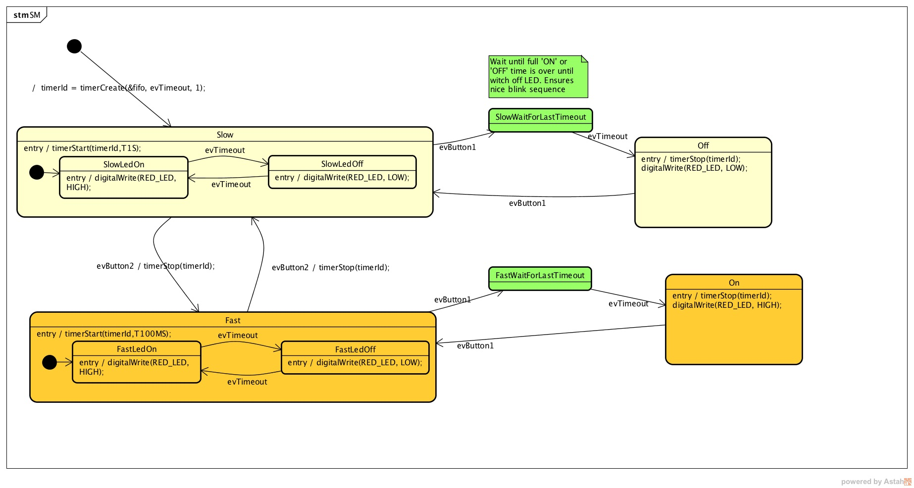

Semana 8
===========
Esta semana continuaremos con el reto de la semana pasada y realizaremos la evaluación sumativa teórica de la primera 
parte del curso. 

Material de referencia para el reto
-------------------------------------

En base a este `ejemplo <https://github.com/sinelabore/examples/tree/master/EnergiaBlink>`__ (tomado del proyecto 
SinelaboreRT), vamos a ilustrar la implementación, mediante un objeto activo, de la tarea que controla el LED:

.. code-block:: c
   :lineno-start: 1

    #include "freertos/FreeRTOS.h"
    #include "freertos/task.h"
    #include "esp_system.h"
    #include "esp_log.h"
    #include "driver/uart.h"
    #include "soc/uart_struct.h"
    #include "string.h"
    #include "freertos/queue.h"
    #include "freertos/timers.h"

    static const int RX_BUF_SIZE = 1024;

    #define TXD_PIN (GPIO_NUM_4)
    #define RXD_PIN (GPIO_NUM_5)
    #define GPIO_OUTPUT_IO_0 GPIO_NUM_18

    typedef enum{
        evTimeout = 0U,
        evButton2,
        evButton1,
        AOBLINK_NO_MSG
    }AOBLINK_EVENT_TYPE;

    /* Event names */
    const char events[] =
        "evTimeout\0evButton2\0evButton1\0NO_MSG\0";

    const unsigned short evt_idx[] = {0, 10, 20, 30};

    QueueHandle_t aoBlinkQueue;

    typedef struct
    {
        AOBLINK_EVENT_TYPE evType;
        uint8_t evData;
    } evAoBlink;

    TimerHandle_t aoTimer;

    const char *getNameByEvent(AOBLINK_EVENT_TYPE evt)
    {
        return (events + evt_idx[evt]);
    }

    void init()
    {
        const uart_config_t uart_config = {
            .baud_rate = 115200,
            .data_bits = UART_DATA_8_BITS,
            .parity = UART_PARITY_DISABLE,
            .stop_bits = UART_STOP_BITS_1,
            .flow_ctrl = UART_HW_FLOWCTRL_DISABLE};
        uart_param_config(UART_NUM_1, &uart_config);
        uart_set_pin(UART_NUM_1, TXD_PIN, RXD_PIN, UART_PIN_NO_CHANGE, UART_PIN_NO_CHANGE);
        // We won't use a buffer for sending data.
        uart_driver_install(UART_NUM_1, RX_BUF_SIZE * 2, 0, 0, NULL, 0);

        // Configure Output
        gpio_intr_disable(GPIO_OUTPUT_IO_0);
        gpio_set_level(GPIO_OUTPUT_IO_0, 0);
        gpio_pullup_dis(GPIO_OUTPUT_IO_0);
        gpio_pulldown_dis(GPIO_OUTPUT_IO_0);
        gpio_set_direction(GPIO_OUTPUT_IO_0, GPIO_MODE_OUTPUT);
    }

    static void aoTimerCallback(TimerHandle_t xTimer)
    {
        BaseType_t xStatus;
        evAoBlink ev;
        //printf("Sending timerEvent\r\n");
        ev.evType = evTimeout;
        ev.evData = 0;
        xStatus = xQueueSendToBack(aoBlinkQueue, &ev, 0);
        if (xStatus != pdPASS)
        {
            printf("aoTimerCallback couldn't send\r\n");
        }
    }

    typedef enum
    {
        Fast,
        FastLedOn,
        FastLedOff,
        Off,
        On,
        SlowWaitForLastTimeout,
        FastWaitForLastTimeout,
        Slow,
        SlowLedOn,
        SlowLedOff,
        NUM_STATES // number of states in the machine
    } States;

    int m_initialized;
    typedef struct
    {
        States stateVar;
        States stateVarSlow;
        States stateVarFast;
    } stateVarsT;

    stateVarsT stateVars;
    stateVarsT stateVarsCopy;

    static void initStateMachine(void)
    {
        BaseType_t xTimerCreatedStatus;

        if (m_initialized == 0U)
        {
            m_initialized = 1U;
            //Create copy of statevar
            stateVarsCopy = stateVars;
            // Set state vars to default states
            stateVarsCopy.stateVar = Slow;          /* set init state of top state */
            stateVarsCopy.stateVarSlow = SlowLedOn; /* set init state of Slow */
            stateVarsCopy.stateVarFast = FastLedOn; /* set init state of Fast */
            aoTimer = xTimerCreate("aoTimer", pdMS_TO_TICKS(1000UL), pdTRUE, NULL, aoTimerCallback);
            if (aoTimer != NULL)
            {
                printf("aoTimer created\r\n");
                xTimerCreatedStatus = xTimerStart(aoTimer, 0);
                if (xTimerCreatedStatus == pdPASS)
                {
                    printf("aoTimer started\r\n");
                }
            }
            gpio_set_level(GPIO_OUTPUT_IO_0, pdTRUE);
            printf("LED OFF \r\n");
            // Copy state variables back
            stateVars = stateVarsCopy;
        }
    }

    static void aoStateMachine(evAoBlink event)
    {

        int evConsumed = 0U;

        if (m_initialized == 0U)
            return;

        //Create copy of statevar
        stateVarsCopy = stateVars;

        switch (stateVars.stateVar)
        {

        case Slow:

            switch (stateVars.stateVarSlow)
            {

            case SlowLedOn:
                if (event.evType == evTimeout)
                {
                    /* Transition from SlowLedOn to SlowLedOff */
                    evConsumed = 1;

                    /* OnEntry code of state SlowLedOff */
                    gpio_set_level(GPIO_OUTPUT_IO_0, pdFALSE);
                    printf("LED OFF\r\n");
                    /* adjust state variables  */
                    stateVarsCopy.stateVarSlow = SlowLedOff;

                }
                else
                {
                    /* Intentionally left blank */
                }      /*end of event selection */
                break; /* end of case SlowLedOn  */

            case SlowLedOff:
                if (event.evType == evTimeout)
                {
                    /* Transition from SlowLedOff to SlowLedOn */
                    evConsumed = 1;

                    /* OnEntry code of state SlowLedOn */
                    gpio_set_level(GPIO_OUTPUT_IO_0, pdTRUE);
                    printf("LED ON\r\n");
                    /* adjust state variables  */
                    stateVarsCopy.stateVarSlow = SlowLedOn;
                }
                else
                {
                    /* Intentionally left blank */
                }      /*end of event selection */
                break; /* end of case SlowLedOff  */

            default:
                /* Intentionally left blank */
                break;
            } /* end switch Slow */

            /* Check if event was already processed  */
            if (evConsumed == 0)
            {

                if (event.evType == evButton1)
                {
                    /* Transition from Slow to SlowWaitForLastTimeout */
                    evConsumed = 1;

                    /* adjust state variables  */
                    stateVarsCopy.stateVar = SlowWaitForLastTimeout;
                }
                else if (event.evType == evButton2)
                {
                    /* Transition from Slow to Fast */
                    evConsumed = 1;

                    /* Action code for transition  */
                    xTimerChangePeriod(aoTimer,pdMS_TO_TICKS(100UL),0);
                    gpio_set_level(GPIO_OUTPUT_IO_0, pdTRUE);
                    printf("LED ON\r\n");
                    stateVarsCopy.stateVar = Fast;          /* Default in entry chain  */
                    stateVarsCopy.stateVarFast = FastLedOn; /* Default in entry chain  */
                }
                else
                {
                    /* Intentionally left blank */
                } /*end of event selection */
            }
            break; /* end of case Slow  */

        case Fast:

            switch (stateVars.stateVarFast)
            {

            case FastLedOn:
                if (event.evType == evTimeout)
                {
                    /* Transition from FastLedOn to FastLedOff */
                    evConsumed = 1;

                    /* OnEntry code of state FastLedOff */
                    gpio_set_level(GPIO_OUTPUT_IO_0, pdFALSE);
                    printf("LED OFF\r\n");
                    /* adjust state variables  */
                    stateVarsCopy.stateVarFast = FastLedOff;
                }
                else
                {
                    /* Intentionally left blank */
                }      /*end of event selection */
                break; /* end of case FastLedOn  */

            case FastLedOff:
                if (event.evType == evTimeout)
                {
                    /* Transition from FastLedOff to FastLedOn */
                    evConsumed = 1;

                    /* OnEntry code of state FastLedOn */
                    gpio_set_level(GPIO_OUTPUT_IO_0, pdTRUE);
                    printf("LED ON\r\n");

                    /* adjust state variables  */
                    stateVarsCopy.stateVarFast = FastLedOn;

                }
                else
                {
                    /* Intentionally left blank */
                }      /*end of event selection */
                break; /* end of case FastLedOff  */

            default:
                /* Intentionally left blank */
                break;
            } /* end switch Fast */

            /* Check if event was already processed  */
            if (evConsumed == 0)
            {

                if (event.evType == evButton1)
                {
                    /* Transition from Fast to FastWaitForLastTimeout */
                    evConsumed = 1;

                    /* adjust state variables  */
                    stateVarsCopy.stateVar = FastWaitForLastTimeout;
                }
                else if (event.evType == evButton2)
                {
                    /* Transition from Fast to Slow */
                    evConsumed = 1;

                    /* Action code for transition  */
                    xTimerChangePeriod(aoTimer,pdMS_TO_TICKS(1000UL),0);
                    gpio_set_level(GPIO_OUTPUT_IO_0, pdTRUE);
                    printf("LED ON\r\n");
                    stateVarsCopy.stateVar = Slow;          /* Default in entry chain  */
                    stateVarsCopy.stateVarSlow = SlowLedOn; /* Default in entry chain  */
                }
                else
                {
                    /* Intentionally left blank */
                } /*end of event selection */
            }
            break; /* end of case Fast  */

        case Off:
            if (event.evType == evButton1)
            {
                /* Transition from Off to Slow */
                evConsumed = 1;

                /* OnEntry code of state Slow */
                xTimerChangePeriod(aoTimer,pdMS_TO_TICKS(1000UL),0);
                gpio_set_level(GPIO_OUTPUT_IO_0, pdTRUE);
                printf("LED ON\r\n");
                stateVarsCopy.stateVar = Slow;          /* Default in entry chain  */
                stateVarsCopy.stateVarSlow = SlowLedOn; /* Default in entry chain  */
            }
            else
            {
                /* Intentionally left blank */
            }      /*end of event selection */
            break; /* end of case Off  */

        case On:
            if (event.evType == evButton1)
            {
                /* Transition from On to Fast */
                evConsumed = 1;

                /* OnEntry code of state Fast */
                xTimerChangePeriod(aoTimer,pdMS_TO_TICKS(100UL),0);
                gpio_set_level(GPIO_OUTPUT_IO_0, pdTRUE);
                printf("LED ON\r\n");
                stateVarsCopy.stateVar = Fast;          /* Default in entry chain  */
                stateVarsCopy.stateVarFast = FastLedOn; /* Default in entry chain  */
            }
            else
            {
                /* Intentionally left blank */
            }      /*end of event selection */
            break; /* end of case On  */

        case SlowWaitForLastTimeout:
            if (event.evType == evTimeout)
            {
                /* Transition from SlowWaitForLastTimeout to Off */
                evConsumed = 1;

                /* OnEntry code of state Off */
                xTimerStop(aoTimer,0);
                gpio_set_level(GPIO_OUTPUT_IO_0, pdFALSE);
                printf("LED OFF\r\n");
                /* adjust state variables  */
                stateVarsCopy.stateVar = Off;
            }
            else
            {
                /* Intentionally left blank */
            }      /*end of event selection */
            break; /* end of case SlowWaitForLastTimeout  */

        case FastWaitForLastTimeout:
            if (event.evType == evTimeout)
            {
                /* Transition from FastWaitForLastTimeout to On */
                evConsumed = 1;

                /* OnEntry code of state On */
                xTimerStop(aoTimer,0);
                gpio_set_level(GPIO_OUTPUT_IO_0, pdTRUE);
                printf("LED ON\r\n");
                /* adjust state variables  */
                stateVarsCopy.stateVar = On;
            }
            else
            {
                /* Intentionally left blank */
            }      /*end of event selection */
            break; /* end of case FastWaitForLastTimeout  */

        default:
            /* Intentionally left blank */
            break;
        } /* end switch stateVar_root */
        // Copy state variables back
        stateVars = stateVarsCopy;
    }

    static void aoBlink(void *pdata)
    {
        BaseType_t xStatus;
        evAoBlink rxEvent;

        initStateMachine();

        while (1)
        {
            xStatus = xQueueReceive(aoBlinkQueue, &rxEvent, portMAX_DELAY);
            if (xStatus == pdPASS)
            {
                printf("EV_type:%s-Data: %d\r\n", getNameByEvent(rxEvent.evType), rxEvent.evData);
                aoStateMachine(rxEvent);
            }
        }
    }

    static void serialTask(void *pdata)
    {
        evAoBlink ev;
        BaseType_t xStatus;
        uint8_t data[2];
        printf("serialTask init\r\n");
        while (1)
        {
            const uint8_t rxBytes = uart_read_bytes(UART_NUM_1, data, 1, 1000 / portTICK_RATE_MS);
            if (rxBytes > 0)
            {
                data[rxBytes] = 0;
                printf("Read: %s\r\n", data);
                ev.evType = AOBLINK_NO_MSG;
                if (data[0] == '1')
                    ev.evType = evButton1;
                if (data[0] == '2')
                    ev.evType = evButton2;
                ev.evData = 0;
                xStatus = xQueueSendToBack(aoBlinkQueue, &ev, 0);
                if (xStatus != pdPASS)
                {
                    printf("Could not send to the queue.\r\n");
                }
            }
        }
    }

    void app_main()
    {
        init();
        aoBlinkQueue = xQueueCreate(10, sizeof(evAoBlink));
        if (aoBlinkQueue != NULL)
        {
            printf("aoBlink state machine created\r\n");
            xTaskCreate(aoBlink, "aoBlink", 1024 * 2, NULL, configMAX_PRIORITIES, NULL);
            xTaskCreate(serialTask, "serialTask", 1024 * 2, NULL, configMAX_PRIORITIES - 1, NULL);
        }
        else
        {
            printf("aoBlinkQueue is not created\r\n");
        }
    }
