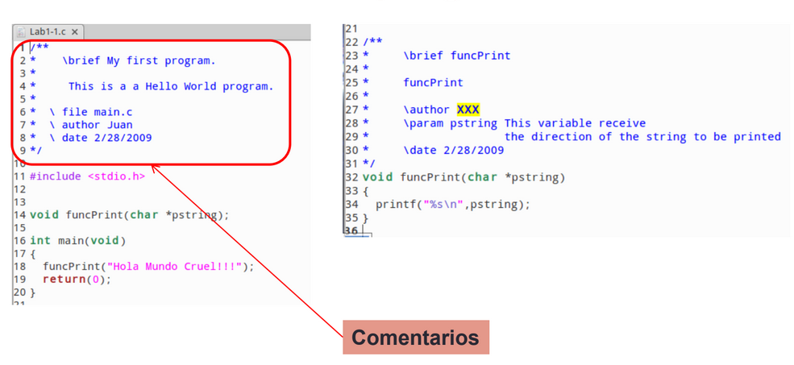
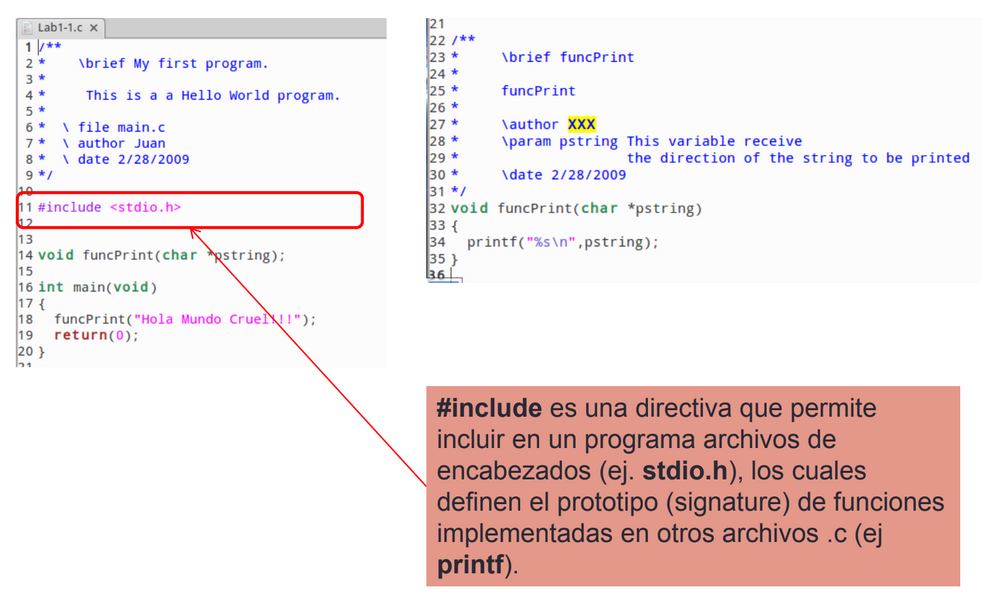
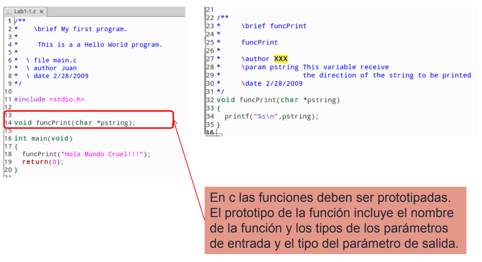
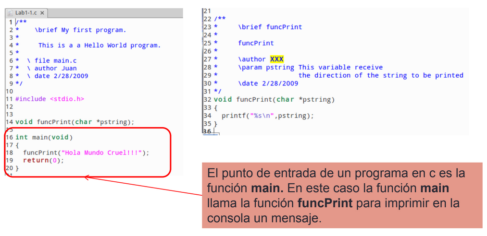
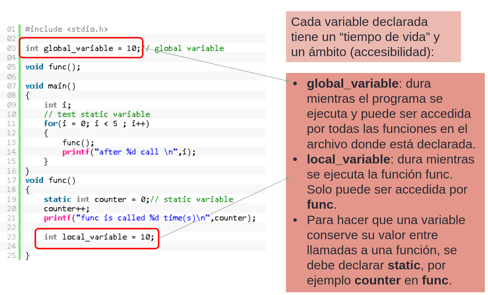
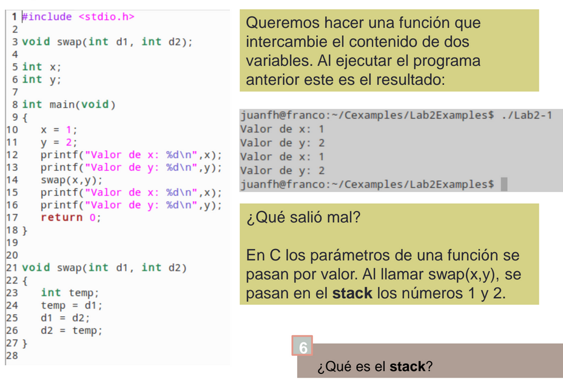
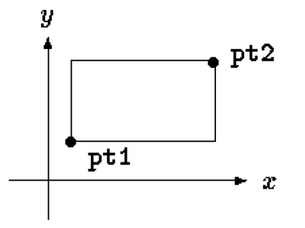
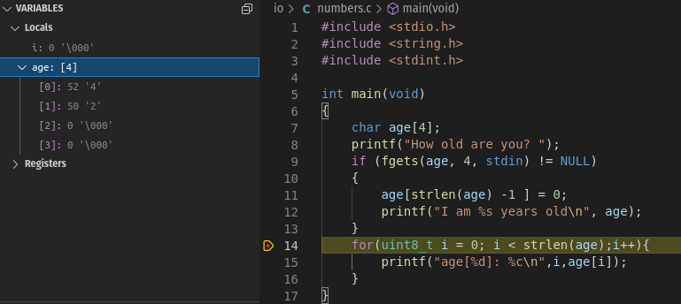
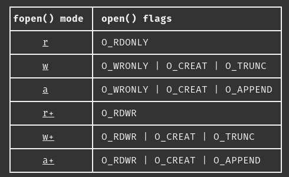

Introducción al lenguaje C
===========================

Con esta guía aprenderás a programar en lenguaje C. Vas a aprender 
las características del lenguaje que te permitirán realizar 
los ejercicios y proyectos propuestos.

Prerrequisitos
-----------------

Esta introducción a C asumen que tu ya conoces y has trabajado con otros 
lenguajes de programas como C#, python, java. Notarás cierta familiaridad 
con la sintaxis de C# o de java.

Temas
-------

#. ¿Qué es C y sus características?
#. Estructura básica de un programa en c
#. Proceso de compilación
#. El preprocesador
#. Tipos de datos, tamaños y rangos
#. Variables
#. Ámbito y accesibilidad de las variables
#. Operadores
#. Instrucciones de control de flujo
#. Punteros
#. Arreglos y su relación con los punteros
#. Cadenas de caracteres
#. Memoria dinámica 
#. Estructuras de datos
#. Entrada-Salida

Lecturas, ejercicios y retos
---------------------------------

Lectura 1: ¿Qué es C y sus características?
^^^^^^^^^^^^^^^^^^^^^^^^^^^^^^^^^^^^^^^^^^^^^

Es un lenguaje de programación de propósito general desarrollado por Dennis Ritchie entre
1969 y 1973 en Bell Labs. Es uno de los lenguajes más utilizados actualmente en sistemas operativos como Linux
y programación de sistemas embebidos.

Características del lenguaje:

* Lenguaje `imperativo <https://en.wikipedia.org/wiki/Imperative_programming>`__.
* Pocas palabras clave, por lo cual es fácil de aprender.
* No soporta de manera nativa la creación de objetos, pero te permite crear datos compuestos como 
  estructuras de datos y uniones.
* Permite el uso de punteros, es decir, variables que almacenan la dirección de otra variable.
* Tiene una `biblioteca estándar <https://en.wikipedia.org/wiki/C_standard_library>`__ externa.
* Los programa se compilan a código nativo, es decir, no es interpretado como python. Por tanto, la ejecución 
  de los programas es rápida, siempre y cuando estén bien escritos.
* Antes de que el programa sea compilado pasa por una fase de pre-procesado (ahora hablamos de eso) que permite 
  incluir en un archivo otros archivos, definir constante, macros, compilación condicional, entre otras cosas.
* Aunque la sintaxis de C es similar a C#, ten en cuenta que son lenguajes diferentes.

`Evolución del lenguaje <https://en.wikipedia.org/wiki/C_(programming_language)>`__:

* 1972: Aparece C.
* 1978: Brian Kernighan and Dennis Ritchie escriben la primera especificación informal (libro: The C Programming Language).
* 1989: aparece el estándar ANSI C C89.
* 1990: ISO (International Organization for Standardization) adopta el estándar ANSI C C90.
* 1999: aparece el estándar C99.
* 2011: aparece el estándar C11.
* 2018: aparece el estándar C17.
* 202x: se espera un nueva revisión del lenguaje.

Lectura 2: Estructura básica de un programa en c
^^^^^^^^^^^^^^^^^^^^^^^^^^^^^^^^^^^^^^^^^^^^^^^^^^

..
    .. raw:: html

        
    
            <iframe frameborder="0" width="100%" height="500px" src="https://replit.com/@juanferfranco/helloWorld?lite=true"></iframe>
        

Ejercicio 1: estructura de un programa en C
^^^^^^^^^^^^^^^^^^^^^^^^^^^^^^^^^^^^^^^^^^^^^^^^^

Realiza un diagrama de flujo para el programa de la lectura anterior. Te voy a recomendar una herramienta 
muy buena para hacer lo anterior, se llama `draw.io <https://app.diagrams.net/>`__. 

Ejercicio 2: compilación de un programa en C
^^^^^^^^^^^^^^^^^^^^^^^^^^^^^^^^^^^^^^^^^^^^^^^^^

Compila el programa anterior así:

.. code-block:: bash

    gcc -Wall Lab1-1.c -o Lab1-1

Recuerda:

* gcc es el compilador.
* -Wall: habilita los mensajes de advertencia (warnings) del compilador.
* Lab1-1.c es el archivo de entrada a compilar.
* -o Lab1-1 indica el nombre del archivo de salida.
  
Para ejecutar el programa:

.. code-block:: bash

    ./Lab1-1

Lectura 3: El preprocesador
^^^^^^^^^^^^^^^^^^^^^^^^^^^^^

El preprocesamiento es una característica muy propia de C que no es común a otros lenguajes de programación. Esta
característica permite MODIFICAR el programa ANTES de pasárselo al compilador para que este luego lo convierta 
en lenguaje ensamblador.

Lo que debes hacer para usar el preprocesador es introducir en el código DIRECTIVAS, es decir, instrucciones que le das al
preprocesador. Una vez el preprocesador lee tu programa, su tarea será remover las directivas y sustituirlas por 
código C que él mismo generará usando las instrucciones que tu le has dado con la directiva específica. Luego de 
este paso, tu programa estará listo para ser leído por el compilador.

Ten en cuenta que las directivas comenzarán por el símbolo #.

Ahora te voy a mostrar algunos ejemplos de directiva que puedes usar:

.. code-block:: c

    #define M 5
    #define C 5

    int main(int argc, char* argv[]) {
        int x = 2;
        int y = x*M + C;
        return 0;
    }

¿Cuál será el resultado en la variable ``y`` luego de ejecutar este programa?

Para responder esta pregunta recuerda que antes de compilador el programa, el archivo se pasa al preprocesador. 
El resultado del preprocesador será algo similar a esto:

.. code-block:: c

    int main(int argc, char* argv[]) {
        int x = 2;
        int y = x*5 + 5;
        return 0;
    }

Ahora si, este archivo, será pasado al compilador para que lo convierta en código ensamblador. 
La respuesta a la pregunta será 15.

Mira este otro ejemplo:

.. code-block:: c

	#define M 5
	#define C 5
	#define MAP(val,m,c) val*m+c

    int main(int argc, char* argv[]) {
        int x = 2;
        int y = MAP(x,M,C);
        return 0;
    }

¿Qué crees que genere el preprocesador luego de procesar este archivo? 

.. note::
    ¡Alerta de Spoiler!

    .. code-block:: c
         

        int main(int argc, char* argv[]) {
            int x = 2;
            int y = x*5+5;
            return 0;
        }

Otra forma de saber, ANTES de compilar, la salida del preprocesador es así:

``gcc -E codigo.c``

Por último prueba el comando anterior con este programa:

.. code-block:: c
    

	#include <stdio.h>
    
    #define M 5
	#define C 5
	#define MAP(val,m,c) x*m+c

    int main(int argc, char* argv[]) {
        int x = 2;
        int y = MAP(x,M,C);
        printf("y: %d", y);
        return 0;
    }

¿Qué puedes concluir de la directiva ``#include``? 

Otro uso interesante del preprocesador son las DIRECTIVAS de compilación condicional. 

Esta directivas te permiten incluir un código u otro, dependiendo de una condición:

.. code-block:: c
    

    #include <stdio.h>

    #define CONDITION
    
    int main(int argc, char* argv[]) {
    
        #ifdef CONDITION
        printf("CODIGO IF\n");
        #else
        printf("CODIGO ELSE\n");
        #endif
        return 0;
    }

¿Cómo crees que quede el programa luego de ser preprocesado?

.. note::
    ¡Alerta de Spoiler!

    Al definir ``CONDITION`` con la directiva ``#define CONDITION``
    y con el comando ``gcc -E codigo.c`` el resultado es:

    .. code-block:: c
         

        int main(int argc, char* argv[]) {
           printf("CODIGO IF\n");
            return 0;
        }

¿Será posible definir una directiva para el preprocesador desde la línea de comandos?

Volvamos al ejemplo anterior pero esta vez sin el ``#define CONDITION``

.. code-block:: c
    

    #include <stdio.h>

    int main(int argc, char* argv[]) {
    
        #ifdef CONDITION
        printf("CODIGO IF\n");
        #else
        printf("CODIGO ELSE\n");
        #endif
        return 0;
    }

¿Cuál será el resultado de compilar y ejecutar este programa?

Compara el resultado obtenido con la salida del comando ``gcc -E codigo.c``.

Ahora prueba este comando:

``gcc -DCONDITION -E codigo.c``

¿Cuál es el resultado?

Y si compilas así:

``gcc -DCONDITION -Wall codigo.c -o codigo``

¿Qué conclusiones puedes sacar?

Lectura 4: Tipos de datos, tamaños y rangos
^^^^^^^^^^^^^^^^^^^^^^^^^^^^^^^^^^^^^^^^^^^^^^

Los datos primitivos básicos en C son los ENTEROS, CARACTERES, NÚMEROS EN PUNTO FLOTANTE.

Infortunadamente C no define tamaños fijos para los ENTEROS. Estos varían de CPU a CPU. Por ejemplo,
en un microcontrolador de 8 bits los enteros pueden ser números de 16 bits, mientras que en una 
CPU de 32 bits serán de 32 bits.

Para solventar lo anterior, el archivo `stdint.h <https://pubs.opengroup.org/onlinepubs/9699919799/>`__ 
define de manera explícita algunos enteros así:

* int8_t : entero de 8 bits en complemento a dos.
* int16_t: entero de 16 bits en complemento a dos.
* int32_t: entero de 32 bits en complemento a dos.
* uint8_t: entero de 8 bits sin signo.
* uint16_t: entero de 16 bits sin signo.
* uint32_t: entero de 32 bits sin signo.

Para los enteros con signo (complemento a dos) el rango de valores que se puede representar 
con N bits es desde :math:`-2^{N-1}` hasta :math:`2^{N-1} - 1`.  Para los enteros positivos de N bits es desde
:math:`0` hasta :math:`2^{N} - 1`

Los número en punto flotante puede ser tipo float o tipo double. En ambos casos se utiliza la representación 
`IEEE758 <https://babbage.cs.qc.cuny.edu/IEEE-754.old/Decimal.html>`__. Los tipo float son de 32 bits y los tipo 
double de 64 bits.

El tipo char puede ser con signo, ``signed char`` o sin signo ``unsigned char``. En el caso con signo el rango va 
:math:`-128` a :math:`127` y si signo desde :math:`0` a :math:`255`. También es común observar el tipo ``char`` sin 
especificar el signo. En este caso, por defecto el rango será desde :math:`-128` hasta :math:`127`.

El lenguaje el operador de tiempo de compilación ``sizeof`` QUE SOLO FUNCIONA EN TIEMPO DE COMPILACIÓN. 
Te repito, SOLO FUNCIONA EN TIEMPO DE COMPILACIÓN. ``sizeof`` devuelve la cantidad de bytes que ocupa un tipo de dato.

Lectura 5: Variables
^^^^^^^^^^^^^^^^^^^^^^

Una variable en C es simplemente un nombre que se la da a una posición de memoria que 
almacenará cierto tipo de dato. Para definir una variable en C deberás indicar:

.. code-block:: c

    tipo_variable nombre_variable = valor_inicial;

Por ejemplo:

.. code-block:: c

    int counter = 5;

En este caso estás declarando la variable counter como un entero y definiendo su valor inicial a 5. NO OLVIDES 
que la capacidad de almacenamiento de ``int`` dependerá de la CPU que uses. Si quieres ser más explícito en el 
tamaño del entero, te recomiendo que uses ``stdint.h``.

Lectura 6: Ámbito y accesibilidad de las variables
^^^^^^^^^^^^^^^^^^^^^^^^^^^^^^^^^^^^^^^^^^^^^^^^^^^

Ejercicio 3: ámbito y accesibilidad de variables
^^^^^^^^^^^^^^^^^^^^^^^^^^^^^^^^^^^^^^^^^^^^^^^^^^^^^

Escribe, compila y ejecuta el programa anterior. Analiza detenidamente el resultado.

Ejercicio 4: Operadores
^^^^^^^^^^^^^^^^^^^^^^^^^^

Para que puedas practicar con este ejercicio te voy a recomendar que uses el depurar de C.
En el siguiente video te muestro cómo puedes iniciar a usarlo.

.. raw:: html
    
    

        <iframe width="560" height="315" src="https://www.youtube.com/embed/ArJWgY680bo" frameborder="0" allow="accelerometer; autoplay; encrypted-media; gyroscope; picture-in-picture" allowfullscreen></iframe>
    

El código del ejemplo que está en el video es este:

.. code-block:: c 
         
    
        #include <stdio.h>
        #include <stdint.h>
        
        int main(void)
        {
            int32_t a = 10;
            int32_t b = 20;
            int32_t c = 0;
        
            c = a + b;
            c = a - b;
            c = a * b;
            c = a / b;
            c = a % b;
            c = a++;
            c = a--;
            return 0;
        }
    
Ahora, usa el depurador para depurar el siguiente programa y ver cómo funcionan 
los distintos operadores. En la siguiente imagen podrás ver los controles básicos para el depurador.

Los controles 2,3 y 4 de izqueirda a derecha te permitirán ejecutar respectivamente, una función completa, sin 
entrar en ella; ingreasar a una función y salir de la función una vez ingreses en ella. Prueba estos 
controles.

Usa el siguiente código, tomado de `aquí <https://www.tutorialspoint.com/cprogramming/c_operators.htm>`__

.. code-block:: c 
     

    #include <stdio.h>
    #include <stdint.h>
    
    void opArithmetic(void);
    void opRelational(void);
    void opLogical(void);
    void opBitWise(void);
    void opAssignment(void);
    void opMisc(void);
    void opPrecedence(void);
    
    int main(void)
    {
        opArithmetic();
        opRelational();
        opLogical();
        opBitWise();
        opAssignment();
        opMisc();
        opPrecedence();
        return 0;
    }
    
    void opArithmetic(void)
    {
        int a = 21;
        int b = 10;
        int c;
    
        c = a + b;
        printf("Line 1 - Value of c is %d\n", c);
    
        c = a - b;
        printf("Line 2 - Value of c is %d\n", c);
    
        c = a * b;
        printf("Line 3 - Value of c is %d\n", c);
    
        c = a / b;
        printf("Line 4 - Value of c is %d\n", c);
    
        c = a % b;
        printf("Line 5 - Value of c is %d\n", c);
    
        c = a++;
        printf("Line 6 - Value of c is %d\n", c);
    
        c = a--;
        printf("Line 7 - Value of c is %d\n", c);
    
        return;
    }
    void opRelational(void)
    {
    
        int a = 21;
        int b = 10;
    
        if (a == b)
        {
            printf("Line 1 - a is equal to b\n");
        }
        else
        {
            printf("Line 1 - a is not equal to b\n");
        }
    
        if (a < b)
        {
            printf("Line 2 - a is less than b\n");
        }
        else
        {
            printf("Line 2 - a is not less than b\n");
        }
    
        if (a > b)
        {
            printf("Line 3 - a is greater than b\n");
        }
        else
        {
            printf("Line 3 - a is not greater than b\n");
        }
    
        /* Lets change value of a and b */
        a = 5;
        b = 20;
    
        if (a <= b)
        {
            printf("Line 4 - a is either less than or equal to  b\n");
        }
    
        if (b >= a)
        {
            printf("Line 5 - b is either greater than  or equal to b\n");
        }
    
        return;
    }
    
    void opLogical(void)
    {
    
        int a = 5;
        int b = 20;
    
        if (a && b)
        {
            printf("Line 1 - Condition is true\n");
        }
    
        if (a || b)
        {
            printf("Line 2 - Condition is true\n");
        }
    
        /* lets change the value of  a and b */
        a = 0;
        b = 10;
    
        if (a && b)
        {
            printf("Line 3 - Condition is true\n");
        }
        else
        {
            printf("Line 3 - Condition is not true\n");
        }
    
        if (!(a && b))
        {
            printf("Line 4 - Condition is true\n");
        }
    
        return;
    }
    
    void opBitWise(void)
    {
        unsigned int a = 60; /* 60 = 0011 1100 */
        unsigned int b = 13; /* 13 = 0000 1101 */
        int c = 0;
    
        c = a & b; /* 12 = 0000 1100 */
        printf("Line 1 - Value of c is %d\n", c);
    
        c = a | b; /* 61 = 0011 1101 */
        printf("Line 2 - Value of c is %d\n", c);
    
        c = a ^ b; /* 49 = 0011 0001 */
        printf("Line 3 - Value of c is %d\n", c);
    
        c = ~a; /*-61 = 1100 0011 */
        printf("Line 4 - Value of c is %d\n", c);
    
        c = a << 2; /* 240 = 1111 0000 */
        printf("Line 5 - Value of c is %d\n", c);
    
        c = a >> 2; /* 15 = 0000 1111 */
        printf("Line 6 - Value of c is %d\n", c);
        return;
    }
    
    void opAssignment(void)
    {
        int a = 21;
        int c;
    
        c = a;
        printf("Line 1 - =  Operator Example, Value of c = %d\n", c);
    
        c += a;
        printf("Line 2 - += Operator Example, Value of c = %d\n", c);
    
        c -= a;
        printf("Line 3 - -= Operator Example, Value of c = %d\n", c);
    
        c *= a;
        printf("Line 4 - *= Operator Example, Value of c = %d\n", c);
    
        c /= a;
        printf("Line 5 - /= Operator Example, Value of c = %d\n", c);
    
        c = 200;
        c %= a;
        printf("Line 6 - %%= Operator Example, Value of c = %d\n", c);
    
        c <<= 2;
        printf("Line 7 - <<= Operator Example, Value of c = %d\n", c);
    
        c >>= 2;
        printf("Line 8 - >>= Operator Example, Value of c = %d\n", c);
    
        c &= 2;
        printf("Line 9 - &= Operator Example, Value of c = %d\n", c);
    
        c ^= 2;
        printf("Line 10 - ^= Operator Example, Value of c = %d\n", c);
    
        c |= 2;
        printf("Line 11 - |= Operator Example, Value of c = %d\n", c);
    }

    void opMisc(void)
    {
        int a = 4;
        short b;
        double c;
        int *ptr;
    
        /* example of sizeof operator */
        printf("Line 1 - Size of variable a = %ld\n", sizeof(a));
        printf("Line 2 - Size of variable b = %ld\n", sizeof(b));
        printf("Line 3 - Size of variable c= %ld\n", sizeof(c));
    
        /* example of & and * operators */
        ptr = &a; /* 'ptr' now contains the address of 'a'*/
        printf("value of a is  %d\n", a);
        printf("*ptr is %d.\n", *ptr);
    
        /* example of ternary operator */
        a = 10;
        b = (a == 1) ? 20 : 30;
        printf("Value of b is %d\n", b);
    
        b = (a == 10) ? 20 : 30;
        printf("Value of b is %d\n", b);
    
        return;
    }
    
    void opPrecedence(void)
    {
        int a = 20;
        int b = 10;
        int c = 15;
        int d = 5;
        int e;
    
        e = (a + b) * c / d; // ( 30 * 15 ) / 5
        printf("Value of (a + b) * c / d is : %d\n", e);
    
        e = ((a + b) * c) / d; // (30 * 15 ) / 5
        printf("Value of ((a + b) * c) / d is  : %d\n", e);
    
        e = (a + b) * (c / d); // (30) * (15/5)
        printf("Value of (a + b) * (c / d) is  : %d\n", e);
    
        e = a + (b * c) / d; //  20 + (150/5)
        printf("Value of a + (b * c) / d is  : %d\n", e);
    
        return;
    }

Lectura 7: Instrucciones de control de flujo
^^^^^^^^^^^^^^^^^^^^^^^^^^^^^^^^^^^^^^^^^^^^^

Lee sobre las instrucciones de control flujo `aquí <https://www.tutorialspoint.com/cprogramming/c_decision_making.htm>`__ 
y `aquí <https://www.tutorialspoint.com/cprogramming/c_loops.htm>`__.

Lectura 8: Punteros
^^^^^^^^^^^^^^^^^^^^^^^

Los punteros son ``VARIABLES`` que almacenan la dirección de otra variable. 

Ejecuta el siguiente programa:

.. code-block:: c
     

    #include <stdio.h>
    #include <stdint.h>
    
    int main(void){
    
        char a;
        int b;
        float c;
        void (*d)(void); 
    
        printf("a'address: %p\n", &a);
        printf("b'address: %p\n", &b);
        printf("c'address: %p\n", &c);
        printf("d'address: %p\n", &d);
    
        return 0;
    }

En mi caso la salida se ve así:

.. code-block:: bash
     

    ./p1
    a'address: 0x7ffd249a93d7
    b'address: 0x7ffd249a93d8
    c'address: 0x7ffd249a93dc
    d'address: 0x7ffd249a93e0

¿Qué significan esos números que se ven en la pantalla?

Pues no son más que las direcciones de memoria virtual de las variables ``a``, ``b``, ``c`` y ``d``.

Nota el tipo de cada varible. Mira que no importa el tipo de variable,
el tamaño de la dirección es la misma.

Ahora mira la dirección de ``b`` y la dirección de ``a``. La diferencia entre ellas es de 1; sin embargo, 
entre ``b`` y ``c`` la diferencia de sus direcciones es de 4. ¿Por qué? ``PRESTA MUCHA ATENCIÓN``, aunque 
las direcciones tienen el mismo tamaño, lo que hay guardado en la dirección de memoria es de diferente 
tamaño. Mira, en la dirección de ``a`` tienes guardado un ``char``. Ya sabes que los ``char`` ocupan un byte. En la 
dirección de ``b`` tienes almancenado un ``int``, en mi computador los ``int`` son de 4 bytes o 32 bits. 

Te dejo esta pregunta a ti. Considerando lo anterior, analiza la diferencia entre las direcciones de ``c`` y ``d``.
¿Cuántos bytes necesita un float para ser representado en mi computador? 

En el ejercicio anterior usamos el operador ``&`` antes de la variable a. Con este operador le estás diciendo 
al compilador que NO QUIERES el contenido de la variable ``a``, sino la dirección de memoria de la variable 
``a``.

Ejecuta el siguiente ejemplo:

.. code-block:: c
     

    #include <stdio.h>
    #include <stdint.h>

    int main(void){

        uint32_t var;
        uint32_t *pvar = &var;

        printf("var'address: %p\n", &var);
        printf("pvar'address: %p\n", &pvar);
        printf("pvar content: %p\n", pvar);
        return 0;
    }

La salida, en mi computador es:

.. code-block:: bash 

    ./p2
    var'address: 0x7ffdcf216fec
    pvar'address: 0x7ffdcf216ff0
    pvar content: 0x7ffdcf216fec

Observa que la dirección de ``a`` concuerda con el contenido de pvar. ¿Por qué? porque le has 
dicho al compilador que en pvar vas a guadar la dirección de una VARIABLE DE TIPO uint32_t ( uint32_t * ) y adicionalmente, 
con el operador ``&`` antes de ``var``, estás indicando que quieres la dirección de ``var`` y además la estás 
asignado ( ``=`` ) a la variable ``pvar``.   

Finalmente, nota que la dirección de ``pvar`` y el contenido de ``pvar`` son diferentes. ¿Viste cómo 
conseguimos la dirección de ``pvar``? 

Para terminar esta lectura, te voy a mostrar en el siguiente video cómo puedes utilizar 
un puntero para leer y escribir la variable que este apunta.

.. raw:: html
    
    

        <iframe width="560" height="315" src="https://www.youtube.com/embed/8vQ_x1EICrQ" frameborder="0" allow="accelerometer; autoplay; encrypted-media; gyroscope; picture-in-picture" allowfullscreen></iframe>
    

Reto 1: argumentos, punteros y funciones
^^^^^^^^^^^^^^^^^^^^^^^^^^^^^^^^^^^^^^^^^^^^^^^^

Analiza detenidamente el problema que se presenta con el siguiente programa:

#. ¿Qué significa pasar un dato a una función por valor?

#. ¿Qué significa pasar un dato a una función por referencia?

#. ¿Qué es el stack?

Tómate un tiempo para pensar en el reto. Luego observa este video donde 
te muestro qué está pasando.

.. raw:: html
    
    

        <iframe width="560" height="315" src="https://www.youtube.com/embed/K-Rg4tygS4Y" frameborder="0" allow="accelerometer; autoplay; encrypted-media; gyroscope; picture-in-picture" allowfullscreen></iframe>
    

Ten en cuenta que en la explicación aterior, estás pasando los datos a la función por valor, es decir, 
estás copiando los valores de las variables.

¿Cómo podemos solucionar el problema anterior? Te dejo un video para que lo veas.

.. raw:: html
    
    

        <iframe width="560" height="315" src="https://www.youtube.com/embed/Dxa5mCzoErg" frameborder="0" allow="accelerometer; autoplay; encrypted-media; gyroscope; picture-in-picture" allowfullscreen></iframe>
    

En la solución estás pasando los datos a la función por referencia, es decir, en realidad no pasas 
los datos directamente, sino las posiciones de memoria donde están los datos.

Lectura 9: Arreglos y su relación con los punteros
^^^^^^^^^^^^^^^^^^^^^^^^^^^^^^^^^^^^^^^^^^^^^^^^^^^^^^

¿Qué es el nombre de arreglo?

.. raw:: html
    
    

        <iframe width="560" height="315" src="https://www.youtube.com/embed/aT8x_njflkY" frameborder="0" allow="accelerometer; autoplay; encrypted-media; gyroscope; picture-in-picture" allowfullscreen></iframe>
    

¿Qué es la dirección de un arreglo? 

.. raw:: html
    
    

        <iframe width="560" height="315" src="https://www.youtube.com/embed/GglLr-uVWhE" frameborder="0" allow="accelerometer; autoplay; encrypted-media; gyroscope; picture-in-picture" allowfullscreen></iframe>
    

¿Cómo accedo a los elementos de un arreglo con un puntero?

.. raw:: html
    
    

        <iframe width="560" height="315" src="https://www.youtube.com/embed/iRXHvW0Q6kc" frameborder="0" allow="accelerometer; autoplay; encrypted-media; gyroscope; picture-in-picture" allowfullscreen></iframe>
    

    
Reto 2: arreglos, funciones, punteros
^^^^^^^^^^^^^^^^^^^^^^^^^^^^^^^^^^^^^^^^^^^

Realiza una función que calcule el promedio de un arreglo de enteros de 32 bits de tamaño arbitrario. 
Deberías pasarle a la función la dirección en memoria del arreglo y el tamaño.

Lectura 10: cadenas de caracteres
^^^^^^^^^^^^^^^^^^^^^^^^^^^^^^^^^^

En este video te muestro cómo se pueden crear cadenas inmutables en C:

.. raw:: html
    
    

        <iframe width="560" height="315" src="https://www.youtube.com/embed/jxdrB9-aXjU" frameborder="0" allow="accelerometer; autoplay; encrypted-media; gyroscope; picture-in-picture" allowfullscreen></iframe>
    

Si deseas modificar algún carácter de la cadena en necesario que la crees como un arreglo de caracteres:

.. raw:: html
    
    

        <iframe width="560" height="315" src="https://www.youtube.com/embed/Sjp43zwRjRU" frameborder="0" allow="accelerometer; autoplay; encrypted-media; gyroscope; picture-in-picture" allowfullscreen></iframe>
    

Ten presente que todas las cadenas en C deben terminar por convención en 0:

.. raw:: html
    
    

        <iframe width="560" height="315" src="https://www.youtube.com/embed/tFh7FU5Y36o" frameborder="0" allow="accelerometer; autoplay; encrypted-media; gyroscope; picture-in-picture" allowfullscreen></iframe>
    

Reto 3: arreglos, cadenas, punteros
^^^^^^^^^^^^^^^^^^^^^^^^^^^^^^^^^^^^

Ejecuta y analiza el siguiente código. No olvides correrlo utilizando el depurador. Te recomiendo 
que antes de ver la salida del programa trates de predicir cuál será.

.. code-block:: c 
     

    #include <stdio.h>
    #include <stdint.h>
    
    char nombres[3][20] = {"fulano", "mengano", "perano"};
    
    int main(void){
    
        char *a;
        char (*b)[20];
        char (*c)[3][20];
    
        a = nombres[0];
        printf("Imprime el contenido de la dirección almacenada en a: %s\n",a);
        printf("Imprime el contenido de la dirección almacenada en a+1: %s\n",a+1);
    
        b = nombres;
        uint8_t sizeOfNombresElement = sizeof(nombres)/sizeof(nombres[0]);
    
        for(uint8_t i = 0; i < sizeOfNombresElement; i++){
            printf("Imprime el contenido de la dirección almacenada en b+%d: %s\n",i, (char *)(b+i));
        }
    
        c = &nombres;
        printf("Imprime el contenido de la dirección almacenada en c: %s\n", (char *) c);
        printf("Imprime el contenido de la dirección almacenada en c+1: %20s\n", (char *) (c+1) );
    
        printf("a  : %p\n",a);
        printf("a+1: %p\n",a+1);
        printf("b  : %p\n",b);
        printf("b+1: %p\n",b+1);
        printf("c  : %p\n",c);
        printf("c+1: %p\n",c+1);
    
        return 0;
    }

#. Explica qué hace la línea ``uint8_t sizeOfNombresElement = sizeof(nombres)/sizeof(nombres[0]);``
#. Observa el ciclo ``for``. ¿Cuál es la función de ``(char *)`` en ``(char *)(b+i)``?
#. ¿Cómo quedan almacenada en memoria la matriz ``nombres``?

Lectura 11: memoria dinámica
^^^^^^^^^^^^^^^^^^^^^^^^^^^^^^^^^^

En lenguaje C las variables se puede asignar en memoria de tres formas: estáticamente, automáticamente (en el
stack), dinámicamente (en el heap).

La memoria dinámica tu la puedes solicitar en tiempo de ejecución. Piensa por ejemplo en esto: necesitas 
crear un arreglo de enteros, pero antes de ejecutar el programa no sabes cuántos items tendrá ese arreglo 
de enteros porque la información del tamaño será ingresada por el usuario al interactuar con tu programa. 
En este caso, por ejemplo, podrías, en tiempo de ejecución, SOLICITAR la cantidad de espacio en memoria 
que será requerida.

.. warning::
    LA MEMORIA DINÁMICA LA DEBES GESTIONAR DE MANERA MANUAL.

    Mientras tu programa se ejecuta, puedes reservar memoria en el heap, pero cuando no la necesites 
    más DEBES liberarla. Ten presente que esto NO es necesario en lenguajes como python, java, C#, entre otros. 
    Por ejemplo, en C#, para crear variables en el heap usas la palabra reservada ``NEW``; sin embargo,
    no tienes que liberar manualmente la memoria. Lo anterior es posible gracias a un código que se ejecuta 
    con el tuyo llamado GARBAGE COLLECTOR (GC). El GC se encargar de liberar la memoria que ya no se está 
    usando. C no cuenta con con este mecanismo. NO LO OLVIDES POR FAVOR. 

    Pero entonces ¿C no es un bueno lenguaje comparado con java, C#, python, entre otros? La verdad no es así.
    C es un lenguaje que te permite escribir código muy eficiente y da un GRAN CONTROL sobre la ejecución 
    del programa. Simplemente ten en cuenta que hay lenguajes de programación apropiados para cada tipo de problema.
    C es el lenguje que se utiliza para escribir el código de Linux, python y una gran parte de los sistemas 
    embebidos que nos rodean.

En C cuentas con funciones declaradas en el archivo ``#include <stdlib.h>`` que te permiten hacer la gestión de la 
memoria:

.. code-block:: c

    void *malloc(size_t size);
    void free(void *ptr);
    void *calloc(size_t nmemb, size_t size);
    void *realloc(void *ptr, size_t size);
    void *reallocarray(void *ptr, size_t nmemb, size_t size);

Con ``malloc`` puedes reservar un número ``size`` de bytes. ``malloc`` te devuleve la dirección de memoria 
donde comenzará la cantidad de bytes solicitados o NULL en caso de error. Por su parte ``free`` te permite 
liberar la memoria reservada. Solo debes pasar la dirección que te retornó ``malloc``.   

Observa el siguiente ejemplo:

.. code-block:: c
     

    #include <stdio.h>
    #include <stdint.h>
    #include <stdlib.h>
    
    uint32_t *create_array(uint8_t);
    void destroy_array(uint32_t *);
    
    int main(void){
    
        uint32_t *buffer = create_array(30);
        if(buffer == NULL) return EXIT_FAILURE;
    
        for(uint8_t i = 0; i < 30; i++){
            buffer[i] = i+1;
        }
        
        for(uint8_t i = 0; i < 30; i++){
            printf("buffer[%d]: %d\n",i, buffer[i]);
        }
    
        destroy_array(buffer);
    
        return EXIT_SUCCESS;
    }
    
    uint32_t *create_array(uint8_t size){
        return (uint32_t * ) malloc(sizeof(uint32_t)* size );
    }

    void destroy_array(uint32_t *this){
        free(this);
    }

La función ``create_array`` te permitirá reservar la cantidad de enteros que le pases 
como argumento. Te devolverá la dirección en memoria donde inicia el bloque 
de enteros reservados. Nota que en ``create_array`` se usa  ``sizeof(uint32_t)* size``. 
Esto es necesario porque se debe determinar cuántos bytes ocupa un entero y luego multiplicar 
por la cantidad de enteros para poder obtener la cantidad total de bytes necesarios.

En C no tienes excepciones, por tanto, debes verificar siempre que puedas (si quieres 
que tu código sea robusto), posibles errores. En este caso nota ``create_array`` te devolverá 
``NULL`` si ``malloc`` no pudo reservar la cantidad de memoria que pediste.

Finalmente, observa que al terminar de usar la memoria, ``destroy_array`` la libera. Tu dirás, 
¿Si es necesario? La respuesta es SI, aunque el programa termine en este punto y el sistema 
operativo libere automáticamente la memoria, yo te recomiendo que adquieras el hábito de 
liberar la memoria. NO OLVIDES es un proceso manual que siempre tendrás que realizar.

Lectura 12: estructuras de datos
^^^^^^^^^^^^^^^^^^^^^^^^^^^^^^^^^^

En C existe la palabra reservada ``struct`` con la cual puedes crear tus propios tipos de datos.
Estas ``struct`` de C serán colecciones de una o más variables que pueden ser de tipos diferentes, 
pero agrupadas bajo un mismo nombre.

Por ejemplo, considera que quieres crear un punto ``(x,y)`` donde la x y la y son enteros. Tienes 
dos opciones. La primera es manejar cada coordinada de manera independite. La segunda crear un 
nuevo tipo de dato que incluya las dos coordenadas a la vez:

.. code-block:: c 

    struct point{
        int x;
        int y;
    };

Nota que cada varible la separas por ``;`` y luego de las llaves colocas otro ``;``.

Ahora vamos a explorar un poco más las estructuras con unas preguntas básicas:

* ¿La declaración de point en el ejemplo anterior ocupa MEMORIA? No ocupa memoria. Puedes 
  pensarlo como la declaración de una clase.
* ¿Cuándo ocupa memoria una ``struct``? cuando declaras variables del tipo de la ``struct``.
* ¿Cómo se declara una variable struct? ``struct point p1``. En este caso p1 si ocupa memoria, 
  aunque aún no has inicializado sus miembros ``x`` y ``y``. 
* ¿Cómo puedo inicializar un variable tipo ``struct``? ``struct point p1 = {1,2};``. En este 
  caso estás creando un memoria la varibale ``p1`` e inicializando la x en 1 y la y en 2.
* ¿Cómo puedes acceder a los miembros de una ``struct``? Para acceder a ``x`` utilizas ``p1.x`` 
  y para acceder a ``y`` ``p2.y``. 
* ¿Puedo tener ``struct`` y arreglos dentro de un ``struct``? Lo puedes hacer. Considera por ejemplo, 
  que quiere definir un nuevo tipo de dato que represente un rectángulo. Para definir un rectángulo 
  vas a necesitar dos puntos. 
  

.. code-block:: c 

    struct point{
        int x;
        int y;
    };

    struct rectangle{
        struct point pt1;
        struct point pt2; 
    };

* ¿Puedes asignar una struct en otras struct compatibles? SI lo puedes hacer:

.. code-block:: c 

    #include <stdio.h>
    
    struct Point {
        int x;
        int y;
    };
    
    int main()
    {
        struct Point p1 = {10, 20};
        struct Point p2 = p1; 
        printf(" p2.x = %d, p2.y = %d\n", p2.x, p2.y);
        return 0;
    }

Ten en cuenta que el contenido de ``p1`` SE COPIA en ``p2``. 

* ¿Puedo comparar dos ``struct``? NO lo puedes hacer. Intenta con el siguiente 
  programa. Observarás un error del compilador

.. code-block:: c 

    #include <stdio.h>
    
    struct Point {
        int x;
        int y;
    };
    
    int main()
    {
        struct Point p1 = {10, 20};
        struct Point p2 = p1; 
        printf(" p2.x = %d, p2.y = %d\n", p2.x, p2.y);

        if(p1 == p2){
            printf("p1 is equal to p2\n");
        }

        return 0;
    }

Reto 4: comparación de estructuras
^^^^^^^^^^^^^^^^^^^^^^^^^^^^^^^^^^^

En la lectura anterior viste que no es posible comparar dos struct usando 
el operador ``==``. En este reto te propongo que hagas un programa que 
permita determinar si dos struct son iguales.

Lectura 13: estructuras y punteros
^^^^^^^^^^^^^^^^^^^^^^^^^^^^^^^^^^^

¿Es posible guardar la dirección en memoria de una variable tipo ``struct`` en un 
puntero? Si es posible:

.. code-block:: c

    #include <stdio.h>
    
    struct Point {
        int x;
        int y;
    };
    
    int main()
    {
        struct Point p1 = {10, 20};
        struct Point *pp1 = &p1;
        printf(" p1.x = %d, p1.y = %d\n", pp1->x, pp1->y);
        return 0;
    }

``pp1`` es una variable que almacena la dirección de ``p1``; sin embargo, 
para acceder a los miembros de p1 a través de pp1 debes usuar el operador ``->``.

Lectura 14: entrada/salida (teclado-pantalla)
^^^^^^^^^^^^^^^^^^^^^^^^^^^^^^^^^^^^^^^^^^^^^^^

En esta lectura aprenderás a solicitarle información al usuario por medio del 
teclado. Profundizarás un poco más en el funcionamiento de la salida por pantalla 
formateada y finalmente aprenderás a leer y almacenar información persistente.

¿Cómo puedes hacer para leer información por medio del teclado?

Tu programa no puede leer directamente la información que el usuario ingresa desde 
el teclaro. Esta tarea la debes hacer por medio del sistema operativo, es decir, debes 
``pedirle el favor`` al sistema operativo (un llamado al sistema operativo). 
¿Cómo? Te voy a proponer una de muchas maneras usando esta función 
``char *fgets(char *str, int n, FILE *stream)``. A ``fgets`` 
le debes pasar la dirección del buffer (arreglo en memoria) donde quieres colocar los 
caracteres introducidos por el usuario, la cantidad de caracteres y la fuente (el flujo) 
de donde estos vienen. La función con esta información se encarga de hacer el llamado o la 
solicitud al sistema operativo. Mientras el sistema operativo hace lo que pediste, tu programa
se BLOQUEA. Esto significa que le entregas el control al sistema operativo. Una vez presiones 
la tecla ``ENTER`` el sistema operativo copiará la información ingresada por el usuario al 
buffer que definiste y tu programa podrá continuar. 

Analicemos juntos este código:

.. code-block:: c
     

    #include <stdio.h>
    int main(void)
    {
        char name[40];
        printf("What is your name? ");
        if (fgets(name, 40, stdin) != NULL)
        {
            printf("Hello %s!\n", name);
        }
    }

¿Recuerdas qué es el nombre de un arreglo? Es la dirección del primer elemento del arreglo. Por 
tanto le estás diciendo a ``fgets`` dónde debe iniciar a colocar los caracteres introducidos 
por el usuario y hasta cuántos, en este caso 40. Nota además que le dices de dónde vienen 
los datos: ``stdin`` o el flujo de entrada estándar, que en este caso es el teclado. Finalmente, 
observa que si hay algún error en la operación ``fgets`` devuelve ``NULL`` y es por eso 
que en este programa se verifica que el resultado sea diferente a ese valor.     

Al ejecutarlo verás esto:

.. code-block:: bash 

    ./stdinRead                       
    What is your name? juan franco
    Hello juan franco
    !

¿Te lo esperabas? observa que luego de la cadena ``juan franco`` también se está imprimiendo 
el ENTER que el usuario ingresó.

¿Y si no quieres ese ENTER? El carácter ENTER estará al final de la cadena ``juan franco``. 
Vamos a comprobarlo. Ejecuta de nuevo el programa con la siguiente modificación. Ten presente que no verás 
la cadena ``What is your name?``, no importa, igual escribe tu nombre y presiona ENTER

.. code-block:: bash 

    ./stdinRead > out.txt
    juan franco
    hexdump -C out.txt 
    00000000  57 68 61 74 20 69 73 20  79 6f 75 72 20 6e 61 6d  |What is your nam|
    00000010  65 3f 20 48 65 6c 6c 6f  20 6a 75 61 6e 20 66 72  |e? Hello juan fr|
    00000020  61 6e 63 6f 0a 21 0a                              |anco.!.|
    00000027

Con esta línea ``./stdinRead > out.txt`` estás redireccionando el flujo de salida a un archivo, 
``out.txt``. Es por eso que no verás ``What is your name?`` en la pantalla sino en ``out.txt``.
Lo interesante viene con ``hexdump -C out.txt`` que te permite observar realmente los caracteres 
escritos por ``printf("Hello %s!\n", name);``. Nota la secuencia de caracteres 
``6a 75 61 6e 20 66 72 61 6e 63 6f 0a 21 0a`` los primeros ``6a 75 61 6e 20 66 72 61 6e 63 6f`` 
corresponden a ``juan franco``, luego ``0a`` al ENTER ingresado por el usuario y ``21 0a`` a ``!\n``. Por tanto, 
para eliminar el ENTER debes buscarlo en el buffer y cambiarlo por ``0``.  

Esto se puede hacer de muchas maneras. Te propongo la siguiente:

.. code-block:: c
     

    #include <stdio.h>
    #include <string.h>

    int main(void)
    {
        char name[40];
        printf("What is your name? ");
        if (fgets(name, 40, stdin) != NULL)
        {
            name[strlen(name) -1 ] = 0;
            printf("Hello %s!\n", name);
        }
    }

La función ``strlen`` encuentra el tamaño de la cadena de caracteres. ¿Cómo? simplemente 
contando caracteres hasta encontrar un 0. Es por eso que las cadenas de caracteres en 
C deben terminar simpre con 0. Sabemos que en este caso el ENTER es el último 
carácter y por tanto está ubicado en la última posición del buffer dada por la longitud 
de la cadena menos uno. 

Ejercicio 5: ingresar números por teclado 
^^^^^^^^^^^^^^^^^^^^^^^^^^^^^^^^^^^^^^^^^^

Escribe el siguiente programa:

.. code-block:: c
     

    #include <stdio.h>
    #include <string.h>
    #include <stdint.h>
    
    int main(void)
    {
        char age[4];
        printf("How old are you? ");
        if (fgets(age, 4, stdin) != NULL)
        {
            age[strlen(age) -1 ] = 0;
            printf("I am %s years old\n", age);
        }
        for(uint8_t i = 0; i < strlen(age);i++){
            printf("age[%d]: %c\n",i,age[i]);
        }
    }
    

Al ejecutarlo:

.. code-block:: bash

    gcc -Wall numbers.c -o num
    ./num 
    How old are you? 42
    I am 42 years old
    age[0]: 4
    age[1]: 2

Si ejecutas el programa con el depurador notarás que la secuencia de caracteres ``42`` no se almancea 
en ``age`` como un número sino como el código ASCII del ``4`` (52) y el código ASCII del ``42`` (50). 
NO OLVIDES ESTO POR FAVOR: si luego quieres hacer operaciones con el número ingresado, lo primero que debes 
hacer es convertir la secuencia de caracteres '4' '2' en el número ``42``.

Ejercicio 6: convertir caracteres a números (forma 1)
^^^^^^^^^^^^^^^^^^^^^^^^^^^^^^^^^^^^^^^^^^^^^^^^^^^^^^

No creiste que te dejaría sin saber cómo hacer la conversión de caracteres a números ¿Cierto?
En C se puede hacer de muchas maneras. Algunas formas son muy simples, pero poco robustas, es decir, 
no verifican errores o son lentas. Te voy a proponer una forma un tanto más complicada pero más 
robusta tomada del manual de Linux.

Aquí viene. Copia el código, ejecutálo. Ingresa números, números con letras. Experimenta. En principio 
se puede ver complicado, pero la verdad no lo es tanto. En otros lenguajes de programación recuerda que 
usualmente tienes bloques ``try catch``, esto que vas a ver es algo similar, solo que en C debes 
hacer esta gestión de manera manual. De nuevo, es porque C te da todo el control a ti para que hagas 
lo que quieras.

.. code-block:: c
     

    #include <stdlib.h>
    #include <limits.h>
    #include <stdio.h>
    #include <errno.h>
    #include <string.h>

    int main(void)
    {
        char *endptr;
        long val;    
        char number[40];

        printf("Enter an integer number: ");
        if (fgets(number, 40, stdin) != NULL)
        {
            number[strlen(number) -1 ] = 0;
            printf("The string to convert is %s\n", number);
        }

        errno = 0;
        val = strtol(number, &endptr, 10);    
        /* Check for various possible errors */    
        if (errno != 0) 
        {
            perror("strtol");
            exit(EXIT_FAILURE);
        }    
        
        if (endptr == number) {
            fprintf(stderr, "No digits were found\n");
            exit(EXIT_FAILURE);
        }

        /* If we got here, strtol() successfully parsed a number */

        printf("strtol() returned %ld\n", val);

        if (*endptr != '\0')        /* Not necessarily an error... */
            printf("Further characters after number: \"%s\"\n", endptr);

        exit(EXIT_SUCCESS);
    }

En este código hay varias cosas interesantes para analizar. 

La función ``strtol`` se define así: 

.. code-block:: c 

    #include <stdlib.h>

    long strtol(const char *nptr, char **endptr, int base);

Para usuar la función debes incluir un archivo de cabezera (stdlib.h). Observa los parámetros de la función.
nptr te permite almacenar una dirección. Será la dirección del primer carácter de la secuencias de caracteres 
que vas a convertir. No ta la palabra reservada ``const``. Esta palabra no es obligatoria, pero si la usas la 
estás diciendo al compilador que por medio de ``nptr`` no piensas modificar el contenido apuntado, por tanto, 
si llegaras a olvidarlo en tu código o si cometes un error, el compilador te dirá. ``endptr`` se ve complicado, 
pero realmente no lo es tanto. Esa variable tiene dos ``*`` que quiere decir que es una variable que almacena 
la dirección de otra variable que almancena direcciones, es decir, es una variable que almancena la dirección 
de un puntero. Finalmente, ``base`` indica la base numérica que se debe utilizar para interpretar la secuencia 
de caracteres, es decir, considera que puedes estar representado un número en base 10, en base 2, en base 16, 
etc.

``strtol`` te devolverá el entero convertido o ``0`` si hay un error. Y te estarás preguntando, ¿Cómo hago para 
saber si tengo un error o el valor ingresado es CERO? Lo que debes verificar es si la función detectó algún error. 
En el archivo ``errno.h`` está definida la variable entera ``errno``. Esta variable la asigna un llamado al sistema 
(cuando le pides al sistema operativo que haga algo por ti) y algunas funciones de bibliotecas para indicar 
un error. TEN PRESENTE que ningún llamado al sistema o función de biblioteca asignará ``errno`` con cero. Por tanto, 
antes de llamar ``strtol`` se coloca ``errno`` en 0.

En la secuencia de caracteres no tienes que tener solo caracteres que representen números, sino también, letras, 
signos artiméticos, etc. Si la secuencia comienza con espacios ``strtol`` los ignora. Puedes tener inicialmente 
los signos ``+`` o ``-`` y ``strtol`` los tendrá en cuenta para la conversión. Asume que tienes la seguiente secuencia:
``"  -2367hola "``. ``strtol`` ignorará los primeros espacios, luego se dará cuenta que el número es negativo y leerá 
todos los caracteres que representan números; sin embargo, se detendrá cuando encuentre el carácter ``h``. En este 
punto realizará la conversión. En la variable ``endptr`` quedará la dirección en memoria de ``h``.

Otra de las virtudes de ``strtol`` es que puedes saber si resultado de la conversión está fuera de rango tanto 
al máximo como al mínimo. Puedes ver un poco más en la documentación de ``strtol`` escribiendo en la terminal 
``man strtol``.

Se ve complicado usar ``strtol``, cierto? Tienes razón. Intentemos una ``receta`` en este punto, PERO lo importante 
es que ya comprendes. 

.. code-block:: c

    #include <stdlib.h>
    #include <stdio.h>
    #include <errno.h>

    int main(void)
    {
        char *endptr;
        long val;    
        char *number = " -2892 test";

        errno = 0;
        val = strtol(number, &endptr, 10);    
        if(errno == 0 && *number != 0 && number != endptr){
            printf("strtol return: %ld\n",val);
        }
        else{
            printf("strtol fails\n");
        }

        exit(EXIT_SUCCESS);
    }

Ejercicio 7: convertir caracteres a números (forma 2)
^^^^^^^^^^^^^^^^^^^^^^^^^^^^^^^^^^^^^^^^^^^^^^^^^^^^^^

Puedes utilizar esta segunda manera que te voy a mostrar, pero tiene un defecto. No tienes manera de saber 
si la conversión desbordó. Si requieres este varificación te debes quedar con strtol.

La función será ``sscanf`` definida así (puedes leer más con ``man sscanf``):

.. code-block:: c 

    #include <stdio.h>

    int sscanf(const char *str, const char *format, ...);

¿Ves que uno de los parámetros de la función es ``...``? En C a esto se le conoce como funciones de parámetros 
variables. Ya verás con los ejemplos cómo se usa. ``sscanf`` convertirá la cadena de caracteres apuntada por ``str`` 
de la manera como le indiques con la cadena apuntada por ``format``. ¿Y los ``...``? esos serán parámetros 
adicionales que le darás a ``sscanf`` con las direcciones de las variables donde se almancenará la conversión. 
Entonces ¿Se pueden hacer varias conversiones a la vez? Si!

.. code-block:: c 

    #include <stdlib.h>
    #include <stdio.h>
    #include <errno.h>
    #include <string.h>

    int main(void)
    {
        int val;    
        char number[40];

        printf("Enter an integer number: ");
        if (fgets(number, 40, stdin) != NULL)
        {
            number[strlen(number) -1 ] = 0;
            printf("The string to convert is %s\n", number);
        }

        errno = 0;
        int successItems = sscanf(number,"%d",&val);
        if(successItems == 1){
            printf("val: %d\n", val);
        }
        else{
            printf("sscanf fails\n");
        }

        exit(EXIT_SUCCESS);
    }

Observa que la cadena ``format`` es ``"%d"`` que indica convertir la secuencia de caracteres apuntada 
por ``number`` a un entero. Luego ``&val`` informa la dirección de memoria donde quieres que queda la conversión.
Si todo sale bien (aunque recuerda que no hay verificación de desbordamiento), ``sscanf`` te devolverá la cantidad 
de conversiones exitosamente realizadas. Es por ello que en este ejemplo verificamos si ``successItems == 1``.

En ``format`` cada espcificación de conversión comienza con ``%`` seguido de: 

* Un ``*`` opcional para decirle que haga la conversión, pero que no la guarde.
* Un ``'`` opcional si la secuencia a convertir incluye el símbolo de miles.
* Una ``m`` opcional para las conversiones de cadenas (no números). Esto libera al programador de reservar previamente 
  un buffer para almancear la conversión. En este caso ``sscanf`` reserva la memoria y devuelve en el parámetros 
  la dirección. LUEGO debes hacer ``FREE``, claro, cuando no uses más la memoria.
* Un entero opcional que indica la cantidad máxima de caracteres a leer.
* Un modificador de TIPO opcional. Mira que en algunos ejemplos hemos usado ``%d`` para leer un ``int`` o 
  por ``%ld`` para leer un ``long``.
* Finalmente, se colca el espcificador de conversión, por ejemplo ``%d`` indica que queremos convertir la cadena de 
  caracteres a un ``int``. Este especificador de conversión también tiene varias opciones. :) 

Puedes leer más sobre los modificadores de tipo y el especificador de conversión en la terminal con ``man sscanf``. 

En este ejemplo te estoy mostrando la forma rápida, tipo receta. Esto es porque ``sscanf`` es una 
función compleja dadas todas las posibilidades que tienes para decirle con ``format`` cómo quieres hacer 
la conversión. Si eres muy curiosa puedes explorar, recuerda, con ``man sscanf``.

Ejercicio 8: leer una cadena de caracteres desde la terminal con scanf
^^^^^^^^^^^^^^^^^^^^^^^^^^^^^^^^^^^^^^^^^^^^^^^^^^^^^^^^^^^^^^^^^^^^^^^

Para complementar el ejercicio anterio. Vamos a leer una cadena de carteres 
desde la terminal utilizando ``scanf``.

.. code-block:: c 

    #include <stdio.h>
    #include <stdlib.h>
    #include <string.h>

    int main(void){

        char *strPtr;
        int n = scanf("%ms",&strPtr);
        if(n == 1){
            printf("String length: %ld\n", strlen(strPtr));
            free(strPtr);
        }
        else{
            printf("scanf fails\n");
        }
        return(EXIT_SUCCESS);
    }

Ejecuta el código así:

.. code-block:: bash 

    ./ts                            
    hola mundo
    String length: 4

Observa que la cadena se almacenó hasta hola. ¿Y si quieres leer toda la cadena? 
Debes decirle a ``scanf`` que lea caracteres mientras este no sea el ``ENTER`` (``\n``):

.. code-block:: c

    #include <stdio.h>
    #include <stdlib.h>
    #include <string.h>

    int main(void){

        char *strPtr;
        // [^\n]: lee mientras no encuentres el enter
        int n = scanf("%m[^\n]",&strPtr);
        if(n == 1){
            printf("String length: %ld\n", strlen(strPtr));
            free(strPtr);
        }
        else{
            printf("scanf fails\n");
        }
        return(EXIT_SUCCESS);
    }

Al ejeecutarlo:

.. code-block:: bash 

    ./ts                            
    hola mundo
    String length: 10 

Ejercicio 9: imprimir con printf
^^^^^^^^^^^^^^^^^^^^^^^^^^^^^^^^^

Durante todo el curso hemos usando la función ``printf``. Llegó el momento 
de profundizar un poco más en ella. Está definida así:

.. code-block:: c 

    #include <stdio.h>

    int printf(const char *format, ...);

Similar a ``sscanf``, ``format`` especifica cómo se desea imprimir en pantalla. Todos los caracteres 
que se colocan entre comillas serán enviados a la pantalla menos ``%`` que indicará una epecificación 
de conversión. Por tanto, cuando ``printf`` encuentre ``%`` realizará la conversión indicada y 
enviará a la pantalla los caracteres respectivos. Cada espcificador de conversión:

* Inicia con ``%``.
* Cero o más ``FLAGS``.
* Luego un entero que espcifica el ancho mínimo del campo a imprimir.
* Una precisión opcional.
* Un modificador de longitud opcional.

Puedes leer más acerca de ``printf`` con escribiendo en la terminal ``man 3 printf``.

Por ejemplo, mira un especificador de conversión para imprimir solo los 5 primeros decimales 
del número pi:

.. code-block:: c 

    #include <stdlib.h>
    #include <stdio.h>
    #include <math.h>

    int main(void){
        printf("pi = %.5f\n",4 * atan(1.0));
        return(EXIT_SUCCESS);
    }

En este caso el espcificador de conversión es ``%.5f``. ``.5`` corresponde a la precisión, es decir, 
5 dígitos.

Lectura 15: entrada/salida (archivos)
^^^^^^^^^^^^^^^^^^^^^^^^^^^^^^^^^^^^^^

En esta lectura vas a aprender las nociones básicas de la entrada-salida por medio de archivos. Más adelante 
en el curso vas profundizar un poco más.

Ten presentes siempre los siguientes pasos cuando trabajes con archivos:

* Abrirlo.
* Realizar operaciones de lectura y/o escritura.
* Cerralo.

.. warning:: TEN PRESENTE ESTO
    Cuando escribes en un archivo realmente NO estás escribiendo directamente el disco. Realmente 
    estás escribiendo un buffer en memoria que luego el sistema operativo se encargará de escribir 
    en el disco. Si lo requieres, DEBES solicitarle al sistema operativo que realice la operación 
    de salida. NO ASUMAS que los información está en al archivo hasta que no te asegures 
    mediante el llamado correspondiente al sistema operativo.

¿Cómo abrir y/o crear un archivo en caso de que no exista?

Para crear un archivo utilizas la función ``fopen`` definida así:

.. code-block:: c

    #include <stdio.h>

    FILE *fopen(const char *pathname, const char *mode);

``pathname`` es un puntero a una cadena de caracteres que indican el nombre del archivo con su 
ruta, ya sea absoluta o relativa en el sistema de archivos. ``mode`` será un puntero a una cadena 
que indica cómo quieres abrir el archivo: ``"r"`` para abrir un archivo solo para leerlo desde el comienzo;
``"r+"`` para leer y escribir el archivo desde el comienzo; ``"w"`` crea el archivo o lo trunca, 
es decir borra lo que ya tengas si este ya existe; ``"w+"`` abren el archivo para lectura y escritura y crea 
el archivo en caso de que no exista, pero si ya existe lo trunca; ``"a"`` Abre el archivo en la última posición 
para que puedas añadir información sin truncar la que ya tiene o lo crea si no existe; ``"a+"`` abre el archivo 
para lectura y para adicionar información al final del mismo o crearlo si no existe. La siguiente tabla resume 
todo lo anterior, pero ten en cuenta que más adelante profundizaras al respecto:

Nota que fopen te devuelve un puntero a ``FILE`` que será utilizado para las operaciones posteriores de lectura 
escritura en el archivo. No olvides verificar ``SIEMPRE`` que la operación fue exitosa comprobando si fopen 
devuelve un valor diferente a ``NULL``.

.. warning::
    SIEMPRE VERIFICA que el archivo si se puede abrir o crear. SIEMPRE!

La receta para abrir o crar un archivo y añadir información al final es:

.. code-block:: c 

    #include <stdio.h>
    #include <stdlib.h>

    int main(void){

        FILE *inFile = fopen("./test.txt","a+");   
        if (inFile == NULL){
            perror("open file fails: ");
            return(EXIT_FAILURE);
        }
        return(EXIT_SUCCESS);
    }

Te recomiendo mucho la función ``perror``: 

.. code-block:: c 

    #include <stdio.h>

    void perror(const char *s);

``perror`` es una función muy útil y te permite describir el último error producido al realizar un llamado al sistema o 
usar una función de biblioteca. Adicionalmente, puedes apunter con ``s`` a una cadena personalizada que verás antes del 
mensaje. 

¿Cómo leer y escribir un archivo?

Puedes usar las técnicas que ya vimos, pero con funciones como estas: fscanf, fgets, fgetc, fprintf, fputc, entre otras. Las que 
te muestro aquí serán las que más usaremos en el curso. 

.. code-block:: c

    #include <stdio.h>

    int fscanf(FILE *stream, const char *format, ...);
    int fgetc(FILE *stream);
    char *fgets(char *s, int size, FILE *stream);
    int fprintf(FILE *stream, const char *format, ...);

Observa que con respecto a lo que ya sabes, estas funciones añaden el parámetro ``stream`` para hacer referencia 
al archivo específico que previamente deberás abrir o crear.

¿Cómo cierras un archivo?

.. code-block:: c

    #include <stdio.h>

    int fclose(FILE *stream);

Y si quieres vacíar la información del buffer de escritura al disco:

.. code-block:: c

    #include <stdio.h>

    int fflush(FILE *stream);

Ejercicio 10: leer un archivo hasta el final 
^^^^^^^^^^^^^^^^^^^^^^^^^^^^^^^^^^^^^^^^^^^^^

En este ejercicio te voy a mostrar cómo puedes leer hasta el final un archivo 
de texto que tiene X líneas. Ten en cuenta que cada línea termina con un ``ENTER``.

Para poder ejecutar este programa necesitarás crear el archivo ``test.txt`` con X líneas 
de texto.

.. code-block:: c 
     

    #include <stdio.h>
    #include <stdlib.h>

    int main(void){

        FILE *inFile = fopen("./test.txt","r");   
        if (inFile == NULL){
            perror("open file fails: ");
            return(EXIT_FAILURE);
        }

        char buffer[64];
        char *status =  NULL;

        do{
            status = fgets(buffer, sizeof(buffer),inFile);
            if(status != NULL){
                printf("%s",buffer);
            }
        }while (status !=NULL);
        printf("\n");

        fclose(inFile);

        return(EXIT_SUCCESS);
    }

Ten en cuenta varios aspectos importantes:

* Verifica siempre que puedas abrir el archivo antes de procesarlo, de los contrario 
  tendrás errores tipo ``segmentation fault`` al intentar procesar el archivo.
* Antes de procesar la cadena en ``buffer`` verifica que fgets no es ``NULL``. 

Reto 5: leer y escribir en un archivo 
^^^^^^^^^^^^^^^^^^^^^^^^^^^^^^^^^^^^^^^

Modifica el programa del ejemplo anterior para copiar el contenido de ``text.txt`` en 
otro archivo.

Ejercicio 11: repaso de punteros
^^^^^^^^^^^^^^^^^^^^^^^^^^^^^^^^^^
(Este ejercicio es tomado de `aquí <https://www.geeksforgeeks.org/pointer-array-array-pointer/>`__)

Relación arreglos y punteros

.. code-block:: c
     

    #include<stdio.h> 

    int main() 
    { 
        int *p;  
        int (*ptr)[5];  
        int arr[5]; 
        
        p = arr; 
        ptr = &arr;  
        printf("p = %p, ptr = %p\n", p, ptr); 
        p++;  
        ptr++; 
        printf("p = %p, ptr = %p\n", p, ptr); 
        return 0; 
    }

Ejecuta el programa anterior. El resultados es:

.. code-block:: c
     
    
    p = 0x7fff4f32fd50, ptr = 0x7fff4f32fd50
    p = 0x7fff4f32fd54, ptr = 0x7fff4f32fd64

En la expresión ``int * p;`` p es una variable de tipo
``int *``. En este tipo de variables se almacenan las
``direcciones`` de variables de tipo ``int``. Por tanto, ``*p``
(sin colocar int antes del ``*``) es de tipo ``int`` porque 
p es de tipo ``int *``.

En la expresión ``int (*ptr)[5];`` ptr es una variable de tipo
``int (*)[5]``. En este tipo de variables se almacenan direcciones
de variables de tipo ``int [5]``, es decir, variables de tipo
arreglo de cinco posiciones. Por tanto, ``*ptr`` es de tipo 
``int [5]`` porque ptr es de tipo ``int (*)[5]``.

En la expresión ``p = arr;`` arr es el nombre del arreglo y un puntero
al primer elemento del arreglo.
En este caso `arr` es de tipo ``int *`` porque el primer elemento
del arreglo es de tipo ``int``. Por tanto, ``*arr`` 
será tipo ``int``.

En la expresión ``ptr = &arr;`` ``&arr`` es la dirección del arreglo.
``&arr`` es tipo ``int (*)[5]``.

La expresión ``printf("p = %p, ptr = %p\n", p, ptr);`` imprime el
contenido de p y ptr. Según el resultado
``(p = 0x7fff4f32fd50, ptr = 0x7fff4f32fd50`)``, la dirección del
arreglo y del primer elemento del arreglo es la misma; sin embargo,
como p es tipo ``int *``, la expresión ``p++`` hará que p apunte
(almacene la dirección) al siguiente entero. En cambio, en la
expresión ``ptr++;`` ptr apuntará al siguiente arreglo de 5
enteros (5 enteros ocupan 20 bytes en memoria considerando
que cada entero ocupa 4 bytes), ya que ptr es de tipo
``int (*)[5]``.

Ejercicio 12: arreglos de arreglos
^^^^^^^^^^^^^^^^^^^^^^^^^^^^^^^^^^^^^^^^^^^^^^^^^

El siguiente ejercicio es más complejo que el anterior, sin embargo,
se analiza de igual manera. Considera el siguiente código:

.. code-block:: c
     

    #include <stdio.h>

    int arr[3][4] = { {1,2,3,4}, {5,6,7,8}, {9,10,11,12} };

    int main(void) {
        int (*p)[3][4] = &arr;
        printf("%d\n", ( (*p)[2] )[3] );
        printf("%d\n", *( *(*p + 2) + 3 ) );
        return 0;
    }

``arr`` es un arreglo de arreglos, es decir, es una arreglo de 3 arreglos
de 4 enteros cada uno.

``arr`` es el nombre del arreglo de arreglos y un puntero al primer elemento
del arreglo. Por tanto, ``arr`` es de tipo ``int (*)[4]`` ya que el primer elemento
de arr es un arreglo de tipo ``int [4]``.

``p`` es un puntero que almacena la dirección de un arreglo de arreglos.
Por tanto, p es de tipo ``int (*)[3][4]``.

Si ``p`` es de tipo ``int (*)[3][4]`` entonces ``*p`` será de tipo ``int [3][4]`` o
``int (*)[4]`` (un puntero al primer elemento del arreglo de arreglos).

El operador ``[]`` en la expresión ``(*p)[2]`` es equivalente a ``*( *p + 2)``.
Como el tipo de ``(*p + 2)`` es ``int (*)[4]`` el tipo de ``*( *p + 2)``
será ``int [4]``. la expresión ``(*p)[2]`` accede al tercer elemento de arr, es
decir, a ``{9,10,11,12}`` que es de tipo ``int [4]``.

Por último, como ``(*p)[2]`` es tipo ``int [4]``, entonces ``( (*p)[2] )[3] )`` es
tipo int y corresponderá al cuarto elemento del tercer arreglo de arr.

Nota que ``( (*p)[2] )[3] )`` es equivalente a ``*( (*p)[2] + 3)`` que a su
vez es equivalente a  ``*( * ( *p + 2)+ 3)``

El programa imprimirá el número ``12``.

La expresión ``printf("%d\n", *( * ( *p + 2)+ 3));`` al ser equivalente a
``printf("%d\n", ( (*p)[2] )[3] );`` también mostrará un ``12``.

Ejercicio 13: repaso de arreglos, punteros y funciones
^^^^^^^^^^^^^^^^^^^^^^^^^^^^^^^^^^^^^^^^^^^^^^^^^^^^^^^^^

Te propongo que realices un programa que:

* Solicite el tamaño de un arreglo.
* Solicite uno por uno sus elementos.
* Realiza una función para imprimir el contenido del arreglo. A esta 
  función deberás pasar la dirección del arreglo y el tamaño.
* Solicite insertar un nuevo elemento en el 
  arreglo mediante la selección de la posición deseada. La posición
  se debe espcificar desde el número 1 hasta el tamaño del arreglo.

Trata de PENSARLE UNOS MINUTOS. Más abajo está la solución.

.. note::
    ¡Alerta de Spoiler!

El siguiente código muestra una posible solución:

.. code-block:: c
     

    #include <stdio.h>
    #define MAX 100

    void printArray(int *pdata,int n){

        printf("\n The array is: \n");

        for(int i = 0; i< n ;i++) {
            printf("data[%d]: %d\n",i,  *(pdata+i) );
        }
    }

    int main(){
        int n;
        int data[MAX];
        int position;

        printf("Enter the length of the array: ");
        scanf("%d", &n);
        printf("Enter %d elements of the array \n",n);

        for(int i = 0; i < n; i++){
            scanf("%d", &data[i]);
        }
        printArray(data, n);

        printf("\n Enter a position where you want to insert: ");
        scanf("%d", &position);
        position--;
        for(int i = n-1;i >= position; i--){
            data[i+1] = data[i];
        }
        printf("\nEnter the value: ");
        scanf("%d", &data[position]);

        printArray(data,n+1);
        return 0;
    }

Reto 6: funciones, arreglos y punteros
^^^^^^^^^^^^^^^^^^^^^^^^^^^^^^^^^^^^^^^^^

Escribe una función que te permita encontrar los elementos comunes de
dos arreglos de enteros. El encabezado de la función es:

.. code-block:: c

    uint8_t arrayCommon(int32_t* arr1, int32_t arr1Size,int32_t* arr2, int32_t arr2Size, int32_t* arrRes, int32_t arrResSize)

* La función debe recibir las direcciones de memoria de los dos arreglos 
  a comparar y del arreglo resultado. También debe recibir el tamaño de cada arreglo.
* Debe devolver la cantidad de elementos comunes encontrados o 0 si no
  encuentra.
* Crea un programa que solicite el tamaño de los arreglos y sus
  elementos.
* El programa debe mostrar el resultado de la función.
* Antes de insertar un elemento en el arreglo resultado debe verificar
  que este no exista en el arreglo, es decir, el arreglo resultado
  no debe tener elementos repetidos.

El flujo del programa será:

* Solicite el tamaño del primer arreglo.
* Ingrese los elementos del primer arreglo.
* Solicite el tamaño del segundo arreglo.
* Ingrese los elementos del segundo arreglo.
* Indicar cuántos elementos comunes se encontraron y un arreglo
  con dichos elementos.

Ejercicio 14: repaso de archivos
^^^^^^^^^^^^^^^^^^^^^^^^^^^^^^^^^^^^^

En este ejercicio te propongo encriptar y desencriptar un archivo.

Se busca realizar dos programas, uno que permitan encriptar otro 
y desencriptar un archivo.

El programa que encripta:

* Debe solicitar al usuario el nombre de la función para encriptar
  la información y el nombre del archivo de entrada y
  el de salida. El archivo de entrada tendrá la
  información y el de salida la información encriptada.
* La función debe modificar cada uno de los bytes que
  componen el archivo de entrada. Tenga presente que también se
  encriptará el byte de nueva línea.

El programa que desencripta:

* Debe solicitar al usuario la función para encriptar
  la información y el nombre del archivo de entrada y
  el de salida. En este caso el archivo de entrada
  tendrá la información encriptada y el archivo de salida
  la información desencriptada.
* Tenga presente que el usuario ingresa la función
  con la cual se encripta y usted debe encontrar la
  función inversa para desencriptar.

.. note::
    ¡Alerta de Spoiler!
    Te dejo una posible solución al ejercicio. Ten en cuenta, que voy
    a obviar todas las verificaciones de error para mantener
    el código compacto y te puedas concentrar justo en la
    funcionalidad solicitada.

.. warning:: Este código asumen que la información ingresada está
            bien formateada y libre de errores. Por tanto, se omiten
            algunas verificaciones.

.. note:: Para probar los siguientes programas (es el mismo para encriptar
        y desencriptar) es necesario que dispongas del archivo que quieres 
        encriptar.

.. code-block:: c

    #include <stdint.h>
    #include <stdio.h>
    #include <stdlib.h>
    #include <string.h>

    uint8_t encXorFunction(uint8_t data) { return data ^ 0xFF; }
    
    int main(int argc, char *argv[]) {
        char input[50];
        char inFile[20];
        char outFile[20];
        char function[10];
        uint8_t (*encFuntion)(uint8_t) = NULL;

        printf("Enter in_file out_file function\n");
        fgets(input, sizeof(input), stdin);
        sscanf(input, "%s %s %s", inFile, outFile, function);
        FILE *fin = fopen(inFile, "r");
        
        if (fin == NULL) {
            perror("Error: ");
            return EXIT_FAILURE;
        }
        
        if (strncmp("xor", function, 3) == 0) {
            encFuntion = &encXorFunction;
        }
    
        FILE *fout = fopen(outFile, "w");
    
        if (fout == NULL) {
            perror("Error: ");
            return EXIT_FAILURE;
        }
    
        int n;
        while ( fgets(input, sizeof(input), fin) != NULL) 
        {
            n = strlen(input);
            for (int i = 0; i < n; i++) {
                input[i] = (*encFuntion)(input[i]);
            }

            fputs(input, fout);
        }
    
        fclose(fin);
        fclose(fout);

        return EXIT_SUCCESS;
    }

