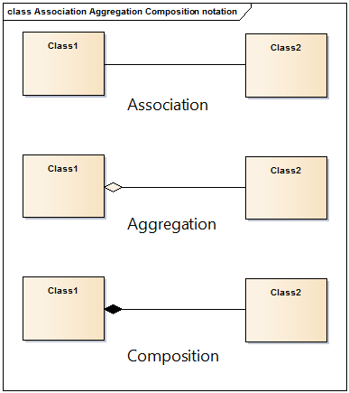

Unidad 1: Lenguaje C
=======================

Introducción
--------------

Para poder abordar el curso de sistemas operativos con un enfoque
práctico necesitamos aprender un nuevo lenguaje de programación
llamado lenguaje C. Este lenguaje resulta muy apropiado para nuestros
propósitos por su gran cercanía con los conceptos que estudiaremos.

C en un lenguaje fácil de aprender y muy poderoso. En pocas semanas
estarás programando en este lenguaje.

Propósito de aprendizaje
***************************

Aplicar el lenguaje de programación C en la solución de problemas
simples haciendo uso de variables, estructuras de control, punteros,
estructuras de datos, funciones y archivo.

Trayecto de actividades
----------------------------

Sesión 1
*************
(Tiempo estimado: 1 hora 40 minutos)

Ejercicio 1: Introducción a Git y GitHub 
^^^^^^^^^^^^^^^^^^^^^^^^^^^^^^^^^^^^^^^^^^^^^

.. toctree::
    :maxdepth: 1

    Introducción a Git y GitHub <./introGit>

Trabajo autónomo 1
*********************
(Tiempo estimado: 2 horas 50 minutos)

Ejercicio 2: terminar y darle una segunda pasada a la sesión 1
^^^^^^^^^^^^^^^^^^^^^^^^^^^^^^^^^^^^^^^^^^^^^^^^^^^^^^^^^^^^^^^^^

Termina la guía de introducción a Git y GitHub y dale una segunda pasada. 

Ejercicio 3: entorno de trabajo
^^^^^^^^^^^^^^^^^^^^^^^^^^^^^^^^^

Para poder trabajar en los ejercicios vas a necesitar un ambiente de trabajo basado en Linux.

Te voy a pedir que le des una mirada a  `este video <https://youtu.be/ZPpo-uViT_o>`__ para 
que te hagas una idea de qué es Linux.

Hay varias opciones para tener Linux funcionando en tu computador: lo puedes instalar en una 
memoria, en una partición de tu computador, en una máquina virtual o incluso en 
`WSL2 <https://docs.microsoft.com/en-us/windows/wsl/install-win10>`__.

La opción que te voy a recomendar es instalar el sistema operativo en una memoria USB externa.

Vas a necesitar dos memorias USB. Una grande (> 16GB), donde instalarás tu sistema operativo
y otra más pequeña (8GB) donde grabaras el instalador. Trata de utilizar la USB más rápida y
más grande para instalar tu sistema operativo.

Te voy a dejar unos videos de ayuda:

* Este `video <https://www.youtube.com/watch?v=zSGZe8NSEAc>`__ 
  te muestra como grabar en la USB pequeña el instalador. En este caso la distribución es PopOS,
  es la misma que yo uso; sin embargo, puedes grabar la que más te guste, por ejemplo Ubuntu.
  Ten presente que la versión del video no será la última. También, debes investigar
  cómo entrar al menú de configuración de tu BIOS para que ajustes el orden de boot. 
  Nota que debes darle prioridad a la USB para que al tenerla conectada arranques el 
  instalador del sistema operativo.

* Ahora, este video `video <https://www.youtube.com/watch?v=RR9Vgytjj24>`__ te mostrará
  cómo instalar, usando la USB pequeña con el instalador, tu sistema operativo en la USB grande.
  Te recomiendo iniciar a ver el video en el minuto 6:29, donde comienza en si el proceso
  de instalación. Una vez termines de instalar Linux en la USB grande, NO OLVIDES desconectar la USB
  pequeña para que tu computador inicie con la versión instalada de Linux en la USB grande.

* Si tu computador no arranca en Linux debes reiniciarlo y entrar el menu de boot (debes indagar 
  cómo hacerlo en tu computador) y seleccionar Linux.

Si lo anterior no te funciona, prueba con una `máquina virtual <https://youtu.be/tNUgLsXD7xg>`__ o con WSL2.
Ten presente que las versiones de los videos pueden no coincidir con las versiones actuales.

Ejercicio 4: instala las herramientas 
^^^^^^^^^^^^^^^^^^^^^^^^^^^^^^^^^^^^^^

Una vez tengas Linux funcionando debes instalar unas cuentas herramientas:

Abren la terminal y ejecuta los comandos:

.. code-block:: bash

    $ sudo apt update
    $ sudo apt install build-essential
    $ sudo apt install gdb

Ejercicio 5: instala un par de entornos de desarrollo
^^^^^^^^^^^^^^^^^^^^^^^^^^^^^^^^^^^^^^^^^^^^^^^^^^^^^^

Para el curso te recomiendo que instales dos entornos de desarrollo:

#. `Eclipse <https://www.eclipse.org/downloads/packages/>`__
#. `Visual Studio Code <https://code.visualstudio.com/>`__

Eclipse te permitirá tener un depurador visual de código, pero la verdad
es un poco lento. Visual Studio, no tiene un depurador visual tan rico, pero es
muy liviano. Yo uso ambos. Normalmente trabajo con Visual Studio Code y cuando
algo no me funciona lo pruebo con Eclipse.

Sesión 2
*************
(Tiempo estimado: 1 hora 40 minutos)

En esta sesión vas a trabajar con el profe en un taller guiado 
introductorio al lenguaje de programación. Aprenderás a compilar programas y 
explorarás el concepto de puntero.

Trabajo autónomo 2
*********************
(Tiempo estimado: 2 horas 50 minutos)

Ejercicio 6: lenguaje de programación C
^^^^^^^^^^^^^^^^^^^^^^^^^^^^^^^^^^^^^^^^

Este será uno de los ejercicios más largos de la unidad porque vamos a introducir 
el lenguaje de programación con el cual estudiaremos todos los conceptos del curso: ``C``.

.. toctree::
    :maxdepth: 3

    Introducción a C <./introC>

Sesión 3
*************
(Tiempo estimado: 1 hora 40 minutos)

En esta sesión vas a continuar trabajando con el ejercicio 6.

Trabajo autónomo 3
*********************
(Tiempo estimado: 2 horas 50 minutos)

Continuarás avanzando con el ejercicio 6.

Sesión 4
*************
(Tiempo estimado: 1 hora 40 minutos)

En esta sesión vas a continuar trabajando con el ejercicio 6.

Trabajo autónomo 4
*********************
(Tiempo estimado: 2 horas 50 minutos)

Continuarás avanzando con el ejercicio 6.

Sesión 5
*************
(Tiempo estimado: 1 hora 40 minutos)

En esta sesión terminarás el ejercicio 6.

Trabajo autónomo 5
*********************
(Tiempo estimado: 2 horas 50 minutos)

Prepárate para la sesión de RETOS antes de la evaluación. Revisa 
el material que llevamos hasta hoy, insiste con los ejercicios 
que más dificultad te dieron.

Sesión 6
*************
(Tiempo estimado: 1 hora 40 minutos)

Ejercicio 7: RETO 
^^^^^^^^^^^^^^^^^^

Clona este `este <https://github.com/juanferfranco/evaluacionUnidad1-2021-20>`__ 
repositorio.

Crea un programa que lea información de un archivo de entrada 
la procese y luego almacene el resultado en un archivo de salida. 

El programa se debe ejecutar en la línea de comandos así:

.. code-block:: bash

    $ ./main pathInFileName pathOutFileName

* ``main`` es el nombre del archivo ejecutable.
* pathInFileName y pathOutFileName son dos cadenas con el path absoluto o 
  relativo a los archivos de entrada y de salida respectivamente.

En los archivos que clonaste implementa las siguientes características:

* feature1: lee la primer línea del archivo de entrada y la escribe en 
  la primer línea del archivo de salida.
* feature2: lee la segunda línea del archivo de entrada, invierte su orden y 
  la escribe en la segunda línea del archivo de salida.
* feature3: lee el arreglo de enteros de la tercera línea del archivo de entrada, calcula la suma y 
  almacena el resultado en la tercera línea del archivo de salida.
* feature4: lee el arreglo de enteros de la cuarta línea del archivo de entrada así como la operación 
  especificada luego del arreglo.
* feature5: recibe la dirección del arreglo y de la operación leída en la feature anterior 
  realiza la operación y guarda el resultado en la cuarta línea del archivo de salida. 
  La operación puede ser avg, max, min correspondientes al promedio, 
  máximo o mínimo. TODOS los resultados deben ser ENTEROS, NO en punto flotante.
* feature6: lee la quinta línea del archivo de entrada y con esta información debes configurar los valores 
  de la siguiente estructura de datos cuya dirección se pasará a la función.

  .. code-block:: c 

      struct Obj_t{
        char *nombre;
        int cedula;
      };

* feature7: recibe la dirección en memoria de la estructura anterior y la guarda en la quinta línea del 
  archivo de salida primero la cédula, seguido por una coma y finalizando con el nombre.
* feature8: lee la sexta línea del archivo de entrada que contiene un número entero positivo que especifica 
  la cantidad de cursos que un estudiante cursó en un semestre. Luego solicita al usuario ingresar el nombre 
  del curso, los créditos y la nota así:

  .. code-block:: bash

    ingresa el curso 1: curso,créditos,nota
    ingresa el curso 2: curso,créditos,nota
    .
    .
    .
    ingresa el curso n: curso, créditos,nota

  La función debe devolver la dirección en memoria de una arreglo de estructuras de datos con la información 
  de cada curso y la el tamaño del arreglo.

* feature9: finalmente, calcula el `promedio ponderado <https://en.wikipedia.org/wiki/Weighted_arithmetic_mean>`__ 
  del semestre. Pregunta al usuario si desea almacenar la información la información en el archivo de salida así:

  .. code-block:: bash

    deseas almacenar la información (s) o (n):
  
  Si el usuario contesta n, debes guardar en la línea 6 del archivo de salida el promedio ponderado. Si el usuario 
  contesta y, debes guardar, desde la línea 6 del archivo de salida, la información ingresada así:
  
  .. code-block:: bash

      curso,créditos,nota
      curso,créditos,nota
      .
      .
      .
      curso,créditos,nota
      promedio ponderado: valor_calculado

* feature10: libera correctamente TODA la memoria reservada y cierra todos 
  los archivos abiertos.

Trabajo autónomo 6
*********************
(Tiempo estimado: 2 horas 50 minutos)

Termina el reto de la sesión. En la sesión del lunes resolveremos dudas 
de la unidad 1 y del reto.

.. warning:: ¡ALERTA DE SPOILER!

    Te muestro ahora una posible solución al reto.

  
main.c:

.. code-block:: c

  #include <stdio.h>
  #include <stdlib.h>
  #include "student.h"

  int main(int argc, char *argv[]){

      if(argc != 3){
          printf("number of arguments is not 3\n");
          return(EXIT_FAILURE);
      }

      FILE *fin = fopen(argv[1],"r");
      if (fin == NULL){
          perror("open fin file fails: ");
          return(EXIT_FAILURE);
      }

      FILE *fout = fopen(argv[2],"w");
      if (fout == NULL){
          perror("open fout file fails: ");
          return(EXIT_FAILURE);
      }

      feature1(fin,fout);
      feature2(fin,fout);
      feature3(fin,fout);

      int *parr = NULL;
      int length = 0;
      char *op = NULL;
      feature4(fin,&parr,&length,&op);
      feature5(fout, parr, length, op);

      struct Obj_t obj = {"test",123};
      feature6(fin, &obj);
      feature7(fout,&obj);

      struct _courseInfo_t *pobj;
      int objArrSize = 0;
      feature8(fin, &pobj, &objArrSize);

      for(int i= 0;i<objArrSize;i++){
          printf("%s,%d,%.1f\n",pobj[i].name, pobj[i].credits, pobj[i].grade);
      }
      feature9(fout, pobj,objArrSize);
      // feature10: release memory
      free(parr);
      free(op);
      free(obj.nombre);
      free(pobj);

      fclose(fin);
      fclose(fout);
      return EXIT_SUCCESS;
  }

student.c:

.. code-block:: c

  #include <stdlib.h>
  #include "student.h"
  #include "string.h"

  void feature1(FILE *fin, FILE *fout){
      char dataBuffer[1024];
      char *status = fgets(dataBuffer,sizeof(dataBuffer),fin);
      if(status == NULL){
          printf("Fails to read fin file\n");
          return;
      }
      fprintf(fout, "%s",dataBuffer);
  }

  void feature2(FILE *fin, FILE *fout){
      char dataBuffer[1024];
      char *status = fgets(dataBuffer,sizeof(dataBuffer),fin);
      if(status == NULL){
          printf("Fails to read fin file\n");
          return;
      }

      if(dataBuffer[strlen(dataBuffer) - 1 ]  == '\n'){
          dataBuffer[strlen(dataBuffer) - 1] = 0;

          for(int i = strlen(dataBuffer)-1; i>= 0; i--){
              fputc(dataBuffer[i],fout);
          }
          fputc('\n',fout);
      }
      else{
          printf("Fails to read fin file. The line does not end with enter\n");
      }
  }

  void feature3(FILE *fin, FILE *fout){
      char dataBuffer[128];
      
      char *status = fgets(dataBuffer,sizeof(dataBuffer),fin);
      if(status == NULL){
          printf("Fails to read fin file\n");
          return;
      }

      if(dataBuffer[strlen(dataBuffer) - 1 ]  == '\n'){
          dataBuffer[strlen(dataBuffer) - 1] = 0;

          char *token;
          int counter = 0;
          token = strtok(dataBuffer," ");
          int arr[64];
          
          while( token != NULL ) {
              int status = sscanf(token,"%d",&arr[counter]);
              counter++;
              token = strtok(NULL," ");
          }
          int sum = 0;
          for(int i= 0; i < counter;i++){
              sum = sum + arr[i];
          }
          fprintf(fout, "%d\n",sum);
      }
      else{
          printf("Fails to read fin file. The line does not end with enter\n");
      }
  }

  void feature4(FILE *fin, int **parr, int *length, char **op){
      char dataBuffer[128];
      char *status = fgets(dataBuffer,sizeof(dataBuffer),fin);
      if(status == NULL){
          printf("Fails to read fin file\n");
          return;
      }

      if(dataBuffer[strlen(dataBuffer) - 1 ]  == '\n'){
          dataBuffer[strlen(dataBuffer) - 1] = 0;

          char *token;
          int counter = 0;
          token = strtok(dataBuffer," ");

          // CLAVE: crear el objeto
          int *pint = malloc(sizeof(int)*64);
          char *operation = malloc(sizeof(char)*8);
  

          while( token != NULL ) {
              int status = sscanf(token,"%d", (pint+counter) );
              if(status == 1){
                  counter++;
              }
              else{
                  sscanf(token,"%s",operation);    
              }
              token = strtok(NULL," ");
          }
          
          *parr = pint;
          *length = counter;
          *op = operation;
      }
      else{
          printf("Fails to read fin file. The line does not end with enter\n");
      }
  }

  void feature5(FILE *fout, int *parr, int length, char *op){

      int result = 0;

      if(strncmp("avg", op, sizeof("avg")) == 0){
          int avg = 0;
          for(int i = 0; i < length;i++){
              avg = avg + parr[i];
          }
          result = avg/length;
      }
      else if(strncmp("max", op, sizeof("max")) == 0){
          int max = parr[0];
          for(int i = 0; i < length;i++){
              if(parr[i] > max) max = parr[i];
          }
          result = max;
      }
      else if(strncmp("min", op, sizeof("min")) == 0){
          int min = parr[0];
          for(int i = 0; i < length;i++){
              if(parr[i] < min) min = parr[i];
          }
          result = min;
      }

      fprintf(fout,"%d\n", result); 
  }

  void feature6(FILE *fin, struct Obj_t *pobj){
      char dataBuffer[128];

      char *status = fgets(dataBuffer,sizeof(dataBuffer),fin);
      if(status == NULL){
          printf("Fails to read fin file\n");
          return;
      }

      if(dataBuffer[strlen(dataBuffer) - 1 ]  == '\n'){
          dataBuffer[strlen(dataBuffer) - 1] = 0;

          // CLAVE: crear el objeto
          //char *nombre = malloc(sizeof(int)*64);
          char *nombre = calloc(64,sizeof(int));

          char *token = NULL;
          token = strtok(dataBuffer,",");
          if(token != NULL){
              strncpy(nombre, token, strlen(token) );
              token = strtok(NULL,",");
              if(token != NULL){
                  int res = sscanf(token,"%d",&(pobj->cedula));
                  if(res != 1){
                      printf("sscanf cedula fails");
                  }
                  else{
                      pobj->nombre = nombre;
                  }
              }
              else{
                  printf("strtok fails in cedula");
              }
          }
          else{
              printf("strtok fails in name");
          }
      }
      else{
          printf("Fails to read fin file. The line does not end with enter\n");
      }
  }

  void feature7(FILE *fout, struct Obj_t *pobj){
      fprintf(fout, "%d,%s\n",pobj->cedula,pobj->nombre);
  }

  void feature8(FILE *fin, struct _courseInfo_t **pobj,int *length){

      int numberOfCourse = 0;
      int status = fscanf(fin, "%d",&numberOfCourse);

      if(status == 1){
          struct _courseInfo_t *pcourse = malloc(sizeof(struct _courseInfo_t)*numberOfCourse);
          printf("Enter the information of your %d course like this: course,credits,grade\n",numberOfCourse);

          int i = 0;

          while(i < numberOfCourse){
              printf("Enter the course %d: ",i+1);
                  
              int status = scanf("%[^,],%d,%f%*c", pcourse[i].name, &pcourse[i].credits, &pcourse[i].grade);
              if(status != 3){
                  printf("(%d)(%s)fscanf fails to read course,credits,grade\n",status,pcourse[i].name);
              }
              else{
                  i++;
              }           
          }
          *pobj = pcourse;
          *length = numberOfCourse;
      }
      else{
          printf("fscanf fails to read number of courses\n");
      }
  }

  void feature9(FILE *fout, struct _courseInfo_t *pobj,int length){
      float avgGrade = 0;
      int totalCredits = 0;

      for(int i = 0; i < length; i++){
          avgGrade = avgGrade + pobj[i].grade*pobj[i].credits;
          totalCredits = totalCredits + pobj[i].credits;
      }
      avgGrade = avgGrade/totalCredits;
      printf("Save info? (y) (n): ");
      int answare = fgetc(stdin);
      if(answare == 'y'){
          for(int i = 0; i < length; i++){
              fprintf(fout,"%s,%d,%.1f\n", pobj[i].name,pobj[i].credits,pobj[i].grade);
          }
      }
      fprintf(fout,"%.1f",avgGrade);
  }

Sesión 7
*************
(Tiempo estimado: 1 hora 40 minutos)

Vas a realizar la evaluación 1 de la Unidad 1.

Trabajo autónomo 7 
*******************
(Tiempo estimado: 2 horas 50 minutos)

Continua trabajando en la evaluación 1

Sesión 8 
**********
(Tiempo estimado: 1 hora 40 minutos)

Continua trabajando en la evaluación 1

Trabajo autónomo 8 
********************
(Tiempo estimado: 2 horas 50 minutos)

Termina la evaluación 1.

Sesión 9
*********
(Tiempo estimado: 1 hora 40 minutos)

Ejercicio 8: revisión de la evaluación 
^^^^^^^^^^^^^^^^^^^^^^^^^^^^^^^^^^^^^^^^^^

Te dejaré en `este <https://github.com/juanferfranco/osev1-u1-2022-10-feedback.git>`__ enlace una posible 
solución a la evaluación 1 de la Unidad 1. Tómate un momento para revisar y preguntar si tienes dudas.

Ejercicio 9: herramientas
^^^^^^^^^^^^^^^^^^^^^^^^^^

En este ejercicio comprenderás en detalle los pasos necesarios para transformar un programa 
escrito en lenguaje C a lenguaje de máquina.

.. toctree::
  :maxdepth: 3

  Herramientas <./tools>

Trabajo autónomo 9 
*******************
(Tiempo estimado: 2 horas 50 minutos)

Termina el ejercicio 9.

Sesión 10
***********
(Tiempo estimado: 1 hora 40 minutos)

Ejercicio 10: memoria de un proceso
^^^^^^^^^^^^^^^^^^^^^^^^^^^^^^^^^^^^^

¿Recuerdas el concepto de proceso? Pues un proceso no es más que una abstracción 
que emplea el sistema operativo para ejecutar y administrar un programa en ejecución. 
Los programas están almacenados en archivos conocidos como object files. Para ejecutar 
un programa, el sistema operativo crea un proceso que ejecuta el object file, es decir, la CPU (o un
``core``) consumirá (fetch) y ejecutará las instrucciones del object file que estarán
almacenadas en alguna región de la memoria principal. Tu sabes también que los
programas en ejecución necesitarán memoria para almacenar las variables. Entonces
surge la siguiente pregunta ``¿Cómo es la memoria de un proceso y cuál es su estructura?``

Cuando el sistema operativo crea un proceso para ejecutar un programa, también
es necesario asignarle memoria y aplicarle una estructura particular. En casi todos
los sistemas operativos las estructura de memoria del proceso es más o menos la misma.
La memoria de un proceso está dividida en múltiples partes conocidas como segmentos:

* Block Started by Symbol (BSS) es el segmentos de datos no inicializados.
* Data.
* Text segment o segmento de código.
* Stack.
* Heaps.

Algunos de estos segmentos se crean con la información almacenada en el
object file mientras que otros segmentos aparecen al momento de ejecutar el programa.

Ejercicio 11: observar los segmentos del object file
^^^^^^^^^^^^^^^^^^^^^^^^^^^^^^^^^^^^^^^^^^^^^^^^^^^^

¿Cómo hacemos para ver el contenido de los segmentos de memoria provenientes del
object file?

Escribe el siguiente programa llamado main.c:

.. code-block:: c

    int main(int argc, char* argv[]) {

        return 0;
    }

Compila el programa con ``gcc -Wall main.c -o main``. Podrás observar el tamaño de 
algunos segmentos:

``size main`` 

.. code-block:: bash

    text	   data	    bss	    dec	    hex	filename
    1418	    544	      8	   1970	    7b2	main

Puedes observar tres segmentos: text, data y bss.

Ejercicio 12: ¿Qué se almacena en los segmentos?
^^^^^^^^^^^^^^^^^^^^^^^^^^^^^^^^^^^^^^^^^^^^^^^^^

Te estarás preguntado ¿Para qué sirve cada uno de los segmentos
que acabas de ver?

El segmento BSS denota la cantidad de memoria reservada para variables globales
que no se inicializaron o que se inicializan a 0.

Modifica el programa anterior así:

.. code-block:: c

    int var1;
    int var2;
    int var3 = 0;

    int main(int argc, char* argv[]) {

        return 0;
    }

De nuevo, compila y ejecuta ``size main``:

.. code-block:: bash

    text	   data	    bss	    dec	    hex	filename
    1418	    544	     16	   1978	    7ba	main

Compara esta salida con la anterior. ¿Notas un cambio en BSS?

Ejercicio 13: segmento data
^^^^^^^^^^^^^^^^^^^^^^^^^^^^^^^

Para analizar el segmento data te propongo modificar de nuevo nuestro programa:

.. code-block:: c

    int var1;
    int var2;
    int var3 = 0;
    int var4 = 69;
    int var5 = 666;

    int main(int argc, char* argv[]) {

        return 0;
    }

Compila y ejecuta ``size main``:

.. code-block:: bash

    text	   data	    bss	    dec	    hex	filename
    1418	    552	     16	   1986	    7c2	main

Compara, ¿El segmento data cambió? El segmento ``data`` entonces te sirve para almacenar
las variables inicializadas con valores diferentes de 0.

Ejercicio 14: variables estáticas 
^^^^^^^^^^^^^^^^^^^^^^^^^^^^^^^^^^

Modifica de nuevo el archivo:

.. code-block:: c

    int var1;
    int var2;
    int var3 = 0;
    int var4 = 69;
    int var5 = 666;

    void func(){
        static int i = 10;
        i++;
    }

    int main(int argc, char* argv[]) {
        func();
        return 0;
    }

Compila y ejecuta ``size main``:

.. code-block:: bash

    text	   data	    bss	    dec	    hex	filename
    1506	    556	     20	   2082	    822	main

Nota que los segmentos cambiaron de nuevo al incluir una nueva variable.

Ejercicio 15: ver el contenido del segmento .data
^^^^^^^^^^^^^^^^^^^^^^^^^^^^^^^^^^^^^^^^^^^^^^^^^^^

¿Cómo hago para ver el contenido del segmento data?

Toma como referencia el programa anterior y escribe el comando ``objdump -s -j .data main``

.. code-block:: bash

    main:     file format elf64-x86-64

    Contents of section .data:
    4000 00000000 00000000 08400000 00000000  .........@......
    4010 45000000 9a020000                    E....... 

¿Puedes ver efectivamente el contenido? observa los valores iniciales de ``var4`` y ``var5`` en
el programa. Ten presente que ``4000`` y ``4010`` son direcciones. El resto de información
es datos, cada file muestra 16 bytes (máximo) y luego se ve la representación de cada byte en ASCII.

Ejercicio 16: ver el contenido del segmento de texto
^^^^^^^^^^^^^^^^^^^^^^^^^^^^^^^^^^^^^^^^^^^^^^^^^^^^^

En el segmento de texto está contenido todo el código de máquina del programa producido por
el compilador.

¿Cómo puedes ver el contenido?

Ejecuta ``objdump -S main``

Podrás observar el código de máquina y la representación simbólica en lenguaje ensamblador.

Ejercicio 17: contenido del stack y del heap
^^^^^^^^^^^^^^^^^^^^^^^^^^^^^^^^^^^^^^^^^^^^^

¿Cómo hacemos para ver el contenido de los segmentos stack y heap?

Solo podemos ver esta parte de la memoria cuando el programa esté en ejecución. Cuando
quieres ejecutar un object file, el sistema operativo crea un nuevo proceso e inicializa
su memoria. Los segmentos BSS, data y text son inicializados con la información que está en
el object file y, el stack y el heap se añaden y son modificados a medida que el código
del segmento text es leído por parte de la CPU.

Veamos un ejemplo:

.. code-block:: c

    #include <unistd.h> 
    int main(int argc, char* argv[]) {
        while (1) {
            sleep(1); 
        };

        return 0;
    }

Compila el código con ``gcc -Wall main.c -o main``

Y ahora ejecuta el programa así ``./main &`` para que quede en background y retomes
el control de la terminal para que puedas seguir escribiendo comandos. Ten en cuenta
que el número que te aparece en la terminal al ejecutar el programa es el ``pid`` o
identificador del proceso en el sistema operativo:

.. code-block:: bash

    juanfranco@pop-os:/tmp/linker$ ./main &
    [1] 295236

Más tarde cuando quieras matar el proceso escribe en la terminal 
``kill -9 295236``.

En Linux puedes consultar información del proceso en el directorio ``/proc`` allí tendrás
una entrada para el proceso identificada con el pid del mismo.

Ejecuta el comando ``ls -al /proc/295236``:

.. code-block:: bash

    total 0
    dr-xr-xr-x   9 juanfranco juanfranco 0 Sep 21 14:17 .
    dr-xr-xr-x 714 root       root       0 Sep 18 07:13 ..
    -r--r--r--   1 juanfranco juanfranco 0 Sep 21 15:12 arch_status
    dr-xr-xr-x   2 juanfranco juanfranco 0 Sep 21 15:12 attr
    -rw-r--r--   1 juanfranco juanfranco 0 Sep 21 15:12 autogroup
    -r--------   1 juanfranco juanfranco 0 Sep 21 15:12 auxv
    -r--r--r--   1 juanfranco juanfranco 0 Sep 21 15:12 cgroup
    --w-------   1 juanfranco juanfranco 0 Sep 21 15:12 clear_refs
    -r--r--r--   1 juanfranco juanfranco 0 Sep 21 14:17 cmdline
    -rw-r--r--   1 juanfranco juanfranco 0 Sep 21 15:12 comm
    -rw-r--r--   1 juanfranco juanfranco 0 Sep 21 15:12 coredump_filter
    -r--r--r--   1 juanfranco juanfranco 0 Sep 21 15:12 cpuset
    lrwxrwxrwx   1 juanfranco juanfranco 0 Sep 21 15:12 cwd -> /tmp/linker
    -r--------   1 juanfranco juanfranco 0 Sep 21 15:12 environ
    lrwxrwxrwx   1 juanfranco juanfranco 0 Sep 21 14:17 exe -> /tmp/linker/main
    dr-x------   2 juanfranco juanfranco 0 Sep 21 15:12 fd
    dr-x------   2 juanfranco juanfranco 0 Sep 21 15:12 fdinfo
    -rw-r--r--   1 juanfranco juanfranco 0 Sep 21 15:12 gid_map
    -r--------   1 juanfranco juanfranco 0 Sep 21 15:12 io
    -r--r--r--   1 juanfranco juanfranco 0 Sep 21 15:12 limits
    -rw-r--r--   1 juanfranco juanfranco 0 Sep 21 15:12 loginuid
    dr-x------   2 juanfranco juanfranco 0 Sep 21 15:12 map_files
    -r--r--r--   1 juanfranco juanfranco 0 Sep 21 15:12 maps
    -rw-------   1 juanfranco juanfranco 0 Sep 21 15:12 mem
    -r--r--r--   1 juanfranco juanfranco 0 Sep 21 15:12 mountinfo
    -r--r--r--   1 juanfranco juanfranco 0 Sep 21 15:12 mounts
    -r--------   1 juanfranco juanfranco 0 Sep 21 15:12 mountstats
    dr-xr-xr-x   5 juanfranco juanfranco 0 Sep 21 15:12 net
    dr-x--x--x   2 juanfranco juanfranco 0 Sep 21 15:12 ns
    -r--r--r--   1 juanfranco juanfranco 0 Sep 21 15:12 numa_maps
    -rw-r--r--   1 juanfranco juanfranco 0 Sep 21 15:12 oom_adj
    -r--r--r--   1 juanfranco juanfranco 0 Sep 21 15:12 oom_score
    -rw-r--r--   1 juanfranco juanfranco 0 Sep 21 15:12 oom_score_adj
    -r--------   1 juanfranco juanfranco 0 Sep 21 15:12 pagemap
    -r--------   1 juanfranco juanfranco 0 Sep 21 15:12 patch_state
    -r--------   1 juanfranco juanfranco 0 Sep 21 15:12 personality
    -rw-r--r--   1 juanfranco juanfranco 0 Sep 21 15:12 projid_map
    lrwxrwxrwx   1 juanfranco juanfranco 0 Sep 21 15:12 root -> /
    -rw-r--r--   1 juanfranco juanfranco 0 Sep 21 15:12 sched
    -r--r--r--   1 juanfranco juanfranco 0 Sep 21 15:12 schedstat
    -r--r--r--   1 juanfranco juanfranco 0 Sep 21 15:12 sessionid
    -rw-r--r--   1 juanfranco juanfranco 0 Sep 21 15:12 setgroups
    -r--r--r--   1 juanfranco juanfranco 0 Sep 21 15:12 smaps
    -r--r--r--   1 juanfranco juanfranco 0 Sep 21 15:12 smaps_rollup
    -r--------   1 juanfranco juanfranco 0 Sep 21 15:12 stack
    -r--r--r--   1 juanfranco juanfranco 0 Sep 21 14:17 stat
    -r--r--r--   1 juanfranco juanfranco 0 Sep 21 15:12 statm
    -r--r--r--   1 juanfranco juanfranco 0 Sep 21 15:11 status
    -r--------   1 juanfranco juanfranco 0 Sep 21 15:12 syscall
    dr-xr-xr-x   3 juanfranco juanfranco 0 Sep 21 15:12 task
    -r--r--r--   1 juanfranco juanfranco 0 Sep 21 15:12 timers
    -rw-rw-rw-   1 juanfranco juanfranco 0 Sep 21 15:12 timerslack_ns
    -rw-r--r--   1 juanfranco juanfranco 0 Sep 21 15:12 uid_map
    -r--r--r--   1 juanfranco juanfranco 0 Sep 21 15:12 wchan

Cada una de estas entradas corresponde a una característica del proceso.

Para preguntar por el mapa de memoria del proceso ejecuta: ``cat /proc/295236/maps``:

.. code-block:: bash

    563fa1aeb000-563fa1aec000 r--p 00000000 08:03 8393449                    /tmp/linker/main
    563fa1aec000-563fa1aed000 r-xp 00001000 08:03 8393449                    /tmp/linker/main
    563fa1aed000-563fa1aee000 r--p 00002000 08:03 8393449                    /tmp/linker/main
    563fa1aee000-563fa1aef000 r--p 00002000 08:03 8393449                    /tmp/linker/main
    563fa1aef000-563fa1af0000 rw-p 00003000 08:03 8393449                    /tmp/linker/main
    7f28fb8f9000-7f28fb91e000 r--p 00000000 08:03 1049202                    /usr/lib/x86_64-linux-gnu/libc-2.31.so
    7f28fb91e000-7f28fba96000 r-xp 00025000 08:03 1049202                    /usr/lib/x86_64-linux-gnu/libc-2.31.so
    7f28fba96000-7f28fbae0000 r--p 0019d000 08:03 1049202                    /usr/lib/x86_64-linux-gnu/libc-2.31.so
    7f28fbae0000-7f28fbae1000 ---p 001e7000 08:03 1049202                    /usr/lib/x86_64-linux-gnu/libc-2.31.so
    7f28fbae1000-7f28fbae4000 r--p 001e7000 08:03 1049202                    /usr/lib/x86_64-linux-gnu/libc-2.31.so
    7f28fbae4000-7f28fbae7000 rw-p 001ea000 08:03 1049202                    /usr/lib/x86_64-linux-gnu/libc-2.31.so
    7f28fbae7000-7f28fbaed000 rw-p 00000000 00:00 0 
    7f28fbb0b000-7f28fbb0c000 r--p 00000000 08:03 1049197                    /usr/lib/x86_64-linux-gnu/ld-2.31.so
    7f28fbb0c000-7f28fbb2f000 r-xp 00001000 08:03 1049197                    /usr/lib/x86_64-linux-gnu/ld-2.31.so
    7f28fbb2f000-7f28fbb37000 r--p 00024000 08:03 1049197                    /usr/lib/x86_64-linux-gnu/ld-2.31.so
    7f28fbb38000-7f28fbb39000 r--p 0002c000 08:03 1049197                    /usr/lib/x86_64-linux-gnu/ld-2.31.so
    7f28fbb39000-7f28fbb3a000 rw-p 0002d000 08:03 1049197                    /usr/lib/x86_64-linux-gnu/ld-2.31.so
    7f28fbb3a000-7f28fbb3b000 rw-p 00000000 00:00 0 
    7ffdd8feb000-7ffdd900c000 rw-p 00000000 00:00 0                          [stack]
    7ffdd9183000-7ffdd9186000 r--p 00000000 00:00 0                          [vvar]
    7ffdd9186000-7ffdd9187000 r-xp 00000000 00:00 0                          [vdso]
    ffffffffff600000-ffffffffff601000 --xp 00000000 00:00 0                  [vsyscall]

Observa cada línea. Tomemos por ejemplo la primera:

``563fa1aeb000-563fa1aec000 r--p 00000000 08:03 8393449                    /tmp/linker/main``

Primero tienes un rango de direcciones: ``563fa1aeb000-563fa1aec000`` en ese 
rango tienes mapeada información del object file ``/tmp/linker/main``. Después del 
rango de direcciones encuentras los permisos: r se puede leer, w modificar, x ejecutar, p para
indicar si la región de memoria es privada o compartida con otro procesos (s). Si la región
está mapeada a un archivo, lo que sigue es el offset en el archivo. Si la región está mapeada
a un archivo verás el identificador del dispositivo (08:03) donde está el archivo. Luego aparece
el inode (lo vemos luego). Y finalmente el path del archivo que está mapeado a esta región. También
puedes ver un espacio en blanco o el propósito de la región, por ejemplo [stack] para indicar
que es una región utilizada para implementar el segmento de stack.

Ejercicio 18: stack
^^^^^^^^^^^^^^^^^^^^^^^^

Profundicemos un poco más en el stack.

¿Recuerdas qué se almacena en el stack?

* Variables locales que no sean estáticas.
* El ``stack frame`` cuando llamas una función. Allí se encuentra 
  la dirección a la que debe retornar el programa luego de llamar la función.
* Parámetros de entrada y salida de una función.

MUY MUY IMPORTANTE: 

* Al llamar un función, las variables que declares en el stack se van
  apilando, como si fueran una columna de platos. El puntero de pila se va ajustando siempre
  el TOP del stack; sin embargo, cuando retornes de la función el puntero de pila se ajustará
  nuevamente a la base de la columna de platos (las variables). Los datos de las variables 
  locales siguen allí pero en cualquier momento pueden ser destruidos al llamar otra función 
  o al producirse una interrupción. Las interrupciones interrumpen el flujo de instrucciones,
  para ejecutar un nuevo flujo conocido como servicio de atención a la interrupción, y hacen
  uso del stack para almacenar temporalmente parte del contexto de la CPU. EN CONCLUSIÓN: una
  vez retornes de una función NO PUEDES contar con las variables locales (¡Murieron!).

* Como el stack no es tan grande comparado con el HEAP debes evitar llamados recursivos
  infinitos para evitar desbordar su capacidad.

¿Cómo puedes ver el contenido del stack? Necesitas un depurador (un debugger).

Ejercicio 19: el heap
^^^^^^^^^^^^^^^^^^^^^^^

Profundicemos un poco más en el heap.

Considera el siguiente código:

.. code-block:: c

    #include <unistd.h>
    #include <stdlib.h> 
    #include <stdio.h> 
    
    int main(int argc, char* argv[]) {
        void* ptr = malloc(1024); 
        printf("Address: %p\n", ptr);
    
        while (1) {
            sleep(1); 
        };
        
        return 0;
    }

Compila y ejecuta:

.. code-block:: bash

    ./main &
    [2] 321982
    Address: 0x55f05576b2a0

Ahora ejecuta de nuevo ``cat /proc/321982/maps`` (nota que estamos usando el pid del nuevo
proceso):

.. code-block:: bash

    55f054ece000-55f054ecf000 r--p 00000000 08:03 8394826                    /tmp/linker/main
    55f054ecf000-55f054ed0000 r-xp 00001000 08:03 8394826                    /tmp/linker/main
    55f054ed0000-55f054ed1000 r--p 00002000 08:03 8394826                    /tmp/linker/main
    55f054ed1000-55f054ed2000 r--p 00002000 08:03 8394826                    /tmp/linker/main
    55f054ed2000-55f054ed3000 rw-p 00003000 08:03 8394826                    /tmp/linker/main
    55f05576b000-55f05578c000 rw-p 00000000 00:00 0                          [heap]
    7f4b21bb2000-7f4b21bd7000 r--p 00000000 08:03 1049202                    /usr/lib/x86_64-linux-gnu/libc-2.31.so
    7f4b21bd7000-7f4b21d4f000 r-xp 00025000 08:03 1049202                    /usr/lib/x86_64-linux-gnu/libc-2.31.so
    7f4b21d4f000-7f4b21d99000 r--p 0019d000 08:03 1049202                    /usr/lib/x86_64-linux-gnu/libc-2.31.so
    7f4b21d99000-7f4b21d9a000 ---p 001e7000 08:03 1049202                    /usr/lib/x86_64-linux-gnu/libc-2.31.so
    7f4b21d9a000-7f4b21d9d000 r--p 001e7000 08:03 1049202                    /usr/lib/x86_64-linux-gnu/libc-2.31.so
    7f4b21d9d000-7f4b21da0000 rw-p 001ea000 08:03 1049202                    /usr/lib/x86_64-linux-gnu/libc-2.31.so
    7f4b21da0000-7f4b21da6000 rw-p 00000000 00:00 0 
    7f4b21dc4000-7f4b21dc5000 r--p 00000000 08:03 1049197                    /usr/lib/x86_64-linux-gnu/ld-2.31.so
    7f4b21dc5000-7f4b21de8000 r-xp 00001000 08:03 1049197                    /usr/lib/x86_64-linux-gnu/ld-2.31.so
    7f4b21de8000-7f4b21df0000 r--p 00024000 08:03 1049197                    /usr/lib/x86_64-linux-gnu/ld-2.31.so
    7f4b21df1000-7f4b21df2000 r--p 0002c000 08:03 1049197                    /usr/lib/x86_64-linux-gnu/ld-2.31.so
    7f4b21df2000-7f4b21df3000 rw-p 0002d000 08:03 1049197                    /usr/lib/x86_64-linux-gnu/ld-2.31.so
    7f4b21df3000-7f4b21df4000 rw-p 00000000 00:00 0 
    7fffc1d25000-7fffc1d46000 rw-p 00000000 00:00 0                          [stack]
    7fffc1dec000-7fffc1def000 r--p 00000000 00:00 0                          [vvar]
    7fffc1def000-7fffc1df0000 r-xp 00000000 00:00 0                          [vdso]
    ffffffffff600000-ffffffffff601000 --xp 00000000 00:00 0                  [vsyscall]

Mira el rango de direcciones del heap: ``55f05576b000-55f05578c000``, ahora observa la dirección
de ``ptr``: ``0x55f05576b2a0`` Ah! está en el rango, está en el heap.

Volvamos al programa. Considera esta línea: ``void* ptr = malloc(1024)`` ¿La variable ptr
en qué segmento está?

¿Qué pasa con la dirección de la región que reservamos una vez salgamos del ámbito en el cual
se declaró prt?

Y si perdemos la dirección ¿Qué pasa con esa memoria que reservamos? ¿Y qué pasa si esto
nos comienza a ocurrir mucho en nuestro programa?

¿Recuerdas cómo evitamos este desperdicio de memoria? (¿Cuál es la función que libera la reserva?)

No olvides que reservar y devolver la reserva de la memoria es tu responsabilidad cuando
trabajas en con lenguajes como C y C++. Otros implementaciones de lenguajes cuentan con un componente que 
se ejecuta concurrente a tu código y se denomina el garbage collector (por ejemplo C#). 
El garbage collector se encarga de liberar o devolver la reserva de memoria por nosotros.

Y ¿Cómo puedes hacer para detectar errores en la gestión de memoria? Puedes utilizar una herramienta
llamada valgrind.

Considera este programa:

.. code-block:: c

    #include <stdio.h>
    #include <stdlib.h>

    int main(int argc, char* argv[]) {
        char *ptr = malloc(20*sizeof(char));
        return 0;
    }

Compila el programa así: ``gcc -g -Wall main.c -o main``. Instala valgrind
con ``sudo apt install valgrind``. Corre el programa así: ``valgrind ./main``:

.. code-block:: none

    ==331725== Memcheck, a memory error detector
    ==331725== Copyright (C) 2002-2017, and GNU GPL'd, by Julian Seward et al.
    ==331725== Using Valgrind-3.15.0 and LibVEX; rerun with -h for copyright info
    ==331725== Command: ./main
    ==331725== 
    ==331725== 
    ==331725== HEAP SUMMARY:
    ==331725==     in use at exit: 20 bytes in 1 blocks
    ==331725==   total heap usage: 1 allocs, 0 frees, 20 bytes allocated
    ==331725== 
    ==331725== LEAK SUMMARY:
    ==331725==    definitely lost: 20 bytes in 1 blocks
    ==331725==    indirectly lost: 0 bytes in 0 blocks
    ==331725==      possibly lost: 0 bytes in 0 blocks
    ==331725==    still reachable: 0 bytes in 0 blocks
    ==331725==         suppressed: 0 bytes in 0 blocks
    ==331725== Rerun with --leak-check=full to see details of leaked memory
    ==331725== 
    ==331725== For lists of detected and suppressed errors, rerun with: -s
    ==331725== ERROR SUMMARY: 0 errors from 0 contexts (suppressed: 0 from 0)

Podrás observar en la sección LEAK SUMMARY que valgrind detectó un leak de 20 bytes.

¿Pero en dónde está el error?

Ejecuta ``valgrind --leak-check=full  ./main``

.. code-block:: none

    ==331978== Memcheck, a memory error detector
    ==331978== Copyright (C) 2002-2017, and GNU GPL'd, by Julian Seward et al.
    ==331978== Using Valgrind-3.15.0 and LibVEX; rerun with -h for copyright info
    ==331978== Command: ./main
    ==331978== 
    ==331978== 
    ==331978== HEAP SUMMARY:
    ==331978==     in use at exit: 20 bytes in 1 blocks
    ==331978==   total heap usage: 1 allocs, 0 frees, 20 bytes allocated
    ==331978== 
    ==331978== 20 bytes in 1 blocks are definitely lost in loss record 1 of 1
    ==331978==    at 0x483B7F3: malloc (in /usr/lib/x86_64-linux-gnu/valgrind/vgpreload_memcheck-amd64-linux.so)
    ==331978==    by 0x109165: main (main.c:5)
    ==331978== 
    ==331978== LEAK SUMMARY:
    ==331978==    definitely lost: 20 bytes in 1 blocks
    ==331978==    indirectly lost: 0 bytes in 0 blocks
    ==331978==      possibly lost: 0 bytes in 0 blocks
    ==331978==    still reachable: 0 bytes in 0 blocks
    ==331978==         suppressed: 0 bytes in 0 blocks
    ==331978== 
    ==331978== For lists of detected and suppressed errors, rerun with: -s
    ==331978== ERROR SUMMARY: 1 errors from 1 contexts (suppressed: 0 from 0)

Puedes ver que el error ocurrió en la línea 5 del programa ``main.c``. ¡Genial!

Ejercicio 20: corrección del memory leak
^^^^^^^^^^^^^^^^^^^^^^^^^^^^^^^^^^^^^^^^^^^^

¿Te animas a corregir el error del ejercicio anterior y verificar con valgrind que
todo esté bien?

Ejercicio 21: el debugger
^^^^^^^^^^^^^^^^^^^^^^^^^^^

¿Recuerdas que para poder ver el contenido del stack necesitas un debugger? Pues
vamos a probar uno. En este caso usaremos GDB. Escribe gdb en la terminal. Si el comando
no es reconocido, lo puedes instalar con ``sudo apt-get install build-essentials``.

Considera este programa:

.. code-block:: c

    #include <stdio.h>

    int main(int argc, char* argv[]) {
        char arr[14];
        
        arr[0] = 'C';
        arr[1] = 'o';
        arr[2] = 'n';
        arr[3] = 't';
        arr[4] = 'r';
        arr[5] = 'o';
        arr[6] = 'l';
        arr[7] = 'a';
        arr[8] = 'd';
        arr[9] = 'o';
        arr[10] = 'r';
        arr[11] = 'e';
        arr[12] = 's';
        arr[13] = 0;

        printf("arr: %s", arr);

        return 0;
    }

Compila el programa con ``gcc -g -Wall main.c -o main``. La opción ``-g`` le
dice al compilador que genere el ejecutable incluyendo información de depuración
en la tabla de símbolos. Esta información será usada posteriormente por GDB

Ejecuta el programa con GDB: ``gdb main``:

.. code-block:: bash

    GNU gdb (Ubuntu 9.1-0ubuntu1) 9.1
    Copyright (C) 2020 Free Software Foundation, Inc.
    License GPLv3+: GNU GPL version 3 or later <http://gnu.org/licenses/gpl.html>
    This is free software: you are free to change and redistribute it.
    There is NO WARRANTY, to the extent permitted by law.
    Type "show copying" and "show warranty" for details.
    This GDB was configured as "x86_64-linux-gnu".
    Type "show configuration" for configuration details.
    For bug reporting instructions, please see:
    <http://www.gnu.org/software/gdb/bugs/>.
    Find the GDB manual and other documentation resources online at:
        <http://www.gnu.org/software/gdb/documentation/>.

    For help, type "help".
    Type "apropos word" to search for commands related to "word"...
    Registered pretty printers for UE4 classes
    Reading symbols from main...
    (gdb) 

Observa que te aparecerá un nuevo prompt: ``(gdb)`` donde escribirás comandos
para GBD.

* Para comenzar la ejecución del programa escribe ``run``
* Coloca un breakpoint al iniciar la función main: ``break main``. El breakpoint le indica
  al depurador que debe tener la ejecución del proceso en ese punto.
* Escribe ``run``. Verás que la ejecución del programa se detiene en en la función
  main.
* Utiliza el comando ``n`` para ejecutar la siguiente línea de código.
* Imprime el contenido de la variable arr con ``print arr``.

La variable arr está en el stack. Puedes ver el contenido del stack con ``x/16x arr``. 
El comando es ``x`` pero además puedas indicar la cantidad de bytes (16) y el formato
(x para hexadecimal):

.. code-block:: bash

    (gdb) x/16x arr
    0x7fffffffdb8a:	0x43	0x6f	0x6e	0x74	0x72	0x6f	0x6c	0x61
    0x7fffffffdb92:	0x64	0x6f	0x72	0x65	0x73	0x00	0x00	0xcd
    (gdb)

Puedes ver el interpretados en ASCII de los valores:

.. code-block:: bash

    (gdb) x/16c arr
    0x7fffffffdb8a:	67 'C'	111 'o'	110 'n'	116 't'	114 'r'	111 'o'	108 'l'	97 'a'
    0x7fffffffdb92:	100 'd'	111 'o'	114 'r'	101 'e'	115 's'	0 '\000'	0 '\000'	-51 '\315'
    (gdb) 

Cambia el contenido del stack:

.. code-block:: bash

    (gdb) set arr[11] = 'a'
    (gdb) print arr
    $2 = "Controladoras"
    (gdb) x/16x arr
    0x7fffffffdb8a:	0x43	0x6f	0x6e	0x74	0x72	0x6f	0x6c	0x61
    0x7fffffffdb92:	0x64	0x6f	0x72	0x61	0x73	0x00	0x00	0xcd
    (gdb) x/16c arr
    0x7fffffffdb8a:	67 'C'	111 'o'	110 'n'	116 't'	114 'r'	111 'o'	108 'l'	97 'a'
    0x7fffffffdb92:	100 'd'	111 'o'	114 'r'	97 'a'	115 's'	0 '\000'	0 '\000'	-51 '\315'
    (gdb)

Trabajo autónomo 10 
********************
(Tiempo estimado: 2 horas 50 minutos)

Termina los ejercicios de la sesión 10.

Construye un programa que te permite visualizar cada uno de los segmentos 
de memoria de un proceso. Experimenta, adiciona más variables. NO OLVIDES 
usar GDB y valgrind.

Sesión 11
***********
(Tiempo estimado: 1 hora 40 minutos)

Ejercicio 22: el concepto de clase en C
^^^^^^^^^^^^^^^^^^^^^^^^^^^^^^^^^^^^^^^^

El siguiente ejemplo te mostrará una técnica para el manejo de la memoria dinámica
que le entrega la responsabilidad de reservar y liberar la memoria dinámica al
código definido en el archivo queue.c. Si analizas detenidamente podrás ver
que el código en queue.h y queue.c trata de implementar el concepto de ``CLASE`` que
ya conoces de otros lenguajes de programación.

queue.h:

.. code-block:: c 

    #ifndef _QUEUE_H
    #define _QUEUE_H

    typedef struct {
        int front;
        int rear;
        double* arr;
    } queue_t;

    queue_t* create(int size);
    void destroy(queue_t* this);
    int size(queue_t* this);
    void enqueue(queue_t* this, double item);
    double dequeue(queue_t* q);

    #endif

queue.c:

.. code-block:: c 

    #include "queue.h"
    #include <stdlib.h> 

    static void init(queue_t* this, int size) {
        this->front = 0;
        this->rear = 0;
        this->arr = (double*)malloc(size * sizeof(double));
    }

    queue_t* create(int size){
        queue_t* q = malloc(sizeof(queue_t));
        init(q,size);
        return(q);
    }

    void destroy(queue_t* this){
        free(this->arr);
        free(this);
    }

    int size(queue_t* this){
        return this->rear - this->front;
    }

    void enqueue(queue_t* this, double item) {
        this->arr[this->rear] = item;
        this->rear++;
    }
    
    double dequeue(queue_t* this) {
        double item = this->arr[this->front];
        this->front++;
        return item;
    }

main.c:

.. code-block:: c 

    #include <stdio.h> 
    #include "queue.h"

    int main(int argc, char** argv) {

        queue_t* q = create(10);
        enqueue(q, 6.5);
        enqueue(q, 1.3);
        enqueue(q, 2.4);
        printf("%f\n", dequeue(q));
        printf("%f\n", dequeue(q));
        printf("%f\n", dequeue(q));
        destroy(q);
        return 0;
    }

Para compilar este ejemplo sigue los siguientes pasos:

.. code-block:: bash

    gcc -c -g -Wall queue.c -o queue.o

    gcc -c -g -Wall main.c -o main.o

    gcc -g -Wall queue.o main.o -o exe

Ejecuta el código y verifica con valgrind el manejo de la memoria

.. code-block:: bash

    ./exe

    valgrind ./exe

¿Qué resultado obtienes?
¿En qué parte de la memoria está almacenada la variable q?
¿Explica cuánta memoria y dónde se está creando con la función create(10)?

Ejercicio 23: el concepto de objeto
^^^^^^^^^^^^^^^^^^^^^^^^^^^^^^^^^^^^

Ahora que conocemos más detalles de la memoria de un proceso y luego
del ejercicio anterior, ya tenemos buenas herramientas para hablar del
modelo de programación orientado a objetos.

Como te has dado cuenta hasta ahora, C no es un lenguaje de programación
orientado a objetos; sin embargo, te preguntarás ¿Es posible escribir 
programas orientados a objetos con C? La respuesta es si. El punto es que
en su sintaxis C no soporta los conceptos de clases, herencia y polimorfismo.
Aún así, es posible implementar estos conceptos de manera indirecta.

¿Y en últimas qué son los objetos?

Mira, no le demos vueltas conceptuales al asunto. Un objeto no es más que
un conjunto de datos en la memoria de un proceso. OJO: SON DATOS y están en la
MEMORIA DE UN PROCESO. Esto último es clave. Los objetos solo viven en tiempo
de ejecución.

Entonces cuando estoy escribiendo el programa hay objetos? NO, ese es el punto
precisamente que intento aclararte de entrada. Cuando escribes un programa orientado
a objetos, NO TIENES OBJETOS aún. Lo que defines es cómo serán esos objetos,
cómo se crearán, cuándo se crearán, cómo y cuándo se usarán y cómo y cuándo
se destruirán (en algunos lenguajes de programación). Es decir, tu programa
describe lo que pasará con los OBJETOS cuando lo ejecutes.

Te lo repito de nuevo: cuando programas orientado a objetos NO estás creando objetos.
Estás más bien indicando qué se debe hacer para crearlos cuando el programa se EJECUTE.

¿Claro lo anterior? Pregunta si no es claro.

Por lo anterior, es que existe el término DISEÑO ORIENTADO A OBJECTOS. Porque
cuando DISEÑAS un programa orientado a objetos te tienes qué imaginar cómo serán esos
OBJETOS, cuándo se crearán y cuáles serán las relaciones entre ellos cuando 
ejecutes el programa.

Ejercicio 24: concepto de mutabilidad e inmutabilidad
^^^^^^^^^^^^^^^^^^^^^^^^^^^^^^^^^^^^^^^^^^^^^^^^^^^^^^^^^

Profe, si yo pudiera ir a ver un objeto en memoria ¿Cómo se vería?

No lo olvides, en últimas, un objeto es una colección de bytes en la memoria. A esas 
posiciones de memoria que componen el objeto las denominamos ATRIBUTOS y al contenido
de esos atributos los llamamos EL ESTADO DEL OBJETO. 

Cuando puedes modificar los valor de los atributos de un objeto mientras el programa
corre se dice que el objeto es MUTABLE. Pero también el objeto puede ser INMUTABLE,
es decir, que una vez creado el objeto e inicializados sus atributos, no podrás cambiar
sus valores o su estado.

Ejercicio 25: concepto de relación entre objetos
^^^^^^^^^^^^^^^^^^^^^^^^^^^^^^^^^^^^^^^^^^^^^^^^^^^^

Ya te comenté que los objetos (colecciones de bytes) pueden estar relacionados entre
ellos. ¿Qué significa eso?

En términos muy generales, si dos objetos están relacionados, es posible que al modificar
el estado de uno de ellos se afecte el estado del otro. Ya en términos más concretos podemos
decir que un objeto está relacionado con otro cuando uno de sus atributos contiene la dirección
de memoria del otro objeto.

Ejercicio 26: el concepto de método
^^^^^^^^^^^^^^^^^^^^^^^^^^^^^^^^^^^^

No lo olvides, un objeto son bytes en memoria. Pero entonces, ¿Qué pasa con el código?

Parte de tus tareas al diseñar o PLANEAR un programa orientado a objetos es decir qué
OPERACIONES vas a realizar para crear los objetos (asignarles memoria), iniciar su estado
(¿Qué es eso?) (construirlos), destruirlos, leer y modificar su ESTADO. PERO, POR FAVOR,
no lo olvides, cuando estás escribiendo el programa estás MODELANDO tu solución,
tu programa es un PLAN que DESCRIBE lo que ocurrirá cuando sea ejecutado.

Ejercicio 27: relación estado-comportamiento
^^^^^^^^^^^^^^^^^^^^^^^^^^^^^^^^^^^^^^^^^^^^^

¿Cómo puedes definir la construcción de un objeto?

Lo puedes hacer de dos formas:

* Construyes un objeto vacío o con un conjuntos mínimo de atributos. A medida que el programa
  se ejecuta, se van añadiendo más atributos. A esta
  técnica se le conoce como prototype-based OOP, por ejemplo en python y javascript.
* El objeto ya tiene unos atributos predeterminados. A esta
  técnica se le conoce como class-based OOP, por ejemplo en C++, C#, java y python.

Para utilizar la segunda forma, debes crear una plantilla predeterminada o CLASE que indique
los atributos que tendrá un objeto al ejecutar el programa.

Te preguntarás, pero en un clase también hay código, entonces ¿Los objetos tienen código? 
Nop. Por lo que hemos venido discutiendo ya sabes que los objetos son solo datos. 
También ya sabes que cuando escribes una clase estás PLANEANDO qué atributos tendrá cada
objeto en memoria. Entonces cuando escribes código en una clase está indicando que ese código
y los atributos están relacionados, es decir, estás indicando de manera explícita 
las posibles OPERACIONES que puedes realizar sobre los DATOS. De esta manera ENCAPSULAS
en el conceptos de CLASE los DATOS y el CÓDIGO. Ten en cuenta que al código también
se le conoce cómo el COMPORTAMIENTO de los objetos, es decir, las acciones que se realizarán
sobre los datos.  

Ejercicio 28: implementación del concepto de clase
^^^^^^^^^^^^^^^^^^^^^^^^^^^^^^^^^^^^^^^^^^^^^^^^^^^

¿Cómo hacemos para implementar las ideas anteriores en C? Ya sabes que C no soporta 
de manera explícita el concepto de clase, pero podemos implementar dicho concepto de manera
implícita:

* Usa un estructura para encapsular los atributos del objeto.
* Utiliza funciones para definir el comportamiento de los objetos. Las funciones
  que definen el comportamiento del objeto recibirán como argumento la dirección
  en memoria de la estructura que encapsula los atributos del objeto.

Analiza de nuevo este código:

queue.h:

.. code-block:: c 

    #ifndef _QUEUE_H
    #define _QUEUE_H

    typedef struct {
        int front;
        int rear;
        double* arr;
    } queue_t;

    queue_t* create(int size);
    void destroy(queue_t* this);
    int size(queue_t* this);
    void enqueue(queue_t* this, double item);
    double dequeue(queue_t* q);

    #endif

queue.c:

.. code-block:: c 

    #include "queue.h"
    #include <stdlib.h> 

    static void init(queue_t* this, int size) {
        this->front = 0;
        this->rear = 0;
        this->arr = (double*)malloc(size * sizeof(double));
    }

    queue_t* create(int size){
        queue_t* q = malloc(sizeof(queue_t));
        init(q,size);
        return(q);
    }

    void destroy(queue_t* this){
        free(this->arr);
        free(this);
    }

    int size(queue_t* this){
        return this->rear - this->front;
    }

    void enqueue(queue_t* this, double item) {
        this->arr[this->rear] = item;
        this->rear++;
    }
    
    double dequeue(queue_t* this) {
        double item = this->arr[this->front];
        this->front++;
        return item;
    }

Nota que en queue.h declaras qué atributos tendrá el objeto:

.. code-block:: c 

    #ifndef _QUEUE_H
    #define _QUEUE_H

    typedef struct {
        int front;
        int rear;
        double* arr;
    } queue_t;

Y qué funciones podrás invocar para leer o escribir dichos atributos, es decir, el comportamiento
del objeto:

.. code-block:: c 

    queue_t* create(int size);
    void destroy(queue_t* this);
    int size(queue_t* this);
    void enqueue(queue_t* this, double item);
    double dequeue(queue_t* q);

Estas cuatro funciones te permiten crear una cola, destruirla, conocer su tamaño,
almacenar en la cola y leer información de ella. Nota que casi todas las funciones
definen un parámetro llamado this. Este parámetro contendrá la dirección del objeto
sobre el cual actuará el código definido en la función.

Por último, observa de nuevo la función main.c:

.. code-block:: c 

    #include <stdio.h> 
    #include "queue.h"

    int main(int argc, char** argv) {

        queue_t* q = create(10);
        enqueue(q, 6.5);
        enqueue(q, 1.3);
        enqueue(q, 2.4);
        printf("%f\n", dequeue(q));
        printf("%f\n", dequeue(q));
        printf("%f\n", dequeue(q));
        destroy(q);
        return 0;
    }

Nota que debemos incluir queue.h para poder utilizar las funciones y el nuevo
tipo de dato ``queue_t``. Observa que la función ``create(10)`` nos permite
crear un cola (un objeto) de 10 enteros en el heap. La dirección de la cola la almacenamos
en la variable ``q`` que estará en el stack.

Si analizas un poco más el archivo ``queue.c`` varás que ``create`` reserva el espacio
en heap para el objeto y adicionalmente inicializa sus atributos:

.. code-block:: c 

    static void init(queue_t* this, int size) {
        this->front = 0;
        this->rear = 0;
        this->arr = (double*)malloc(size * sizeof(double));
    }

    queue_t* create(int size){
        queue_t* q = malloc(sizeof(queue_t));
        init(q,size);
        return(q);
    }

Ejercicio 29: comparación con C#
^^^^^^^^^^^^^^^^^^^^^^^^^^^^^^^^^^^

Ahora compara el programa anterior con una implementación en C#:

.. code-block:: csharp

    using System;

    public class Queue{
        
        private int front;
        private int rear;
        private double[] arr;
        
        public Queue(int size){
            
            front = 0;
            rear = 0;
            arr = new double[size];
        }    
        
        public int size(){
            return (rear - front);
        }
        
        public void enqueue(double item) {
            arr[rear] = item;
            rear++;
        }
        
        public double dequeue() {
            double item = arr[front];
            front++;
            return item;
        }
    }

    class Program {
        static void Main() {
            Queue q = new Queue(10);
            q.enqueue(6.5);
            q.enqueue(1.3);
            q.enqueue(2.4);
            Console.WriteLine(q.dequeue());
            Console.WriteLine(q.dequeue());
            Console.WriteLine(q.dequeue());
        }
    }

Mira los atributos:

En C:

.. code-block:: c 

    #ifndef _QUEUE_H
    #define _QUEUE_H

    typedef struct {
        int front;
        int rear;
        double* arr;
    } queue_t;

En C#:

.. code-block:: csharp

    using System;

    public class Queue{
        
        private int front;
        private int rear;
        private double[] arr;

Mira cómo se crea el objeto y se llaman los métodos:

En C:

.. code-block:: c

    queue_t* q = create(10);
    enqueue(q, 6.5);

.. code-block:: csharp

Queue q = new Queue(10);
q.enqueue(6.5);

En la comparación anterior, notas que la implementación en C# no tiene
código para ``destroy``. ¿Recuerdas por qué es esto?

El programa en C# también podríamos escribirlo así:

.. code-block:: csharp

    using System;

    public class Queue{
        
        private int front;
        private int rear;
        private double[] arr;
        
        public Queue(int size){
            
            this.front = 0;
            this.rear = 0;
            this.arr = new double[size];
        }    
        
        public int size(){
            return (this.rear - this.front);
        }
        
        public void enqueue(double item) {
            this.arr[rear] = item;
            this.rear++;
        }
        
        public double dequeue() {
            double item = this.arr[front];
            this.front++;
            return item;
        }
    }
    
    
    class Program {
        
        static void Main() {
            Queue q = new Queue(10);
            q.enqueue(6.5);
            q.enqueue(1.3);
            q.enqueue(2.4);
            Console.WriteLine(q.dequeue());
            Console.WriteLine(q.dequeue());
            Console.WriteLine(q.dequeue());
        }
    }

Nota qué cambió con respecto a la primera implementación que te mostré.
¿Lo notaste? En esta segunda implementación estoy utilizando la palabra
reservada ``this``. Esta variable contiene la dirección en memoria del
objecto a través del cual llamamos el método. Observa de nuevo el código
en C. Notas ¿Cómo están relacionados los conceptos?

Trabajo autónomo 11
********************
(Tiempo estimado: 2 horas 50 minutos)

Termina los ejercicios de la sesión 11. 

Vuelve a leer el material de esta sección y asegúrate de analizar con 
detenimiento los ejercicios 28 y 29.

Sesión 12
***********
(Tiempo estimado: 1 hora 40 minutos)

Ejercicio 30: relación de composición entre objetos
^^^^^^^^^^^^^^^^^^^^^^^^^^^^^^^^^^^^^^^^^^^^^^^^^^^^

Cuando DISEÑAS un programa orientado a objetos
también debes considerar las relaciones entre esos objetos. Pues bien, en general
hay dos tipos:

* Relaciones TO-HAVE o HAS-TO (TIENE UN)

* Relaciones TO-BE o IS-A (ES UN) (¿recuerdas la herencia?)

Vamos a concentrarnos primero en las TO-HAVE: la composición y la agregación.

¿Qué es una relación de composición? 

Dos objetos tienen una relación de composición cuando uno de ellos contiene a
otro objeto. Debes tener en cuenta que en una relación de composición la VIDA del objeto
contenido depende de la vida del objeto contenedor, es decir, 
si el objeto contenedor muere, el objeto contenido también. Cuando el objeto
contenedor se va destruir, primero tendrá que hacerse con el objeto contenido.

Mira de nuevo este código:

.. code-block:: c 

    #include "queue.h"
    #include <stdlib.h> 

    static void init(queue_t* this, int size) {
        this->front = 0;
        this->rear = 0;
        this->arr = (double*)malloc(size * sizeof(double));
    }

    queue_t* create(int size){
        queue_t* q = malloc(sizeof(queue_t));
        init(q,size);
        return(q);
    }

Observa la función ``create``. Dicha función crear una ``queue``.
¿Qué datos componen la cola?

.. code-block:: c 

    typedef struct {
        int front;
        int rear;
        double* arr;
    } queue_t;

    #endif

A su vez se en ``init`` estamos creando un nuevo objeto que no es más
que un arreglo de ``size`` ``doubles``. La relación entre estos dos objetos
es de composición.  

Ahora nota que al momento de destruir el objeto contenedor, primero se
destruye el objeto contenido:

.. code-block:: c 

    void destroy(queue_t* this){
        free(this->arr);
        free(this);
    }

Ejercicio 31: relación de agregación
^^^^^^^^^^^^^^^^^^^^^^^^^^^^^^^^^^^^^

¿Qué es la agregación?

En esta relación tenemos también un objeto contenedor y un objeto contenido, la
gran diferencia con la composición es que la vida del objeto contenido no depende
de la vida del objeto contenedor. El objeto contenido puede ser construido incluso
antes de que el objeto contenedor sea construido.

Ejercicio 32: MINI-RETO
^^^^^^^^^^^^^^^^^^^^^^^^^

Con todo lo anterior en mente y esta nueva definición, te tengo un mini RETO:

Implementa un programa en C modelado con objetos que implemente una relación de
agregación para esta situación: " ...el jugador recoge un arma, la usa varias veces 
y luego la tira..."

.. note::
    ¡Alerta de Spoiler!

    Una posible implementación a este mini-reto la puedes ver en el siguiente código
    tomado de `este <https://www.packtpub.com/free-ebook/extreme-c/9781789343625>`__ 
    . Le hice unas pequeñas modificaciones al código para que puedas ver el resultado
    en la terminal.

gun.h:

.. code-block:: c 

    #ifndef GUN_H_
    #define GUN_H_

    typedef struct
    {
        int bullets;
    } gun_t;

    gun_t *gun_new();
    void gun_ctor(gun_t *, int);
    void gun_dtor(gun_t *);

    int gun_has_bullets(gun_t *);
    void gun_trigger(gun_t *);
    void gun_refill(gun_t *);

    #endif /* GUN_H_ */

gun.c:

.. code-block:: c 

    #include <stdlib.h>
    #include <stdio.h>
    #include "gun.h"

    gun_t *gun_new()
    {
        return (gun_t *)malloc(sizeof(gun_t));
    }

    void gun_ctor(gun_t *this, int initial_bullets)
    {
        this->bullets = 0;
        if (initial_bullets > 0)
        {
            this->bullets = initial_bullets;
        }
    }

    void gun_dtor(gun_t *this)
    {

    }

    int gun_has_bullets(gun_t *this)
    {
        return (this->bullets > 0);
    }

    void gun_trigger(gun_t *this)
    {
        this->bullets--;
        printf("gun triggered\n");
    }

    void gun_refill(gun_t *this)
    {
        this->bullets = 7;
    }

    
player.h:

.. code-block:: c 

    #ifndef PLAYER_H_
    #define PLAYER_H_

    #include "gun.h"

    typedef struct
    {
        char *name;
        gun_t *gun;
    } player_t;

    player_t *player_new();
    void player_ctor(player_t *, const char *);
    void player_dtor(player_t *);

    void player_pickup_gun(player_t *, gun_t *);
    void player_shoot(player_t *);
    void player_drop_gun(player_t *);

    #endif /* PLAYER_H_ */

player.c:

.. code-block:: c 

    #include <stdlib.h>
    #include <string.h>
    #include <stdio.h>
    #include "gun.h"
    #include "player.h"

    player_t *player_new()
    {
        return (player_t *)malloc(sizeof(player_t));
    }

    void player_ctor(player_t *this, const char *name)
    {
        this->name = (char *)malloc((strlen(name) + 1) * sizeof(char));
        strcpy(this->name, name);
        this->gun = NULL;
    }

    void player_dtor(player_t *this)
    {
        free(this->name);
    }

    void player_pickup_gun(player_t *this, gun_t *gun)
    {
        this->gun = gun;
    }

    void player_shoot(player_t *this)
    {
        if (this->gun)
        {
            gun_trigger(this->gun);
        }
        else
        {
            printf("Player wants to shoot but he doesn't have a gun!\n");
            exit(1);
        }
    }

    void player_drop_gun(player_t *this)
    {
        this->gun = NULL;
    }

main.c:

.. code-block:: c 

    #include <stdio.h>
    #include <stdlib.h>
    #include "gun.h"
    #include "player.h"

    int main(int argc, char *argv[])
    {
        gun_t *gun = gun_new();
        gun_ctor(gun, 3);

        player_t *player = player_new();
        player_ctor(player, "Billy");

        player_pickup_gun(player, gun);

        while (gun_has_bullets(gun))
        {
            player_shoot(player);
        }

        gun_refill(gun);

        while (gun_has_bullets(gun))
        {
            player_shoot(player);
        }

        player_drop_gun(player);

        player_dtor(player);
        free(player);

        gun_dtor(gun);
        free(gun);

        return 0;
    }

Para compilar:

.. code-block:: bash

    gcc -Wall -c  player.c -o player.o    
    gcc -Wall -c  gun.c -o gun.o          
    gcc -Wall -c  main.c -o main.o        
    gcc -Wall main.o player.o gun.o -o app

Ejercicio 33: representación UML de las relaciones
^^^^^^^^^^^^^^^^^^^^^^^^^^^^^^^^^^^^^^^^^^^^^^^^^^^^^

¿Recuerdas que en tu curso de programación y diseño orientado a objetos
vistes las relaciones anteriores?

En ese curso a los dos relaciones anteriores: agregación y composición
se les denomina en general asociaciones, es decir, dos objetos pueden estar
asociados mediante una relación de agregación o composición.

Estas relaciones pueden mostrarse de manera gráfica utilizando un
lenguaje de modelado conocido como `UML <http://uml.org/>`__. Te dejo aquí
una imagen:

Ejercicio 34: ejericio de modelado UML
^^^^^^^^^^^^^^^^^^^^^^^^^^^^^^^^^^^^^^^^^^^^^

¿Te animas a realizar un modelo UML para nuestros dos ejemplos de composición
y agregación?

Ejercicio 35: relación de herencia
^^^^^^^^^^^^^^^^^^^^^^^^^^^^^^^^^^^^^

El otro tipo de relación que podemos tener entre dos objetos es la relación TO-BE, 
mejor conocida como herencia. 

¿Cómo funciona la herencia?

En términos simples, la herencia permite añadirle a un objeto atributos de otro
objeto. 

.. code-block:: c

    typedef struct {
        char first_name[32];
        char last_name[32];
        unsigned int birth_year;
    } person_t;

    typedef struct {
        char first_name[32];
        char last_name[32];
        unsigned int birth_year;
        char student_number[16]; // Extra attribute
        unsigned int passed_credits; // Extra attribute
    } student_t;

En el ejemplo anterior, tomado de `aquí <https://www.packtpub.com/free-ebook/extreme-c/9781789343625>`__,
nota los atributos de la estructura person_t y student_t. ¿Ves alguna relación entre ellos?

student_t ``extiende`` los atributos de person_t. Por tanto, podemos decir que student_t también
ES UNA (IS-A) person_t.

Observa entonces que podemos escribir de nuevo el código anterior así:

.. code-block:: c

    typedef struct {
        char first_name[32];
        char last_name[32];
        unsigned int birth_year;
    } person_t;
    
    typedef struct {
        person_t person;
        char student_number[16]; // Extra attribute
        unsigned int passed_credits; // Extra attribute
    }student_t;personPrivate

¿Ves lo que pasó? estamos anidando una estructura en otra estructura. Por tanto student_t hereda
de person_t. Observa que un puntero a student_t estará apuntando al primer atributo que es
un person_t. ¿Lo ves? Por eso decimos que un student_t también ES UN person_t. Míralo en acción
aquí:

.. code-block:: c

    #include <stdio.h>

    typedef struct {
        char first_name[32];
        char last_name[32];
        unsigned int birth_year;
    }person_t;

    typedef struct {
        person_t person;
        char student_number[16]; // Extra attribute
        unsigned int passed_credits; // Extra attribute
    } student_t;

    int main(int argc, char* argv[]) {
        student_t s;
        student_t* s_ptr = &s;
        person_t* p_ptr = (person_t*)&s;
        printf("Student pointer points to %p\n", (void*)s_ptr);
        printf("Person pointer points to %p\n", (void*)p_ptr);
        return 0;
    }

Ejercicio 36: para reflexionar
^^^^^^^^^^^^^^^^^^^^^^^^^^^^^^^^^

En este punto te pido que te pongas cómodo. Lo que viene será alucinante...

Del ejercicio anterior concluimos que student_t está heredando de person_t.
Por tanto, a las funciones que definas para manipular un objeto de tipo
person_t también le puedes pasar un puntero a un student_t (para manipular
sus atributos correspondiente a person_t). SEÑORES y SEÑORAS, estamos
reutilizando código.

Ejercicio 37: implementación de herencia simple
^^^^^^^^^^^^^^^^^^^^^^^^^^^^^^^^^^^^^^^^^^^^^^^^^

Ahora te voy a mostrar una técnica para implementar herencia simple en C.
Analiza con detenimiento este código por favor 
(`tomado de aquí <https://www.packtpub.com/free-ebook/extreme-c/9781789343625>`__):

person.h:

.. code-block:: c

    #ifndef PERSON_H_
    #define PERSON_H_

    typedef struct {
        char first_name[32];
        char last_name[32];
        unsigned int birth_year;
    } person_t;

    person_t *person_new();
    void person_ctor( person_t *, const char *, const char *, unsigned int);
    void person_dtor(person_t *);

    void person_get_first_name(person_t *, char *);
    void person_get_last_name(person_t *, char *);
    unsigned int person_get_birth_year(person_t *);

    #endif /* PERSON_H_ */

Código para person.c:

.. code-block:: c

    #include <stdlib.h>
    #include <string.h>
    #include <stdlib.h>
    #include "person.h"

    person_t *person_new() {
        return malloc(sizeof(person_t));
    }

    void person_ctor(person_t *this,
            const char *first_name,
            const char *last_name,
            unsigned int birth_year) {

                strcpy(this->first_name, first_name);
                strcpy(this->last_name, last_name);
                this->birth_year = birth_year;
    }

    void person_dtor(person_t *this) {

    }

    void person_get_first_name(person_t *this, char *buffer) {
        strcpy(buffer, this->first_name);
    }

    void person_get_last_name(person_t *this, char *buffer) {
        strcpy(buffer, this->last_name);
    }

    unsigned int person_get_birth_year(person_t *this) {
        return this->birth_year;
    }

    void person_get_last_name(person_t *this, char *buffer) {
        strcpy(buffer, this->last_name);
    }

    unsigned int person_get_birth_year(person_t *this) {
        return this->birth_year;
    }

student.h:

.. code-block:: c

    #ifndef STUDENT_H_
    #define STUDENT_H_

    #include "person.h"

    typedef struct {
        person_t person;
        char *student_number;
        unsigned int passed_credits;
    } student_t;

    student_t *student_new();
    void student_ctor(student_t *,
                    const char * /* first name */,
                    const char * /* last name */,
                    unsigned int /* birth year */,
                    const char * /* student number */,
                    unsigned int /* passed credits */);
    void student_dtor(student_t *);

    void student_get_student_number(student_t *, char *);
    unsigned int student_get_passed_credits(student_t *);

    #endif /* STUDENT_H_ */

student.c:

.. code-block:: c

    #include <stdlib.h>
    #include <stdio.h>
    #include <string.h>
    #include "person.h"
    #include "student.h"

    student_t *student_new() {
        return (student_t *)malloc(sizeof(student_t));
    }

    void student_ctor(student_t *this,
                    const char * first_name,
                    const char * last_name,
                    unsigned int birth_year,
                    const char * student_number,
                    unsigned int passed_credits) {

        person_ctor((person_t *)this,
        first_name, last_name, birth_year);
        this->student_number = (char *)malloc(16 * sizeof(char));
        strcpy(this->student_number, student_number);
        this->passed_credits = passed_credits;
    }

    void student_dtor(student_t *this) {
        free(this->student_number);
        person_dtor((person_t *)this);
    }

    void student_get_student_number(student_t *this,
            char *buffer) {
            strcpy(buffer, this->student_number);
    }

    unsigned int student_get_passed_credits(student_t *this) {
        return this->passed_credits;
    }

main.c:

.. code-block:: c

    #include <stdio.h>
    #include <stdlib.h>
    #include "person.h"
    #include "student.h"

    int main(int argc, char* argv[]) {
        char buffer[32];

        student_t *student = student_new();
        student_ctor(student, "John", "Doe", 1987, "TA5667", 134);
        
        person_t *person_ptr = (person_t *)student;
        person_get_first_name(person_ptr, buffer);
        printf("First name: %s\n", buffer);
        person_get_last_name(person_ptr, buffer);
        printf("Last name: %s\n", buffer);
        printf("Birth year: %d\n", person_get_birth_year(person_ptr));

        student_get_student_number(student, buffer);
        printf("Student number: %s\n", buffer);
        printf("Passed credits: %d\n",
        student_get_passed_credits(student));

        student_dtor(student);
        free(student);
        return 0;
    }

Para compilar y generar la aplicación:

.. code-block:: bash

    gcc -Wall -c person.c -o person.o                             
    gcc -Wall -c student.c -o student.o                           
    gcc -Wall -c main.c -o main.o      
    gcc -Wall main.o person.o student.o -o app

Ejercicio 38: POLIMORFISMO en tiempo de ejecución
^^^^^^^^^^^^^^^^^^^^^^^^^^^^^^^^^^^^^^^^^^^^^^^^^^^

Ahora te voy a mostrar una técnica para implementar polimorfismo en tiempo de 
ejecución en C (`tomado de aquí <https://www.packtpub.com/free-ebook/extreme-c/9781789343625>`__).

Pero antes ¿Qué es el polimorfismo en tiempo de ejecución? Antes mira qué te permite hacer
el polimorfismo. Considera que tienes estos tres objetos:

.. code-block:: c

    animal_t *animal = animal_new();
    animal_ctor(animal);

    struct cat_t *cat = cat_new();
    cat_ctor(cat);

    struct duck_t *duck = duck_new();
    duck_ctor(duck);

cat y duck heredan de animal. Por tanto, como cat y duck son animal también,
entonces al hacer esto:

.. code-block:: c

    // This is a polymorphism
    animal_sound(animal);
    animal_sound((animal_t *)cat);
    animal_sound((animal_t *)duck);

Consigues esta salida:

.. code-block:: c

    Animal: Beeeep
    Cat: Meow
    Duck: Quack

Entonces puedes ver que la función animal_sound exhibe un comportamiento polimórfico
dependiendo del tipo de referencia que le pasemos.

¿Para qué sirve esto? Supón que tienes un código base al cual quieres adicionarle
funcionalidades nuevas. El polimorfismo te permite mantener el código base lo más intacto
posible a medida que añades más comportamientos por medio de la herencia.

Ahora, si. Mira cómo se puede implementar:

animal.h:

.. code-block:: c

    #ifndef ANIMAL_H_
    #define ANIMAL_H_

    typedef void (*sound_func_t)(void *);

    typedef struct {
        char *name;
        // This member is a pointer to the function which
        // performs the actual sound behavior
        sound_func_t sound_func;
    } animal_t;

    animal_t *animal_new();

    void animal_ctor(animal_t *);
    void animal_dtor(animal_t *);

    void animal_get_name(animal_t *, char *);
    void animal_sound(animal_t *);

    #endif /* ANIMAL_H_ */

animal.c:

.. code-block:: c

    #include <stdlib.h>
    #include <string.h>
    #include <stdio.h>
    #include "animal.h"

    void __animal_sound(void *this) {
        animal_t* animal = (animal_t *)this;
        printf("%s: Beeeep\n", animal->name);
    }

    animal_t *animal_new() {
        return (animal_t *)malloc(sizeof(animal_t));
    }

    void animal_ctor(animal_t *this) {
        this->name = (char *)malloc(10 * sizeof(char));
        strcpy(this->name, "Animal");
        this->sound_func = &__animal_sound;
    }

    void animal_dtor(animal_t *this) {
        free(this->name);
    }

    void animal_get_name(animal_t *this, char *buffer) {
        strcpy(buffer, this->name);
    }

    void animal_sound(animal_t *this) {
        this->sound_func(this);
    }

cat.h:

.. code-block:: c

    #ifndef CAT_H_
    #define CAT_H_

    #include "animal.h"

    typedef struct {
        animal_t animal;
    } cat_t;

    cat_t *cat_new();

    void cat_ctor(cat_t *);

    void cat_dtor(cat_t *);

    #endif /* CAT_H_ */

cat.c:

.. code-block:: c

    #include <stdio.h>
    #include <stdlib.h>
    #include <string.h>
    #include "cat.h"

    void __cat_sound(void *this) {
        animal_t *animal = (animal_t *) this;
        printf("%s: Meow\n", animal->name);
    }

    // Memory allocator
    cat_t *cat_new() {
        return (cat_t *)malloc(sizeof(cat_t));
    }
    // Constructor
    void cat_ctor(cat_t *this) {
        animal_ctor((animal_t *)this);
        strcpy(this->animal.name, "Cat");
        this->animal.sound_func = __cat_sound;
    }

    void cat_dtor(cat_t *this) {
        animal_dtor((animal_t *)this);
    }

duck.h:

.. code-block:: c

    #ifndef DUCK_H_
    #define DUCK_H_

    #include "animal.h"

    typedef struct {
        animal_t animal;
    } duck_t;

    duck_t *duck_new();

    void duck_ctor(duck_t *);

    void duck_dtor(duck_t *);

    #endif /* DUCK_H_ */

duck.c:

.. code-block:: c

    #include <stdio.h>
    #include <stdlib.h>
    #include <string.h>
    #include "duck.h"

    void __duck_sound(void *this) {
        animal_t* animal = (animal_t*)this;
        printf("%s: Quacks\n", animal->name);
    }

    duck_t *duck_new() {
        return (duck_t *)malloc(sizeof(duck_t));
    }

    void duck_ctor(duck_t *this) {
        animal_ctor((animal_t *)this);
        strcpy(this->animal.name, "Duck");
        this->animal.sound_func = __duck_sound;
    }

    void duck_dtor(duck_t *this) {
        animal_dtor((animal_t *)this);
    }

main.c:

.. code-block:: c

    #include <stdio.h>
    #include <stdlib.h>
    #include <string.h>
    #include "animal.h"
    #include "cat.h"
    #include "duck.h"

    int main(int argc, char* argv[]) {

        animal_t *animal = animal_new();
        animal_ctor(animal);

        cat_t *cat = cat_new();
        cat_ctor(cat);

        duck_t *duck = duck_new();
        duck_ctor(duck);

        animal_sound(animal);
        animal_sound((animal_t *)cat);
        animal_sound((animal_t *)duck);

        animal_dtor(animal);
        free(animal);

        cat_dtor(cat);
        free(cat);

        duck_dtor(duck);
        free(duck);

        return EXIT_SUCCESS;
    }

Para ejecutar el código realizas las siguientes operaciones:

.. code-block:: bash 

    gcc -Wall -c cat.c -o cat.o
    gcc -Wall -c duck.c -o duck.o
    gcc -Wall -c animal.c -o animal.o
    gcc -Wall -c main.c -o main.o    
    gcc -Wall main.o cat.o duck.o animal.o -o app

Ejercicio 39: clases abstractas
^^^^^^^^^^^^^^^^^^^^^^^^^^^^^^^^^^^

¿Qué son las clases abstractas? Son un tipo de clases de las cuales no puedes
crear OBJETOS porque les falta o tienen incompleta una parte. 
Entonces ¿Para qué sirven? Sirven para crear programas
orientados a objetos que puedan extenderse al máximo y con la menor cantidad
de dependencias entre sus componentes. ¿Te suena que vale la pena?

Mira este problema: tienes que construir una biblioteca que te permita comunicar,
un dispositivo periférico con una aplicación interactiva. Las responsabilidades del código
son: gestionar el puerto de comunicación, gestionar la comunicación con la interfaz de 
usuario y enviar-recibir datos siguiendo un ``protocolo específico``.
En este escenario podrías escribir una biblioteca que resuelva este problema solo
para un dispositivo en particular o escribirla de tal manera que puedas reutilizar
casi todo el código y solo tengas que cambiar el protocolo de comunicación si a futuro
cambias de dispositivo.

¿Cuál de las dos opciones de suena más?

Si te suena más la segunda, entonces todas las partes comunes del código irán
en la clase abstracta y las partes que varían, en este caso el protocolo de comunicación,
irán en otra clase que herede de la clase abstracta. Aquí entra en juego el otro concepto
que estudiamos, el POLIMORFISMO, ¿Cómo? En el código de la clase
abstracta se llamará el código que varía o métodos VIRTUALES, pero este código no estará 
implementado. Por tanto, los métodos virtuales tendrás que implementarlo en la clase que
hereda, de la cual, si PUEDES crear OBJETOS. Hermoso, ¿No?.

En lenguajes de programación como C# se hace
`así <https://docs.microsoft.com/en-us/dotnet/csharp/language-reference/keywords/abstract>`__.
En C++ sería `así <https://www.geeksforgeeks.org/virtual-function-cpp/>`__.

Ten presente que en la medida que llevas al extremo este concepto de abstracción podrás
llegar a clases que no tengan atributos sino SOLO métodos virtuales. En este punto habrás
llegado a las INTERFACES, de las cuales tampoco podrás crear objetos.

Trabajo autónomo 12
********************
(Tiempo estimado: 2 horas 50 minutos)

Termina y repasa el material de la sesión 12. Tendremos la segunda evaluación de la 
Unidad 1 la próxima semana.

Evaluación 1 de la unidad 1
----------------------------

La evaluación consiste de dos partes:

* Parte 1: solución a un problema.
* Parte 2: sustentación de la solución al problema.

Enunciado del problema
**************************

Para el desarrollo de una aplicación de comunicación se usará el esquema cliente-servidor. Cada servidor 
tendrá que mantener una lista enlazada con los eventos que podrá emitir. Esta lista es configurable y 
por tanto podrás adicionar, eliminar y buscar eventos en la lista. ``LA LISTA NO DEBE TENER EVENTOS 
REPETIDOS``. Se pide entonces que completes 
el código del proyecto que encontrarás `aquí <https://classroom.github.com/a/EkllvpwV>`__.

Consideraciones
**************************

* Tanto la solución como la sustentación las realizarás usando GitHub tal como los ejercicio 19 y 20 
  de la guía ``Introducción a Git y GitHub`` que hiciste al comienzo de la unidad.
* No olvides realizar constantemente commits y push al repositorio remoto. Estos commits deben 
  reflejar tu trabajo en el tiempo.
* No uses ninguna función para imprimir en pantalla a menos que sean las que ya están en el código 
  que debes completar. La razón de esto es que tu programa será verificado automáticamente y por tanto, 
  si envías información no esperada a la pantalla es posible que las pruebas automáticas fallen.
* Para compilar, cámbiate el directorio donde están los archivos ``.c`` y ejecuta el comando ``make``. 
  Ten en cuanta que con el commando ``make clean`` puedes limpiar todos los archivos compilados y luego 
  con ``make`` volver a generarlos.
* Para hacer las pruebas localmente puedes correr todos los vectores de prueba así:

  .. code-block:: bash

    ./test-main.sh
  
  O si quiere correr solo un vector, por ejemplo, el 10, lo haces así:

  .. code-block:: bash

    ./test-main.sh -t 10

* Verifica que estás usando correctamente la memoria dinámica. Para ello instala valgrind y luego 
  realiza la verificación. Te dejo los comandos, primero para instalar valgrind y luego para verificar.

  .. code-block:: bash 

        sudo apt update
        sudo apt install valgrind

  .. code-block:: bash 

        valgrind ./main < ./tests/12.in
  
  Si la memoria está bien verás algo así en el resumen:

  .. code-block:: none
  
        ==17813== 
        ==17813== HEAP SUMMARY:
        ==17813==     in use at exit: 0 bytes in 0 blocks
        ==17813==   total heap usage: 12 allocs, 12 frees, 5,360 bytes allocated
        ==17813== 
        ==17813== All heap blocks were freed -- no leaks are possible
        ==17813== 
        ==17813== For lists of detected and suppressed errors, rerun with: -s
        ==17813== ERROR SUMMARY: 0 errors from 0 contexts (suppressed: 0 from 0)
   
  La salida anterior se consigue ejecutando el programa con el vector de prueba 12.in. Con este 
  vector de prueba, el programa realiza 12 reservas con malloc y detecta 12 liberaciones con free. 
  Por tanto, al final indica que no hay errores.

Enunciado de la sustentación
*********************************

En la wiki del repositorio de la evaluación (recuerda, ejercicio 20 de la introducción a Git y GitHub) vas a 
explicar cómo se comporta la lista y los eventos en memoria cada que se realiza una operación sobre estas. 
Muestra en diagramas qué cosas están en el stack y qué cosas estarían en el heap y cuál es la relación entre 
estos elementos.

Coloca en la wiki la salida que obtienes al ejecutar valgrind como te comentó en las consideraciones.

Criterios de evaluación
**************************

* Solución del problema: 3 unidades (pasa todos los vectores de prueba).
* Sustentación de la solución: 2 unidades.

Evaluación 2 de la unidad 1
----------------------------

REGRESA AQUÍ LA SEMANA 7. No olvides presionar F5.