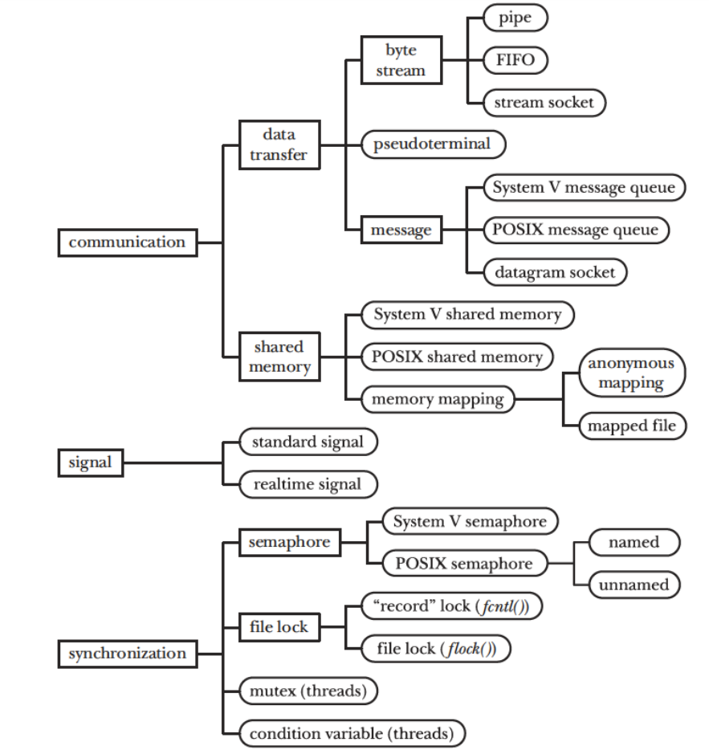

Unidad 3: Comunicación y sincronización
=========================================

Introducción
--------------

Hasta ahora hemos aprendido a crear flujos de instrucciones independientes,
ya sea con procesos o utilizando hilos. ¿Y si queremos
comunicar estos flujos?

Propósito de aprendizaje
***************************

Comprender y aplicar estrategias de comunicación y sincronización
entre diferentes flujos de instrucciones.

Lecturas y ejercicios
------------------------

Sesión 1: sincronización y comunicación (introducción)
***********************************************************************

Ejercicio 1: taxonomía de servicios
^^^^^^^^^^^^^^^^^^^^^^^^^^^^^^^^^^^^

La comunicación entre procesos se conoce por sus siglas en inglés 
IPC o interprocess communication. Observa en la siguiente figura 
una taxonomía con las facilidades que ofrecen los sistemas Unix:

¿Cuáles son las categorías más generales que logras identificar?

Observa que hay tres tipos de facilidades:

#. De comunicación
#. De señalización
#. De sincronización

En estos primeros ejercicios nos vamos a concentrar en las facilidades
de comunicación.

Ejercicio 2: pregunta para reflexionar
^^^^^^^^^^^^^^^^^^^^^^^^^^^^^^^^^^^^^^^

Las facilidades de comunicación permiten intercambiar datos a dos o más
procesos.

¿Qué harías si tienes que intercambiar datos entre hilos?

Ejercicio 3: concepto de comunicación por transferencia de datos
^^^^^^^^^^^^^^^^^^^^^^^^^^^^^^^^^^^^^^^^^^^^^^^^^^^^^^^^^^^^^^^^^

En las facilidades de comunicación por transferencia de datos, 
la comunicación en general ocurre así: un proceso A desea comunicarse
con un proceso B. El proceso A realizará un llamado al sistema y 
los datos destinados a B serán copiados en el sistema operativo. Por 
su parte B realizará un llamado al sistema operativo y los datos 
provenientes de A serán copiados del sistema operativo al proceso B.

Analiza la siguiente figura:

Ejercicio 4: concepto de comunicación por memoria compartida
^^^^^^^^^^^^^^^^^^^^^^^^^^^^^^^^^^^^^^^^^^^^^^^^^^^^^^^^^^^^^^

En las facilidades de comunicación por memoria compartida, el sistema 
operativo hará que dos o más procesos compartan la misma zona de memoria RAM. 
De esta manera, los cambios en la variable compartida en el proceso A, 
se verán reflejados inmediatamente en el proceso B.

* ¿Cuál es la diferencia entre los mecanismos de comunicación por transferencia 
  de datos y por memoria compartida?
* ¿Cuál de los dos mecanismos crees que puede ser más rápido?

Ejercicio 5: características de los mecanismos transferencia de datos
^^^^^^^^^^^^^^^^^^^^^^^^^^^^^^^^^^^^^^^^^^^^^^^^^^^^^^^^^^^^^^^^^^^^^^

En el curso vamos a practicar dos mecanismos de comunicación por transferencia 
de datos denominados los flujos de bytes (byte stream) y los mensajes (messages).

En la transferencia por flujo de mensajes:

* Se utilizan Pipes, FIFOs y stream sockets
* Son flujos de bytes sin un tamaño definido.
* Cada operación de lectura permite leer una cantidad arbitraria 
  de bytes independiente de la cantidad escrita (claro, no puedo leer 
  más de lo que hay :) )
* SOLO los sockets permiten la comunicación entre dos procesos corriendo 
  en dos computadores diferentes conectados por una red de datos.
* Las lecturas son destructivas → los datos se consumen.
* ``La sincronización entre procesos es automática → Si no hay datos para leer, 
  el proceso se bloquea (por defecto)``.

En la transferencia por mensajes:

* Se utilizan colas (queues) y datagrams sockets.
* Los mensajes tiene un tamaña definido
* Cada operación de lectura devuelve UN mensaje. 
* No se pueden leer partes del mensaje.

¿Cuál es la diferencia entre los mecanismos por flujos
de bytes y por intercambio de mensajes?

¿Un proceso puede leer de un mensaje solo unos cuantos bytes y dejar
el resto de el sistema operativo?

¿Qué pasa si dos procesos están leyendo al mismo tiempo un flujo 
de bytes?

¿Es posible comunicar procesos que estén corriendo en diferentes computadores?

Ejercicio 6: pipes
^^^^^^^^^^^^^^^^^^^^

Vamos a estudiar nuestro primer mecanismos: pipes o tuberías

Cuando creas la tubería el sistema operativo asigna dos descriptores 
al proceso, uno para leer y otro para escribir. Observa la siguiente 
figura:

¿Ves las variables ``filedes[0]`` y ``filedes[1]``? allí el 
sistema operativo almacena los descriptores de lectura y escritura.

¿Pero qué son esos descriptores? No te asustes con los nombre. Son 
simplemente dos identificadores, dos números.

Observa ahora este código:

.. code-block:: c
   :linenos:

   int p[2];
   pipe(p);

El llamado al sistema ``pipe``, le solicita al sistema operativo que cree la tubería.
Nota que tu le pasas la dirección en memoria de un arreglo de dos posiciones 
(no olvides que el nombre del arreglo es la dirección en memoria del 
primer elementos de este). En ``p[0]`` se almacena el identificador para 
leer los datos de la tubería y en ``p[1]`` el identificador para escribir 
datos a la tubería.

Con el conocimiento que tiene ahora, analiza este ejemplo tomado de
`este <https://www.geeksforgeeks.org/pipe-system-call/>`__ sitio:

.. code-block:: c
   :linenos:

    // C program to illustrate
    // pipe system call in C
    #include <stdio.h>
    #include <unistd.h>
    #include <stdlib.h>

    #define MSGSIZE 16
    char* msg1 = "hello, world #1";
    char* msg2 = "hello, world #2";
    char* msg3 = "hello, world #3";

    int main()
    {
        char inbuf[MSGSIZE];
        int p[2], i;

        if (pipe(p) < 0)
            exit(1);

        /* continued */
        /* write pipe */

        write(p[1], msg1, MSGSIZE);
        write(p[1], msg2, MSGSIZE);
        write(p[1], msg3, MSGSIZE);

        for (i = 0; i < 3; i++) {
            /* read pipe */
            read(p[0], inbuf, MSGSIZE);
            printf("%s\n", inbuf);
        }
        return 0;
    }
    
¿Cuántos procesos estás comunicando en este caso? 

Ejercicio 7: comunicación entre procesos con pipes
^^^^^^^^^^^^^^^^^^^^^^^^^^^^^^^^^^^^^^^^^^^^^^^^^^^

¿Y si quieres comunicar dos procesos utilizando tuberías?

En la pare de ``a`` de la figura el proceso padre crea la 
tubería. Luego hace un fork. Por tanto el proceso hija hereda
los descriptores.

¿Por qué el proceso hijo los hereda?

Luego del fork, el proceso que va a escribir debe cerrar el 
descriptor de lectura y el procesos que va a leer debe cerrar 
el descriptor de escritura.

¿Por qué? Esta pregunta es más difícil. Vamos a analizarla juntos.

* El proceso que lee la tubería cierra su descriptor de escritura,
  de esta manera cuando el proceso que escribe no quiera hacerlo 
  más, cerrará también su descriptor de escritura y el sistema 
  operativo podrá indicarle al proceso lector que YA NO TIENE 
  sentido que espere por datos. Ya nadie más escribirá en la tubería.
  ¿Qué pasa entonces si el proceso que lee no cierra el descriptor 
  de escritura? Pues metes en líos al sistema operativo. ¿Cómo 
  haría este para saber que ya nadie más va a escribir la tubería?
  Por tanto, si no cierras el descriptor de escritura en el proceso
  lector, éste se quedará esperando PARA SIEMPRE por datos, el proceso 
  quedará permanentemente bloqueado.

* Y entonces para qué cierras el descriptor de lectura en el proceso 
  que escribe? Para que el sistema operativo sepa que no hay más procesos
  interesados en leer la tubería y le pueda avisar al proceso escritor 
  que no tiene sentido escribir. Ya nadie te escucha! 

Analiza el segundo ejemplo de `este <https://www.geeksforgeeks.org/pipe-system-call/>`__ 
sitio. Observa que en el segundo ejemplo hay unas líneas comentadas. TE ESTÁN invitando 
a experimentar. NO DEJES DE HACERLO!!!

Ejercicio 8: comunicación entre procesos con pipes
^^^^^^^^^^^^^^^^^^^^^^^^^^^^^^^^^^^^^^^^^^^^^^^^^^^

Analiza con detenimiento el siguiente ejemplo:

.. code-block:: c
   :linenos:

    #include <sys/wait.h>
    #include <unistd.h>
    #include <stdlib.h>
    #include <stdio.h>
    #include <string.h>

    #define BUF_SIZE 10

    int main(int argc, char *argv[])
    {
        int pfd[2]; /* Pipe file descriptors */
        char buf[BUF_SIZE];
        ssize_t numRead;

        if (argc != 2 || strcmp(argv[1], "--help") == 0){
            printf("usage error: %s string\n", argv[0]);
            exit(EXIT_FAILURE);
        }
        

        if (pipe(pfd) == -1){ /* Create the pipe */
            perror("pipe");
            exit(EXIT_FAILURE);
        }

        switch (fork())
        {
        case -1:
            perror("fork");
            exit(EXIT_FAILURE);
        case 0: /* Child  - reads from pipe */
            if (close(pfd[1]) == -1)
            { /* Write end is unused */
                perror("close - child");
                exit(EXIT_FAILURE);
            }
            for (;;)
            { /* Read data from pipe, echo on stdout */
                numRead = read(pfd[0], buf, BUF_SIZE);
                if (numRead == -1)
                {
                    perror("read");
                    exit(EXIT_FAILURE);
                }

                if (numRead == 0)
                    break; /* End-of-file */
                if (write(STDOUT_FILENO, buf, numRead) != numRead)
                {
                    perror("child - partial/failed write");
                    exit(EXIT_FAILURE);
                }
            }
            write(STDOUT_FILENO, "\n", 1);
            if (close(pfd[0]) == -1)
            {
                perror("close");
                exit(EXIT_FAILURE);
            }

            exit(EXIT_SUCCESS);
        default: /* Parent - writes to pipe */
            if (close(pfd[0]) == -1)
            { /* Read end is unused */
                perror("close - parent");
                exit(EXIT_FAILURE);
            }

            if (write(pfd[1], argv[1], strlen(argv[1])) != strlen(argv[1]))
            {
                perror("parent - partial/failed write");
                exit(EXIT_FAILURE);
            }
            if (close(pfd[1]) == -1)
            { /* Child will see EOF */
                perror("close");
                exit(EXIT_FAILURE);
            }
            wait(NULL); /* Wait for child to finish */
            exit(EXIT_SUCCESS);
        }
    }

Realiza un diagrama de flujo para cada proceso. No continues
hasta asegurar de entender cómo funciona. EXPERIMENTA. Realiza 
cambios, trata de predecir qué pasará, EXPERIMENTA, explica tus 
resultados.

Trabajo autónomo 1: experimenta y practica con pipes
**********************************************************
(Tiempo estimado: 2 horas 50 minutos)

Antes de realizar el siguiente ejercicio te invito a que leas de nuevo 
todo el material hasta este punto. Analiza una vez más los ejemplos, 
EXPERIMENTA.

Ejercicio 9: comunicación bidireccional con pipes
^^^^^^^^^^^^^^^^^^^^^^^^^^^^^^^^^^^^^^^^^^^^^^^^^^^

Realiza un programa que le permita a dos procesos comunicarse de manera 
bidireccional utilizando pipes.

Para realizar la prueba lanza el programa así:

.. code-block:: bash

    ./pipeBidiTest mensaje_desde_el_padre mensaje_desde_el_hijo.

El proceso padre debe enviar al hijo el contenido de la cadena 
“mensaje_desde_el_padre” y el proceso hijo el contenido de la cadena 
“mensaje_desde_el_hijo”. Nota que el contenido de ambas cadenas 
lo pasas desde la línea de comandos.

Sesión 2: comunicación mediante FIFOs
*****************************************

Ejercicio 10: FIFOs
^^^^^^^^^^^^^^^^^^^^^

Te voy a mostrar ahora otro mecanismo de comunicación: FIFOs

¿Te fijas de nuevo en la taxonomía de IPCs por favor? ¿Cómo 
está clasificado este mecanismo?

Las FIFO permiten que dos procesos que no están relacionados se puedan 
comunicar. Son similares, semánticamente hablando, a las pipe. La diferencia 
está en que las FIFO tienen un nombre dentro del sistemas de archivos y 
se abren como si fueran archivos.

Puedes crear una FIFO así:

.. code-block:: c
    :linenos:

    #include <sys/types.h>
    #include <sys/stat.h>

    int mkfifo(const char *pathname, mode_t mode);

RETURN VALUE:
       On success mkfifo() and mkfifoat() return 0.  
       In the case of an error, -1 is returned 
       (in which case, errno is set appropriately).

DESCRIPTION:
       A FIFO special file is similar to a pipe, except that it is created in a 
       different way.  Instead of being an anonymous communications channel, 
       a FIFO special file is entered into the filesystem by calling mkfifo().

       Once  you  have  created a FIFO special file in this way, any process can 
       open it for reading or writing, in the same way as an ordinary file.  
       However, it has to be open at both ends simultaneously before you can proceed 
       to do any input or output operations on it.  Opening a FIFO for reading 
       normally blocks until some other process opens  the  same  FIFO
       for writing, and vice versa.

Nota el tipo de dato para el argumento ``mode``, es de tipo ``mode_t``

Especifica los permisos para la nueva FIFO. Esto permisos se especifican haciendo una OR a 
nivel de bits con las constantes definidas en la siguiente tabla:

======= ============== ======================================
Name    Numeric Value                  Description           
======= ============== ======================================
S_IRWXU       0700      Read, write, execute/search by owner.        
S_IRUSR       0400      Read permission, owner.                      
S_IWUSR       0200      Write permission, owner.                     
S_IXUSR       0100      Execute/search permission, owner.            
S_IRWXG        070      Read, write, execute/search by group.        
S_IRGRP        040      Read permission, group.                      
S_IWGRP        020      Write permission, group.                     
S_IXGRP        010      Execute/search permission, group.            
S_IRWXO         07      Read, write, execute/search by others.       
S_IROTH         04      Read permission, others.                     
S_IWOTH         02      Write permission, others.                    
S_IXOTH         01      Execute/search permission, others.           
S_ISUID      04000      Set-user-ID on execution.                    
S_ISGID      02000      Set-group-ID on execution.                   
S_ISVTX      01000      On directories, restricted deletion flag.    
======= ============== ======================================

Si quieres que la fifo tenga permisos de lectura y escritura para
el usuario dueño del archivo y el grupo harías:

.. code-block:: c
    :linenos:

    mode = S_IRUSR | S_IWUSR | S_IRGRP | S_IWGRP

Ten en cuenta que puedes almacenar un valor numérico en mode. PERO OJO
el valor tendrá que estar en octal, como en la tabla. ¿Cómo sabemos 
que está en octal? Porque el número inicia con ``0``.

¿Cuál sería el modo de una FIFO cuyo valor sea 0666?

Ejercicio 11: ejemplo de comunicación con FIFOs
^^^^^^^^^^^^^^^^^^^^^^^^^^^^^^^^^^^^^^^^^^^^^^^^^

Ahora analiza con detenimiento el ejemplo en 
`este <https://www.geeksforgeeks.org/named-pipe-fifo-example-c-program/>`__ sitio.

Ten presente que el proceso que escribe la FIFO la abren en modo escritura y 
el proceso que la lee en modo lectura.

Ejecuta en la terminal el siguiente comando:

.. code-block:: bash

    man 3 mkfifo

Observa de nuevo la descripción:

DESCRIPTION:
       A FIFO special file is similar to a pipe, except that it is created in a 
       different way.  Instead of being an anonymous communications channel, 
       a FIFO special file is entered into the filesystem by calling mkfifo().

       Once  you  have  created a FIFO special file in this way, any process can 
       open it for reading or writing, in the same way as an ordinary file.  
       However, it has to be open at both ends simultaneously before you can proceed 
       to do any input or output operations on it.  Opening a FIFO for reading 
       normally blocks until some other process opens  the  same  FIFO
       for writing, and vice versa.

¿Qué pasa si el proceso escritor abre (open) la fifo sin que el proceso lector la haya
abierto?

¿Qué pasa si el proceso lector abre (open) la fifo sin que el proceso escritor la haya
abierto?

Ejercicio 12: pregunta para reflexionar
^^^^^^^^^^^^^^^^^^^^^^^^^^^^^^^^^^^^^^^^^^

Considera que debes escribir un programa que esté ATENTO AL MISMO TIEMPO 
de los datos que le llegan por una FIFO y por la interfaz de usuario (la terminal)

¿Qué tendrías que hacer?

Trabajo autónomo 2: experimenta con FIFOs
********************************************
(Tiempo estimado 2 horas 50 minutos)

Vas a leer de nuevo el material de la sesión 2. Analiza nuevamente los 
ejemplos y EXPERIMENTA.

RETO 1: chat usando FIFOs
^^^^^^^^^^^^^^^^^^^^^^^^^^^^

Vas a realizar un chat entre dos procesos, usando FIFOs, que te permitan intercambiar 
mensajes entre ellos. La COMUNICACIÓN NO DEBE ser por turnos, es decir, 
puedes enviar cuantos mensajes desees desde un proceso y desde otro. 
Por tanto, debes usar HILOS!

Sesión 3: comunicación usando colas
********************************************

Ejercicio 13: características 
^^^^^^^^^^^^^^^^^^^^^^^^^^^^^^

Viene otro mecanismo de comunicación: System V message queues (Colas 
de mensajes System V).

¿Te fijas de nuevo en la taxonomía de IPCs por favor? ¿Cómo 
está clasificado este mecanismo?

* Las colas de mensajes son de tamaño fijo → Las comunicaciones ocurren por 
  paquetes o unidades de mensaje.

* Cada mensaje incluye un tipo entero. Esto permite seleccionar el mensajes a leer. Esto 
  quiere decir que pueden enviar a una cola varios tipos de mensajes y seleccionar
  cuál tipo quieres leer. Podrías entonces tener un proceso enviando mensajes de varios 
  tipos y otros procesos lectores consumiendo solo el mensaje de su interés. 
  UNA BELLEZA!!!

* Las colas de mensajes existen a nivel de sistema, no son de un proceso en particular. 

Ejercicio 14: creación de colas
^^^^^^^^^^^^^^^^^^^^^^^^^^^^^^^^

Para crear una cola de mensajes utilizas el siguiente llamado al sistema:

.. code-block:: c
    :linenos:

    #include <sys/types.h>
    #include <sys/ipc.h>
    #include <sys/msg.h>

    int msgget(key_t key, int msgflg);

RETURN VALUE:
       If successful, the return value will be the message queue identifier 
       (a nonnegative integer), otherwise -1 with errno indicating the error.

DESCRIPTION:
       The  msgget() system call returns the System V message queue identifier 
       associated with the value of the key argument.  It may be used either 
       to obtain the identifier of a previously created message queue 
       (when msgflg is zero and key does not have the value IPC_PRIVATE), 
       or to create a new set.

       A new message queue is created if key has the value IPC_PRIVATE or 
       key isn't IPC_PRIVATE, no message queue with the given key key exists, 
       and IPC_CREAT is specified in msgflg.

       If msgflg specifies both IPC_CREAT and IPC_EXCL and a message queue 
       already exists for key, then msgget() fails with errno set to EEXIST.  

* Si quiero crear una cola de mensajes pública ¿Qué valor debería pasarle a msgflg?

* Si quiero obtener el identificador de la cola ¿Qué valor debe tener msgflg?

* Si paso msgflg con IPC_CREAT y la cola ya está creada ¿Qué pasa?

Ejercicio 15: más sobre la creación 
^^^^^^^^^^^^^^^^^^^^^^^^^^^^^^^^^^^^^^^

Ten presente que además debes colocar en msgflag los permisos 
mediante una operación OR a nivel de bits y con esta tabla que ya conoces:

Esto permisos se especifican haciendo una OR a 
nivel de bits con las constantes definidas en la siguiente tabla:

======= ============== ======================================
Name    Numeric Value                  Description           
======= ============== ======================================
S_IRWXU       0700      Read, write, execute/search by owner.        
S_IRUSR       0400      Read permission, owner.                      
S_IWUSR       0200      Write permission, owner.                     
S_IXUSR       0100      Execute/search permission, owner.            
S_IRWXG        070      Read, write, execute/search by group.        
S_IRGRP        040      Read permission, group.                      
S_IWGRP        020      Write permission, group.                     
S_IXGRP        010      Execute/search permission, group.            
S_IRWXO         07      Read, write, execute/search by others.       
S_IROTH         04      Read permission, others.                     
S_IWOTH         02      Write permission, others.                    
S_IXOTH         01      Execute/search permission, others.           
S_ISUID      04000      Set-user-ID on execution.                    
S_ISGID      02000      Set-group-ID on execution.                   
S_ISVTX      01000      On directories, restricted deletion flag.    
======= ============== ======================================

¿Cómo sería msgflg si quiere crear una cola con permisos de lectura 
y escritura para el dueño de la cola?

Ejercicio 16: creación de claves únicas
^^^^^^^^^^^^^^^^^^^^^^^^^^^^^^^^^^^^^^^^

¿Cómo puedes hacer para generar una key única para poder 
crear la cola?

Usas la función ``ftok``:

.. code-block:: c
    :linenos: 

       #include <sys/types.h>
       #include <sys/ipc.h>

       key_t ftok(const char *pathname, int proj_id);

RETURN VALUE:
       On success, the generated key_t value is returned.  
       On failure -1 is returned, with errno indicating the error.

DESCRIPTION:
       The  ftok()  function  uses  the  identity  of the file named by 
       the given pathname (which must refer to an existing, 
       accessible file) and the least significant 8 bits of proj_id
       (which must be nonzero) to generate a key_t type System V IPC key, 
       suitable for use with msgget(2), semget(2), or shmget(2).

       The resulting value is the same for all pathnames that name the same 
       file, when the same value of proj_id is used.  The value returned 
       should be different  when  the  (simultaneously existing) files or 
       the project IDs differ.

Ejercicio 17: destrucción de colas
^^^^^^^^^^^^^^^^^^^^^^^^^^^^^^^^^^^^

Una vez termines de utilizar la cola puedes destruirla del sistema operativo 
con la función ``msgctl``:

.. code-block:: c
    :linenos:

       #include <sys/types.h>
       #include <sys/ipc.h>
       #include <sys/msg.h>

       int msgctl(int msqid, int cmd, struct msqid_ds *buf);
    
En ``msqid`` pasas el identificador o clave de la cola, en ``cmd`` 
pasas el comando ``IPC_RMID`` y en buf ``NULL``.

Ejecuta en la línea de comandos: man msgctl.

¿Qué pasa si hay datos o procesos esperando en la cola?

Ejercicio 18: enviar y recibir mensajes
^^^^^^^^^^^^^^^^^^^^^^^^^^^^^^^^^^^^^^^^^

Ahora que ya sabes crear la cola, obtener el identificador de ella y destruirla, 
vas a aprender a enviar y leer mensajes.

Escribe en la terminal el comando ``man msgsnd`` y lee con detenimiento 
la información allí.

Ten presente que el argumento msgflg lo dejaremos por defecto en 0; sin embargo, 
puedes experimentar, quién te puede decir que no :) !!!

Ejercicio 19: ejemplo
^^^^^^^^^^^^^^^^^^^^^^^

Analiza la documentación y el ejemplo de 
`este <https://www.tutorialspoint.com/inter_process_communication/inter_process_communication_message_queues.htm>`__ 
sitio.

Trabajo autónomo 3: Colas
*******************************
(Tiempo estimado: 2 horas 50 minutos)

Lee de nuevo el material de la sesión 3 y analiza y experienta con 
el ejemplo.

RETO 2: chat usando mensajes
^^^^^^^^^^^^^^^^^^^^^^^^^^^^^

Vas a realizar un chat entre dos procesos, usando colas, que te permitan intercambiar 
mensajes entre ellos. La COMUNICACIÓN NO DEBE ser por turnos, es decir, 
puedes enviar cuantos mensajes desees desde un proceso y desde otro. 
Por tanto, debes usar HILOS!

Sesión 4: memoria compartida
********************************

Ejercicio 20: sincronización 
^^^^^^^^^^^^^^^^^^^^^^^^^^^^^^

Vamos a estudiar otro mencanismos de comunicación, pero esta vez lo haremos por memoria 
compartida; Sin embargo, antes de estudiar este mencanismo tendremos que aprender a 
sincronizar el acceso a la memoria para evitar que los datos compartidos se corrompan.

¿Cómo podemos sincronizar dos flujos de instrucciones? Por medio de SEMÁFOROS.

En `este enlace <https://docs.google.com/presentation/d/1oQRNx-zzGNfQ04Zwt79n4AaLoabfOvWr0F0tCfqSypA/edit?usp=sharing>`__
se encuentra el material de trabajo.

Ejercicio 21: memoria compartida
^^^^^^^^^^^^^^^^^^^^^^^^^^^^^^^^^

Ahora si, vamos a aprender la estrategia de comunicación entre procesos por  
memoria compartida.

En `este enlace <https://docs.google.com/presentation/d/1i4VVIwVh0tSbv3k1_jOYPUYK6egH1iTYqLt4TNusCTo/edit?usp=sharing>`__
se encuentra el material para este ejercicio.

Ejercicio 22: ejemplo
^^^^^^^^^^^^^^^^^^^^^^^

El siguiente ejemplo muestra cómo dos procesos pueden comunicarse utilizando 
memoria compartida.

El primer proceso crea la memoria compartida y escribe información. 
El segundo proceso la lee y destruye la memoria compartida.

Proceso 1:

.. code-block:: c
   :linenos:

    #include <stdio.h>
    #include <stdlib.h>
    #include <sys/mman.h>
    #include <sys/stat.h>        /* For mode constants */
    #include <fcntl.h>           /* For O_* constants */
    #include <string.h>
    #include <unistd.h>
    #include <sys/types.h>

    #define SH_SIZE 16

    int main(int argc, char * argv[]){

        int shm_fd = shm_open("shm0", O_CREAT | O_RDWR, 0600);
        if (shm_fd < 0) {
            perror("shm memory error: ");
            exit(EXIT_FAILURE);
        }
        fprintf(stdout, "Shared memory is created with fd: %d\n", shm_fd);
        
        if (ftruncate(shm_fd, SH_SIZE * sizeof(char)) < 0) {
            perror("Truncation failed: ");
            exit(EXIT_FAILURE);
        }

        fprintf(stdout, "The memory region is truncated.\n");

        void* map = mmap(NULL, SH_SIZE, PROT_WRITE, MAP_SHARED, shm_fd, 0);

        if (map == MAP_FAILED) {
            perror("Mapping failed: ");
            exit(EXIT_FAILURE);
        }

        char* ptr = (char*)map;
        ptr[0] = 'A';
        ptr[1] = 'B';
        ptr[2] = 'C';
        ptr[3] = '\n';
        ptr[4] = '\0';

        fprintf(stdout, "Data is written to the shared memory.\n");

        if (munmap(ptr, SH_SIZE) < 0) {
            perror("Unmapping failed: ");
            exit(EXIT_FAILURE);
        }

        
        if (close(shm_fd) < 0) {
            perror("Closing shm failed: ");
            exit(EXIT_FAILURE);
        }

        exit(EXIT_SUCCESS);
    }

Proceso 2:

.. code-block:: c
   :linenos:

    #include <stdio.h>
    #include <stdlib.h>
    #include <sys/mman.h>
    #include <sys/stat.h>        /* For mode constants */
    #include <fcntl.h>           /* For O_* constants */
    #include <string.h>
    #include <unistd.h>
    #include <sys/types.h>

    #define SH_SIZE 16

    int main(int argc, char * argv[]){

        int shm_fd = shm_open("shm0", O_RDONLY, 0600);
        if (shm_fd < 0) {
            perror("shm memory error: ");
            exit(EXIT_FAILURE);
        }
        fprintf(stdout, "Shared memory is created with fd: %d\n", shm_fd);    

        void* map = mmap(NULL, SH_SIZE, PROT_READ, MAP_SHARED, shm_fd, 0);

        if (map == MAP_FAILED) {
            perror("Mapping failed: ");
            exit(EXIT_FAILURE);
        }    

        char* ptr = (char*)map;
        fprintf(stdout, "The contents of shared memory object: %s\n", ptr);

    
        if (munmap(ptr, SH_SIZE) < 0) {
            perror("Unmapping failed: ");
            exit(EXIT_FAILURE);
        }

        
        if (close(shm_fd) < 0) {
            perror("Closing shm failed: ");
            exit(EXIT_FAILURE);
        }  
    
        if (shm_unlink("shm0") < 0) {
            perror("Unlink failed: ");
            exit(EXIT_FAILURE);
        }

        exit(EXIT_SUCCESS);
    }

Para ejecutar los programas sigue estos pasos:

.. code-block:: c
   :linenos:

    gcc -Wall p1.c -o p1 -lrt
    ./p1

El proceso 1 terminará pero dejará la zona
de memoria compartida lista y con datos. Para
verificarlo:

.. code-block:: c
   :linenos:

    ls /dev/shm
    cat /dev/shm/shm0

Ahora compile y ejecute el proceso 2.

.. code-block:: c
   :linenos:

    gcc -Wall p2.c -o p2 -lrt
    ./p2

Trabajo autónomo 4: chat usando memoria compartida
****************************************************

Vas a leer de nuevo el material y a experimentar con los ejemplos.

Vas a realizar un chat entre dos procesos, usando memoria, que te permitan 
intercambiar mensajes entre ellos. La COMUNICACIÓN NO DEBE ser por turnos, es decir, 
puedes enviar cuantos mensajes desees desde un proceso y desde otro. 
Por tanto, debes usar HILOS! No olvides que al usar memoria compartida es 
necesario sincronizar el acceso a la memoria compartida. NO OLVIDES HACERLO, 
aunque tu aplicación funcione es posible que se pueda presentar una condición 
de carrera.

Evaluación de la Unidad 3
---------------------------

Regresa aquí la semana de evaluación para leer el enunciado.

NO OLVIDES presionar F5 para actualizar la página.
