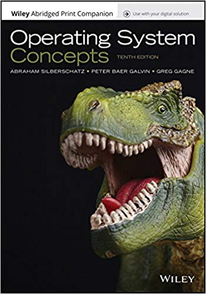

Curso Sistemas Operativos 2019-10
========================================

¿Para qué sirve este curso?
-----------------------------
Para tomar decisiones y construir sistemas con ¡SUPER PODERES!

.. note::
    * You need to understand your code.
    * You need to understand your tools.
    * You need to understand your platform.
    * When we give up on understanding what we are actually doing when you write code, it just leads to bad software.     

    Brian Will.

Descripción del curso
----------------------
El curso aborda el estudio de los sistemas operativos en su condición de capa de software que posibilita y simplifica el 
manejo de la computadora sirviendo como intermediario entre el usuario y el hardware. 
Se pretende brindar al estudiante fundamentación en aspectos concretos relativos al diseño, implementación y 
uso (en el rol de programador y administrador) de un sistema operativo. Dichos aspectos son esenciales para el diseño y 
montaje de aplicaciones de software modernas.

Propósito del curso
---------------------
El curso enriquece la formación con los conceptos y herramientas más importantes necesarias en el 
diseño, administración y operación de sistemas operativos.

Competencia
------------
Analiza, diseña, evalúa, implementa, administra y da soporte a soluciones informáticas efectivas y eficientes.

Carta Descsriptiva del curso
-----------------------------
`En este enlace se encuentra la carta descriptiva del curso 
<https://drive.google.com/open?id=1TbzmtZc1k_dPRpb3CYi1HbPFeCq_Efxm>`__.

Estructura y metodología del curso
-----------------------------------
Durante las sesiones discutiremos los conceptos más importantes y practicaremos esos conceptos. Se complementará con lecturas 
para profundizar en el material. Se propondrán ejercicios para afianzar los conceptos estudiados.

Cronograma
----------
`Tabla de actividades <https://drive.google.com/open?id=1DNRsIWvKDMNT34X6XBqp2bC7Lpfd26yCzI8ceAbaBWs>`__.

Evaluación
-----------
* Práctica de programación en C (10%)
* Práctica de procesos e hilos (10%) 
* Práctica de comunicación (10%)
* Práctica de sincronización (10%)
* Práctica de manejo de memoria (10%)
* Práctica de E/S - sistemas de archivos (10%)
* Exposición Tópicos de actualidad en los sistemas operativos (10%) 
* Evaluación Final (30%) - Semana 17

Texto guía
-----------

* `Sitio web y material extra del texto <http://os-book.com/>`__.

* `Guía de estudio <http://codex.cs.yale.edu/avi/os-book/OS10/study-guide/Study-Guide.pdf>`__.

Dedicación
----------
Este curso es de 3 créditos repartidos en 4 horas de trabajo en el aula y 5 horas de trabajo autónomo.

Datos de contacto
------------------
* Atención a estudiantes: lunes, martes y miércoles 11am 12m. Bloque 11 (edificio nuevo) piso 3 (sala de atención a estudiantes).
* Sitio web: `https://sistemasoperativos.readthedocs.io <https://sistemasoperativos.readthedocs.io>`__. 

Para la exposición de tópicos de actualidad
--------------------------------------------
* El trabajo es en parejas.
* Cada exposición tendrá una duración máxima de 30 minutos que incluyen el montaje, exposición y desmontaje.
* La exposición debe tener como mínimo los siguientes elementos:

    * Motivación personal para seleccionar el sistema operativo 
    * Contexto histórico del sistemas operativo: cuándo, por qué, dónde, quién.
    * Implementar un programa ``interesante`` que ilustre cómo se aplican, en el sistema operativo seleccionado, 
      conceptos tales como: procesos, tareas, hilos, manejo de memoria, sincronización, comunicación, entrada salida, 
      almancenamiento.
    * Se debe entregar un video (formato mp4) de máximo 3 minutos (optimizado en tamaño) donde se muestre y explique 
      el programa funcionando.
    * Se debe entregar un documento estilo paper que tengo un tutorial con la explicación paso a paso para reproducir 
      el programa. El tutorial debe incluir los pasos para instalar y configurar el sistema operativo.

.. toctree::
   :maxdepth: 3
   :caption: Contenidos semanales:

   Semana1 <_semana1/semana1>
   Semana2 <_semana2/semana2>
   Semana3 <_semana3/semana3>  
